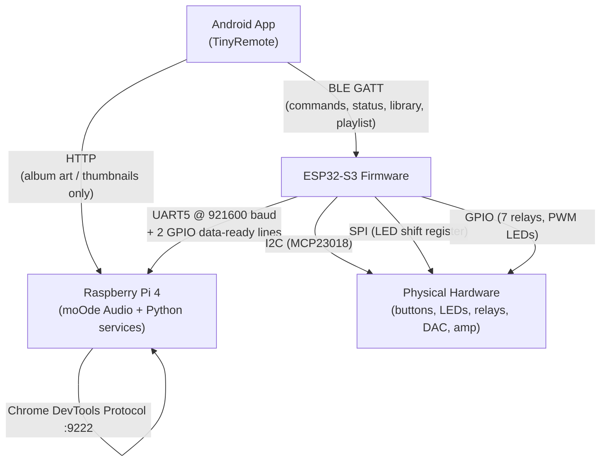
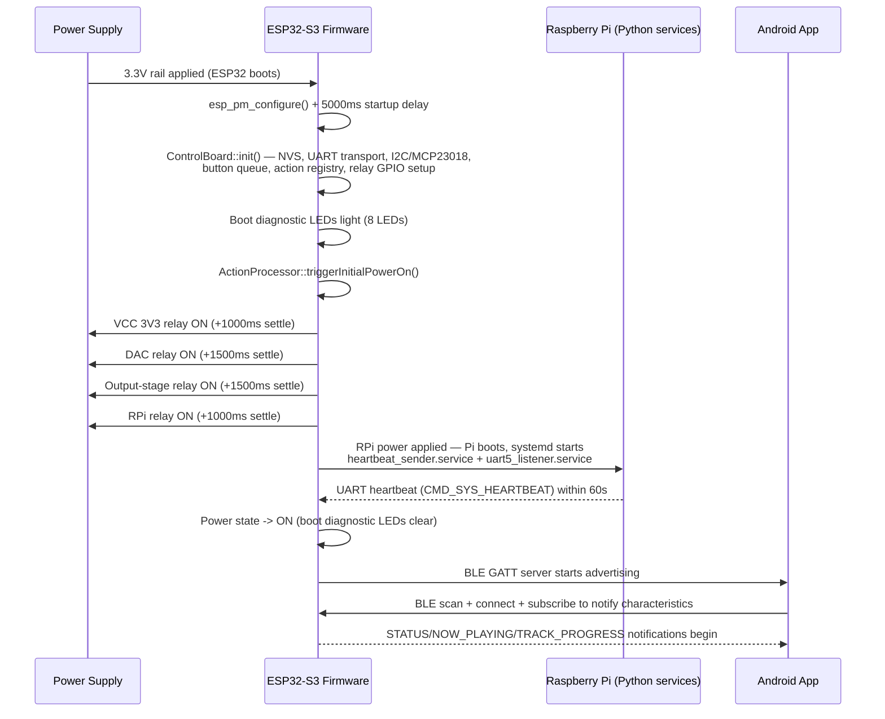
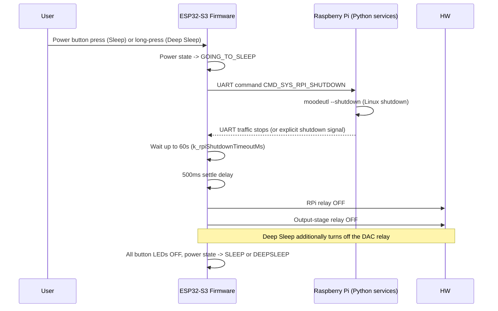
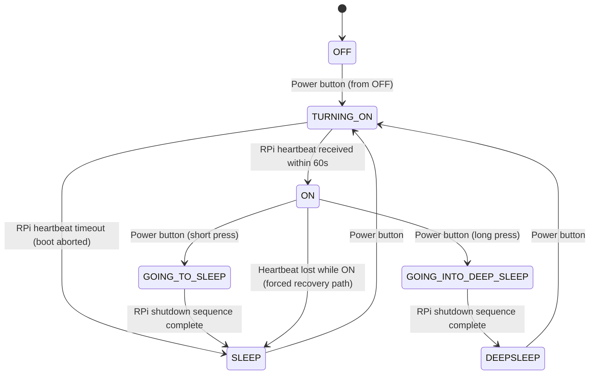
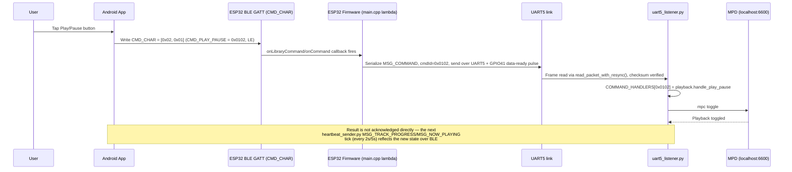

# 01 — System Architecture and Overview

Document version 1.0 — 2026-09-18 — describes commit `402f526` on branch `feature/library-improvements`.

## 1. Introduction

TinyControlBoard is a custom audio-streamer control system built around a Raspberry Pi 4
running moOde Audio. An ESP32-S3 microcontroller acts as the front-panel controller: it
reads physical buttons/rotary input, drives front-panel LEDs, sequences the unit's power
relays, and bridges user commands to the Raspberry Pi over a dedicated UART link. A
companion Android app connects to the ESP32 over Bluetooth LE, giving remote access to the
same controls plus library browsing, search and playlist management.

**Scope of this document set**: the ESP32-S3 firmware ([lib/](../lib/), [src/](../src/)),
the Raspberry Pi companion Python services ([scripts/rpi/](../scripts/rpi/)), and the
Android app ([android/TinyRemote/](../android/TinyRemote/)).

**Intended audience**: a developer with no prior exposure to this codebase who needs to
build, modify, or diagnose any of the three components.

## 2. System Components

| Component | Source | Role |
|---|---|---|
| ESP32-S3 firmware | [lib/](../lib/), [src/](../src/) | Button/rotary input (MCP23018 over I2C), front-panel LED drive (16-bit SPI shift register + PWM), 7-relay power sequencing, UART bridge to the Pi, BLE GATT server for the Android app |
| Raspberry Pi 4 / moOde Audio | [scripts/rpi/](../scripts/rpi/) | Runs moOde Audio (MPD + web UI); two systemd Python services translate UART commands into MPD/`moodeutl`/Chrome-DevTools-Protocol actions and report heartbeat/now-playing/progress back to the ESP32 |
| Android app ("TinyRemote"/"DanStreamer") | [android/TinyRemote/](../android/TinyRemote/) | Kotlin app; connects to the ESP32's BLE GATT service for all control/library/playlist operations; fetches album art directly from moOde over HTTP |

## 3. Overall Architecture

## 4. Component Responsibilities

| Component | Responsibility | Does Not Control |
|---|---|---|
| ESP32-S3 firmware | Physical button/rotary reading, front-panel LED state, all 7 power relays, UART command relay, BLE GATT server, heartbeat detection | Playback/MPD state, moOde UI, library/playlist storage — those live entirely on the Pi |
| Raspberry Pi (Python services) | Translating UART commands into MPD commands, `moodeutl` calls, and moOde UI panel switches (CDP); sending now-playing/progress/heartbeat data back | Power sequencing, relay state, physical button/LED hardware — those are ESP32-only |
| Android app | User interface, BLE command origination, library/search/playlist UI, direct HTTP fetch of album art from moOde | Relay/power sequencing, UART framing — the app never talks UART; all of that is inside the ESP32 |

No two components were found to both claim ownership of the same responsibility, **except**
the physical front-panel LED (owned solely by firmware, no ambiguity) — no cross-component
responsibility conflicts were identified in the inspected source.

## 5. Communication Paths

| Path | Transport | Direction | Purpose |
|---|---|---|---|
| Android → ESP32 | BLE GATT writes | Android → ESP32 | Button commands, library/playlist commands, display-view selection |
| ESP32 → Android | BLE GATT notifications | ESP32 → Android | Power/LED status, now-playing text, track progress, library entries, playlist results |
| Android → Raspberry Pi | Plain HTTP (cleartext) | Android → Pi | Album art / thumbnail image fetch only (moOde's own web endpoints) |
| ESP32 → Raspberry Pi | UART5, 921600 baud, framed binary packets | ESP32 → Pi | Commands (`MSG_COMMAND`), playlist commands (`MSG_PLAYLIST_CMD`) |
| Raspberry Pi → ESP32 | UART5, 921600 baud, framed binary packets | Pi → ESP32 | Heartbeat (`MSG_COMMAND`/`CMD_SYS_HEARTBEAT`), now-playing (`MSG_NOW_PLAYING`), track progress (`MSG_TRACK_PROGRESS`), library entries (`MSG_LIBRARY_ENTRY`), playlist results (`MSG_PLAYLIST_RESULT`) |
| ESP32 ↔ Raspberry Pi (out-of-band) | 2 dedicated GPIO lines (data-ready handshake) | Both directions | Signals "a UART frame is ready to read" so the receiver doesn't need to poll the UART continuously |

See [05-communication-protocol.md](05-communication-protocol.md) for full wire-format detail.

## 6. External Dependencies

| Category | Dependency |
|---|---|
| OS (Pi) | Raspberry Pi OS + moOde Audio (exact moOde version: **TODO – not present in supplied source**) |
| Firmware framework | ESP-IDF 5.3.1 via PlatformIO (`platform = espressif32 @ ~6.5.0`), C++17 |
| Firmware BLE stack | NimBLE (ESP-IDF bundled) |
| RPi runtime | Python 3, `pyserial`, `RPi.GPIO` (lgpio backend) |
| RPi audio | MPD (Music Player Daemon), reached via raw TCP on `localhost:6600` |
| RPi UI control | Chromium/moOde kiosk browser with `--remote-debugging-port=9222` (Chrome DevTools Protocol) |
| Android | Gradle 9.5.0, AGP 9.3.1, Kotlin 2.2.10, compileSdk/targetSdk 34, minSdk 23 |
| Android BLE | Android's native `BluetoothGatt` APIs (no third-party BLE library) |
| Hardware | ESP32-S3 (16 MB flash), MCP23018 I2C GPIO expander, 16-bit SPI LED shift register, 7 relay-driven power rails |

## 7. Startup Sequence

If no heartbeat arrives from the Pi within 60 seconds
(`board::timing::k_rpiBootTimeoutMs`), the firmware aborts the power-on sequence and falls
back to the `SLEEP` state (see §9 Failure Modes).

## 8. Shutdown Sequence

## 9. Failure Modes

| Failure | Documented behavior | Source |
|---|---|---|
| Android app unavailable | No effect on ESP32/Pi operation — BLE is optional; physical buttons keep working | Inferred from independent code paths (BLE server has no dependency back into `ActionProcessor` core loop except via `injectCommand`-style calls) |
| Raspberry Pi never boots / no heartbeat during power-on | Power-on sequence aborts after 60s (`k_rpiBootTimeoutMs`), firmware falls back to `SLEEP` state, boot diagnostic LED for the `RpiComms` stage flashes at 3 Hz | `PowerStateTransitionHandler::handle()` (PowerOn branch) |
| Raspberry Pi stops sending heartbeats while ON | After 30s with no UART RX (`k_heartbeatTimeoutMs`), `HeartbeatMonitor` fires `onTimeout` → `ActionProcessor::handleHeartbeatTimeout()` forces a transition toward `SLEEP` | `lib/hal/uart/heartbeatMonitor.cpp`, `lib/app/actionProcessor.cpp` |
| UART communication fails (framing/checksum error) | Raspberry Pi's `uart5_listener.py` drops any packet with a bad checksum or wrong `srcApp`; no retry/NACK is sent | `scripts/rpi/home/antho/protocol.py`, `uart5_listener.py` |
| A GPIO/relay hardware device does not respond | Not detected by software — GPIO relay writes are fire-and-forget (`gpio_set_level`), there is no read-back/verification of relay state | `lib/hal/relay/relay.cpp` |
| A systemd service fails to start on the Pi | `Restart=always` is set on both `heartbeat_sender.service`/`uart5_listener.service` per `docs/RPI4_SETUP.md`'s service templates — systemd will keep restarting it; no ESP32-side detection beyond the general heartbeat timeout | `docs/RPI4_SETUP.md` |
| BLE connection drops mid-session | `BoardBleManager` auto-reconnects after 2000ms unless the disconnect was user-initiated; a 15s connect watchdog exists during the `Connecting` state | `android/.../ble/BoardBleManager.kt` |

## 10. System State

The ESP32 firmware's power state machine is the primary named state machine in this system.

State names and enum values: `OFF, TURNING_ON, ON, SHUTTING_DOWN, SLEEP, GOING_TO_SLEEP,
DEEPSLEEP, GOING_INTO_DEEP_SLEEP` (`lib/power/powerState.hpp`). `SHUTTING_DOWN` exists in the
enum but was not observed being set by any transition in `PowerStateTransitionHandler.cpp` at
this commit — retained here as **TODO – confirm if `SHUTTING_DOWN` is dead/reserved**.

## Appendix — End-to-end command trace (example: pressing Play/Pause on the Android app)

