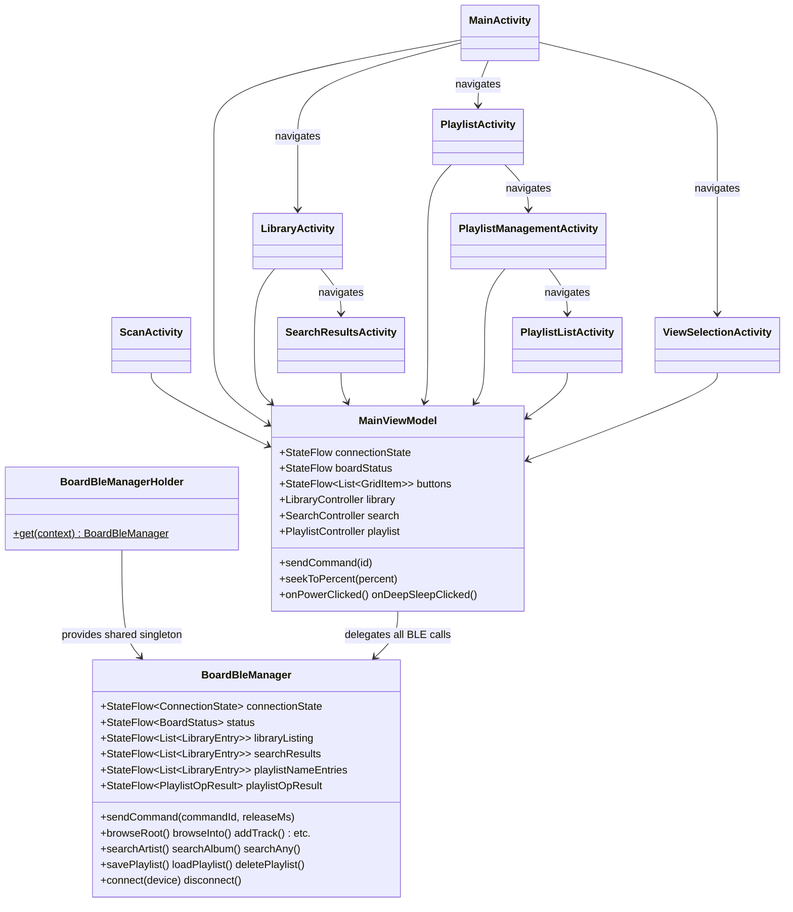
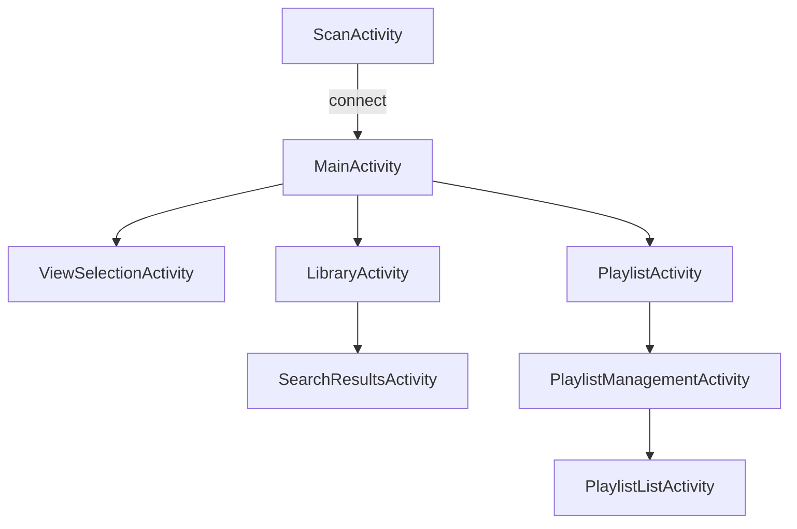
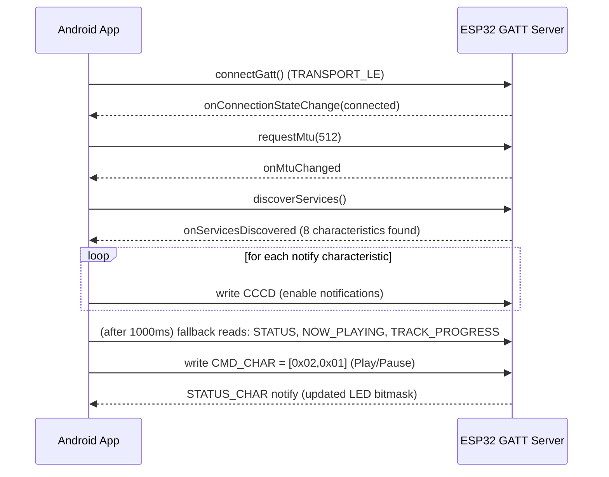

# 02 — Android Developer Guide

Document version 1.0 — 2026-09-18 — describes commit `402f526` on branch `feature/library-improvements`.
App module: [android/TinyRemote/](../android/TinyRemote/) (Gradle root project name `DanStreamer`, `applicationId com.tinycb.remote`).

## 1. Overview

The Android app is a native Kotlin control surface for the TinyControlBoard system. It
connects directly to the ESP32-S3's Bluetooth LE GATT server — there is no server-side
Android backend and no HTTP-based command channel. A separate, independent HTTP path is
used only to fetch album art / thumbnails directly from moOde Audio's own web server.

## 2. Development Environment

| Item | Value | Source |
|---|---|---|
| Android Gradle Plugin | 9.3.1 | `gradle/libs.versions.toml` / `build.gradle.kts` |
| Kotlin | 2.2.10 | `build.gradle.kts` |
| Gradle | 9.5.0 | `gradle/wrapper/gradle-wrapper.properties` |
| compileSdk / targetSdk | 34 | `app/build.gradle.kts` |
| minSdk | 23 | `app/build.gradle.kts` |
| Java/Kotlin JVM target | 17 | `app/build.gradle.kts` |
| Compose BOM | 2024.06.00 | `app/build.gradle.kts` (used only for a background-decoration Composable, not the main UI, which is View-based) |
| `viewBinding` | enabled | `app/build.gradle.kts` |

VS Code / IDE: not required — this is a standard Android Studio + Gradle project;
Android Studio is the practical choice since `local.properties` (SDK path) is
Android-Studio-generated and intentionally not committed.

## 3. Project Structure

```
android/TinyRemote/
├── build.gradle.kts, settings.gradle.kts, gradle.properties
├── gradlew.bat / gradlew            — Gradle wrapper scripts (present at this commit)
└── app/
    ├── build.gradle.kts
    ├── proguard-rules.pro
    └── src/main/
        ├── AndroidManifest.xml
        ├── kotlin/com/tinycb/remote/
        │   ├── ble/            — BLE UUIDs, protocol parsing, connection manager, singleton holder
        │   ├── data/            — ButtonCatalog (static button/grid definitions)
        │   ├── model/           — plain data classes (BoardStatus, ButtonDef, GridItem, LibraryEntry)
        │   ├── net/             — CoverArtFetcher, ThumbnailFetcher, MoodeSettings (HTTP-only, no BLE)
        │   ├── ui/               — Activities + RecyclerView adapters
        │   └── viewmodel/       — MainViewModel (single shared ViewModel)
        └── res/                  — layouts, drawables, strings, themes
```

## 4. Application Architecture



`MainViewModel` is deliberately the **only** ViewModel class in the app; all Activities
retrieve it and all of them share one `BoardBleManager` instance via
`BoardBleManagerHolder` (an application-scoped singleton) — this was a deliberate fix for
an earlier bug where each Activity got its own disconnected `BoardBleManager` (see
`/memories/repo/wifi-remote-android-plan.md` for the historical bug writeup; not
reproduced here since it predates the current architecture).

## 5. Application Startup

1. `ScanActivity` is the launcher Activity (`MAIN`/`LAUNCHER` intent filter).
2. On launch it requests Bluetooth runtime permissions (`BLUETOOTH_SCAN`/`BLUETOOTH_CONNECT`
   on API 31+, `ACCESS_FINE_LOCATION` on API ≤30) then starts a BLE scan filtered by the
   service UUID.
3. Tapping a discovered device calls `BoardBleManager.connect()`; on `ConnectionState.Connected`,
   `ScanActivity` starts `MainActivity`.
4. In DEBUG builds only, `ScanActivity` also shows a "Preview UI (no board)" shortcut that
   jumps straight to `MainActivity` without a real BLE connection.

## 6. UI Architecture

| Screen (Activity) | Purpose | Entry point | Navigates to |
|---|---|---|---|
| `ScanActivity` | BLE device discovery/connect | App launcher | `MainActivity` |
| `MainActivity` | Main control panel: transport buttons, power, button grid, now-playing, album art, tap-to-seek progress bar | From `ScanActivity` on connect | `ViewSelectionActivity`, `LibraryActivity`, `PlaylistActivity` |
| `ViewSelectionActivity` | Choose which moOde panel the board displays (Playback/Radio/Playlist/Folder/Tag/Album) | Menu button on `MainActivity` | back to `MainActivity` |
| `LibraryActivity` | Browse MPD library folders/radio, add tracks/folders to queue, launch search | Library/Browse action on `MainActivity` | `SearchResultsActivity` |
| `SearchResultsActivity` | Search results grouped by album with sticky headers, add/replace actions | Search dialog in `LibraryActivity` | back to `LibraryActivity` |
| `PlaylistActivity` | Current MPD queue: reorder (drag), remove (swipe), play track | Now-playing text tap on `MainActivity` | `PlaylistManagementActivity`, `LibraryActivity` |
| `PlaylistManagementActivity` | Save/Load/Delete named playlists, Clear Queue | "Manage" on `PlaylistActivity` | `PlaylistListActivity` |
| `PlaylistListActivity` | List of saved playlists for Load or Delete (mode via `EXTRA_MODE`) | Load/Delete buttons on `PlaylistManagementActivity` | back with result |



## 7. Audio Control

All playback control is issued as BLE `CMD_CHAR` writes carrying a `CommandId` (see
[05-communication-protocol.md](05-communication-protocol.md) for the full ID table):

- Play/Pause `0x0102`, Next `0x0100`, Previous `0x0101`, Stop `0x0103`
- Skip forward/back (`0x0104`/`0x0105`; superseded in the current UI by tap-to-seek, see below)
- Shuffle (`CMD_TOGGLE_RANDOM = 0x011F`), Repeat (`CMD_TOGGLE_REPEAT = 0x011C`)
- Volume/brightness stepper buttons (`CMD_SET_BRIGHTNESS_UP/DOWN`)
- Tap-to-seek: `MainActivity`'s progress bar has a touch listener that computes
  `percent = (touchX / width) * 100` and calls `MainViewModel.seekToPercent(percent)`, which
  writes `CMD_SEEK_TO_PERCENT (0x0139)` with `param0 = percent` and **optimistically**
  updates the local progress state before the write completes (the Pi only re-sends track
  progress every 2s, so without this the bar would appear frozen for up to 2s).
- Playlists handled via `LIBRARY_CMD_CHAR`/`PLAYLIST_CMD_CHAR` — see §8.

## 8. Library and Search

- **Library structure**: `LibraryActivity` shows the current MPD folder/queue listing
  (`BleProtocol` entry types: folder=0, track=1, empty=2, radio=3). Tapping a folder shows
  an action sheet (Open / Add Folder / Replace with Folder); tapping a track adds it to the
  MPD queue and shows a toast (does not clear or auto-play the queue).
- **Search**: a toolbar action opens a dialog with a text field and an Artist/Album/Any
  radio group; results are requested via `PLAYLIST_CMD_CHAR` (`CMD_LIBRARY_SEARCH_ARTIST /
  _ALBUM / _ANY`, payload = UTF-8 search text) and streamed back over `LIBRARY_CHAR`.
- **Search results**: grouped by album (server pre-sorts by album then track number),
  rendered with sticky album headers and per-track FLAC/MP3 badges derived client-side from
  the filename extension; each album header can fetch a real thumbnail via
  `ThumbnailFetcher` using the MD5 album-path hash the Pi computes and sends alongside each
  entry.
- **Playlist interaction**: `PlaylistActivity` shows the live MPD queue (not a saved
  playlist) with drag-to-reorder and swipe-to-remove; `PlaylistManagementActivity` handles
  saved playlists (Save/Load/Delete/Clear Queue) via `PLAYLIST_CMD_CHAR` and the
  `PLAYLIST_RESULT_CHAR` notification for success/failure feedback.

## 9. Communication With Raspberry Pi (via ESP32) — actual protocol

**Important**: the Android app does not have a direct network link to the Raspberry Pi for
control purposes. All commands, status, library, and playlist data flow over **Bluetooth
LE** to the ESP32, which then relays to the Pi over UART. The only direct
Android↔Raspberry-Pi traffic is plain HTTP for album art/thumbnails (see §11).

### GATT contract

| Characteristic | UUID suffix | Properties | Payload |
|---|---|---|---|
| `CMD_CHAR` | `...9d01` | WRITE, WRITE_NO_RESPONSE | `[cmdId_lo, cmdId_hi, releaseMs_lo?, releaseMs_hi?]` |
| `STATUS_CHAR` | `...9d02` | READ, NOTIFY | `[powerState_u8, ledBitmask_lo, ledBitmask_hi]` |
| `NOW_PLAYING_CHAR` | `...9d03` | READ, NOTIFY | UTF-8 track name |
| `TRACK_PROGRESS_CHAR` | `...9d04` | READ, NOTIFY | `[elapsed_lo, elapsed_hi, duration_lo, duration_hi, isPlaying]` |
| `LIBRARY_CHAR` | `...9d05` | READ, NOTIFY | `MSG_LIBRARY_ENTRY` payload (browse/search/queue rows) |
| `LIBRARY_CMD_CHAR` | `...9d06` | WRITE, WRITE_NO_RESPONSE | `[cmdId_lo, cmdId_hi, param_lo, param_hi]` |
| `PLAYLIST_CMD_CHAR` | `...9d07` | WRITE, WRITE_NO_RESPONSE | `[cmdId_lo, cmdId_hi, name(UTF-8)]` |
| `PLAYLIST_RESULT_CHAR` | `...9d08` | READ, NOTIFY | `[ok_u8, message(UTF-8)]` |

Service UUID: `4a5c6e7d-8f9a-4b2c-1d3e-5f6a7b8c9d0e`. Full field-level detail is in
[05-communication-protocol.md](05-communication-protocol.md).

### Timeouts / retry behavior (Android side)

- Connect watchdog: 15s during `Connecting` state.
- Auto-reconnect: retries after 2000ms on unexpected disconnect (not on manual `disconnect()`).
- Playlist name/result fetches: `withTimeout(5000–8000ms)` around the relevant StateFlow,
  falling back to a retry/cancel dialog.
- No application-level ACK/NACK exists for `CMD_CHAR`/`LIBRARY_CMD_CHAR` writes — they are
  fire-and-forget; the UI relies on the next STATUS/LIBRARY notification to reflect the result.



## 10. Threading and Asynchronous Operations

- **Coroutines**: `viewModelScope` + `Dispatchers.IO` for BLE writes, playlist waits, and
  HTTP fetches.
- **Album art polling**: a `while (isActive)` loop in `MainViewModel` re-fetches cover art
  every 5000ms while a track is playing.
- **Track progress interpolation**: a 500ms ticker updates a `lastPingMs` field so the UI can
  interpolate the progress bar between the Pi's ~2s update cadence.
- **GATT callbacks**: arrive on a Binder thread (not main); `Handler(Looper.getMainLooper())`
  is used only for the connect watchdog and delayed reconnect. StateFlow updates from any
  thread are safe by construction.

## 11. Configuration

| Config value | Where stored | Notes |
|---|---|---|
| moOde host IP/hostname | `SharedPreferences` via `MoodeSettings` (default `192.168.0.10`) | User-editable via a dialog on `MainActivity`; used only by `CoverArtFetcher`/`ThumbnailFetcher` |
| BLE service/characteristic UUIDs | Hardcoded constants in `BleUuids.kt` | Must match `lib/ble/BleServer.cpp` on the firmware side |
| Cleartext HTTP | `android:usesCleartextTraffic="true"` in `AndroidManifest.xml` | Needed because moOde's HTTP endpoints are plain HTTP on the home LAN |

No secrets, API keys, or credentials were found in the Android source at this commit.

## 12. Logging and Diagnostics

Standard `android.util.Log` throughout (no custom logging framework): `Log.d`/`Log.i` for
connection/discovery progress, `Log.w`/`Log.e` for scan failures, unexpected disconnects,
missing characteristics, and write/read failures — primarily in `BoardBleManager`,
`CoverArtFetcher`, and `ThumbnailFetcher`. View via `adb logcat`.

## 13. Build

```powershell
cd android\TinyRemote
$env:JAVA_HOME = "C:\Program Files\Android\Android Studio\jbr"   # AGP 9.3.1 needs a modern JDK
.\gradlew.bat assembleDebug
```

`gradlew`/`gradlew.bat` are present in this repository at this commit (an earlier session's
notes about a missing wrapper are stale).

## 14. Deployment

```powershell
adb install -r app\build\outputs\apk\debug\app-debug.apk
```

Or use Android Studio's Run button with a USB-debug-enabled device. No Play Store
publishing is used — this is a personal-use sideloaded app.

## 15. Extending the Application

- **New screen**: add an `Activity` + layout under `ui/`, register it in
  `AndroidManifest.xml`, and add any new BLE plumbing to `BoardBleManager` +
  `MainViewModel`.
- **New control/button**: add a `ButtonDef` entry to `data/ButtonCatalog.kt`.
- **New BLE command**: add the `CommandId` constant to `BleProtocol.kt` (must match the
  firmware's `uartProtocol.hpp` and the Pi's `command_ids.py` — see
  [05-communication-protocol.md](05-communication-protocol.md) before adding any new wire
  message type).
- **New system command routed through an existing channel**: commands that don't need a new
  characteristic (numeric via `LIBRARY_CMD_CHAR`, or name-payload via `PLAYLIST_CMD_CHAR`)
  need **zero** BLE/firmware code changes — only a new `CommandId` constant and a Pi-side
  handler registration (this pattern was used for `CMD_SEEK_TO_PERCENT` and
  `CMD_ADD_SEARCH_RESULT`).
- **New library feature**: extend `LibraryController`/`SearchController`/`PlaylistController`
  in `MainViewModel.kt`, mirroring the existing grouping pattern.
