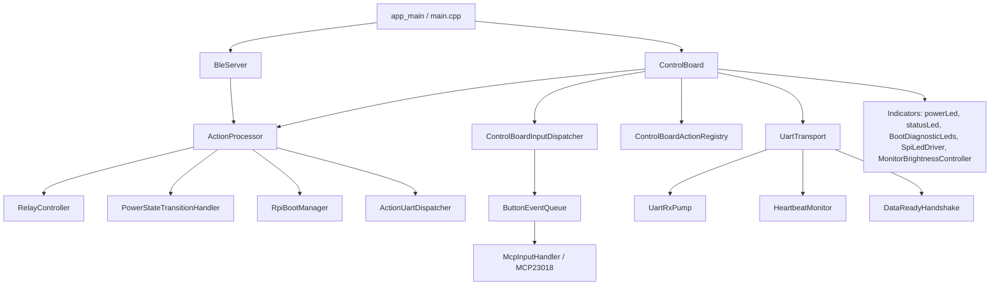
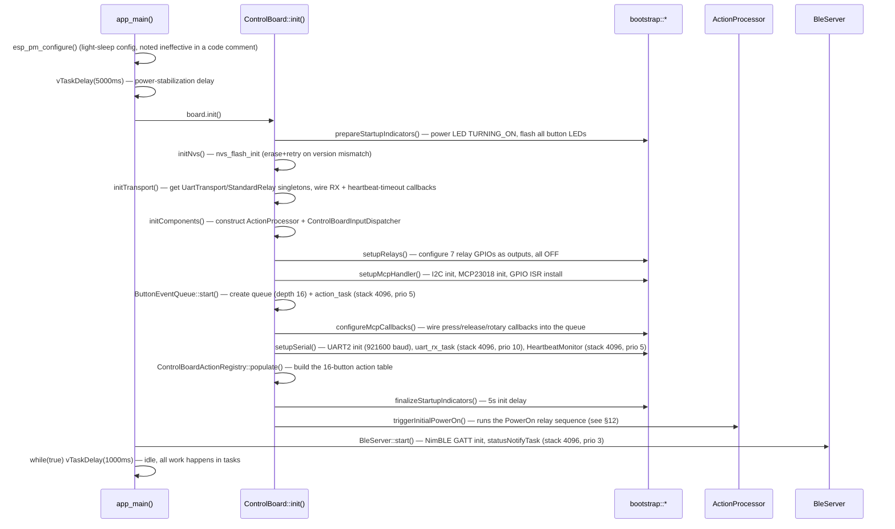
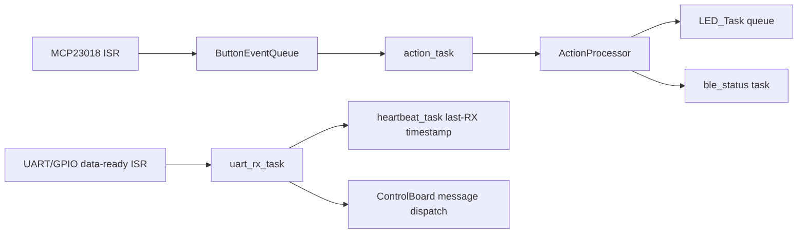
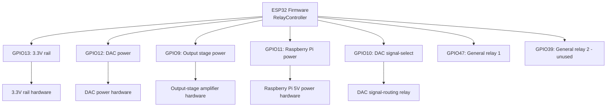
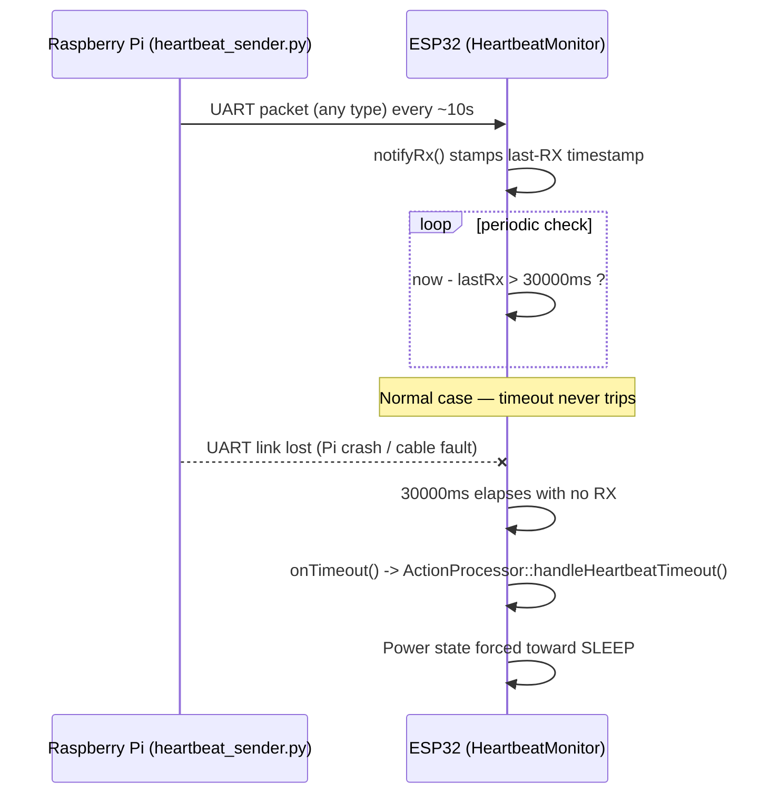

# 03 — ESP32-S3 Firmware Developer Guide

Document version 1.0 — 2026-09-18 — describes commit `402f526` on branch `feature/library-improvements`.

## 1. Firmware Overview

The ESP32-S3 firmware is the physical control layer of TinyControlBoard: it reads the
front-panel buttons/rotary encoder, drives the front-panel LEDs, sequences the unit's power
relays, bridges commands to/from the Raspberry Pi over UART, and exposes a BLE GATT server
for the Android app. It is written in C++17 against ESP-IDF, built via PlatformIO.

## 2. Development Environment

| Item | Value | Source |
|---|---|---|
| PlatformIO platform | `espressif32 @ ~6.5.0` | [platformio.ini](../platformio.ini) |
| Framework | `espidf` | platformio.ini |
| ESP-IDF version | 5.3.1 | sdkconfig |
| Board | `esp32-s3-devkitc-1-16mb` (project-local manifest at [boards/esp32-s3-devkitc-1-16mb.json](../boards/esp32-s3-devkitc-1-16mb.json)) | platformio.ini |
| C++ standard | C++17 | CMakeLists.txt |
| CPU frequency | 240 MHz | `board_build.f_cpu` |
| Flash | 16 MB, partitioned via [partitions.csv](../partitions.csv) | partitions.csv |
| Build tool | PlatformIO CLI (VS Code task **PlatformIO Build**, or `platformio run`) | .vscode task |
| Environments | `esp32-s3-devkitc-1-16mb` (debug, default, `-DSIMULATE_RPI_BOOT=1`), `esp32-s3-devkitc-1-16mb-release` (`-DNDEBUG`) | platformio.ini |
| Monitor | 115200 baud, filters `direct, esp32_exception_decoder` | platformio.ini |

## 3. Project Structure

```
lib/
  app/        — orchestration: ControlBoard, ActionProcessor, ActionFactory, input dispatch, button registry
  ble/        — BleServer.{hpp,cpp} — NimBLE GATT peripheral
  board/      — boardConfig.hpp (GPIO/timing/I2C/relay/indicator constants), boardButtonIds.hpp, boardIdentity.hpp
  hal/
    buttons/  — mcpInputHandler.{hpp,cpp} — MCP23018 I2C GPIO expander driver
    leds/     — spiLedDriver.{hpp,cpp} (16-bit SPI shift register), pwmLed.{hpp,cpp}
    relay/    — relay.{hpp,cpp} — GPIO relay driver
    storage/  — nvsStorage.{hpp,cpp}
    uart/     — serial.{hpp,cpp} facade + dataReadyHandshake, uartRxPump, heartbeatMonitor, heartbeatWatchdog, uartReceiver
  indicators/ — LED-level services: powerLed, statusLed, BootDiagnosticLeds, MonitorBrightnessController, ledManager (singleton accessors)
  input/      — actions/ — IAction and action templates (SimpleCommandAction, DynamicToggleAction, DynamicCycleAction, DynamicRotaryAction, DynamicTimedAction)
  power/      — powerState.hpp, PowerStateTransitionHandler/Policy, RelayController, RPIBootManager
  protocol/   — uartProtocol.{hpp,cpp} (wire format), commandCatalog.{hpp,cpp}
src/
  main.cpp    — app_main() entry point
  CMakeLists.txt — ESP-IDF component registration (explicit source globs per lib/ subfolder)
host_tests/   — host-buildable (MSVC/CMake) logic tests, independent of ESP-IDF
```

Include convention: all `#include`s are relative to `lib/` (e.g. `#include
"hal/uart/serial.hpp"`); `-Ilib` is the only include path in `platformio.ini`.

## 4. Firmware Architecture



## 5. Boot Sequence



If `board.init()` returns false, `app_main()` logs an error, calls `board.deinit()`, then
`BootDiagnosticLeds::begin()` + `firmwareInitFailed()` (flashes all 8 boot LEDs at 3 Hz) and
returns — there is deliberately **no retry loop** (a prior design retried `init()` every
second; this was reverted because retrying risks re-driving relays into a bad
configuration).

## 6. FreeRTOS Tasks

| Task | Purpose | File | Stack | Priority | Core |
|---|---|---|---|---|---|
| `action_task` | Drains the button/rotary event queue, drives `ActionProcessor` | `lib/app/ButtonEventQueue.cpp` | 4096 | 5 | unpinned |
| `uart_rx_task` | Drains UART RX bytes, reassembles framed packets | `lib/hal/uart/uartRxPump.cpp` | 4096 | 10 | unpinned |
| `heartbeat_task` | Polls elapsed time since last UART RX, fires timeout callback | `lib/hal/uart/heartbeatMonitor.cpp` | 4096 | 5 | unpinned |
| `ble_status` | Polls system/library/playlist state and pushes BLE notifications | `lib/ble/BleServer.cpp` | 4096 | 3 | unpinned |
| `LED_Task` | Drains a 1-deep status-LED command queue | `lib/indicators/statusLed.cpp` | 4096 | 5 | unpinned |
| `boot_diag_leds` (flash task) | Flashes boot-diagnostic LEDs on failure | `lib/indicators/BootDiagnosticLeds.cpp` | 2048 | TODO – verify exact priority constant | unpinned |
| MCP23018 interrupt task | Reads MCP23018 registers on GPIO interrupt, decodes button/rotary state | `lib/hal/buttons/mcpInputHandler.cpp` | TODO – verify exact stack/priority constants | TODO | unpinned |
| SPI boot indicator task | Legacy/auxiliary SPI boot LED task | `lib/indicators/SpiBootIndicator.cpp` | TODO – verify | TODO | unpinned |

No task is pinned to a specific core in the inspected source (no `xTaskCreatePinnedToCore`
calls found).



## 7. UART

| Property | Value |
|---|---|
| Peripheral | `UART_NUM_2` |
| TX / RX pins | `GPIO2` (TX) / `GPIO1` (RX) |
| Baud rate | 921600 |
| Data format | 8N1 (default `uart_param_config`; explicit parity/stop-bit values: **TODO – confirm exact `uart_config_t` fields in `serial.cpp`**) |
| Flow control | None — handled instead by a 2-GPIO data-ready handshake (`GPIO41` ESP32→Pi, `GPIO42` Pi→ESP32`) |
| RX buffer | 1024 bytes (`k_bufferSize`, ring buffer ~2× that internally) |
| Receive mechanism | ISR on the data-ready GPIO wakes `uart_rx_task`, which loops `uart_read_bytes()` until the driver buffer is drained (fixed in a prior fix for burst traffic — see hazard note below) |
| Transmit mechanism | `UartTransport::sendData()`/`sendUartMessage()` — checks the ESP32 output data-ready line is low, writes the frame, pulses the output line high for 10ms |
| Error handling | Checksum/framing validated on the Pi side; the ESP32 side does not NACK malformed frames |

**Known hazard (fixed)**: a burst of many small packets (e.g. a long library listing) can
coalesce multiple GPIO wake notifications into a single task wake (`ulTaskNotifyTake`
semantics) — the RX task must fully drain the UART driver buffer on every wake, not just
read one fixed-size chunk, or bytes are silently dropped. This is the current
implementation's behavior; see `/memories/repo/wifi-remote-android-plan.md` for the original
bug write-up.

## 8. I2C

| Property | Value |
|---|---|
| Port | `I2C_NUM_0` |
| SDA / SCL | `GPIO16` / `GPIO15` |
| Clock speed | 50 kHz |
| Device | MCP23018 16-bit I/O expander, address `0x20` |
| Interrupt pin | `GPIO18` |
| Enable pin | `GPIO17` (driven high by firmware to enable the I2C level shifter/expander) |
| Driver | `lib/hal/buttons/mcpInputHandler.{hpp,cpp}` |
| Timeout | 10 ms (`k_mcpTimeoutMs`) |

Register map used (from `mcpInputHandler`): `IODIRA/B (0x00/0x01)`, `GPINTENA/B
(0x04/0x05)`, `INTCONA/B (0x08/0x09)`, `IOCON (0x0A)`, `GPPUA/B (0x0C/0x0D)`, `INTFA/B
(0x0E/0x0F)`, `INTCAPA/B (0x10/0x11)`, `GPIOA/B (0x12/0x13)`. Rotary movement is decoded via
a 4-entry Gray-code lookup table.

## 9. SPI

| Property | Value |
|---|---|
| Peripheral | `SPI2_HOST` |
| Pins | MOSI `GPIO7`, CLK `GPIO6`, LATCH `GPIO5` (software-toggled GPIO, not a SPI CS line) |
| Mode | Mode 0 |
| Clock speed | 1 MHz |
| Device | 16-bit shift-register LED driver (no readback device) |
| Driver | `lib/hal/leds/spiLedDriver.{hpp,cpp}` |
| Data format | 16-bit LED bitmask shifted out low-byte-first then high-byte-first, latched after transfer |

## 10. GPIO

| GPIO | Function | Direction | Active state | Owner |
|---|---|---|---|---|
| 1 | UART2 RX | in | n/a | `lib/hal/uart/serial.cpp` |
| 2 | UART2 TX | out | n/a | `lib/hal/uart/serial.cpp` |
| 3 | App active LED (power LED, "on" color) | out | active-high (assumed, not separately verified) | `lib/indicators/powerLed.cpp` |
| 4 | App standby LED (power LED, "sleep" color) | out | active-high (assumed) | `lib/indicators/powerLed.cpp` |
| 5 | SPI LED latch | out | — | `lib/hal/leds/spiLedDriver.cpp` |
| 6 | SPI LED clock | out | — | `lib/hal/leds/spiLedDriver.cpp` |
| 7 | SPI LED data (MOSI) | out | — | `lib/hal/leds/spiLedDriver.cpp` |
| 9 | Output-stage power relay | out | active-high | `lib/power/RelayController.cpp` |
| 10 | Prototype/signal DAC-enable relay | out | active-high | `lib/power/RelayController.cpp` |
| 11 | Raspberry Pi power relay | out | active-high | `lib/power/RelayController.cpp` |
| 12 | DAC power relay | out | active-high | `lib/power/RelayController.cpp` |
| 13 | 3.3V rail power relay | out | active-high | `lib/power/RelayController.cpp` |
| 15 | I2C SCL | out | — | `lib/hal/buttons/mcpInputHandler.cpp` |
| 16 | I2C SDA | in/out | — | `lib/hal/buttons/mcpInputHandler.cpp` |
| 17 | MCP23018 enable | out | active-high | `lib/hal/buttons/mcpInputHandler.cpp` |
| 18 | MCP23018 interrupt | in | active-low (typical MCP23018 default; **TODO – confirm `IOCON.ODR`/polarity bits in code**) | `lib/hal/buttons/mcpInputHandler.cpp` |
| 21 | Button-LED PWM (overall brightness) | out (LEDC) | — | `lib/indicators/ledDefinitions.hpp` / PWM LED |
| 39 | General relay 2 | out | active-high | `lib/board/boardConfig.hpp` — **initialized but never referenced by any action/power sequence in the inspected source (dead output)** |
| 41 | ESP32→Pi data-ready output | out | active-high (10ms pulse) | `lib/hal/uart/dataReadyHandshake.cpp` |
| 42 | Pi→ESP32 data-ready input | in | active-high (rising-edge ISR) | `lib/hal/uart/dataReadyHandshake.cpp` |
| 43 | Monitor brightness PWM | out (LEDC) | — | `lib/indicators/MonitorBrightnessController.cpp` |
| 47 | General relay 1 | out | active-high | `lib/board/boardConfig.hpp` |
| 48 | Working-status LED | out | — | `lib/indicators/statusLed.cpp` |

Full pin table also cross-referenced in [06-hardware-interface.md](06-hardware-interface.md)
and [wiring-reference.md](wiring-reference.md).

## 11. MCP23018

| Property | Value |
|---|---|
| Address | `0x20` |
| Pin allocation | 16 GPIO expander pins mapped 0–15 to firmware button indices (`board::buttons` enum) |
| Interrupts | `GPINTENA/B` enabled per-pin; `INTCAPA/B` captured state read on interrupt; ISR on `GPIO18` wakes the interrupt-handling task |
| Enable signal | `GPIO17` driven high to enable the expander/level-shifter before I2C traffic begins |
| Register configuration | See §8 register map |
| Software driver | `lib/hal/buttons/mcpInputHandler.{hpp,cpp}` |

## 12. Relay Control

All 7 relays are driven directly by ESP32 GPIO outputs (`gpio_set_level`) — there is **no
I/O-expander in the relay path** in the inspected source; the MCP23018 is used only for
button/rotary input, not for relay output.



| Relay | GPIO | Sequenced in power-on? | Notes |
|---|---|---|---|
| VCC 3V3 power | 13 | Yes (1st, +1000ms) | |
| DAC power | 12 | Yes (2nd, +1500ms) | Distinct from GPIO10 "toggle DAC" — this is bulk power |
| Output stage power | 9 | Yes (3rd, +1500ms) | Turned off first on Sleep/DeepSleep |
| Raspberry Pi power | 11 | Yes (4th, +1000ms; then waits up to 60s for heartbeat) | |
| DAC signal-select (`ESS_DAC_ENABLED`) | 10 | No — user-toggled independently via "Toggle DAC" button | Selects/enables signal routing, not bulk power |
| General relay 1 | 47 | No | Not referenced by any action in the inspected source beyond GPIO init |
| General relay 2 | 39 | No | Initialized only; **dead output**, never referenced elsewhere |

## 13. Communication Protocol

See [05-communication-protocol.md](05-communication-protocol.md) for the full UART wire
format specification (this firmware is one of the two endpoints of that protocol).

## 14. Heartbeat

| Property | Value |
|---|---|
| Purpose | Detect loss of the Raspberry Pi's UART link |
| Direction | Raspberry Pi → ESP32 (any valid UART RX packet resets the timer, not just an explicit heartbeat command) |
| Timeout | 30000 ms (`board::timing::k_heartbeatTimeoutMs`) |
| Check interval | Monitor task polls the elapsed-time watchdog periodically (interval constant lives in `heartbeatMonitor.cpp`) |
| Failure behavior | `ActionProcessor::handleHeartbeatTimeout()` forces the power state toward `SLEEP` if currently `ON`/`TURNING_ON` |
| Recovery | A subsequent power-on cycle re-arms the boot-time 60s RPi-boot wait (`RpiBootManager::waitForRpiToBoot`) |



## 15. Error Handling

Return-code based (`esp_err_t`), no C++ exceptions (disabled by default under ESP-IDF).
Bootstrap functions (`bootstrap::setupRelays()`, `setupMcpHandler()`, `setupSerial()`) return
`bool`; `ControlBoard::init()` aborts firmware startup and flashes the boot-diagnostic LEDs
on any `false` return, rather than retrying.

## 16. Logging

Standard ESP-IDF `ESP_LOGI/ESP_LOGW/ESP_LOGE`, one log tag per module/class (e.g.
`"Control_Board"`, `"Serial"`, `"MCP"`, `"Relay"`, `"BLE_Server"`, `"Rpi_Boot_Manager"`,
`"Power_State_Hdlr"`, `"Action_Processor"`). Viewed via `platformio device monitor` or the
VS Code PlatformIO monitor pane.

## 17. Firmware Build

```powershell
# VS Code task "PlatformIO Build", or from a terminal:
C:\Users\<user>\.platformio\penv\Scripts\platformio.exe run
# Release build:
C:\Users\<user>\.platformio\penv\Scripts\platformio.exe run -e esp32-s3-devkitc-1-16mb-release
```

## 18. Flashing

```powershell
platformio.exe run -t upload
```

Exact upload port/baud: **TODO – not pinned in `platformio.ini`** (uses PlatformIO's
auto-detected upload port; no `upload_port`/`upload_speed` override present).

## 19. Firmware Update

No OTA mechanism was found in the inspected source (no `esp_https_ota`/`esp_ota_ops` calls).
Updates are applied by re-flashing over USB via PlatformIO.

## 20. Extending the Firmware

- **Add a command**: add a `CMD_*` enum value to `lib/protocol/uartProtocol.hpp`, add a row
  to `commandCatalog.cpp` if it needs a display name, and route it through
  `ActionCommandRoutingPolicy`/`ActionFactory` if it needs board-local handling; otherwise the
  default route (`UartDispatch`) forwards it to the Pi untouched.
- **Add a GPIO**: add a named constant to the appropriate namespace in `boardConfig.hpp`.
- **Add a peripheral**: add a new `lib/hal/<peripheral>/` module; register its sources in
  `src/CMakeLists.txt`'s `GLOB_RECURSE` list.
- **Add a task**: prefer wrapping it the way `HeartbeatMonitor`/`UartRxPump` do — a thin
  class owning the `xTaskCreate` call plus a callback interface, rather than a bare
  free-function task.
- **Modify relay behavior**: `lib/power/RelayController.cpp` and
  `PowerStateTransitionHandler.cpp` — the latter owns the actual state-machine sequencing
  and timing delays (`board::timing::*` in `boardConfig.hpp`).
- **Add diagnostic functionality**: `lib/indicators/BootDiagnosticLeds.{hpp,cpp}` already
  provides a `stageSuccess(BootStage)`/`stageFailure(BootStage)` pattern for surfacing boot
  failures on the front-panel LEDs.

## Dead/orphaned code observed at this commit

- `GENERAL_2` relay (GPIO39) — initialized, never referenced elsewhere.
- `SerialHeartbeatRouter.hpp` — minimal call-sites; largely a pass-through.
- `ControlBoardButtonIds.hpp` — thin alias to `board::buttons`, could be inlined.
- `esp_pm_configure()` in `main.cpp` — retained with a code comment stating it "does not
  work :( does not save any power at all"; left in place, not removed.
