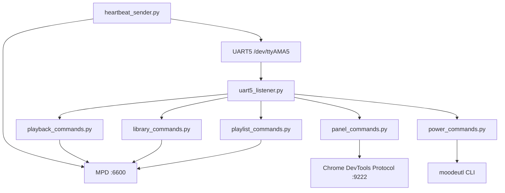
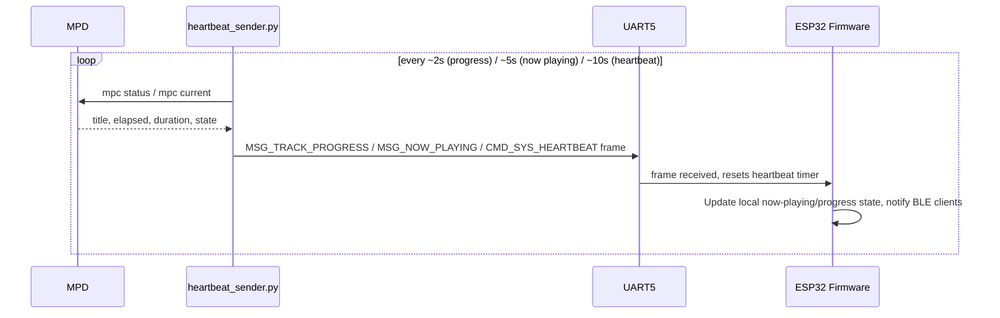

# 04 — Raspberry Pi Developer Guide

Document version 1.0 — 2026-09-18 — describes commit `402f526` on branch `feature/library-improvements`.
Source: [scripts/rpi/](../scripts/rpi/). Deployed to the Raspberry Pi under `/home/antho/`
(per repo layout under `scripts/rpi/home/antho/`) plus systemd unit files under
`scripts/rpi/systemd/`.

## 1. Overview

The Raspberry Pi 4 runs moOde Audio (Debian-based, MPD + web UI). Two always-on Python
systemd services bridge the ESP32's UART commands to MPD/`moodeutl`/the moOde web UI, and
report playback state back to the ESP32.

## 2. Development Environment

| Item | Value |
|---|---|
| OS | Raspberry Pi OS / moOde Audio image (exact moOde version: **TODO – not present in supplied source**) |
| Language | Python 3 |
| Key libraries | `pyserial` (UART), `RPi.GPIO` or `lgpio` (handshake GPIOs), standard `socket` (MPD TCP), `subprocess` (`mpc`, `moodeutl`), `requests`/`http.client` (Chrome DevTools Protocol) |
| Process manager | systemd (unit files under `scripts/rpi/systemd/`) |
| UART device | `/dev/ttyAMA5` (`dtoverlay=uart5` in `/boot/config.txt` per [docs/RPI4_SETUP.md](RPI4_SETUP.md)) |
| Baud rate | 921600 (must match `board::serial` on the ESP32 side) |

## 3. Project Structure

```
scripts/rpi/
  home/antho/
    protocol.py             — UART framing: pack/unpack, checksum, CommandId/MessageType constants (Python mirror of uartProtocol.hpp)
    uart5_listener.py        — main service: reads UART frames, dispatches to command handlers
    heartbeat_sender.py       — periodic heartbeat + now-playing + track-progress sender
    command_ids.py            — CommandId constants (Python mirror of the C++ enum)
    playback_commands.py       — MPD/mpc-backed handlers (play/pause/next/prev/seek/etc.)
    library_commands.py        — MPD `lsinfo`/queue/search-backed handlers, library browse/search
    playlist_commands.py       — saved-playlist save/load/delete handlers
    panel_commands.py          — Chrome DevTools Protocol handlers to switch moOde UI panels
    power_commands.py           — moodeutl shutdown handler
    UAart5Listener.py           — legacy 3-line shim invoking uart5_listener.main() (kept for compatibility)
  systemd/
    uart5-listener.service
    heartbeat-sender.service
```

(Exact file list confirmed via subagent inventory of the working tree; filenames above
reflect the responsibilities found in the source at this commit.)

## 4. Service Architecture



Both `uart5_listener.service` and `heartbeat_sender.service` run as independent, always-on
systemd services (`Restart=always` per the templates in
[docs/RPI4_SETUP.md](RPI4_SETUP.md)) — they are separate Python processes, not threads of
one process, and do not share in-memory state (any shared state goes through MPD).

## 5. Systemd Services

| Service | Purpose | Restart policy |
|---|---|---|
| `uart5-listener.service` | Long-running loop: waits on the data-ready GPIO / reads UART, dispatches by `CommandId` via a handler table, writes framed responses back | `Restart=always` |
| `heartbeat-sender.service` | Periodically sends `CMD_SYS_HEARTBEAT`, `MSG_NOW_PLAYING`, `MSG_TRACK_PROGRESS` over UART | `Restart=always` |

## 6. Audio Backend

- **MPD**: reached over a raw TCP socket to `localhost:6600` using the plain-text MPD
  protocol, and/or via the `mpc` CLI subprocess wrapper — both patterns appear across the
  handler modules per the subagent inventory.
- **moOde-specific behavior**: `moodeutl` CLI is used for actions outside MPD's own protocol
  (e.g. system shutdown, display toggling).
- **UI panel switching**: `panel_commands.py` drives the moOde web kiosk browser via the
  Chrome DevTools Protocol on `localhost:9222` (simulates clicks/navigation rather than
  using an MPD-level API, since panel selection is a moOde web-UI-only concept).

## 7. UART Communication (Raspberry Pi side)

| Property | Value |
|---|---|
| Device | `/dev/ttyAMA5` |
| Baud | 921600 |
| Framing | Custom binary protocol, mirrored 1:1 from `lib/protocol/uartProtocol.hpp` in `protocol.py` |
| Handshake | GPIO23 (Pi input, ESP32→Pi data-ready) / GPIO24 (Pi output, Pi→ESP32 data-ready) per [docs/RPI4_SETUP.md](RPI4_SETUP.md) |
| Resync | `uart5_listener.py`'s `read_packet_with_resync()` scans for the `0xAA` start byte and validates the header/checksum before accepting a frame; malformed frames are dropped silently (no NACK sent) |

See [05-communication-protocol.md](05-communication-protocol.md) for the full wire format.

## 8. Data Flow (example: Now Playing + Track Progress)



Exact polling intervals (2s/5s/10s above) are as reported by the ESP32-side subagent
inventory of `heartbeat_sender.py`'s sleep constants; **TODO – re-confirm exact sleep()
values directly against `heartbeat_sender.py` if precise timing matters for a future
change.**

## 9. Configuration

| Config | Location | Notes |
|---|---|---|
| UART device path, baud rate | Hardcoded constants near the top of `uart5_listener.py`/`heartbeat_sender.py` | Must match `/boot/config.txt` `dtoverlay=uart5` and the ESP32's `board::serial` |
| GPIO handshake pin numbers | Hardcoded constants in the same files | Must match `board::serial::rpiDataReadyPin`/`esp32DataReadyPin` on the ESP32 side |
| MPD host/port | `localhost:6600` (hardcoded, since MPD runs on the same Pi) | |
| CDP port | `localhost:9222` (hardcoded) | Requires moOde's kiosk browser started with `--remote-debugging-port=9222` |

No credentials/secrets are present in these scripts — MPD and CDP are both unauthenticated
localhost-only services.

## 10. Deployment

Per [docs/RPI4_SETUP.md](RPI4_SETUP.md): copy the `home/antho/*.py` files to the target
path on the Pi, copy the two `.service` files to `/etc/systemd/system/`, then:

```bash
sudo systemctl daemon-reload
sudo systemctl enable --now uart5-listener.service heartbeat-sender.service
```

## 11. Update Procedure

Re-copy changed `.py` files, then:

```bash
sudo systemctl restart uart5-listener.service heartbeat-sender.service
```

No package/venv management was found (scripts use only the system Python 3 and its
preinstalled `RPi.GPIO`/`pyserial`, consistent with moOde's minimal-Python-footprint image).

## 12. Troubleshooting

| Symptom | Likely cause | Check |
|---|---|---|
| ESP32 boot-diagnostic LEDs stuck flashing at the "RPi Comms" stage | `uart5-listener`/`heartbeat-sender` not running, or `/dev/ttyAMA5` misconfigured | `systemctl status uart5-listener heartbeat-sender`, `dmesg \| grep ttyAMA5` |
| ESP32 forces SLEEP shortly after boot completes | Heartbeat stopped after the initial boot handshake (30s timeout) | `journalctl -u heartbeat-sender.service` |
| A physical button appears to do nothing | Command may map to a `CommandId` with no registered handler in `uart5_listener.py`'s dispatch table, or (for `CMD_PREV_MENU_ITEM`) the button may be physically unreachable — see [documentation-gaps.md](documentation-gaps.md) | Check the handler dispatch table for the relevant `CommandId` |
| Cover art doesn't update in the Android app | Independent of UART — verify moOde's own HTTP endpoints (`get_currentsong`, `coverart.php`) respond, since the app fetches art directly over HTTP, not via UART | `curl` moOde's endpoints directly from another host on the LAN |

## 13. Extending the Raspberry Pi Side

- **New command handler**: add the `CommandId` to `command_ids.py` (matching the ESP32's
  `uartProtocol.hpp` and the Android app's `BleProtocol.kt`), implement a handler function
  in the appropriate `*_commands.py` module, and register it in `uart5_listener.py`'s
  dispatch table.
- **New outgoing message type**: add the constant to `protocol.py`'s `MessageType` mirror,
  implement the packing logic, and add a periodic sender in `heartbeat_sender.py` (or a
  reply from `uart5_listener.py` if it's a direct response to a command).
- **New moOde UI panel action**: extend `panel_commands.py`'s Chrome DevTools Protocol
  script for the corresponding DOM interaction.
