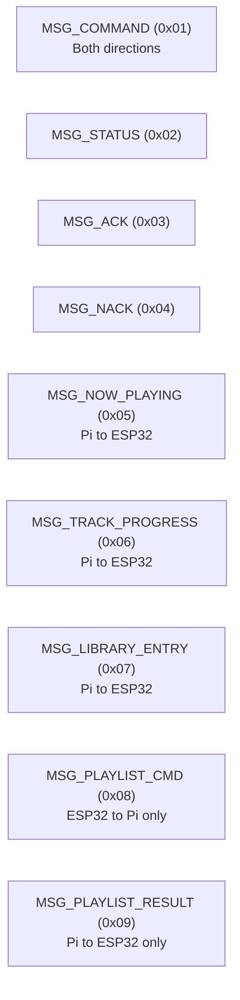
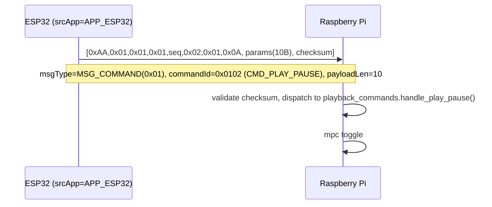
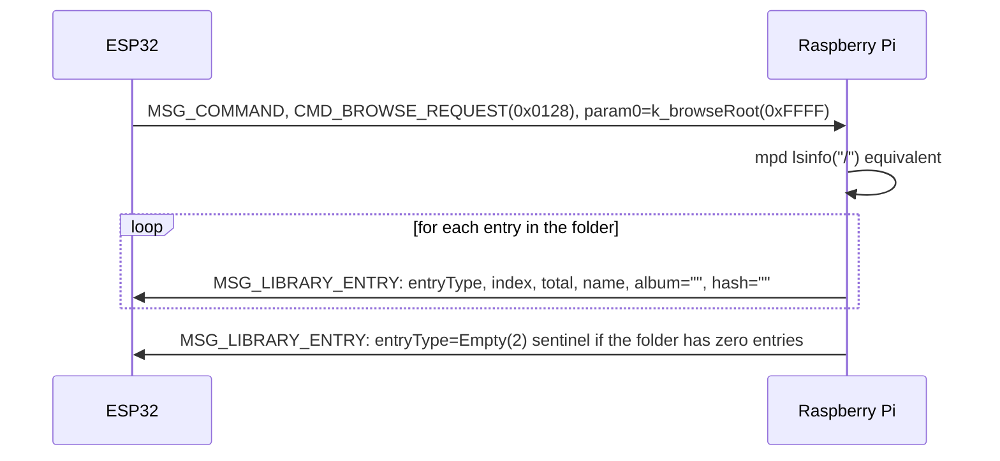

# 05 — Communication Protocol Specification

Document version 1.0 — 2026-09-18 — describes commit `402f526` on branch `feature/library-improvements`.

Authoritative source: [lib/protocol/uartProtocol.hpp](../lib/protocol/uartProtocol.hpp)
(verified verbatim against source for this document). Mirrored on the Raspberry Pi in
`scripts/rpi/home/antho/protocol.py`/`command_ids.py`, and on Android in
`android/TinyRemote/app/src/main/kotlin/com/tinycb/remote/ble/BleProtocol.kt`. All three
were found consistent with each other at this commit (header layout, checksum, `CommandId`
values, `MessageType` values).

This protocol has **two carriers**:

1. **UART5** between the ESP32-S3 and the Raspberry Pi — the full framed binary protocol
   described below, at 921600 baud, with a 2-GPIO data-ready handshake (no hardware flow
   control).
2. **BLE GATT** between the ESP32-S3 and the Android app — the same logical message
   *payloads* (not the UART header/checksum) are carried as GATT characteristic
   writes/notifications, one characteristic per message purpose (see
   [02-android-developer-guide.md](02-android-developer-guide.md) §9).

## 1. Packet Structure (UART carrier)

```
byte 0       : startByte      = 0xAA
byte 1       : version        = 0x01
byte 2       : srcApp         = APP_ESP32 (0x01) | APP_PI (0x02)
byte 3       : msgType        = MessageType (see below)
byte 4       : sequence       = rolling counter, sender-assigned
byte 5-6     : commandId      = uint16 LE (CommandId, see below)
byte 7       : payloadLen (N) = length in bytes of the payload that follows
byte 8..8+N-1: payload        = message-type-specific (see §3)
byte 8+N     : checksum       = uint8
```

| Constant | Value |
|---|---|
| `k_headerSize` | 8 |
| `k_legacyPayloadSize` | 10 (5 × `uint16` params, used by plain `MSG_COMMAND` packets) |
| `k_libraryEntryMaxPayloadSize` | 135 (the largest payload type, see §3.6) |
| `k_maxPayloadSize` | 135 |
| `k_maxPacketSize` | 144 (8 header + 135 payload + 1 checksum) |
| `k_commandPacketSize` | 19 (8 header + 10 legacy payload + 1 checksum) |

Two build-time `static_assert`s guard this layout: (1) `k_maxPacketSize` must not overflow
`uint8_t` (≤255), and (2) `k_libraryEntryMaxPayloadSize` must stay ≤253 bytes so a single
BLE GATT notification (ATT MTU 256, minus 3 bytes ATT overhead) can carry the largest
library-entry payload in one notification without fragmentation.

## 2. Checksum Algorithm

`calculateChecksum(p_data)` — implementation is in `uartProtocol.cpp` (not reproduced
verbatim in this document; behavior confirmed via the Python mirror in `protocol.py` and
the header-level comments): the checksum is computed over header bytes 1 through
`7+N` (i.e. everything after the start byte, through the end of the payload) and appended
as byte `8+N`. The receiver recomputes the same sum over the received bytes and rejects the
frame if it disagrees with the trailing checksum byte.

## 3. Message Types

| Constant | Value | Direction | Payload |
|---|---:|---|---|
| `MSG_COMMAND` | 0x01 | Both | 5 × `uint16` LE params (`k_legacyPayloadSize` = 10 bytes) |
| `MSG_STATUS` | 0x02 | ESP32 → Pi (or informational) | Implementation-specific status payload |
| `MSG_ACK` | 0x03 | Either | Acknowledgement (no payload fields defined in `UartMessage` beyond the header) |
| `MSG_NACK` | 0x04 | Either | Negative-acknowledgement |
| `MSG_NOW_PLAYING` | 0x05 | Pi → ESP32 | UTF-8 track name, up to `k_maxNowPlayingLen` (60) bytes + explicit length byte |
| `MSG_TRACK_PROGRESS` | 0x06 | Pi → ESP32 | `elapsed_s(u16 LE) + duration_s(u16 LE) + is_playing(u8)` |
| `MSG_LIBRARY_ENTRY` | 0x07 | Pi → ESP32 | See §3.6 |
| `MSG_PLAYLIST_CMD` | 0x08 | ESP32 → Pi only | Playlist name, UTF-8, no terminator |
| `MSG_PLAYLIST_RESULT` | 0x09 | Pi → ESP32 only | `ok(u8, 0/1) + result message (UTF-8, no terminator)` |

### 3.6 `MSG_LIBRARY_ENTRY` payload layout

```
entryType (u8)      : 0=Folder, 1=Track, 2=Empty(sentinel), 3=Radio
index (u16 LE)
total (u16 LE)
nameLen (u8)        : ≤ 55
name (nameLen bytes): UTF-8
albumLen (u8)       : ≤ 40 (0 for browse/playlist listings)
album (albumLen bytes)
hashLen (u8)        : ≤ 32 (0 or 32 ASCII-hex MD5 chars; search results only)
hash (hashLen bytes)
```

Special index values: `k_browseUp = 0xFFFE` (navigate to parent folder),
`k_browseRoot = 0xFFFF` (navigate to library root).

## 4. Message Types Diagram



## 5. Command Table

`PowerCommand`: `POWER_ACTIVE=0x01`, `POWER_SLEEP=0x02`, `POWER_DEEP_SLEEP=0x03`.
`AppId`: `APP_ESP32=0x01`, `APP_PI=0x02`.

| CommandId | Value | Name | Notes |
|---|---:|---|---|
| `CMD_NO_ACTION` | 0x0000 | No-op | |
| `CMD_SYS_POWER` | 0x0001 | System power button | param0 = `PowerCommand` |
| `CMD_SYS_RPI_SHUTDOWN` | 0x0002 | Request Pi shutdown | ESP32 → Pi, part of Sleep/DeepSleep sequence |
| `CMD_SYS_HEARTBEAT` | 0x0003 | Heartbeat | Pi → ESP32, resets the 30s watchdog |
| `CMD_SYS_NOHEARTBEAT` | 0x0004 | (reserved / heartbeat-disable signal) | **TODO – confirm exact usage; not exercised in the inspected call sites** |
| `CMD_NEXT_TRACK` | 0x0100 | Next track | |
| `CMD_PREVIOUS_TRACK` | 0x0101 | Previous track | |
| `CMD_PLAY_PAUSE` | 0x0102 | Play/Pause toggle | |
| `CMD_STOP_TRACK` | 0x0103 | Stop | |
| `CMD_SKIP_FORWARD` | 0x0104 | Seek forward | |
| `CMD_SKIP_BACK` | 0x0105 | Seek back | |
| `CMD_PREV_MENU_ITEM` | 0x0106 | Previous moOde menu item | Unreachable from any physical button, see [documentation-gaps.md](documentation-gaps.md) |
| `CMD_NEXT_MENU_ITEM` | 0x0107 | Next moOde menu item | |
| `CMD_ITEM_SELECT` | 0x0108 | Select current menu item | |
| `CMD_EXIT_ITEM` | 0x0109 | Exit current menu item | |
| `CMD_TOGGLE_DAC_ON` | 0x010A | DAC signal-select on | |
| `CMD_DISPLAY_OFF` | 0x010B | Display off | |
| `CMD_TOGGLE_METER_ON` | 0x010C | Meter display on | |
| `CMD_TOGGLE_METER_OFF` | 0x010D | Meter display off | |
| `CMD_DISPLAY_ON` | 0x010E | Display on | |
| `CMD_TOGGLE_DAC_OFF` | 0x010F | DAC signal-select off | |
| `CMD_ROTARY_LEFT` | 0x0110 | Rotary left (discrete) | |
| `CMD_ROTARY_RIGHT` | 0x0111 | Rotary right (discrete) | |
| `CMD_ROTARY_ACTION` | 0x0112 | Rotary movement | param0 = direction (0=left,1=right); this is the value actually emitted by the current rotary input path |
| `CMD_TOGGLE_DAC` | 0x0113 | DAC signal-select toggle | |
| `CMD_TOGGLE_DISPLAY` | 0x0114 | Display toggle | |
| `CMD_TOGGLE_METER` | 0x0115 | Meter display toggle | param0 = 1/0 |
| `CMD_CYCLE_BRIGHTNESS` | 0x0116 | Cycle front-panel brightness level | |
| `CMD_COVER_VIEW_ON` | 0x0117 | Cover-art view on | |
| `CMD_COVER_VIEW_OFF` | 0x0118 | Cover-art view off | |
| `CMD_TOGGLE_COVER_VIEW` | 0x0119 | Cover-art view toggle | |
| `CMD_REPEAT_ON` | 0x011A | Repeat on | |
| `CMD_REPEAT_OFF` | 0x011B | Repeat off | |
| `CMD_TOGGLE_REPEAT` | 0x011C | Repeat toggle | param0 = 1/0 |
| `CMD_RANDOM_ON` | 0x011D | Shuffle on | |
| `CMD_RANDOM_OFF` | 0x011E | Shuffle off | |
| `CMD_TOGGLE_RANDOM` | 0x011F | Shuffle toggle | param0 = 1/0 |
| `CMD_SET_BRIGHTNESS_UP` | 0x0120 | Brightness up | |
| `CMD_SET_BRIGHTNESS_DOWN` | 0x0121 | Brightness down | |
| `CMD_SELECT_PANEL_PLAYBACK` | 0x0122 | Select moOde Playback panel | |
| `CMD_SELECT_PANEL_RADIO` | 0x0123 | Select moOde Radio panel | |
| `CMD_SELECT_PANEL_PLAYLIST` | 0x0124 | Select moOde Playlist panel | |
| `CMD_SELECT_PANEL_FOLDER` | 0x0125 | Select moOde Folder panel | |
| `CMD_SELECT_PANEL_TAG` | 0x0126 | Select moOde Tag panel | |
| `CMD_SELECT_PANEL_ALBUM` | 0x0127 | Select moOde Album panel | |
| `CMD_BROWSE_REQUEST` | 0x0128 | Browse a library folder | param0 = child index, or `k_browseUp`/`k_browseRoot` |
| `CMD_ADD_TRACK` | 0x0129 | Add track to queue | param0 = index of file in current listing |
| `CMD_PLAYLIST_REQUEST` | 0x012A | Request current MPD queue | Response via `MSG_LIBRARY_ENTRY` stream |
| `CMD_PLAY_TRACK` | 0x012B | Play a queue position | param0 = zero-based queue position |
| `CMD_REMOVE_TRACK` | 0x012C | Remove from queue | param0 = zero-based queue position |
| `CMD_ADD_FOLDER` | 0x012D | Add folder's tracks to queue | param0 = folder index; up to 50 tracks |
| `CMD_REPLACE_WITH_FOLDER` | 0x012E | Replace queue with folder's tracks | param0 = folder index; up to 50 tracks |
| `CMD_PLAYLIST_LIST_REQUEST` | 0x012F | Request saved playlist names | Sent via `LIBRARY_CMD_CHAR`/response via `MSG_LIBRARY_ENTRY` |
| `CMD_PLAYLIST_SAVE` | 0x0130 | Save new playlist | `MSG_PLAYLIST_CMD` payload = new playlist name |
| `CMD_PLAYLIST_SAVE_OVERWRITE` | 0x0131 | Overwrite existing playlist | `MSG_PLAYLIST_CMD` payload = playlist name (remove then save) |
| `CMD_PLAYLIST_LOAD` | 0x0132 | Load playlist | `MSG_PLAYLIST_CMD` payload = playlist name |
| `CMD_PLAYLIST_DELETE` | 0x0133 | Delete playlist | `MSG_PLAYLIST_CMD` payload = playlist name |
| `CMD_CLEAR_QUEUE` | 0x0134 | Clear MPD queue | |
| `CMD_LIBRARY_SEARCH_ARTIST` | 0x0135 | Search by artist | `MSG_PLAYLIST_CMD` payload = search text; results via `MSG_LIBRARY_ENTRY` |
| `CMD_LIBRARY_SEARCH_ALBUM` | 0x0136 | Search by album | Same pattern |
| `CMD_LIBRARY_SEARCH_ANY` | 0x0137 | Search any field | Same pattern |
| `CMD_ADD_SEARCH_RESULT` | 0x0138 | Add a search result to queue | param0 = index into last search result listing |
| `CMD_SEEK_TO_PERCENT` | 0x0139 | Seek within track | param0 = target percent (0–100) of duration |
| `CMD_MOVE_TRACK` | 0x013A | Reorder queue | param0 = current position, param1 = destination position |

All 60 `CommandId` values above were transcribed directly from
`lib/protocol/uartProtocol.hpp` at this commit and cross-checked against the Android and RPi
subagent inventories — no discrepancies found.

## 6. Message Format (`UartMessage` struct fields)

| Field | Type | Used by |
|---|---|---|
| `startByte, version, srcApp, msgType, sequence, commandId` | header (see §1) | all messages |
| `params[5]` | `uint16[5]` | `MSG_COMMAND` |
| `nowPlayingText[61] + nowPlayingLen` | `uint8[]` + `uint8` | `MSG_NOW_PLAYING` |
| `trackElapsedSec, trackDurationSec, trackIsPlaying` | `uint16, uint16, bool` | `MSG_TRACK_PROGRESS` |
| `libraryEntryType, libraryEntryIndex, libraryEntryTotal` | `uint8, uint16, uint16` | `MSG_LIBRARY_ENTRY` |
| `libraryEntryName[56] + libraryEntryNameLen` | `uint8[]` + `uint8` | `MSG_LIBRARY_ENTRY` |
| `libraryEntryAlbum[41] + libraryEntryAlbumLen` | `uint8[]` + `uint8` | `MSG_LIBRARY_ENTRY` |
| `libraryEntryArtHash[33] + libraryEntryArtHashLen` | `uint8[]` + `uint8` | `MSG_LIBRARY_ENTRY` |
| `playlistNameOut[56] + playlistNameOutLen` | `uint8[]` + `uint8` | `MSG_PLAYLIST_CMD` (outgoing, ESP32→Pi) |
| `playlistResultOk, playlistResultMessage[56] + playlistResultMessageLen` | `bool, uint8[]+uint8` | `MSG_PLAYLIST_RESULT` (incoming, Pi→ESP32) |
| `checksum` | `uint8` | all messages |

`serializeMessage(rMsg, p_buffer)` writes the wire-format bytes for the fields relevant to
`rMsg.msgType` and returns the total packet size; `deserializeMessage(p_buffer, rMsg)`
performs the inverse and validates the checksum, returning `false` on mismatch.

## 7. Example Exchange — Command (Play/Pause)



## 8. Example Exchange — Library Browse



## 9. Versioning

`k_version = 0x01` is placed in every packet header but the inspected source does not
implement multi-version negotiation or rejection of mismatched versions — **TODO – confirm
whether `deserializeMessage()` checks `version` and what happens on mismatch; not observed
in the header-level declarations reviewed for this document.**

## 10. Error Handling (protocol level)

- **Checksum failure**: frame is dropped by the receiver; no NACK is sent back over UART in
  the inspected source (`MSG_NACK` exists as an enum value but no call site emitting it was
  found in either the ESP32 or Pi subagent inventories — **TODO – confirm whether
  `MSG_NACK` is dead protocol surface**).
  Renamed as noted in [documentation-gaps.md](documentation-gaps.md) if resolved.
- **Resync**: the Pi's `read_packet_with_resync()` scans forward for the next `0xAA` start
  byte after a bad frame, rather than dropping the whole connection.
  ESP32-side resync behavior: **TODO – confirm the ESP32 RX pump has equivalent resync
  logic** (subagent report suggests it does via a state machine in `uartRxPump.cpp`, not
  independently re-verified line-by-line for this document).
- **Truncated/oversized payload**: `payloadLen` is receiver-validated against the expected
  size for the given `msgType`; behavior on mismatch: **TODO – confirm exact reject
  semantics**.
