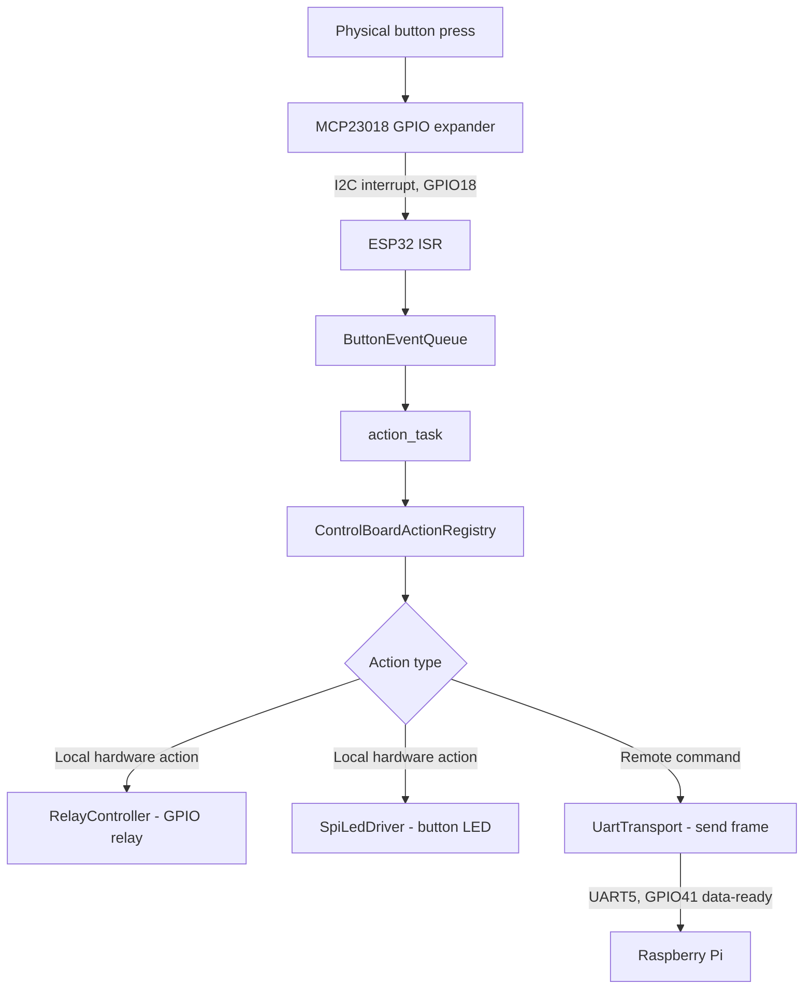
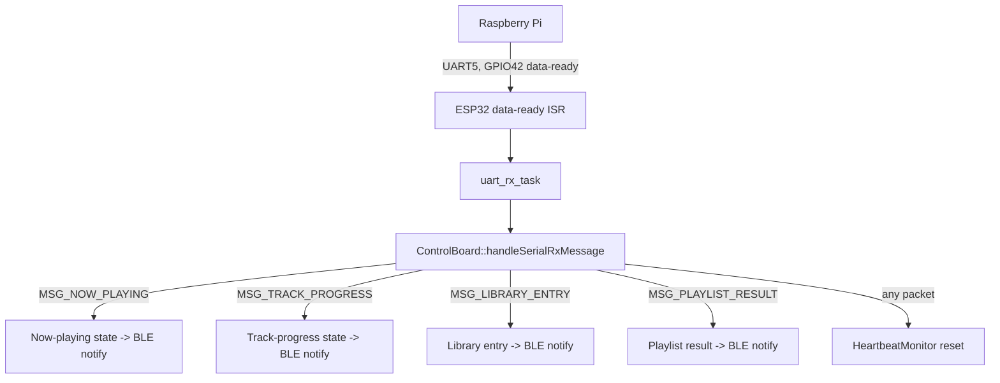

# 06 — Hardware Interface Reference

Document version 1.0 — 2026-09-18 — describes commit `402f526` on branch `feature/library-improvements`.
Primary source: [lib/board/boardConfig.hpp](../lib/board/boardConfig.hpp) (read verbatim for
this document), cross-referenced with [wiring-reference.md](wiring-reference.md) and
[docs/schema.png](schema.png).

## 1. Scope

This document is the single reference for every GPIO, bus, and physical connector the
ESP32-S3 firmware touches. See [03-esp32-developer-guide.md](03-esp32-developer-guide.md)
§10 for the same table framed from the firmware-module perspective; this document is
organized by physical function instead.

## 2. Timing Constants

| Constant | Value | Purpose |
|---|---:|---|
| `k_heartbeatTimeoutMs` | 30000 | Max silence from the Pi before forced SLEEP |
| `k_initDelayMs` | 5000 | Startup power-stabilization delay |
| `k_powerSettleDelayMs` | 1500 | Settle time after DAC / output-stage relay changes |
| `k_vcc3v3OnDelayMs` | 1000 | Settle time after the 3.3V rail relay turns on |
| `k_rpiOnDelayMs` | 1000 | Settle time after the Pi power relay turns on |
| `k_rpiBootTimeoutMs` | 60000 | Max wait for first Pi heartbeat during power-on |
| `k_rpiShutdownTimeoutMs` | 60000 | Max wait for Pi shutdown to complete |
| `k_rpiShutdownSettleDelayMs` | 500 | Settle time after shutdown wait, before cutting Pi power |
| `k_vcc3v3PowerOffDelayMs` | 5000 | Settle time before removing the 3.3V rail |

## 3. UART / Handshake

| Function | Pin | Notes |
|---|---:|---|
| UART peripheral | `UART_NUM_2` | |
| Baud rate | 921600 | |
| TX | `GPIO2` | ESP32 → Pi |
| RX | `GPIO1` | Pi → ESP32 |
| RX buffer size | 1024 bytes | |
| ESP32 data-ready output | `GPIO41` | Pulsed high ~10ms when a frame is ready to send |
| Pi data-ready input | `GPIO42` | ESP32 reads this to know the Pi has data ready |

## 4. I2C Bus

| Function | Pin / Value |
|---|---:|
| SCL | `GPIO15` |
| SDA | `GPIO16` |
| MCP23018 interrupt | `GPIO18` |
| MCP23018 enable | `GPIO17` |
| MCP23018 address | `0x20` |
| MCP timeout | 10 ms |
| Clock speed | 50 kHz |

## 5. SPI Bus (Front-Panel LED Shift Register)

| Function | Pin |
|---|---:|
| Data (MOSI) | `GPIO7` |
| Clock | `GPIO6` |
| Latch | `GPIO5` |

16-bit register, shifted low-byte-first then high-byte-first; one bit per front-panel push
button (bit 0 unused — the power button has no LED). See
[wiring-reference.md](wiring-reference.md) §1.5–1.6 for the full bit/command mapping.

## 6. Relay Outputs

| Relay | Pin | Active state | Sequenced by power state machine |
|---|---:|---|---|
| 3.3V rail power | `GPIO13` | High = ON | Yes (power-on stage 1) |
| DAC power | `GPIO12` | High = ON | Yes (stage 2); OFF only on Deep Sleep |
| Output-stage power | `GPIO9` | High = ON | Yes (stage 3); OFF on Sleep and Deep Sleep |
| Raspberry Pi power | `GPIO11` | High = ON | Yes (stage 4) |
| DAC signal-select (`ESS_DAC_ENABLED`) | `GPIO10` | High = ON | No — user toggle only |
| General relay 1 | `GPIO47` | High = ON | No — unused by any action in inspected source |
| General relay 2 | `GPIO39` | High = ON | No — dead output, never referenced |

Active-high confirmed directly in `lib/hal/relay/relay.cpp`
(`gpio_set_level(relayPin, state ? 1 : 0)`), with internal pull-down enabled and no
pull-up — i.e. relays default to OFF on an undriven/floating pin.

## 7. Indicator Outputs

| Function | Pin | Notes |
|---|---:|---|
| App active LED | `GPIO3` | Power-state LED, "on" color |
| App standby LED | `GPIO4` | Power-state LED, "sleep" color |
| Working-status LED | `GPIO48` | Board activity indicator |
| Button LED PWM | `GPIO21` | Overall brightness for all 16 SPI button LEDs; default duty `(8191*8)/10` |
| Monitor brightness | `GPIO43` | Drives display/monitor brightness control |

## 8. BLE

| Property | Value |
|---|---|
| Device name | `TinyControlBoard` |
| Max connections | 1 |
| Service UUID | `4a5c6e7d-8f9a-4b2c-1d3e-5f6a7b8c9d0e` |
| Characteristics | 8, UUIDs `...9d01`–`...9d08` (see [05-communication-protocol.md](05-communication-protocol.md) and [02-android-developer-guide.md](02-android-developer-guide.md) §9) |
| ATT MTU | `CONFIG_BT_NIMBLE_ATT_PREFERRED_MTU = 256` (usable payload ≤253 bytes after ATT overhead) |

## 9. Full GPIO Table

| GPIO | Function | Direction |
|---:|---|---|
| 1 | UART2 RX | in |
| 2 | UART2 TX | out |
| 3 | App active LED | out |
| 4 | App standby LED | out |
| 5 | SPI LED latch | out |
| 6 | SPI LED clock | out |
| 7 | SPI LED data | out |
| 9 | Output-stage power relay | out |
| 10 | DAC signal-select relay | out |
| 11 | Raspberry Pi power relay | out |
| 12 | DAC power relay | out |
| 13 | 3.3V rail power relay | out |
| 15 | I2C SCL | out |
| 16 | I2C SDA | in/out |
| 17 | MCP23018 enable | out |
| 18 | MCP23018 interrupt | in |
| 21 | Button LED PWM | out |
| 39 | General relay 2 (unused) | out |
| 41 | ESP32→Pi data-ready | out |
| 42 | Pi→ESP32 data-ready | in |
| 43 | Monitor brightness PWM | out |
| 47 | General relay 1 | out |
| 48 | Working-status LED | out |

## 10. Signal Path — Button Press to Hardware Action

## 11. Signal Path — UART Command In (from Pi)

## 12. Physical Interfaces Table

| Interface | Type | Connector/Location |
|---|---|---|
| Front-panel button/rotary/LED harness | 40-pin Molex | See [wiring-reference.md](wiring-reference.md) §1.7 |
| Raspberry Pi UART link | Wired point-to-point, ESP32 GPIO1/2/41/42 ↔ Pi GPIO12/13/23/24 | Per [docs/userDocumentation/RPI4_SETUP.md](userDocumentation/RPI4_SETUP.md) |
| Power rails | Relay-switched: 3.3V, DAC, Output stage, Raspberry Pi 5V | 4 relays sequenced; 3 auxiliary relays (DAC signal-select, general 1/2) |
| USB (firmware flashing) | ESP32-S3 native USB / UART bootloader | Development only |

## 13. Bill of Materials (as inferred from source)

| Part | Role | Source of inference |
|---|---|---|
| ESP32-S3 (16MB flash variant) | Main controller | `boards/esp32-s3-devkitc-1-16mb.json`, `platformio.ini` |
| MCP23018 | 16-bit I2C GPIO expander for button/rotary input | `board::i2c::mcpAddress = 0x20`, `lib/hal/buttons/mcpInputHandler.cpp` |
| 16-bit SPI shift register (e.g. 74HC595-class device) | Front-panel button LED driver | `lib/hal/leds/spiLedDriver.cpp` — exact part number **TODO – not present in supplied source** |
| Raspberry Pi 4 | Audio playback host (moOde Audio) | `docs/userDocumentation/RPI4_SETUP.md`, repo-wide references |
| Relay modules ×7 | Power-rail and signal switching | `lib/board/boardConfig.hpp::relays` |

## 14. Safety Notes

- All power-rail relays default OFF on an unconfigured/floating GPIO (pull-down enabled, no
  pull-up) — a firmware crash before `setupRelays()` completes leaves the unit fully
  powered off rather than in an undefined-energized state.
- The DAC and output-stage relays are turned OFF before the Raspberry Pi relay in both the
  Sleep and Deep Sleep sequences (output-stage first, then — for Deep Sleep only — DAC),
  reducing the chance of an audible pop from the RPi's own shutdown transient reaching the
  amplifier stage.
- **TODO – Information not available in the supplied source**: relay coil voltage/current
  ratings, PSU rail voltage/current ratings, and any fusing/overcurrent protection present
  on the physical board. None of this electrical detail is expressed in the firmware source
  (GPIO logic levels only) and was not present in any other supplied document.
