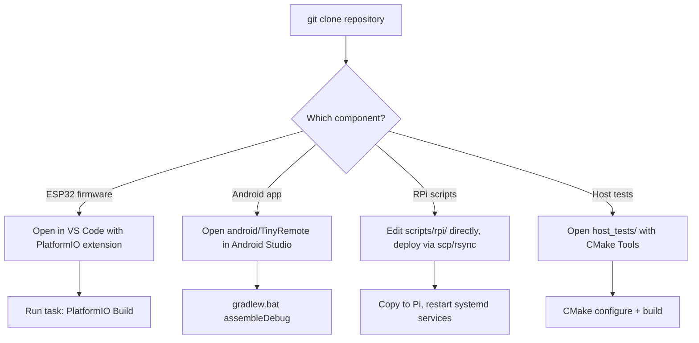

# 07 — Development Environment Setup

Document version 1.0 — 2026-09-18 — describes commit `402f526` on branch `feature/library-improvements`.

## 1. Overview

This project has three independently-buildable components sharing one repository. Most
contributors will only need the toolchain for the component they're changing.

| Component | Toolchain needed |
|---|---|
| ESP32-S3 firmware | PlatformIO + ESP-IDF (installed automatically by PlatformIO) |
| Raspberry Pi scripts | Python 3 only (no build step; deploy by copying files) |
| Android app | Android Studio / Gradle + JDK 17 |
| Host-testable pure-logic tests | CMake + MSVC (Windows) under [host_tests/](../host_tests/) |

## 2. Prerequisites

| Tool | Version | Used for |
|---|---|---|
| PlatformIO Core | Any recent (auto-manages ESP-IDF 5.3.1 toolchain per `platformio.ini`) | ESP32 firmware build/flash |
| VS Code + PlatformIO extension | Any recent | Firmware editing/build/monitor (task `PlatformIO Build` is pre-defined) |
| Android Studio (or standalone Gradle 9.5.0 + JDK 17) | AGP 9.3.1 / Kotlin 2.2.10 | Android app build |
| Python 3 | Any 3.x present on the target Raspberry Pi (moOde image) | RPi scripts — no separate dev install needed beyond an editor |
| CMake + Visual Studio (MSVC) | Any recent | `host_tests/` build only |
| Git | Any recent | Source control |

## 3. Repository Setup



## 4. Building the ESP32 Firmware

```powershell
# Preferred: use the pre-defined VS Code task
# Task: "PlatformIO Build" (runs `platformio run`)

# Equivalent from a terminal:
C:\Users\<user>\.platformio\penv\Scripts\platformio.exe run
```

To build the release environment specifically:

```powershell
C:\Users\<user>\.platformio\penv\Scripts\platformio.exe run -e esp32-s3-devkitc-1-16mb-release
```

## 5. Building/Running the Android App

```powershell
cd android\TinyRemote
.\gradlew.bat assembleDebug
adb install -r app\build\outputs\apk\debug\app-debug.apk
```

## 6. Building/Running Host Tests

See [host-testability-notes.md] repo memory / [host_tests/CMakeLists.txt](../host_tests/CMakeLists.txt)
for the current confirmed CMake configure/build/test command sequence for the
`host_tests/` project (pure-logic tests, no ESP-IDF dependency).

## 7. Deploying Raspberry Pi Scripts

```bash
# On the Raspberry Pi, or via scp from a dev machine:
scp scripts/rpi/home/antho/*.py pi@<host>:/home/antho/
scp scripts/rpi/systemd/*.service pi@<host>:/tmp/
ssh pi@<host> "sudo mv /tmp/*.service /etc/systemd/system/ && \
  sudo systemctl daemon-reload && \
  sudo systemctl enable --now uart5-listener.service heartbeat-sender.service"
```

## 8. Verification Checklist

- [ ] `platformio run` completes with no errors for both environments.
- [ ] Firmware flashes and boots: boot-diagnostic LEDs light in sequence, then clear once
      the Raspberry Pi heartbeat arrives.
- [ ] `systemctl status uart5-listener heartbeat-sender` both show `active (running)` on
      the Pi.
- [ ] Android app: `ScanActivity` discovers the board (`TinyControlBoard` in the scan list)
      and connects successfully; `MainActivity` receives status/now-playing updates.
- [ ] A physical button press (e.g. Play/Pause) produces an audible MPD state change.
- [ ] Album art loads in the Android app (verifies moOde's HTTP endpoints are reachable on
      the configured host/IP in `MoodeSettings`).

## 9. Common Issues

| Issue | Resolution |
|---|---|
| PlatformIO can't find the board manifest | Ensure `boards/esp32-s3-devkitc-1-16mb.json` exists relative to the project root — it is a project-local board definition, not a stock PlatformIO board |
| Android Gradle sync fails on JDK version | AGP 9.3.1 requires JDK 17+; set `JAVA_HOME` accordingly |
| No UART traffic reaches the Pi | Confirm `dtoverlay=uart5` in `/boot/config.txt` and that `/dev/ttyAMA5` exists; see [docs/userDocumentation/RPI4_SETUP.md](userDocumentation/RPI4_SETUP.md) |
| Firmware boots but never leaves `TURNING_ON` | Raspberry Pi services not running or UART miswired — see [04-rpi-developer-guide.md](04-rpi-developer-guide.md) §12 |
