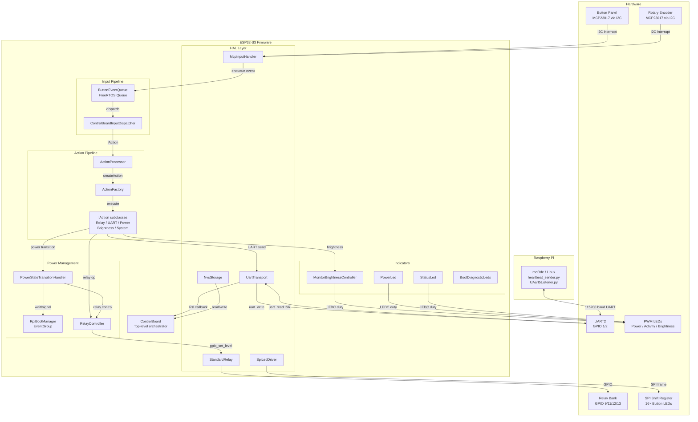
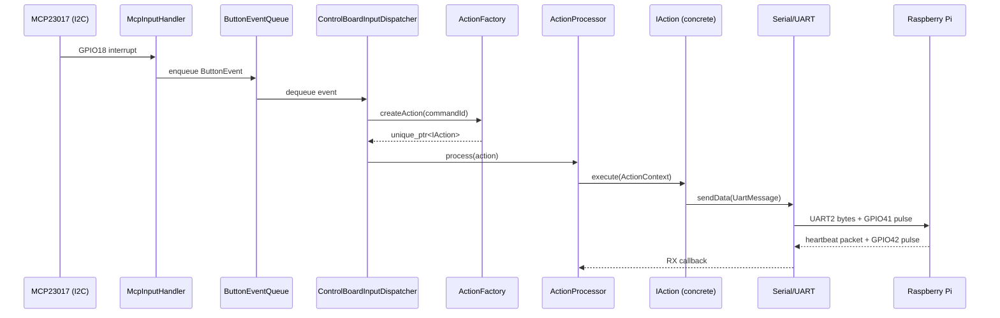

# TinyControlBoard — Project Documentation

This is the consolidated reference document for the TinyControlBoard project. It covers the firmware architecture, hardware wiring, UART protocol, button mapping, power sequencing, Raspberry Pi setup, and developer guides.

The end-user operating guide is kept as a separate document: [stream-dac-front-panel-user-guide.md](./stream-dac-front-panel-user-guide.md)

---

## Table of Contents

1. [Introduction](#1-introduction)
2. [System Architecture](#2-system-architecture)
3. [Hardware Reference](#3-hardware-reference)
4. [UART Protocol Reference](#4-uart-protocol-reference)
5. [Button and Command Map](#5-button-and-command-map)
6. [Power Sequencing](#6-power-sequencing)
7. [Raspberry Pi Setup](#7-raspberry-pi-setup)
8. [Developer Guides](#8-developer-guides)

---

## 1. Introduction

### 1.1 What This Project Does

TinyControlBoard is an ESP32-S3-based control surface that:

- reads physical buttons and rotary input,
- controls relays and indicator outputs,
- talks to a Raspberry Pi over UART,
- reacts to Raspberry Pi heartbeat status,
- translates user input into commands such as playback control, display control, DAC control, and power-state changes,
- visually signals boot progress and failure via SPI-driven button LEDs.

In practical terms, the board is the hardware front end and the Raspberry Pi is the system it controls.

### 1.2 System at a Glance

The main runtime flow is:

1. The ESP32 boots and waits briefly for power to settle.
2. `app_main()` creates a `ControlBoard` instance.
3. `ControlBoard::init()` initializes LEDs, relays, input handling, and serial communication.
4. Button and rotary events are converted into `std::unique_ptr<actions::IAction>` objects via `ActionFactory::createAction()`.
5. `ActionProcessor::process()` executes the action via `IAction::execute(ActionContext&)`.
6. Some actions change local hardware state; others send UART commands to the Raspberry Pi.
7. The Raspberry Pi sends heartbeat packets back so the ESP32 knows the Pi is still online.

Primary entry points:

- [src/main.cpp](../src/main.cpp)
- [lib/app/ControlBoard.hpp](../lib/app/ControlBoard.hpp)
- [lib/app/ControlBoard.cpp](../lib/app/ControlBoard.cpp)

---

## 2. System Architecture

### 2.1 High-Level View

The firmware is built around one top-level orchestrator: `ControlBoard`.

At runtime, the system does four main jobs:

1. initialize the board and connected hardware,
2. read user input from buttons and rotary input,
3. convert those inputs into local actions or UART commands,
4. monitor the Raspberry Pi link and react to heartbeat state.

### 2.2 Architecture Diagram



### 2.3 Startup Flow

Current startup sequence:

1. `app_main()` waits 5 seconds for power to settle.
2. A `ControlBoard` instance is created.
3. NVS flash is initialized.
4. `bootstrap::prepareStartupIndicators()` sets the power LED to `TURNING_ON`.
5. The UART and relay singletons are acquired; serial RX and heartbeat-timeout callbacks are registered.
6. `ActionProcessor` and `ControlBoardInputDispatcher` are constructed.
7. Relays are initialized and set to default off states.
8. The MCP input handler is initialized.
9. The `ButtonEventQueue` task is started.
10. Button press, release, and rotary callbacks are registered.
11. UART hardware is initialized.
12. The button-to-action map is populated via `ControlBoardActionRegistry`.
13. After a `board::timing::k_initDelayMs` delay, `triggerInitialPowerOn()` is called which starts the full power-on sequence.

Note: if any critical init step fails (MCP handler or serial setup), `SpiBootIndicator::notifyFailure()` is called immediately, which flashes all SPI LEDs rapidly to signal the fault before the firmware aborts init.

References:

- [src/main.cpp](../src/main.cpp)
- [lib/app/ControlBoard.cpp](../lib/app/ControlBoard.cpp)
- [lib/app/ControlBoardBootstrap.cpp](../lib/app/ControlBoardBootstrap.cpp)
- [lib/board/boardConfig.hpp](../lib/board/boardConfig.hpp)

### 2.4 Core Components

#### 2.4.1 `ControlBoard`

`ControlBoard` is the top-level integration class. It owns the component instances and routes events. Initialization logic is split into helper namespaces:

- `bootstrap::` functions (in `ControlBoardBootstrap.cpp`) handle startup step sequencing.
- `ControlBoardActionRegistry` populates the button-to-action map.
- `ControlBoardInputDispatcher` translates button/rotary events into `IAction` objects and manages per-button LED state.
- `ButtonEventQueue` serializes press, release, and rotary events onto a FreeRTOS queue processed by `ControlBoardInputDispatcher`.

References:

- [lib/app/ControlBoard.hpp](../lib/app/ControlBoard.hpp)
- [lib/app/ControlBoard.cpp](../lib/app/ControlBoard.cpp)
- [lib/app/ControlBoardBootstrap.hpp](../lib/app/ControlBoardBootstrap.hpp)
- [lib/app/ControlBoardActionRegistry.hpp](../lib/app/ControlBoardActionRegistry.hpp)
- [lib/app/ControlBoardInputDispatcher.hpp](../lib/app/ControlBoardInputDispatcher.hpp)
- [lib/app/ButtonEventQueue.hpp](../lib/app/ButtonEventQueue.hpp)

#### 2.4.2 `ActionProcessor`

`ActionProcessor` receives a `std::unique_ptr<actions::IAction>` and executes it via the `ActionContext` services struct.

Side effects are implemented in concrete `IAction` subclasses under `lib/app/commands/`:

- `RelayAction` — local relay changes,
- `BrightnessAction` — local brightness changes,
- `UartDispatchAction` — sends UART commands to the Raspberry Pi,
- `PowerTransitionAction` — handles power-state transitions,
- `DisplayAction` — display on/off control,
- `SystemAction` — system-level commands.

`ActionFactory::createAction()` maps a `CommandId` to the appropriate concrete type via `ActionCommandRoutingPolicy`.

References:

- [lib/app/actionProcessor.hpp](../lib/app/actionProcessor.hpp)
- [lib/app/actionProcessor.cpp](../lib/app/actionProcessor.cpp)
- [lib/app/ActionFactory.hpp](../lib/app/ActionFactory.hpp)
- [lib/app/ActionContext.hpp](../lib/app/ActionContext.hpp)
- [lib/app/ActionCommandRoutingPolicy.hpp](../lib/app/ActionCommandRoutingPolicy.hpp)

#### 2.4.3 `Serial` (UartTransport)

The serial layer owns the ESP32 side of the Pi link. It does three distinct jobs:

- configure and use UART2,
- manage the two extra data-ready handshake GPIOs,
- track heartbeat timing and pass completed messages up through a callback.

References:

- [lib/transport/uart/serial.hpp](../lib/transport/uart/serial.hpp)
- [lib/transport/uart/serial.cpp](../lib/transport/uart/serial.cpp)

#### 2.4.4 `RpiBootManager`

`RpiBootManager` is a synchronization helper built around a FreeRTOS event group. It does not directly control hardware. Instead, it waits for lifecycle signals:

- heartbeat received means the Pi is alive or has finished booting,
- heartbeat timeout is treated as shutdown/offline confirmation.

The `board::debug::kSimulateRpiBoot` flag in [lib/board/boardConfig.hpp](../lib/board/boardConfig.hpp) can be set to `true` to skip the heartbeat wait entirely. This is useful when testing on the bench without a Raspberry Pi. The flag is evaluated at compile time (`if constexpr`) so there is zero overhead in release builds.

References:

- [lib/power/RPIBootManager.hpp](../lib/power/RPIBootManager.hpp)
- [lib/power/RPIBootManager.cpp](../lib/power/RPIBootManager.cpp)

#### 2.4.5 `SpiBootIndicator`

`SpiBootIndicator` is a FreeRTOS-based visual boot indicator that flashes all 16 SPI-driven button LEDs to signal boot progress or failure.

Behavior:

- `startWaiting()` — starts a background FreeRTOS task that flashes all LEDs at 500 ms half-period (1 Hz) while the firmware waits for the Raspberry Pi heartbeat.
- `notifySuccess()` — signals the task to stop and clears all LEDs. Called when the heartbeat is received within the timeout.
- `notifyFailure()` — switches to a fast 150 ms half-period flash (~3.3 Hz). If the task is not yet running (firmware init failure), it starts the task directly in the failed state.

Call sites:

- `PowerStateTransitionHandler` calls `startWaiting()` just before `waitForRpiToBoot()`, then calls `notifySuccess()` or `notifyFailure()` based on the result.
- `ControlBoard::init()` calls `notifyFailure()` before each early-return failure path.

References:

- [lib/indicators/SpiBootIndicator.hpp](../lib/indicators/SpiBootIndicator.hpp)
- [lib/indicators/SpiBootIndicator.cpp](../lib/indicators/SpiBootIndicator.cpp)

#### 2.4.6 `SpiLedDriver`

`SpiLedDriver` drives 16 button LEDs via SPI shift registers (SPI2_HOST, 1 MHz, GPIO 6/7/5 for clock/MOSI/latch).

Key methods:

- `init()` — sets up the SPI bus and device.
- `setLed(index, on)` — sets a single LED by bit index (0–15).
- `setAllLeds(on)` — atomically sets all 16 LEDs on or off. Used by `SpiBootIndicator` for whole-panel flashing.
- `update()` — pushes the current 16-bit state to the shift register via SPI.

The overall brightness of all button LEDs is controlled by a PWM duty on GPIO 21 (`k_buttonLedPwmPin`) through the `StatusLed` instance registered as `s_buttonStatusLed`. The duty is updated by `MonitorBrightnessController` whenever screen brightness changes so the two track together.

References:

- [lib/hal/leds/spiLedDriver.hpp](../lib/hal/leds/spiLedDriver.hpp)
- [lib/hal/leds/spiLedDriver.cpp](../lib/hal/leds/spiLedDriver.cpp)

#### 2.4.7 `MonitorBrightnessController` and Button LED Coupling

`MonitorBrightnessController` owns the PWM duty on the monitor brightness pin and also drives the button LED brightness level. Every method that changes screen brightness calls `getButtonStatusLed().setIdleDuty()` with an inverted mapping:

- level 0 (screen dimmest) → button LEDs dimmest,
- level 9 (screen brightest) → button LEDs brightest.

The inversion is applied inside `buttonDutyForLevel()` because the button LED circuit is active-low (higher LEDC duty → dimmer output).

`setIdleDuty()` on `StatusLed` is thread-safe (`std::atomic<uint32_t> m_idleDuty`) and takes effect immediately when the LED task is in `SolidIdle` state.

The coupling is active through: `init()`, `changeBrightnessLevel()`, `cycleBrightness()`, `setState()` ON path, `toggleDisplayOffOn()`, and `clearDisplayOffMode()`.

References:

- [lib/indicators/monitorBrightnessController.hpp](../lib/indicators/monitorBrightnessController.hpp)
- [lib/indicators/MonitorBrightnessController.cpp](../lib/indicators/MonitorBrightnessController.cpp)

#### 2.4.8 `RelayController`

`RelayController` is a thin helper around the relay abstraction. It provides:

- relay state changes with optional delay,
- DAC relay toggling,
- Raspberry Pi relay shutdown,
- screen relay shutdown.

`StandardRelay::setRelayState()` returns a `bool` — `true` if `gpio_set_level()` succeeded, `false` on driver error. Physical contact state is not detectable without dedicated feedback hardware.

References:

- [lib/power/RelayController.hpp](../lib/power/RelayController.hpp)
- [lib/power/RelayController.cpp](../lib/power/RelayController.cpp)
- [lib/hal/relay/relay.hpp](../lib/hal/relay/relay.hpp)

### 2.5 Input Flow

The current input path is:

1. MCP interrupt fires; `McpInputHandler` decodes it as a press, release, or rotary event.
2. The event is enqueued into `ButtonEventQueue`.
3. `ControlBoardInputDispatcher` dequeues the event and looks up the `ButtonConfig` for that button index.
4. `ButtonConfig::action->produce(isPressed)` is called on the `IActionSource` to obtain a `std::unique_ptr<actions::IAction>`.
5. `ControlBoardInputDispatcher` applies `LedPolicy` (None / Momentary / Toggle) to the SPI LED state for that button.
6. The `IAction` is passed to `ActionProcessor::process()`.
7. `ActionProcessor` builds an `ActionContext` and calls `iaction->execute(ctx)`.
8. The concrete command class performs the side effect (relay, UART, brightness, power transition, etc.).

Related files:

- [lib/hal/buttons/mcpInputHandler.hpp](../lib/hal/buttons/mcpInputHandler.hpp)
- [lib/app/ButtonEventQueue.hpp](../lib/app/ButtonEventQueue.hpp)
- [lib/app/ControlBoardInputDispatcher.hpp](../lib/app/ControlBoardInputDispatcher.hpp)
- [lib/input/actions/actionTemplates.hpp](../lib/input/actions/actionTemplates.hpp)
- [lib/app/ActionFactory.hpp](../lib/app/ActionFactory.hpp)
- [lib/app/ActionContext.hpp](../lib/app/ActionContext.hpp)

### 2.6 UART Communication Flow

**ESP32 → Pi path:**

1. An action processor branch decides to send a command.
2. A `UartMessage` or command ID is passed to `Serial`.
3. `Serial::sendData()` writes bytes on UART2.
4. The ESP32 raises its data-ready pin (GPIO41) briefly so the Pi knows to read.

**Pi → ESP32 path:**

1. The Raspberry Pi writes a UART packet.
2. The Pi pulses its data-ready line (GPIO42).
3. The ESP32 ISR wakes the UART RX task.
4. Incoming bytes are added to the receiver buffer.
5. Complete messages are deserialized and passed to the registered callback.

Current limitation: `ControlBoard::handleSerialRxMessage()` actively handles heartbeat messages. Other received UART messages are routed through a minimal inbound scaffold and logged, but protocol-specific behavior is still pending.

### 2.7 Power and Status State Model

**Power LED states** (`lib/power/powerState.hpp`):

- `OFF`
- `TURNING_ON`
- `ON`
- `SLEEP`
- `GOING_TO_SLEEP`
- `DEEPSLEEP`
- `SHUTTING_DOWN`
- `GOING_INTO_DEEP_SLEEP`

**Activity/status LED states** (`lib/indicators/activityStatus.hpp`):

- `doingWork`
- `Idle`
- `SolidIdle`
- `sleeping`
- `MaintenanceMode`
- `Active`

### 2.8 Software Design Patterns

| Pattern | Where Used | Notes |
|---|---|---|
| **Command** | `IAction` / `IActionSource` hierarchy | Each button press is converted to a `unique_ptr<IAction>`; `execute(ctx)` carries the side-effect. Adding a new command = new subclass in `lib/app/commands/`. |
| **Factory** | `ActionFactory::createAction()` | Maps `CommandId` → concrete `IAction` subclass via an internal `switch`. Centralises construction; callers never `new` command objects. |
| **Strategy / Policy** | `ActionCommandRoutingPolicy` | Table-driven command routing (`constexpr CommandRouteEntry k_commandRouteTable[]`). Default = UART dispatch; rows override for local-only actions. |
| **Observer / Callback** | UART RX callback, heartbeat timeout callback, MCP button/release/rotary callbacks | Producers register `std::function` callbacks; no direct coupling between HAL and application layers. |
| **State Machine** | `ControlBoardPowerState` + `PowerStateTransitionHandler` | Eight named states; `handle()` transitions between them based on `IAction` type and hold-time. |
| **Event Queue** | `ButtonEventQueue` | ISR-safe FreeRTOS queue; decouples GPIO ISR from application-thread processing. |
| **Singleton** | `UartTransport::getInstance()`, indicator accessors in `ledManager.hpp` | Used only for hardware peripherals that have a single physical instance. |
| **RAII** | `ButtonEventQueue` destructor, `UartTransport` destructor | FreeRTOS task handles and queue handles are cleaned up on destruction. |
| **Service Locator (limited)** | `indicators::getPowerLed()`, `getMonitorBrightnessController()`, etc. | Free-function accessors in `ledManager.hpp` return references to static indicator instances. |
| **Table-driven registration** | `ControlBoardActionRegistry` (`constexpr ButtonRegistration k_buttons[]`) | Adding a button = one table row + one `CMD_*` constant; no procedural wiring. |

### 2.9 Data Flow Diagram (Input → Action → Output)



### 2.10 Concurrency Model

#### FreeRTOS Tasks

| Task Name | Created In | Stack | Priority | Purpose |
|---|---|---:|---:|---|
| `uart_rx_task` | `lib/hal/uart/serial.cpp` | 4096 B | 10 | Blocks on GPIO notify from data-ready ISR; drains UART FIFO; pushes bytes into ring buffer; fires RX callback per complete frame. |
| `heartbeat_monitor` | `lib/hal/uart/serial.cpp` | 4096 B | 5 | Polls every 100 ms; fires timeout callback when elapsed since last RX exceeds `k_heartbeatTimeoutMs`. |
| `action_task` | `lib/app/ButtonEventQueue.cpp` | 4096 B | 5 | Blocks on `xQueueReceive`; dequeues `ButtonEvent` structs and calls `ControlBoardInputDispatcher::dispatch()`. |
| `mcp_int_task` | `lib/hal/buttons/mcpInputHandler.cpp` | 4096 B | 10 | Woken by `vTaskNotifyGiveFromISR` from GPIO18 ISR; reads MCP23017 registers over I2C; fires button/rotary callbacks. |
| `LED_Task` (×N) | `lib/indicators/statusLed.cpp` | 4096 B | 5 | Drives one PWM indicator LED; implements blink / breathe / solid patterns. One instance per `StatusLed` object. |
| `BreatheTask` (×N) | `lib/indicators/statusLed.cpp` | 2048 B | 5 | Fade-in/fade-out effect helper spawned transiently by `LED_Task`. |
| `boot_diag_leds` | `lib/indicators/BootDiagnosticLeds.cpp` | 2048 B | idle+1 | Created only on first boot-stage failure; flashes SPI LEDs at 3 Hz until hardware reset. |

#### Synchronization Primitives

| Primitive | Where | Purpose |
|---|---|---|
| `FreeRTOS Queue` (depth 16) | `ButtonEventQueue` | Decouples ISR/callback context from application task. |
| `FreeRTOS Queue` (depth 1) | `StatusLed` (per instance) | Passes `ControlBoardWorkingStatus` enums to `LED_Task`. |
| `FreeRTOS EventGroup` | `RpiBootManager` | Bit 0 = heartbeat received; Bit 1 = shutdown confirmed. |
| `std::atomic<ControlBoardPowerState>` | `SystemState` | Thread-safe power state shared between `ActionProcessor` and heartbeat callback. |
| `std::atomic<uint16_t>` | `ControlBoardInputDispatcher::m_buttonLedBitmask` | Per-button LED toggle state; updated with `fetch_xor`. |
| `std::atomic<uint32_t>` | `StatusLed::m_idleDuty` | Allows `MonitorBrightnessController` to update button LED brightness from any task context. |
| `std::atomic<bool>` | `UartTransport::m_initialized`, `m_stopRxTask`, `m_stopHeartbeatTask` | Guards task lifecycle without a mutex. |

#### Interrupt Handling

| ISR | Trigger | Action |
|---|---|---|
| `UartTransport::gpioIsrHandler` (`IRAM_ATTR`) | GPIO42 POSEDGE (Pi data-ready) | `vTaskNotifyGiveFromISR` → wakes `uart_rx_task` |
| `McpInputHandler::gpioIsr` | GPIO18 (MCP23017 /INT) | `vTaskNotifyGiveFromISR` → wakes `mcp_int_task` |

Design rules: ISRs contain no I2C or UART calls; all slow bus work happens in the unblocked task. Both ISRs use the shared ISR service (`gpio_install_isr_service`). `IRAM_ATTR` ensures `gpioIsrHandler` runs from IRAM and is not blocked by flash cache misses.

### 2.11 Communication Protocols Summary

| Protocol | Interface | Speed / Settings | Role |
|---|---|---|---|
| **UART** (custom framed) | UART2 / GPIO1 (RX) / GPIO2 (TX) | 115 200 baud, 8N1 | Bi-directional link to Raspberry Pi. 18-byte frames. |
| **I2C** | I2C_NUM_0 / GPIO15 (SCL) / GPIO16 (SDA) | 50 000 Hz | Reads MCP23017 I/O expander at address `0x20`. |
| **SPI** | SPI2_HOST / GPIO6 (CLK) / GPIO7 (MOSI) / GPIO5 (latch) | 1 MHz | Drives 16-bit shift register for button panel LEDs. |
| **LEDC (PWM)** | Multiple GPIO channels | 4 kHz / 13-bit | Monitor brightness (GPIO43), button LED PWM (GPIO21), power LED (GPIO3/4), status LED (GPIO48). |
| **GPIO handshake** | GPIO41 (out) / GPIO42 (in) | Logic level | Data-ready signalling: Pi raises GPIO42 before sending; ESP32 raises GPIO41 for 10 ms after sending. |
| **NVS (SPI flash)** | Internal flash | — | Persists brightness level across power cycles. |

### 2.12 Error Handling and Fault Recovery

| Scenario | Detection | Recovery |
|---|---|---|
| MCP23017 init failure | `McpInputHandler::begin()` returns `esp_err_t != ESP_OK` | `BootDiagnosticLeds::firmwareInitFailed()` (all 8 LEDs flash at 3 Hz); `main.cpp` retries `init()` every 1 s. |
| Serial/UART init failure | `Serial::initUart()` returns `false` | Same path: flash all LEDs at 3 Hz + retry loop. |
| Individual power-on relay failure | `StandardRelay::setRelayState()` returns `false` | `BootDiagnosticLeds::stageFailure(stage)` for the failing stage; relay sequence halts. |
| Heartbeat timeout while ON | `heartbeat_monitor` fires timeout callback | `ActionProcessor::handleHeartbeatTimeout()` forces `powerState` to `SLEEP`. |
| Pi boot timeout (60 s) | `RpiBootManager::waitForRpiToBoot()` returns `false` | `BootDiagnosticLeds::stageFailure(BootStage::RpiComms)`; relay power-on considered failed. |
| GPIO driver error | `gpio_set_level()` returns non-OK | `StandardRelay::setRelayState()` returns `false`; caller decides whether to abort. |
| NVS key not found on first boot | `NvsStorage::readInt8()` returns `false` | `MonitorBrightnessController::init()` uses compile-time default level `2`; written to NVS on first brightness change. |
| FreeRTOS task creation failure | `xTaskCreate()` returns `!= pdPASS` | Logged via `ESP_LOGE`; init step returns `false`, triggering the retry path. |

### 2.13 Notable Design Characteristics

- `ControlBoard` is the integration hub and currently owns a lot of orchestration.
- Input actions are represented as objects, making it straightforward to remap buttons without rewriting processor logic.
- Toggle actions maintain internal software state, so their first emitted command depends on the starting state in firmware.
- Heartbeat is treated as the Raspberry Pi liveness signal for both boot completion and shutdown detection.
- Non-heartbeat Pi-originated commands are not yet fully consumed on the ESP32 side.
- Boot and init failures are signalled visually via `SpiBootIndicator`: slow flashing (~1 Hz) during normal boot wait, fast flashing (~3.3 Hz) on timeout or firmware init failure.
- The `board::debug::kSimulateRpiBoot` compile-time flag allows full firmware testing without a connected Raspberry Pi.
- Button LED brightness tracks monitor brightness automatically via `MonitorBrightnessController` using an inverted active-low mapping.
- `StandardRelay::setRelayState()` returns a bool indicating GPIO driver success. Physical relay contact state cannot be detected without additional feedback hardware.

---

## 3. Hardware Reference

### 3.1 ESP32-S3 GPIO Pin Map

| GPIO Pin | Direction | Connected To | Protocol | Notes |
|---:|---|---|---|---|
| 1 | Input | Raspberry Pi TX | UART2 RX | Main Pi → ESP32 data |
| 2 | Output | Raspberry Pi RX | UART2 TX | Main ESP32 → Pi data |
| 3 | Output | App active LED | LEDC PWM | |
| 4 | Output | App standby LED | LEDC PWM | |
| 5 | Output | SPI LED latch | SPI2 | Active rising edge to latch shift register |
| 6 | Output | SPI LED clock | SPI2 | |
| 7 | Output | SPI LED data (MOSI) | SPI2 | |
| 9 | Output | Output stage power relay | GPIO | Active high |
| 10 | Output | Prototype DAC enable relay | GPIO | Active high |
| 11 | Output | Raspberry Pi power relay | GPIO | Active high |
| 12 | Output | DAC power relay | GPIO | Active high |
| 13 | Output | Screen power relay | GPIO | Active high |
| 15 | Output | I2C SCL | I2C_NUM_0 | MCP23017 clock |
| 16 | I/O | I2C SDA | I2C_NUM_0 | MCP23017 data |
| 17 | Output | MCP23017 enable | GPIO | Active high |
| 18 | Input | MCP23017 /INT | GPIO (ISR) | Active low interrupt, POSEDGE ISR trigger |
| 21 | Output | Button LED PWM | LEDC PWM | Overall brightness for all 16 SPI button LEDs |
| 39 | Output | General relay 2 | GPIO | Spare |
| 41 | Output | Pi data-ready (to Pi) | GPIO | Pulsed high 10 ms after sending |
| 42 | Input | Pi data-ready (from Pi) | GPIO (ISR) | POSEDGE wakes `uart_rx_task` |
| 43 | Output | Monitor brightness | LEDC PWM | Analogue brightness to display |
| 47 | Output | General relay 1 | GPIO | Spare |
| 48 | Output | Working status LED | LEDC PWM | |

### 3.2 Raspberry Pi Side Wiring

#### UART5 and Handshake Pins

| Function | Raspberry Pi BCM | Physical Pin | Notes |
|---|---:|---:|---|
| ESP32 → Pi data-ready input | 23 | 16 | Listener waits for rising edge here |
| Pi → ESP32 data-ready output | 24 | 18 | Sender script pulses this line |
| UART5 TX | 12 | 32 | Standard `dtoverlay=uart5` mapping |
| UART5 RX | 13 | 33 | Standard `dtoverlay=uart5` mapping |

#### End-to-End Connection Table

| Function | Raspberry Pi Side | ESP32-S3 Side |
|---|---|---|
| Pi UART5 TX → ESP32 UART RX | BCM12, pin 32 | GPIO1 |
| Pi UART5 RX ← ESP32 UART TX | BCM13, pin 33 | GPIO2 |
| ESP32 → Pi data-ready | BCM23, pin 16 | GPIO41 |
| Pi → ESP32 data-ready | BCM24, pin 18 | GPIO42 |
| Ground | Pi GND | ESP32 GND |

Important rule: UART TX always connects to the other side's RX.

#### Handshake Line Meaning

- **GPIO41 (ESP32 output → Pi BCM23 input):** ESP32 pulses this high for 10 ms after sending a UART packet to notify the Pi that data is waiting.
- **GPIO42 (Pi BCM24 output → ESP32 input):** Pi raises this before sending to wake the ESP32 UART RX task via ISR.

Companion references:

- [scripts/rpi/home/antho/UAart5Listener.py](../scripts/rpi/home/antho/UAart5Listener.py)
- [scripts/rpi/home/antho/heartbeat_sender.py](../scripts/rpi/home/antho/heartbeat_sender.py)

### 3.3 Front Panel Connector Map

This table maps the physical front-panel connector pins to firmware symbols. The schematic image is: [docs/schema.png](./schema.png)

#### Power and Ground

| Connector Pin | Diagram Label | Notes |
|---|---|---|
| 1 | `Power On (LED)` | App active / power-state LED path |
| 2 | `Power StandBy (LED)` | App standby / power-state LED path |
| 35–38 | `GND` | Ground returns |
| 39–40 | `5V` | Supply rail |

#### Button Input Pins

| Connector Pin | Diagram Label | Firmware Button Index | Current Firmware Mapping | Match Status |
|---|---|---:|---|---|
| 3 | `Btn_Power` | 0 | `kPower` → `CMD_SYS_POWER` | matches |
| 5 | `CMD_Previous_Track` | 1 | `kPrevTrack` → `CMD_PREVIOUS_TRACK` | matches |
| 7 | `CMD_Next_Track` | 2 | `kNextTrack` → `CMD_NEXT_TRACK` | matches |
| 9 | `CMD_Skip_Forrard` | 3 | `kSkipForward` → `CMD_SKIP_FORWARD` | matches |
| 11 | `CMD_Skip_Back` | 4 | `kSkipBack` → `CMD_SKIP_BACK` | matches |
| 13 | `CMD_Play_Pause` | 5 | `kPlayPause` → `CMD_PLAY_PAUSE` | matches |
| 15 | `CMD_Stop_Track` | 6 | `kToggleDisplay` → `CMD_STOP_TRACK` | matches |
| 17 | `CMD_Prev_Menu_Item` | 7 | current firmware uses `kCover` → `CMD_COVER_VIEW_ON/OFF` | **mismatch** |
| 4 | `CMD_Next_Menu_Item` | 8 | `kNextMenu` → `CMD_NEXT_MENU_ITEM` | matches |
| 6 | `CMD_Item_Select` | 9 | `kMenuSelect` → `CMD_ITEM_SELECT` | matches |
| 8 | `CMD_Toggle_Dac` | 10 | `kToggleDac` → `CMD_TOGGLE_DAC_ON/OFF` | matches |
| 10 | `CMD_Display_Off` | 11 | `kToggleDisplay` → `CMD_DISPLAY_OFF/ON` | partial match |
| 12 | `CMD_Toggle_Meter_On` | 12 | `kToggleMeter` → `CMD_TOGGLE_METER_ON/OFF` | partial match |
| 14 | `CMD_Rotary_Action` | 13 | `kRotaryEventLeft` → `CMD_ROTARY_ACTION` param `0` | matches |
| 16 | `CMD_Rotary_Action` | 14 | `kRotaryEventRight` → `CMD_ROTARY_ACTION` param `1` | matches |
| 18 | `CMD_Cycle_Brightness` | 15 | `kCycleBrightness` → `CMD_CYCLE_BRIGHTNESS` | matches |

**Note:** Connector pin 17 is labelled `CMD_Prev_Menu_Item` on the schematic but current firmware assigns that slot to `Cover`. `CMD_PREV_MENU_ITEM` exists in the codebase but is not currently bound to any front-panel button.

#### SPI Button LED Output Pins

| Connector Pin | Diagram Label | SPI LED Output | Current Firmware Use |
|---|---|---|---|
| 19 | `LED_0_1` | bit 0 | lights for Previous Track |
| 21 | `LED_0_2` | bit 1 | lights for Next Track |
| 23 | `LED_0_3` | bit 2 | lights for Skip Forward |
| 25 | `LED_0_4` | bit 3 | lights for Skip Back |
| 27 | `LED_0_5` | bit 4 | lights for Play/Pause |
| 29 | `LED_0_6` | bit 5 | lights for Stop |
| 31 | `LED_0_7` | bit 6 | lights for firmware button index 7 |
| 33 | `LED_0_8` | bit 7 | lights for Next Menu |
| 20 | `LED_0_9` | bit 8 | lights for Menu Select |
| 22 | `LED_0_10` | bit 9 | lights for Toggle DAC |
| 24 | `LED_0_11` | bit 10 | lights for Toggle Display |
| 26 | `LED_0_12` | bit 11 | lights for Toggle Meter |
| 28 | `LED_0_13` | bit 12 | present; not driven by current rotary path |
| 30 | `LED_0_14` | bit 13 | present; not driven by current rotary path |
| 32 | `LED_0_15` | bit 14 | lights for Cycle Brightness |
| 34 | `LED_0_16` | bit 15 | present; currently unused by firmware |

### 3.4 Partition Table

| Name | Type | SubType | Offset | Size | Purpose |
|---|---|---|---|---|---|
| `nvs` | data | nvs | 0x9000 | 24 KB | Non-volatile key-value storage |
| `phy_init` | data | phy | 0xF000 | 4 KB | RF calibration data (managed by ESP-IDF) |
| `factory` | app | factory | 0x10000 | ~15.9 MB | Firmware image |

---

## 4. UART Protocol Reference

Primary source: [lib/protocol/uartProtocol.hpp](../lib/protocol/uartProtocol.hpp)

Related implementations:

- [lib/transport/uart/serial.cpp](../lib/transport/uart/serial.cpp)
- [scripts/rpi/home/antho/UAart5Listener.py](../scripts/rpi/home/antho/UAart5Listener.py)
- [scripts/rpi/home/antho/heartbeat_sender.py](../scripts/rpi/home/antho/heartbeat_sender.py)

### 4.1 Packet Format

The current packet size is **18 bytes**.

| Byte Offset | Field | Size |
|---|---|---:|
| 0 | start byte | 1 |
| 1 | protocol version | 1 |
| 2 | source app | 1 |
| 3 | message type | 1 |
| 4 | sequence | 1 |
| 5–6 | command ID | 2 |
| 7–16 | five 16-bit parameters | 10 |
| 17 | checksum | 1 |

Current constants:

- start byte: `0xAA`
- protocol version: `0x01`
- packet size: `18`

### 4.2 Message Types

| Name | Value |
|---|---:|
| `MSG_COMMAND` | `0x01` |
| `MSG_STATUS` | `0x02` |
| `MSG_ACK` | `0x03` |
| `MSG_NACK` | `0x04` |

### 4.3 Application IDs

| Name | Value |
|---|---:|
| `APP_ESP32` | `0x01` |
| `APP_PI` | `0x02` |

### 4.4 Command ID Catalog

| Command | Value |
|---|---:|
| `CMD_NO_ACTION` | `0x0000` |
| `CMD_SYS_POWER` | `0x0001` |
| `CMD_SYS_RPI_SHUTDOWN` | `0x0002` |
| `CMD_SYS_HEARTBEAT` | `0x0003` |
| `CMD_SYS_NOHEARTBEAT` | `0x0004` |
| `CMD_NEXT_TRACK` | `0x0100` |
| `CMD_PREVIOUS_TRACK` | `0x0101` |
| `CMD_PLAY_PAUSE` | `0x0102` |
| `CMD_STOP_TRACK` | `0x0103` |
| `CMD_SKIP_FORWARD` | `0x0104` |
| `CMD_SKIP_BACK` | `0x0105` |
| `CMD_PREV_MENU_ITEM` | `0x0106` |
| `CMD_NEXT_MENU_ITEM` | `0x0107` |
| `CMD_ITEM_SELECT` | `0x0108` |
| `CMD_EXIT_ITEM` | `0x0109` |
| `CMD_TOGGLE_DAC_ON` | `0x010A` |
| `CMD_DISPLAY_OFF` | `0x010B` |
| `CMD_TOGGLE_METER_ON` | `0x010C` |
| `CMD_TOGGLE_METER_OFF` | `0x010D` |
| `CMD_DISPLAY_ON` | `0x010E` |
| `CMD_TOGGLE_DAC_OFF` | `0x010F` |
| `CMD_ROTARY_LEFT` | `0x0110` |
| `CMD_ROTARY_RIGHT` | `0x0111` |
| `CMD_ROTARY_ACTION` | `0x0112` |
| `CMD_TOGGLE_DAC` | `0x0113` |
| `CMD_TOGGLE_DISPLAY` | `0x0114` |
| `CMD_TOGGLE_METER` | `0x0115` |
| `CMD_CYCLE_BRIGHTNESS` | `0x0116` |
| `CMD_COVER_VIEW_ON` | `0x0117` |
| `CMD_COVER_VIEW_OFF` | `0x0118` |
| `CMD_TOGGLE_COVER_VIEW` | `0x0119` |
| `CMD_REPEAT_ON` | `0x011A` |
| `CMD_REPEAT_OFF` | `0x011B` |
| `CMD_TOGGLE_REPEAT` | `0x011C` |
| `CMD_RANDOM_ON` | `0x011D` |
| `CMD_RANDOM_OFF` | `0x011E` |
| `CMD_TOGGLE_RANDOM` | `0x011F` |

### 4.5 Checksum

The checksum is computed as the sum of bytes 1 through 16, masked to 8 bits.

Pi-side Python expression: `sum(packet_bytes[1:17]) & 0xFF`

### 4.6 Heartbeat

Heartbeat command ID: `CMD_SYS_HEARTBEAT = 0x0003`

Current firmware compatibility note: the firmware also still accepts the legacy heartbeat command `0x9999`.

Heartbeat behavior:

- the ESP32 starts a heartbeat timeout monitor during initialization,
- when a heartbeat packet is received, the action processor is notified,
- if the timeout expires (30 seconds), the action processor is notified that the Pi is offline,
- during power-on, absence of heartbeat for 60 seconds causes boot timeout.

### 4.7 Pi Script Command Handling

The Pi listener currently handles:

- Raspberry Pi shutdown,
- playback next/previous track,
- play/pause, stop,
- seek forward/back,
- rotary next/previous,
- meter toggle,
- cover view toggle,
- repeat/random toggle,
- panel cycling (next/prev moOde UI panel via CDP WebSocket on port 9222).

Some commands use parameters:

- `CMD_ROTARY_ACTION`: parameter 0 carries direction (0 = left, 1 = right),
- `CMD_TOGGLE_METER`: parameter 0 for enabled/disabled,
- `CMD_TOGGLE_COVER_VIEW`: parameter 0 for enabled/disabled,
- `CMD_TOGGLE_DISPLAY`: parameter 0 or 1.

### 4.8 Protocol Limitations

- Some older macro aliases still exist in the header alongside the current constants.
- Non-heartbeat Pi-originated messages are not yet deeply handled in `ControlBoard`.
- The Pi scripts and firmware must be kept aligned on command IDs and parameter semantics.

---

## 5. Button and Command Map

Primary sources:

- [lib/board/boardConfig.hpp](../lib/board/boardConfig.hpp)
- [lib/app/ControlBoardActionRegistry.cpp](../lib/app/ControlBoardActionRegistry.cpp)
- [lib/input/actions/actionTemplates.hpp](../lib/input/actions/actionTemplates.hpp)

### 5.1 Action Types

There are four main action patterns:

- `SimpleCommandAction` — sends one command when the button is pressed.
- `ToggleAction` — flips internal state on press and emits an ON or OFF command.
- `TimedAction` — starts timing on press and emits one command on release with the held duration.
- `RotaryAction` — emits `CMD_ROTARY_ACTION` with parameter `0` for left and `1` for right.

Behavior notes:

- toggle actions change state on button press only,
- timed actions emit their command on button release,
- simple command actions do nothing on release,
- `LedPolicy` (None / Momentary / Toggle) controls SPI LED feedback per button.

### 5.2 Button Index Reference

| Index | Symbolic Name |
|---|---|
| 0 | `kPower` |
| 1 | `kPrevTrack` |
| 2 | `kNextTrack` |
| 3 | `kSkipForward` |
| 4 | `kSkipBack` |
| 5 | `kPlayPause` |
| 6 | `kToggleDisplay` |
| 7 | `kCover` |
| 8 | `kRepeat` |
| 9 | `kToggleRandom` |
| 10 | `kToggleDac` |
| 11 | `kNextPanel` |
| 12 | `kToggleMeter` |
| 13 | `kRotaryEventLeft` |
| 14 | `kRotaryEventRight` |
| 15 | `kCycleBrightness` |

### 5.3 Full Button Mapping Table

For toggle-backed buttons, the action can emit one of two raw command IDs depending on current state, and the action processor may then normalize that into a different UART command.

| Index | Button Name | Action Type | SPI Bit Pattern | SPI TX (low, high) | Raw Command ID(s) | Final Routed Command | Final Effect |
|---|---|---|---|---|---|---|---|
| 0 | Power | `TimedAction` | n/a | n/a | `0x0001 CMD_SYS_POWER` | `CMD_SYS_POWER` | Enters ON, SLEEP, or DEEPSLEEP based on state + hold time; no SPI LED |
| 1 | Previous Track | Simple | `0000 0000 0000 0010` | `0x02 0x00` | `0x0101 CMD_PREVIOUS_TRACK` | `CMD_PREVIOUS_TRACK` | UART command to Pi |
| 2 | Next Track | Simple | `0000 0000 0000 0100` | `0x04 0x00` | `0x0100 CMD_NEXT_TRACK` | `CMD_NEXT_TRACK` | UART command to Pi |
| 3 | Skip Forward | Simple | `0000 0000 0000 1000` | `0x08 0x00` | `0x0104 CMD_SKIP_FORWARD` | `CMD_SKIP_FORWARD` | UART command to Pi |
| 4 | Skip Back | Simple | `0000 0000 0001 0000` | `0x10 0x00` | `0x0105 CMD_SKIP_BACK` | `CMD_SKIP_BACK` | UART command to Pi |
| 5 | Play/Pause | Simple | `0000 0000 0010 0000` | `0x20 0x00` | `0x0102 CMD_PLAY_PAUSE` | `CMD_PLAY_PAUSE` | UART command to Pi |
| 6 | Stop | Simple | `0000 0000 0100 0000` | `0x40 0x00` | `0x0103 CMD_STOP_TRACK` | `CMD_STOP_TRACK` | UART command to Pi |
| 7 | Cover | Toggle | `0000 0000 1000 0000` | `0x80 0x00` | `0x0117/0x0118` | `0x0119 CMD_TOGGLE_COVER_VIEW` param `1`/`0` | Pi toggles cover view |
| 8 | Repeat | Toggle | `0000 0001 0000 0000` | `0x00 0x01` | `0x011A/0x011B` | `0x011C CMD_TOGGLE_REPEAT` param `1`/`0` | Pi toggles repeat mode |
| 9 | Toggle Random | Toggle | `0000 0010 0000 0000` | `0x00 0x02` | `0x011D/0x011E` | `0x011F CMD_TOGGLE_RANDOM` param `1`/`0` | Pi toggles random mode |
| 10 | Toggle DAC | Toggle | `0000 0100 0000 0000` | `0x00 0x04` | `0x010A/0x010F` | local relay toggle only | Toggles DAC power relay |
| 11 | Next Panel | Simple | `0000 1000 0000 0000` | `0x00 0x08` | `0x0107 CMD_NEXT_MENU_ITEM` | `CMD_NEXT_MENU_ITEM` | Pi cycles to next moOde panel |
| 12 | Toggle Meter | Toggle | `0001 0000 0000 0000` | `0x00 0x10` | `0x010C/0x010D` | `0x0115 CMD_TOGGLE_METER` param `1`/`0` | Pi meter display change |
| 13 | Rotary Left | Rotary | n/a | n/a | `0x0112 CMD_ROTARY_ACTION` | `CMD_ROTARY_ACTION` param `0` | Pi interprets as previous/left |
| 14 | Rotary Right | Rotary | n/a | n/a | `0x0112 CMD_ROTARY_ACTION` | `CMD_ROTARY_ACTION` param `1` | Pi interprets as next/right |
| 15 | Cycle Brightness | Simple | `1000 0000 0000 0000` | `0x00 0x80` | `0x0116 CMD_CYCLE_BRIGHTNESS` | local brightness cycle | Cycles monitor and button LED brightness |

### 5.4 Per-Button Notes

**Power button (index 0):**
- Press starts a timer; release emits `CMD_SYS_POWER` with `releaseTimeMillis`.
- Hold < 3000 ms → sleep path; hold ≥ 3000 ms → deep-sleep path.
- No corresponding SPI LED.

**Toggle buttons (Cover, Repeat, Random, DAC, Meter):**
- Keep internal software state in the action object.
- First press uses the action's default state; subsequent presses alternate ON/OFF.
- LED retention (`keepLedActive`) keeps the LED latched when the toggle state is ON.

**Rotary (indices 13/14):**
- Both directions use the same command ID; direction is carried in parameter 0.
- Rotary movement does not currently update a button LED.

**SPI LED notes:**
- Button 0 (power) is skipped — `setLed()` is not called for it; SPI LED bit 0 is unused in the normal button path.
- For all other buttons, `ledIndex = buttonId`.
- The SPI driver transmits the 16-bit register low byte first: byte 0 = bits 0–7, byte 1 = bits 8–15.
- If a toggle-backed LED is latched on, the transmitted SPI value will be the OR-combination of all active bits.

### 5.5 Local vs UART Actions

**Actions that send UART commands to the Pi:**
previous track, next track, skip forward, skip back, play/pause, stop, next menu, menu select, panel cycling, cover view toggle, meter toggle, rotary action, Raspberry Pi shutdown during power-down paths.

**Actions that stay local on the ESP32:**
power sequencing, DAC relay toggle, brightness cycling, relay shutdown sequencing, heartbeat wait and timeout handling.

---

## 6. Power Sequencing

Source files:

- [lib/power/PowerStateTransitionHandler.cpp](../lib/power/PowerStateTransitionHandler.cpp)
- [lib/power/PowerStateTransitionPolicy.hpp](../lib/power/PowerStateTransitionPolicy.hpp)
- [lib/power/RPIBootManager.cpp](../lib/power/RPIBootManager.cpp)
- [lib/power/RelayController.cpp](../lib/power/RelayController.cpp)
- [lib/power/powerState.hpp](../lib/power/powerState.hpp)
- [lib/board/boardConfig.hpp](../lib/board/boardConfig.hpp)

### 6.1 Power States

| State | Meaning |
|---|---|
| `OFF` | Board is off |
| `TURNING_ON` | Power-on sequence in progress |
| `ON` | Fully operational |
| `SLEEP` | Raspberry Pi and screen powered down; DAC and output stage remain on |
| `GOING_TO_SLEEP` | Sleep shutdown sequence in progress |
| `DEEPSLEEP` | All subsystems powered down |
| `SHUTTING_DOWN` | Defined in enum; not yet fully used in current code paths |
| `GOING_INTO_DEEP_SLEEP` | Defined in enum; not yet fully used in current code paths |

### 6.2 Timing Constants

All timing constants live in `board::timing` namespace in [lib/board/boardConfig.hpp](../lib/board/boardConfig.hpp). The long-press threshold lives in [lib/power/PowerStateTransitionPolicy.hpp](../lib/power/PowerStateTransitionPolicy.hpp).

| Constant | Value (ms) | Meaning |
|---|---:|---|
| `k_initDelayMs` | 5000 | Post-boot settle delay before `triggerInitialPowerOn()` |
| `k_powerSettleDelayMs` | 1500 | Delay after enabling DAC and output-stage relays |
| `k_screenOnDelayMs` | 1000 | Delay for screen and Pi relay steps during power-on |
| `k_rpiBootTimeoutMs` | 60000 | Max time to wait for heartbeat after power-on |
| `k_rpiShutdownTimeoutMs` | 60000 | Max time to wait for heartbeat timeout during shutdown |
| `k_rpiShutdownSettleDelayMs` | 500 | Delay between Pi relay off and screen relay off |
| `k_screenPowerOffDelayMs` | 5000 | Delay after screen relay off before LED state changes |
| `k_heartbeatTimeoutMs` | 30000 | Inactivity window after which heartbeat is considered lost |
| `kLongPressThresholdMs` | 3000 | Separates sleep from deep sleep on power-button release |

### 6.3 Power Button Behavior

1. Button press stores the current time.
2. Button release computes the hold duration.
3. Release emits `CMD_SYS_POWER` plus `releaseTimeMillis`.
4. `ActionProcessor` chooses the power transition based on current power state and held duration.

### 6.4 Power-On Sequence

Entered when current state is `OFF`, `SLEEP`, or `DEEPSLEEP` and the power button is released.

1. Power LED state → `TURNING_ON`.
2. Screen relay enabled with 1000 ms delay.
3. DAC relay enabled with 1500 ms delay.
4. Output stage relay enabled with 1500 ms delay.
5. Raspberry Pi relay enabled with 1000 ms delay.
6. `SpiBootIndicator::startWaiting()` — all SPI LEDs begin flashing slowly (~1 Hz).
7. Firmware waits up to 60 seconds for Pi heartbeat.
8. **Success:** `SpiBootIndicator::notifySuccess()`, LEDs clear. Power LED → `ON`, activity status → `Active`.
9. **Timeout:** `SpiBootIndicator::notifyFailure()`, LEDs switch to fast flash (~3.3 Hz). Power LED → `SLEEP`, activity status → `sleeping`.

### 6.5 Sleep Sequence

Entered when current state is `ON` and power button hold < 3000 ms.

1. Power LED state → `GOING_TO_SLEEP`.
2. `CMD_SYS_RPI_SHUTDOWN` sent over UART.
3. Firmware waits up to 60 seconds for shutdown confirmation via heartbeat timeout.
4. Raspberry Pi power relay turned off.
5. 500 ms delay.
6. Screen power relay turned off.
7. 5000 ms delay.
8. Power LED → `SLEEP`, activity status → `sleeping`.

Practical result: Raspberry Pi and screen are shut down; DAC and output stage power remain on.

### 6.6 Deep-Sleep Sequence

Entered when current state is `ON` and power button hold ≥ 3000 ms.

1. Power LED state → `GOING_TO_SLEEP`.
2. `CMD_SYS_RPI_SHUTDOWN` sent over UART.
3. Firmware waits up to 60 seconds for shutdown confirmation via heartbeat timeout.
4. Raspberry Pi power relay turned off.
5. 500 ms delay.
6. Screen power relay turned off.
7. DAC relay turned off.
8. Output stage relay turned off.
9. Power LED → `DEEPSLEEP`, activity status → `sleeping`.

Practical result: Raspberry Pi, screen, DAC, and output stage power all removed. Board logic still remains present to respond to a future power-button press.

### 6.7 Heartbeat Role in Power Sequencing

Heartbeat is the synchronization signal between the ESP32 and the Raspberry Pi.

- Heartbeat received → sets the event-group bit for boot completion. Power-on waits for this.
- Heartbeat timeout → sets the event-group bit for shutdown confirmation. Sleep and deep-sleep wait for this.

This means the system uses *absence of heartbeat* as a shutdown/offline signal. `waitForRpiShutdown()` is satisfied by heartbeat timeout, which is a practical signal but not a strong explicit shutdown acknowledgment packet.

### 6.8 Relay GPIO Assignments

| Relay Purpose | ESP32 GPIO |
|---|---:|
| Screen power | 13 |
| DAC power | 12 |
| Raspberry Pi power | 11 |
| Output stage power | 9 |
| Prototype DAC enable | 10 |
| General relay 1 | 47 |
| General relay 2 | 39 |

### 6.9 Current Behavior Caveats

- `wait` parameters in relay shutdown helpers are currently unused.
- The code path sets `GOING_TO_SLEEP` for both sleep and deep-sleep paths.
- The enum includes `SHUTTING_DOWN` and `GOING_INTO_DEEP_SLEEP`, but the current processor code does not clearly transition through them.
- On boot timeout, the power LED still transitions to `ON`; the fast-flashing SPI LEDs are the only persistent failure indicator.

### 6.10 Debug Flag: Simulating Pi Boot

To test the full firmware on the bench without a connected Raspberry Pi, set the following flag in [lib/board/boardConfig.hpp](../lib/board/boardConfig.hpp):

```cpp
namespace board::debug {
    inline constexpr bool kSimulateRpiBoot = true; // set false for production
}
```

When `true`, `RpiBootManager::waitForRpiToBoot()` returns `true` immediately without waiting for a heartbeat, `SpiBootIndicator::notifySuccess()` is called normally, and a warning is logged. When `false` (default/production), this code path is optimized away entirely by the compiler (`if constexpr`).

---

## 7. Raspberry Pi Setup

Primary source: [scripts/rpi/README.md](../scripts/rpi/README.md)

Companion scripts:

- [scripts/rpi/home/antho/UAart5Listener.py](../scripts/rpi/home/antho/UAart5Listener.py)
- [scripts/rpi/home/antho/heartbeat_sender.py](../scripts/rpi/home/antho/heartbeat_sender.py)

### 7.1 What Runs on the Pi

The Raspberry Pi side has two main Python processes:

- a UART5 listener that receives commands from the ESP32 and runs local commands,
- a heartbeat sender that periodically transmits a heartbeat packet back to the ESP32.

### 7.2 UART Listener

The listener script:

- opens `/dev/ttyAMA5`,
- waits on BCM GPIO23 for a rising edge,
- reads one 18-byte packet,
- verifies the checksum,
- dispatches the command to local handlers.

Handled actions include: Raspberry Pi shutdown, playback next/previous, play/pause, stop, seek forward/back, rotary next/previous, meter toggle, cover view toggle, repeat toggle, random toggle, panel cycling (prev/next moOde UI panel via CDP WebSocket on port 9222).

### 7.3 Heartbeat Sender

The heartbeat script:

- opens `/dev/ttyAMA5`,
- waits until the ESP32 data-ready line is low,
- sends a heartbeat packet every 10 seconds,
- pulses BCM GPIO24 to notify the ESP32 that data is waiting.

### 7.4 Required Pi Configuration

| Configuration | Details |
|---|---|
| UART5 overlay | Add `dtoverlay=uart5` to `/boot/firmware/config.txt` |
| Python serial | Python serial library must be installed |
| GPIO daemon | `pigpiod` must be running |
| Chromium | Add `--remote-debugging-port=9222` to launch command in `~/.xinitrc` (required for panel cycling via CDP) |

### 7.5 Systemd Services

| Service | Role | Script |
|---|---|---|
| `uart_listener.service` | Receives ESP32 commands | `/usr/bin/python3 /home/antho/UAart5Listener.py` |
| `heartbeat.service` | Periodically sends heartbeat to ESP32 | `/usr/bin/python3 /home/antho/heartbeat_sender.py` |
| `pigpiod` | GPIO support | System service |

### 7.6 Pi File Locations

| Purpose | Path |
|---|---|
| UART5 overlay config | `/boot/firmware/config.txt` |
| Listener script | `/home/antho/UAart5Listener.py` |
| Listener service | `/etc/systemd/system/uart_listener.service` |

---

## 8. Developer Guides

### 8.1 Build and Test

#### Firmware Build

The verified workspace build path is the VS Code task: **PlatformIO Build**

Top-level configuration files:

- [platformio.ini](../platformio.ini)
- [CMakeLists.txt](../CMakeLists.txt)

#### Host-Side Tests

Host tests live under [host_tests/](../host_tests) and can be run with CMake/MSVC on this machine without a connected ESP32 or ESP-IDF.

#### Device Tests

PlatformIO device tests live under [test/](../test/). They compile for the ESP32-S3 and require a connected board to run:

```
pio test
```

| Suite | What It Covers |
|---|---|
| [test/test_power_led](../test/test_power_led) | `PowerLed` constructor defaults and brightness scaling |
| [test/test_simple_command_action](../test/test_simple_command_action) | `SimpleCommandAction` press/release response |
| [test/test_uart_protocol](../test/test_uart_protocol) | UART message serialization, deserialization, checksum |
| [test/test_spi_boot_indicator](../test/test_spi_boot_indicator) | `SpiBootIndicator` state machine: start/success/failure/idempotency |
| [test/test_spi_led_driver](../test/test_spi_led_driver) | `SpiLedDriver` constructor state and early-return guard paths |

All five suites build and link cleanly against the ESP32-S3 toolchain.

### 8.2 How to Add a New Button Action

The current canonical ownership for button wiring:

| Concern | File |
|---|---|
| Physical button ID constants | [lib/board/boardButtonIds.hpp](../lib/board/boardButtonIds.hpp) |
| Button ID namespace alias | [lib/app/ControlBoardButtonIds.hpp](../lib/app/ControlBoardButtonIds.hpp) |
| Button registration table | [lib/app/ControlBoardActionRegistry.cpp](../lib/app/ControlBoardActionRegistry.cpp) |
| Action source templates | [lib/input/actions/actionTemplates.hpp](../lib/input/actions/actionTemplates.hpp) |
| Command routing table | [lib/app/ActionCommandRoutingPolicy.hpp](../lib/app/ActionCommandRoutingPolicy.hpp) |
| Action factory (route → concrete IAction) | [lib/app/ActionFactory.cpp](../lib/app/ActionFactory.cpp) |
| Concrete command implementations | [lib/app/commands/](../lib/app/commands/) |
| UART toggle/rotary dispatch | [lib/app/ActionUartDispatcher.cpp](../lib/app/ActionUartDispatcher.cpp) |
| Protocol command IDs | [lib/protocol/uartProtocol.hpp](../lib/protocol/uartProtocol.hpp) |

There are **no** global action singleton files (`buttonActions.hpp`/`buttonActions.cpp`). Actions are created dynamically from the registration table.

#### Step 1: Add the Command ID

Define the new command in [lib/protocol/uartProtocol.hpp](../lib/protocol/uartProtocol.hpp):

1. Pick a command name consistent with the current naming scheme (e.g. `CMD_FOO_BAR`).
2. Pick a unique numeric value that does not collide with existing commands.
3. If the Raspberry Pi is involved, update the Pi-side listener script.
4. Update [Section 4 (UART Protocol Reference)](#4-uart-protocol-reference) and [Section 5 (Button and Command Map)](#5-button-and-command-map) of this document.

#### Step 2: Add or Reserve a Button ID

If adding a brand-new physical button, reserve its ID in [lib/board/boardButtonIds.hpp](../lib/board/boardButtonIds.hpp):

```cpp
inline constexpr uint8_t k_mute = 16;
```

Increment `k_count` to match the new total.

Notes:
- `ControlBoardButtonIds.hpp` is a namespace alias — it picks up new constants automatically.
- The SPI LED bitmask uses the button ID as a bit index for non-power buttons, so changing existing indices also shifts LED positions. Reserve new IDs at the end of the list.

#### Step 3: Register the Button

Add one row to `constexpr ButtonRegistration k_buttons[]` in [lib/app/ControlBoardActionRegistry.cpp](../lib/app/ControlBoardActionRegistry.cpp):

```cpp
{ controlBoardButtons::k_mute, ActionSourceType::Simple, CMD_MUTE, CMD_NO_ACTION, LedPolicy::Momentary },
```

Column meanings:

| Column | Purpose |
|---|---|
| `buttonId` | Physical button constant from `board::buttons` |
| `type` | `Simple`, `Toggle`, `Timed`, or `Rotary` |
| `cmd1` | Main command (or `CMD_ON` for `Toggle`) |
| `cmd2` | `CMD_OFF` for `Toggle`; `CMD_NO_ACTION` otherwise |
| `ledPolicy` | `None`, `Momentary`, or `Toggle` |

#### Step 4: Wire the Behavior

**Path A — Simple UART command:** No extra work needed beyond steps 1–3. Commands not in `k_commandRouteTable[]` default to `ActionCommandRoute::UartDispatch`, and `UartDispatchAction::execute()` sends them with no parameters.

**Path B — Toggle UART command:** Add one row to `k_toggleTable[]` in [lib/app/ActionUartDispatcher.cpp](../lib/app/ActionUartDispatcher.cpp):

```cpp
{CMD_MUTE_ON, CMD_MUTE_OFF, CMD_TOGGLE_MUTE, "Mute"},
```

The dispatcher will match `CMD_MUTE_ON` or `CMD_MUTE_OFF` and send a UART packet with `commandId = CMD_TOGGLE_MUTE` and `params[0] = 1` (ON) or `0` (OFF).

**Path C — Local-only action:**

1. Classify the command in [lib/app/ActionCommandRoutingPolicy.hpp](../lib/app/ActionCommandRoutingPolicy.hpp):

```cpp
{ CMD_TOGGLE_FAN, ActionCommandRoute::Relay },
```

2. If a new `ActionCommandRoute` value was added, map it in `createAction()` in [lib/app/ActionFactory.cpp](../lib/app/ActionFactory.cpp):

```cpp
case ActionCommandRoute::Fan:
    return std::make_unique<actions::FanAction>(command);
```

3. Create `lib/app/commands/FanAction.hpp` and `FanAction.cpp` inheriting `actions::IAction` and implementing `execute(ActionContext &ctx)`.

#### Step 5: Update the Pi Side (if UART)

Update [scripts/rpi/home/antho/UAart5Listener.py](../scripts/rpi/home/antho/UAart5Listener.py) to handle the new command ID, decoding parameters consistently with the firmware encoding.

#### Step 6: Quick Checklist

1. Add or confirm the `CMD_*` constant in `uartProtocol.hpp`.
2. Add or confirm the button ID in `boardButtonIds.hpp`; increment `k_count`.
3. Add one row to `k_buttons[]` in `ControlBoardActionRegistry.cpp`.
4. **If toggle UART:** add a row to `k_toggleTable[]` in `ActionUartDispatcher.cpp`.
5. **If local-only:** classify in `ActionCommandRoutingPolicy.hpp`, map in `ActionFactory.cpp`, implement `execute()`.
6. Update Pi-side handling if UART is involved.
7. Update Sections 4 and 5 of this document.
8. Run the `PlatformIO Build` task and verify the expected side effect.

#### Worked Examples

**Example A — Simple UART button (Mute):**

1. `uartProtocol.hpp` — add `CMD_MUTE = 0x0120`
2. `boardButtonIds.hpp` — add `k_mute = 16`, increment `k_count`
3. `ControlBoardActionRegistry.cpp` — add `{ k_mute, ActionSourceType::Simple, CMD_MUTE, CMD_NO_ACTION, LedPolicy::Momentary }`
4. Pi listener — handle `CMD_MUTE`
5. Update this document

**Example B — Toggle UART button (Mute with state):**

1. `uartProtocol.hpp` — add `CMD_MUTE_ON`, `CMD_MUTE_OFF`, `CMD_TOGGLE_MUTE`
2. `boardButtonIds.hpp` — add `k_mute`, increment `k_count`
3. `ControlBoardActionRegistry.cpp` — add `Toggle` row
4. `ActionUartDispatcher.cpp` — add row to `k_toggleTable[]`
5. Pi listener, then update this document

**Example C — Local relay button (Fan):**

1. `uartProtocol.hpp` — add `CMD_TOGGLE_FAN`
2. `boardButtonIds.hpp` — add `k_fan`, increment `k_count`
3. `ControlBoardActionRegistry.cpp` — add `Simple` row for `CMD_TOGGLE_FAN`
4. `ActionCommandRoutingPolicy.hpp` — add `{ CMD_TOGGLE_FAN, ActionCommandRoute::Relay }`
5. Extend `RelayAction.cpp` to handle `CMD_TOGGLE_FAN`, or create a new command class
6. Update this document

### 8.3 Project Structure and Folder Ownership

#### Current Folder Map

| Area | Purpose |
|---|---|
| `src/` | Firmware entry point (`main.cpp`, `main.h`) |
| `lib/board/` | Board-specific constants, pin maps, identity, debug flags |
| `lib/app/` | Orchestration and top-level runtime composition |
| `lib/input/actions/` | Action definitions and reusable button action objects |
| `lib/hal/buttons/` | MCP23017 input expander driver |
| `lib/hal/leds/` | SPI and PWM LED drivers |
| `lib/hal/relay/` | Low-level relay GPIO abstraction |
| `lib/hal/uart/` | UART transport and handshake handling |
| `lib/hal/storage/` | NVS storage helper |
| `lib/protocol/` | Wire format and command IDs |
| `lib/indicators/` | LED services, brightness control, and boot indication |
| `lib/power/` | Power state, relay sequencing, Pi boot/shutdown coordination |
| `scripts/rpi/` | Raspberry Pi listener, sender, and setup docs |
| `docs/` | Project documentation |
| `host_tests/` | Pure C++ host-side tests (no ESP-IDF required) |
| `test/` | PlatformIO device test suites (run on ESP32-S3) |

#### Ownership Rules

- **`lib/app/`** — orchestration only: top-level wiring, callback registration, button and UART dispatch, composing domain services. Must not own relay policy, boot waiting, board pin maps, or protocol constants.
- **`lib/board/`** — physical board facts: pins, ports, addresses, board identity, fixed timing values tied to hardware bring-up.
- **`lib/input/`** — human input and local action mapping: button capture, MCP expander details, rotary decoding, button-to-action lookup, reusable button action objects.
- **`lib/indicators/`** — user-visible feedback only: status LEDs, power LED behavior, brightness control, PWM LED helpers.
- **`lib/power/`** — power lifecycle and shutdown coordination: power states, relay sequencing, Pi boot/shutdown waiting.
- **`lib/protocol/`** — wire format only: packet structure, command IDs, serialization.
- **`lib/hal/`** — hardware abstraction: thin wrappers around ESP-IDF peripheral APIs.

### 8.4 Configuration Constants Reference

#### Timing Constants (`board::timing` in `lib/board/boardConfig.hpp`)

| Constant | Default Value | Unit | Description |
|---|---:|---|---|
| `k_heartbeatTimeoutMs` | 30 000 | ms | Inactivity window before heartbeat is considered lost |
| `k_initDelayMs` | 5 000 | ms | Post-boot settle delay before `triggerInitialPowerOn()` |
| `k_powerSettleDelayMs` | 1 500 | ms | Delay after DAC / output-stage relay enable |
| `k_screenOnDelayMs` | 1 000 | ms | Delay between screen and Pi relay steps during power-on |
| `k_rpiBootTimeoutMs` | 60 000 | ms | Max wait for Pi heartbeat after power-on |
| `k_rpiShutdownTimeoutMs` | 60 000 | ms | Max wait for Pi heartbeat loss during shutdown |
| `k_rpiShutdownSettleDelayMs` | 500 | ms | Delay between Pi relay off and screen relay off |
| `k_screenPowerOffDelayMs` | 5 000 | ms | Delay after screen relay off before LED state changes |
| `kLongPressThresholdMs` (in `PowerStateTransitionPolicy.hpp`) | 3 000 | ms | Power-button hold that selects deep sleep vs sleep |

#### UART Constants (`board::serial` in `lib/board/boardConfig.hpp`)

| Constant | Value | Description |
|---|---|---|
| `k_port` | `UART_NUM_2` | UART peripheral |
| `k_baudRate` | 115 200 | Baud rate |
| `k_txPin` | `GPIO_NUM_2` | TX to Pi |
| `k_rxPin` | `GPIO_NUM_1` | RX from Pi |
| `k_bufferSize` | 256 | RX ring buffer bytes |
| `k_rpiDataReadyPin` | `GPIO_NUM_42` | Pi pulls high to signal data ready |
| `k_esp32DataReadyPin` | `GPIO_NUM_41` | ESP32 pulses high after sending |

#### NVS Keys

| Namespace | Key | Type | Default | Written By | Description |
|---|---|---|---|---|---|
| `brightness` | `level` | int8_t | 2 | `MonitorBrightnessController` | Monitor brightness level (0–9); persisted on every user change |

### 8.5 Dependencies and Third-Party Libraries

| Library / Component | Version | Source | Purpose |
|---|---|---|---|
| **Espressif ESP-IDF** | ~5.1 (via PlatformIO `espressif32 @ ~6.5.0`) | https://github.com/espressif/esp-idf | RTOS, drivers (UART, I2C, SPI, LEDC, GPIO, NVS), FreeRTOS port |
| **FreeRTOS** | Bundled with ESP-IDF | Part of ESP-IDF | Task scheduling, queues, event groups, timers |
| **PlatformIO** | ≥6.x | https://platformio.org | Build system, environment management, flash/monitor tooling |
| **Arduino / ESP32 Arduino Core** | Not used | — | Framework is `espidf` (bare IDF); Arduino layer is not present |
