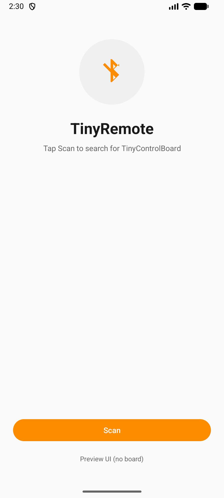
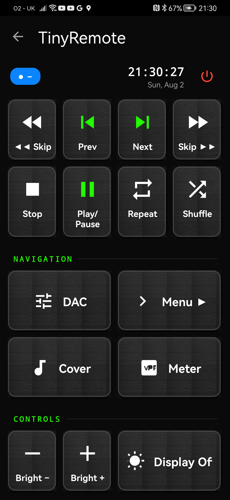

# TinyRemote: Simple User Guide

TinyRemote turns your Android phone into a remote control for your TinyControlBoard music player. Use it to start and stop music, change tracks, and control the player display.

You do not need to connect the app to Wi-Fi or pair it in your phone's Bluetooth settings. Just open TinyRemote and use **Scan**.

## Start Here

Before using the app, make sure:

- Your TinyControlBoard music player is plugged in and switched on.
- Bluetooth is turned on in your phone or tablet settings.
- Your phone is close to the player, ideally in the same room.

## Connect For The First Time

1. Open **TinyRemote** on your phone.
2. Tap the orange **Scan** button.
3. If your phone asks for permission to find nearby devices, tap **Allow**.
4. Wait for **TinyControlBoard** to appear on the screen.
5. Tap **TinyControlBoard**.
6. When you see the control buttons, you are ready to use the app.

If your phone asks for Location permission, tap **Allow**. Some older Android phones need this permission before they can look for Bluetooth devices. TinyRemote does not track your location.

*Figure 1. The TinyRemote scan screen. Tap **Scan** to begin searching. The **Preview UI (no board)** link shown in this development capture is not available in the release app.*

If you see **Searching for TinyControlBoard...**, wait a moment. If you see **Disconnected**, tap **Scan** and choose the player again.

## Use The Remote

The remote screen has the same kinds of controls you would expect on a music player. Tap a button once to use it.

*Figure 2. The remote screen. Music controls are at the top; player-display controls are below them. The small amber dots show when a matching player setting is on.*

### Check The Top Of The Screen

Before sending music commands, look at the small label near the top left:

- **ON** means the player is ready.
- **OFF** or **SLEEP** means the player is not ready. Tap the power icon at the top right, then wait until the label changes to **ON**.
- If the label says the player is starting or shutting down, wait before tapping power again.

The app may also show the song title and a progress bar. These appear only when the player has that information available.

### Play, Pause, And Change Tracks

| Control | Action |
| --- | --- |
| **Play** | Start the music. When music is playing, this button becomes **Pause**. |
| **Pause** | Pause the music. Tap **Play** to continue. |
| **Stop** | Stop the music. |
| **Prev** | Go to the previous song. |
| **Next** | Go to the next song. |
| **Skip Back** | Jump back within the current song. |
| **Skip Forward** | Jump forward within the current song. |
| **Repeat** | Keep playing the list again from the beginning. Tap again to turn it off. |
| **Shuffle** | Play songs in a random order. Tap again to turn it off. |

### Change What You See On The Player

| Control | Action |
| --- | --- |
| **Menu** | Choose what the player display shows. |
| **Cover** | Show the album-cover display mode. |
| **Meter** | Show or hide the moving music-level display. |
| **DAC** | Switch the audio output only if your player has more than one output set up. |

Some player setups may not use every option. Nothing is wrong if an option does not change what you see or hear.

### Make The Player Screen Brighter Or Darker

| Control | Action |
| --- | --- |
| **Brightness -** | Make the player screen a little darker. |
| **Brightness +** | Make the player screen a little brighter. |
| **Display Off** | Turn off the player screen. Your music keeps playing. The button then changes to **Display On**. |

## Choose A Player Screen

1. Tap **Menu** on the remote screen.
2. Tap the view you want to see on the player.
3. Tap the back arrow to return to the remote screen.

| Option | Display mode |
| --- | --- |
| **Default View** | Go back to the usual player screen. |
| **Radio Stations** | Show saved radio stations. |
| **Playlist** | Show the current list of songs. |
| **Folder View** | Show music folders. |
| **Tag View** | Sort music by its tags, such as artist or genre. |
| **Album View** | Show music by album. |

## If Something Does Not Work

| Problem | Likely cause | Solution |
| --- | --- | --- |
| I cannot see TinyControlBoard after tapping Scan. | The player may be off, too far away, or Bluetooth may be off on your phone. | Move closer to the player, check that it is switched on, turn on phone Bluetooth, then tap **Scan** again. |
| The app asks for permission again. | Permission was not allowed the first time. | Choose **Allow**. If it still does not work, open phone Settings, find TinyRemote, and allow Nearby devices or Bluetooth. Older phones may also need Location allowed. |
| The app says it disconnected. | The phone is no longer connected to the player. | Tap **Scan**, then tap **TinyControlBoard** again. |
| A button does nothing. | The player is off, asleep, or still starting. | Check the top-left label. If it does not say **ON**, tap the power icon and wait. |
| I cannot see the song title or progress bar. | Your player is not sending that information right now. | You can still use the music controls normally. |

## When You Are Finished

Use the back arrow from the remote screen to return to the scan screen. This disconnects TinyRemote from the player.

TinyRemote is a remote control only. It does not store music, play sound from your phone, update the player, or set up Wi-Fi.