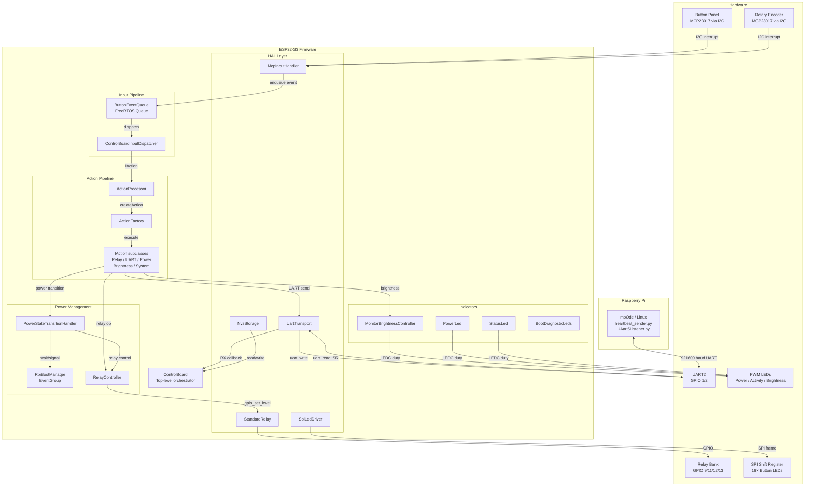
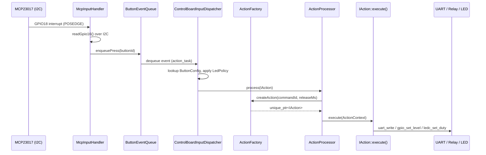
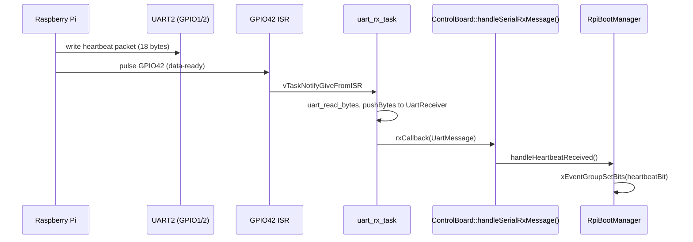

# TinyControlBoard Architecture

This document explains how the current firmware is structured and how control flows through the system.

## 1. High-Level View

The firmware is built around one top-level orchestrator: `ControlBoard`.

At runtime, the system does four main jobs:

1. initialize the board and connected hardware,
2. read user input from buttons and rotary input,
3. convert those inputs into local actions or UART commands,
4. monitor the Raspberry Pi link and react to heartbeat state.

Core entry points:

- [src/main.cpp](../src/main.cpp)
- [lib/app/ControlBoard.hpp](../lib/app/ControlBoard.hpp)
- [lib/app/ControlBoard.cpp](../lib/app/ControlBoard.cpp)

### System Architecture Diagram



## 2. Startup Flow

Current startup sequence:

1. `app_main()` waits 5 seconds for power to settle.
2. A `ControlBoard` instance is created.
3. NVS flash is initialized.
4. `bootstrap::prepareStartupIndicators()` sets the power LED to `TURNING_ON`.
5. The UART and relay singletons are acquired; serial RX and heartbeat-timeout callbacks are registered.
6. `ActionProcessor` and `ControlBoardInputDispatcher` are constructed.
7. Relays are initialized and set to default off states.
8. The MCP input handler is initialized.
9. The `ButtonEventQueue` task is started.
10. Button press, release, and rotary callbacks are registered.
11. UART hardware is initialized.
12. The button-to-action map is populated via `ControlBoardActionRegistry`.
13. After a `board::timing::k_initDelayMs` delay, `triggerInitialPowerOn()` is called which starts the full power-on sequence.
14. Once initialization succeeds, `app_main()` starts `ble::BleServer` and connects its command and status callbacks to the board.

Note: if any critical init step fails (MCP handler, queue, serial setup, or initial power-on), `BootDiagnosticLeds::firmwareInitFailed()` is called immediately. It flashes the eight diagnostic LEDs at about 3 Hz while `app_main()` retries initialization every second.

References:

- [src/main.cpp](../src/main.cpp)
- [lib/app/ControlBoard.cpp](../lib/app/ControlBoard.cpp)
- [lib/app/ControlBoardBootstrap.cpp](../lib/app/ControlBoardBootstrap.cpp)
- [lib/board/boardConfig.hpp](../lib/board/boardConfig.hpp)

## 3. Main Components

### 3.1 `ControlBoard`

`ControlBoard` is the top-level integration class. It owns the component instances and routes events. Initialization logic is split into helper namespaces:

- `bootstrap::` functions (in `ControlBoardBootstrap.cpp`) handle startup step sequencing.
- `ControlBoardActionRegistry` populates the button-to-action map.
- `ControlBoardInputDispatcher` translates button/rotary events into `IAction` objects and manages per-button LED state.
- `ButtonEventQueue` serializes press, release, and rotary events onto a FreeRTOS queue processed by `ControlBoardInputDispatcher`.

Main responsibilities:

- initialize NVS, relays, UART, and serial callbacks,
- initialize the MCP input handler,
- start the `ButtonEventQueue` and register MCP callbacks,
- populate the button-to-action registry,
- trigger the initial power-on sequence.

References:

- [lib/app/ControlBoard.hpp](../lib/app/ControlBoard.hpp)
- [lib/app/ControlBoard.cpp](../lib/app/ControlBoard.cpp)
- [lib/app/ControlBoardBootstrap.hpp](../lib/app/ControlBoardBootstrap.hpp)
- [lib/app/ControlBoardActionRegistry.hpp](../lib/app/ControlBoardActionRegistry.hpp)
- [lib/app/ControlBoardInputDispatcher.hpp](../lib/app/ControlBoardInputDispatcher.hpp)
- [lib/app/ButtonEventQueue.hpp](../lib/app/ButtonEventQueue.hpp)

### 3.2 `ActionProcessor`

`ActionProcessor` receives a `std::unique_ptr<actions::IAction>` and executes it via the `ActionContext` services struct.

Side effects are implemented in concrete `IAction` subclasses under `lib/app/commands/`:

- `RelayAction` — local relay changes,
- `BrightnessAction` — local brightness changes,
- `UartDispatchAction` — sends UART commands to the Raspberry Pi,
- `PowerTransitionAction` — handles power-state transitions,
- `DisplayAction` — display on/off control,
- `SystemAction` — system-level commands.

`ActionFactory::createAction()` maps a `CommandId` to the appropriate concrete type via `ActionCommandRoutingPolicy`.

References:

- [lib/app/actionProcessor.hpp](../lib/app/actionProcessor.hpp)
- [lib/app/actionProcessor.cpp](../lib/app/actionProcessor.cpp)
- [lib/app/ActionFactory.hpp](../lib/app/ActionFactory.hpp)
- [lib/app/ActionContext.hpp](../lib/app/ActionContext.hpp)
- [lib/app/ActionCommandRoutingPolicy.hpp](../lib/app/ActionCommandRoutingPolicy.hpp)
- [lib/app/commands/](../lib/app/commands/)

### 3.3 `Serial`

The serial layer owns the ESP32 side of the Pi link.

It does three distinct jobs:

- configure and use UART2,
- manage the two extra data-ready handshake GPIOs,
- track heartbeat timing and pass completed messages up through a callback.

References:

- [lib/hal/uart/serial.hpp](../lib/hal/uart/serial.hpp)
- [lib/hal/uart/serial.cpp](../lib/hal/uart/serial.cpp)

### 3.4 `RpiBootManager`

`RpiBootManager` is a synchronization helper built around a FreeRTOS event group.

It does not directly control hardware. Instead, it waits for lifecycle signals:

- heartbeat received means the Pi is alive or has finished booting,
- heartbeat timeout is treated as shutdown/offline confirmation.

Debug flag:

- `board::debug::kSimulateRpiBoot` in [lib/board/boardConfig.hpp](../lib/board/boardConfig.hpp) can be set to `true` to skip the heartbeat wait entirely. This is useful when testing on the bench without a Raspberry Pi connected. The flag is evaluated at compile time (`if constexpr`) so there is zero overhead in release builds.

References:

- [lib/power/RPIBootManager.hpp](../lib/power/RPIBootManager.hpp)
- [lib/power/RPIBootManager.cpp](../lib/power/RPIBootManager.cpp)
- [lib/board/boardConfig.hpp](../lib/board/boardConfig.hpp)

### 3.5 `BootDiagnosticLeds`

`BootDiagnosticLeds` uses eight of the sixteen SPI button LEDs to show power-on progress and failure. `begin()` turns on all diagnostic LEDs at the start of a power-on attempt. Each successful relay stage calls `stageSuccess()` to extinguish its pair. A relay or Raspberry Pi communication failure calls `stageFailure()` and flashes only that stage's pair at about 3 Hz until reset. Firmware initialization failures call `firmwareInitFailed()` and flash all eight diagnostic LEDs.

The service is accessed through `indicators::getBootDiagnosticLeds()` in `ledManager.hpp`. It is separate from the normal per-button LED state and from the power/activity PWM indicators.

References:

- [lib/indicators/BootDiagnosticLeds.hpp](../lib/indicators/BootDiagnosticLeds.hpp)
- [lib/indicators/BootDiagnosticLeds.cpp](../lib/indicators/BootDiagnosticLeds.cpp)
- [lib/indicators/ledManager.hpp](../lib/indicators/ledManager.hpp)

### 3.6 `SpiLedDriver`

`SpiLedDriver` drives 16 button LEDs via SPI shift registers (SPI2_HOST, 1 MHz, GPIO 6/7/5 for clock/MOSI/latch).

Key methods:

- `init()` — sets up the SPI bus and device.
- `setLed(index, on)` — sets a single LED by bit index (0–15).
- `setAllLeds(on)` — sets all 16 LEDs on or off. Used for the short startup flash; boot-stage diagnostics use individual LED pairs.
- `update()` — pushes the current 16-bit state to the shift register via SPI.

The overall brightness of all button LEDs is controlled by a PWM duty on GPIO 21 (`k_buttonLedPwmPin`) through the `StatusLed` instance registered as `s_buttonStatusLed`. The duty is updated by `MonitorBrightnessController` whenever screen brightness changes so the two track together (see §3.7).

References:

- [lib/hal/leds/spiLedDriver.hpp](../lib/hal/leds/spiLedDriver.hpp)
- [lib/hal/leds/spiLedDriver.cpp](../lib/hal/leds/spiLedDriver.cpp)

### 3.7 `MonitorBrightnessController` And Button LED Coupling

`MonitorBrightnessController` owns the PWM duty on the monitor brightness pin and also drives the button LED brightness level. Every method that changes screen brightness calls `getButtonStatusLed().setIdleDuty()` with an inverted mapping:

- level 0 (screen dimmest) → button LEDs dimmest,
- level 9 (screen brightest) → button LEDs brightest.

The inversion is applied inside `buttonDutyForLevel()` in `MonitorBrightnessController.cpp` because the button LED circuit is active-low (higher LEDC duty → dimmer output).

`setIdleDuty()` on `StatusLed` is thread-safe (`std::atomic<uint32_t> m_idleDuty`) and takes effect immediately when the LED task is in `SolidIdle` state.

The coupling is active through:

- `init()` — applies the NVS-restored level to both outputs on startup,
- `changeBrightnessLevel()` / `cycleBrightness()` — user brightness steps,
- `setState()` ON path — restores saved level on wake,
- `toggleDisplayOffOn()` — drives both to zero when display-off is active, restores on toggle-off,
- `clearDisplayOffMode()` — restores both before a power transition.

References:

- [lib/indicators/monitorBrightnessController.hpp](../lib/indicators/monitorBrightnessController.hpp)
- [lib/indicators/MonitorBrightnessController.cpp](../lib/indicators/MonitorBrightnessController.cpp)
- [lib/indicators/statusLed.hpp](../lib/indicators/statusLed.hpp)

### 3.8 `RelayController`

`RelayController` is a thin helper around the relay abstraction. It currently provides:

- relay state changes with optional delay,
- DAC relay toggling,
- Raspberry Pi relay shutdown,
- 3V3 relay shutdown.

`StandardRelay::setRelayState()` returns a `bool` — `true` if `gpio_set_level()` succeeded, `false` on driver error (e.g. pin not configured or invalid pin number). Physical contact state is not detectable without dedicated feedback hardware.

References:

- [lib/power/RelayController.hpp](../lib/power/RelayController.hpp)
- [lib/power/RelayController.cpp](../lib/power/RelayController.cpp)
- [lib/hal/relay/relay.hpp](../lib/hal/relay/relay.hpp)
- [lib/hal/relay/relay.cpp](../lib/hal/relay/relay.cpp)

### 3.9 `BleServer`

`BleServer` is the external local-remote control interface. It starts only after `ControlBoard::init()` succeeds and keeps NimBLE implementation details inside `lib/ble/BleServer.cpp`.

The GATT service provides:

- a command characteristic accepting a 16-bit little-endian `CommandId`,
- a status characteristic reporting power state and the button LED bitmask,
- a track-progress characteristic,
- a library-entry notification characteristic,
- a library-command characteristic carrying a command ID and one parameter.

Command writes call `ActionProcessor::injectCommand()`, so BLE commands use the same factory and action execution path as physical input. Library commands instead use the callback installed by `app_main()` to send a protocol message to the Raspberry Pi. The server also receives library-entry notifications from the inbound UART path.

Reference:

- [lib/ble/BleServer.hpp](../lib/ble/BleServer.hpp)
- [lib/ble/BleServer.cpp](../lib/ble/BleServer.cpp)
- [src/main.cpp](../src/main.cpp)

## 4. Input Flow

The current input path is:

1. MCP interrupt fires; `McpInputHandler` decodes it as a press, release, or rotary event.
2. The event is enqueued into `ButtonEventQueue`.
3. `ControlBoardInputDispatcher` dequeues the event and looks up the `ButtonConfig` for that button index.
4. `ButtonConfig::action->produce(isPressed)` is called on the `IActionSource` to obtain a `std::unique_ptr<actions::IAction>`.
5. `ControlBoardInputDispatcher` applies `LedPolicy` (None / Momentary / Toggle) to the SPI LED state for that button.
6. The `IAction` is passed to `ActionProcessor::process()`.
7. `ActionProcessor` builds an `ActionContext` and calls `iaction->execute(ctx)`.
8. The concrete command class performs the side effect (relay, UART, brightness, power transition, etc.).

Related files:

- [lib/hal/buttons/mcpInputHandler.hpp](../lib/hal/buttons/mcpInputHandler.hpp)
- [lib/hal/buttons/mcpInputHandler.cpp](../lib/hal/buttons/mcpInputHandler.cpp)
- [lib/app/ButtonEventQueue.hpp](../lib/app/ButtonEventQueue.hpp)
- [lib/app/ControlBoardInputDispatcher.hpp](../lib/app/ControlBoardInputDispatcher.hpp)
- [lib/input/actions/actionTemplates.hpp](../lib/input/actions/actionTemplates.hpp)
- [lib/input/actions/IAction.hpp](../lib/input/actions/IAction.hpp)
- [lib/app/ActionFactory.hpp](../lib/app/ActionFactory.hpp)
- [lib/app/ActionContext.hpp](../lib/app/ActionContext.hpp)

## 5. UART Flow

The current ESP32 -> Pi path is:

1. An action processor branch decides to send a command.
2. A `UartMessage` or command ID is passed to `Serial`.
3. `Serial::sendData()` writes bytes on UART.
4. The ESP32 raises its data-ready pin briefly so the Pi knows to read.

The Pi -> ESP32 path is:

1. The Raspberry Pi writes a UART packet.
2. The Pi pulses its data-ready line.
3. The ESP32 ISR wakes the UART RX task.
4. Incoming bytes are added to the receiver buffer.
5. Complete messages are deserialized and passed to the registered callback.

Important current limitation:

- `ControlBoard::handleSerialRxMessage()` actively handles heartbeat messages.
- Other received UART messages are now routed through a minimal `ActionProcessor` inbound scaffold and logged, but protocol-specific behavior is still pending.

References:

- [lib/hal/uart/serial.cpp](../lib/hal/uart/serial.cpp)
- [lib/app/ControlBoard.cpp](../lib/app/ControlBoard.cpp)
- [lib/protocol/uartProtocol.hpp](../lib/protocol/uartProtocol.hpp)

## 6. State And Status Model

### 6.1 Power State

The main power LED state model currently includes:

- `OFF`
- `TURNING_ON`
- `ON`
- `SLEEP`
- `GOING_TO_SLEEP`
- `DEEPSLEEP`

Reference:

- [lib/power/powerState.hpp](../lib/power/powerState.hpp)

### 6.2 Working Status

The activity/status LED model currently includes:

- `doingWork`
- `Idle`
- `SolidIdle`
- `sleeping`
- `MaintenanceMode`
- `Active`

Reference:

- [lib/indicators/activityStatus.hpp](../lib/indicators/activityStatus.hpp)

## 7. Folder Ownership

This is the practical ownership model for the current codebase.

| Area | Current Role |
|---|---|
| `src/` | firmware entry point |
| `lib/board/` | board constants, identity, and debug flags |
| `lib/app/` | orchestration and integration layer |
| `lib/input/actions/` | reusable button action objects and templates |
| `lib/hal/buttons/` | MCP23017 input expander driver |
| `lib/hal/leds/` | SPI and PWM LED drivers |
| `lib/hal/relay/` | low-level relay GPIO abstraction |
| `lib/hal/uart/` | UART transport and handshake logic |
| `lib/hal/storage/` | NVS storage helper |
| `lib/protocol/` | wire format and command IDs |
| `lib/ble/` | BLE GATT command, status, track-progress, and library interfaces |
| `lib/indicators/` | LED services, brightness control, and boot indication |
| `lib/power/` | power state, relay sequencing, and Pi boot/shutdown coordination |
| `scripts/rpi/` | Raspberry Pi listener, sender, and setup docs |
| `host_tests/` | pure C++ host-side tests (no ESP-IDF required) |
| `test/` | PlatformIO device tests (run on connected ESP32-S3) |

## 8. Notable Current Design Characteristics

- `ControlBoard` is the integration hub and currently owns a lot of orchestration.
- Input actions are represented as objects, which makes it straightforward to remap buttons without rewriting processor logic.
- Toggle actions maintain internal software state, so their first emitted command depends on the starting state in firmware.
- Heartbeat is treated as the Raspberry Pi liveness signal for both boot completion and shutdown detection.
- Non-heartbeat Pi-originated commands are routed through the inbound `ActionProcessor` scaffold; protocol-specific handling remains pending.
- Boot progress and failures are signalled via `BootDiagnosticLeds`: eight LEDs start on, successful stages turn their pairs off, and failed stages flash their pair at about 3 Hz.
- The `board::debug::kSimulateRpiBoot` compile-time flag allows full firmware testing without a connected Raspberry Pi. When `true`, the 60-second heartbeat wait is skipped instantly.
- Button LED brightness tracks monitor brightness automatically. `MonitorBrightnessController` calls `getButtonStatusLed().setIdleDuty()` at every brightness-change site using an inverted active-low mapping.
- `StandardRelay::setRelayState()` returns a bool indicating GPIO driver success. Physical relay contact state cannot be detected without additional feedback hardware (current sense or optocoupler on the switched output).

## 9. Related Docs

- [docs/project-guide.md](./project-guide.md)
- [docs/button-command-map.md](./button-command-map.md)
- [docs/power-sequencing.md](./power-sequencing.md)
- [docs/wiring-reference.md](./wiring-reference.md)
- [docs/protocol-reference.md](./protocol-reference.md)
- [docs/raspberry-pi-setup.md](./raspberry-pi-setup.md)

---

## 10. Software Design Patterns

| Pattern | Where Used | Notes |
|---|---|---|
| **Command** | `IAction` / `IActionSource` hierarchy | Each button press is converted to a `unique_ptr<IAction>`; `execute(ctx)` carries the side-effect. Adding a new command = new subclass in `lib/app/commands/`. |
| **Factory** | `ActionFactory::createAction()` | Maps `CommandId` → concrete `IAction` subclass via an internal `switch`. Centralises construction; callers never `new` command objects. |
| **Strategy / Policy** | `ActionCommandRoutingPolicy` | Table-driven command routing (`constexpr CommandRouteEntry k_commandRouteTable[]`). Default = UART dispatch; rows override for local-only actions. |
| **Observer / Callback** | UART RX callback, heartbeat timeout callback, MCP button/release/rotary callbacks | Producers register `std::function` callbacks; no direct coupling between HAL and application layers. |
| **State Machine** | `ControlBoardPowerState` + `PowerStateTransitionHandler` | Eight named states; `handle()` transitions between them based on `IAction` type and hold-time. |
| **Event Queue** | `ButtonEventQueue` | ISR-safe FreeRTOS queue; decouples GPIO ISR from application-thread processing. |
| **Singleton** | `UartTransport::getInstance()`, indicator accessors in `ledManager.hpp` | Used only for hardware peripherals that have a single physical instance. |
| **RAII** | `ButtonEventQueue` destructor, `UartTransport` destructor | FreeRTOS task handles and queue handles are cleaned up on destruction. |
| **Service Locator (limited)** | `indicators::getPowerLed()`, `getMonitorBrightnessController()`, etc. | Free-function accessors in `ledManager.hpp` return references to static indicator instances. |
| **Table-driven registration** | `ControlBoardActionRegistry` (`constexpr ButtonRegistration k_buttons[]`) | Adding a button = one table row + one `CMD_*` constant; no procedural wiring. |

## 11. Data Flow Diagram

### 11.1 Input → Action → Output



### 11.2 Pi → ESP32 Heartbeat Path



## 12. Memory Architecture

| Region | Usage | Notes |
|---|---|---|
| **IRAM** | ISR functions (`IRAM_ATTR`) | `DataReadyHandshake` and `McpInputHandler` ISR handlers are placed in IRAM and only wake worker tasks. |
| **DRAM (stack)** | FreeRTOS task stacks | Each task allocates its stack from the heap at `xTaskCreate` time. See §13 for per-task sizes. |
| **DRAM (heap)** | `unique_ptr<IAction>` objects, `std::vector` in `ControlBoardActionRegistry`, FreeRTOS queue/timer handles | Action objects are short-lived; allocated during `ActionFactory::createAction()` and freed immediately after `execute()`. |
| **NVS (flash)** | Monitor brightness level | Stored under namespace `"brightness"`, key `"level"` (int8_t). Written on every user brightness change; read at boot. |
| **Flash (factory partition)** | Firmware image | 15.9 MB; see §16 partition table. |
| **PSRAM** | Not used | No external PSRAM is mounted on the target board. |

Stack usage notes:
- The `IRAM_ATTR` ISR handlers use minimal stack (notification only; no heap).
- `UartReceiver` holds a 256-byte ring buffer as a member variable (on the `uart_rx_task` stack).
- `MonitorBrightnessController` and `NvsStorage` instances are owned by `ControlBoard` as member objects, living on the main heap for the application lifetime.

## 13. Concurrency Model

### 13.1 FreeRTOS Tasks

| Task Name | Created In | Stack | Priority | Purpose |
|---|---|---|---:|---|
| `uart_rx_task` | `lib/hal/uart/uartRxPump.cpp` | 4096 B | 10 | Blocks on GPIO notification; drains the UART FIFO, feeds `UartReceiver`, and fires the RX callback for each complete frame. |
| `heartbeat_monitor` | `lib/hal/uart/heartbeatMonitor.cpp` | 4096 B | 5 | Polls `HeartbeatWatchdog` every 100 ms and fires the timeout callback when the RX inactivity window expires. |
| `action_task` | `lib/app/ButtonEventQueue.cpp` | 4096 B | 5 | Blocks on `xQueueReceive`; dequeues `ButtonEvent` structs and calls `ControlBoardInputDispatcher::dispatch()`. |
| `mcp_int_task` | `lib/hal/buttons/mcpInputHandler.cpp` | 4096 B | 10 | Woken by `vTaskNotifyGiveFromISR` from GPIO18 ISR; reads MCP23017 registers over I2C; fires button/rotary callbacks. |
| `LED_Task` (×N) | `lib/indicators/statusLed.cpp` | 4096 B | 5 | Drives one PWM indicator LED; reads from a 1-slot FreeRTOS queue; implements blink / breathe / solid patterns. One instance per `StatusLed` object. |
| `BreatheTask` (×N) | `lib/indicators/statusLed.cpp` | 2048 B | 5 | Fade-in/fade-out effect helper spawned transiently by `LED_Task`. |
| `boot_diag_leds` | `lib/indicators/BootDiagnosticLeds.cpp` | 2048 B | idle+1 | Created only on first boot-stage failure; flashes SPI LEDs at 3 Hz continuously until hardware reset. |

### 13.2 Synchronization Primitives

| Primitive | Where | Purpose |
|---|---|---|
| `FreeRTOS Queue` (depth 16) | `ButtonEventQueue` | Decouples ISR/callback context from application task. |
| `FreeRTOS Queue` (depth 1) | `StatusLed` (per instance) | Passes `ControlBoardWorkingStatus` enums to `LED_Task`. |
| `FreeRTOS EventGroup` | `RpiBootManager` | Bit 0 = heartbeat received; Bit 1 = shutdown confirmed. `waitForRpiToBoot()` and `waitForRpiShutdown()` call `xEventGroupWaitBits`. |
| `std::atomic<ControlBoardPowerState>` | `SystemState` | Thread-safe power state shared between `ActionProcessor` and heartbeat callback. |
| `std::atomic<uint16_t>` | `ControlBoardInputDispatcher::m_buttonLedBitmask` | Per-button LED toggle state; updated with `fetch_xor`. |
| `std::atomic<uint32_t>` | `StatusLed::m_idleDuty` | Allows `MonitorBrightnessController` to update button LED brightness from any task context. |
| `std::atomic<bool>` | UART task lifecycle flags and `HeartbeatWatchdog` state | Guards task lifecycle and heartbeat state without a mutex. |

## 14. Interrupt Handling Strategy

| ISR | Trigger | Action | Safe Primitives Used |
|---|---|---|---|
| `DataReadyHandshake` ISR (`IRAM_ATTR`) | GPIO42 POSEDGE (Pi data-ready) | `vTaskNotifyGiveFromISR` → wakes `uart_rx_task` | `vTaskNotifyGiveFromISR`, `portYIELD_FROM_ISR` |
| `McpInputHandler::gpioIsr` | GPIO18 (MCP23017 /INT) | `vTaskNotifyGiveFromISR` → wakes `mcp_int_task` | `vTaskNotifyGiveFromISR`, `portYIELD_FROM_ISR` |

Design rules:
- ISRs contain **no** I2C or UART calls; all slow bus work happens in the unblocked task.
- Both ISRs are installed via `gpio_install_isr_service` + `gpio_isr_handler_add` (shared ISR service).
- `IRAM_ATTR` ensures `gpioIsrHandler` runs from IRAM and is not blocked by flash cache misses during SPI flash operations.
- FreeRTOS task notification (not a semaphore) is used for minimal ISR overhead.

## 15. Communication Protocols

| Protocol | Interface | Speed / Settings | Role |
|---|---|---|---|
| **UART** (custom framed) | UART2 / GPIO1 (RX) / GPIO2 (TX) | 921 600 baud, 8N1 | Bi-directional link to Raspberry Pi. Variable-length frames: 19-byte command packets with a 10-byte payload, up to 69 bytes total. |
| **I2C** | I2C_NUM_0 / GPIO15 (SCL) / GPIO16 (SDA) | 50 000 Hz | Reads button states and interrupt capture registers from MCP23017 I/O expander at address `0x20`. |
| **SPI** | SPI2_HOST / GPIO6 (CLK) / GPIO7 (MOSI) / GPIO5 (latch) | 1 MHz | Drives 16-bit parallel-load shift register for button panel LEDs. One full 16-bit frame per `SpiLedDriver::update()`. |
| **LEDC (PWM)** | Multiple GPIO channels | 4 kHz / 13-bit resolution | Monitor brightness control (GPIO43), button LED PWM (GPIO21), power LED (GPIO3/4), working status LED (GPIO48). |
| **GPIO handshake** | GPIO41 (out) / GPIO42 (in) | Logic level | Data-ready signalling: Pi raises GPIO42 before sending; ESP32 raises GPIO41 for 10 ms after sending. |
| **NVS (SPI flash)** | Internal flash | N/A | Persists brightness level across power cycles in the `nvs` partition. |

## 16. Error Handling And Fault Recovery

| Scenario | Detection | Recovery |
|---|---|---|
| MCP23017 init failure | `McpInputHandler::begin()` returns `esp_err_t != ESP_OK` | `ControlBoard::init()` calls `BootDiagnosticLeds::firmwareInitFailed()` (all 8 LEDs flash at 3 Hz) then returns failure; `main.cpp` retries `init()` every 1 s. |
| Serial/UART init failure | `Serial::initUart()` returns `false` | Same path: `firmwareInitFailed()` + retry loop. |
| Individual power-on relay failure | `StandardRelay::setRelayState()` returns `false` | `PowerStateTransitionHandler` calls `BootDiagnosticLeds::stageFailure(stage)` for the failing stage; system halts relay sequence and flashes that stage's LED pair. |
| Heartbeat timeout while ON | `heartbeat_monitor` task fires timeout callback | `ActionProcessor::handleHeartbeatTimeout()` forces `powerState` to `SLEEP`; a subsequent power-button press can re-trigger the full power-on sequence. |
| Pi boot timeout (60 s) | `RpiBootManager::waitForRpiToBoot()` returns `false` | `PowerStateTransitionHandler` calls `BootDiagnosticLeds::stageFailure(BootStage::RpiComms)`; relay power-on is considered failed. |
| GPIO driver error | `gpio_set_level()` returns non-OK | `StandardRelay::setRelayState()` returns `false`; caller decides whether to abort. Physical relay contact cannot be confirmed without feedback hardware. |
| NVS key not found on first boot | `NvsStorage::readInt8()` returns `false` | `MonitorBrightnessController::init()` uses compile-time default level `2`; writes it to NVS on first brightness change. |
| FreeRTOS task creation failure | `xTaskCreate()` returns `!= pdPASS` | Logged via `ESP_LOGE`; the init step that required the task returns `false`, triggering the retry path. |

---

## 17. Configuration And Constants Map

### 17.1 Timing Constants (`lib/board/boardConfig.hpp` — `board::timing`)

| Constant | Default Value | Unit | Description |
|---|---:|---|---|
| `k_heartbeatTimeoutMs` | 30 000 | ms | Inactivity window before heartbeat is considered lost |
| `k_initDelayMs` | 5 000 | ms | Post-boot settle delay before `triggerInitialPowerOn()` |
| `k_powerSettleDelayMs` | 1 500 | ms | Delay after DAC / output-stage relay enable |
| `k_vcc3v3OnDelayMs` | 1 000 | ms | Delay between 3V3 and Pi relay steps during power-on |
| `k_rpiBootTimeoutMs` | 60 000 | ms | Max wait for Pi heartbeat after power-on |
| `k_rpiShutdownTimeoutMs` | 60 000 | ms | Max wait for Pi heartbeat loss during shutdown |
| `k_rpiShutdownSettleDelayMs` | 500 | ms | Delay between Pi relay off and 3V3 relay off |
| `k_vcc3v3PowerOffDelayMs` | 5 000 | ms | Delay after 3V3 relay off before LED state changes |
| `kLongPressThresholdMs` (in `PowerStateTransitionPolicy.hpp`) | 3 000 | ms | Power-button hold duration that selects deep sleep vs sleep |

### 17.2 UART Constants (`lib/board/boardConfig.hpp` — `board::serial`)

| Constant | Value | Description |
|---|---|---|
| `k_port` | `UART_NUM_2` | UART peripheral |
| `k_baudRate` | 921 600 | Baud rate |
| `k_txPin` | `GPIO_NUM_2` | TX to Pi |
| `k_rxPin` | `GPIO_NUM_1` | RX from Pi |
| `k_bufferSize` | 256 | RX ring buffer bytes |
| `k_rpiDataReadyPin` | `GPIO_NUM_42` | Pi pulls high to signal data ready |
| `k_esp32DataReadyPin` | `GPIO_NUM_41` | ESP32 pulses high after sending |

### 17.3 GPIO Pin Mapping

| GPIO Pin | Direction | Connected To | Protocol | Notes |
|---:|---|---|---|---|
| 1 | Input | Raspberry Pi TX | UART2 RX | Main Pi → ESP32 data |
| 2 | Output | Raspberry Pi RX | UART2 TX | Main ESP32 → Pi data |
| 3 | Output | App active LED | LEDC PWM | |
| 4 | Output | App standby LED | LEDC PWM | |
| 5 | Output | SPI LED latch | SPI2 | Active rising edge to latch shift register |
| 6 | Output | SPI LED clock | SPI2 | |
| 7 | Output | SPI LED data (MOSI) | SPI2 | |
| 9 | Output | Output stage relay | GPIO | Active high |
| 10 | Output | Prototype DAC enable relay | GPIO | Active high |
| 11 | Output | Raspberry Pi power relay | GPIO | Active high |
| 12 | Output | DAC power relay | GPIO | Active high |
| 13 | Output | 3V3 power relay | GPIO | Active high |
| 15 | Output | I2C SCL | I2C_NUM_0 | MCP23017 clock |
| 16 | I/O | I2C SDA | I2C_NUM_0 | MCP23017 data |
| 17 | Output | MCP23017 enable | GPIO | Active high |
| 18 | Input | MCP23017 /INT | GPIO (ISR) | Active low interrupt, POSEDGE ISR trigger |
| 21 | Output | Button LED PWM | LEDC PWM | Overall brightness for all 16 SPI button LEDs |
| 39 | Output | General relay 2 | GPIO | Spare |
| 41 | Output | Pi data-ready (to Pi) | GPIO | Pulsed high 10 ms after sending |
| 42 | Input | Pi data-ready (from Pi) | GPIO (ISR) | POSEDGE wakes `uart_rx_task` |
| 43 | Output | Monitor brightness | LEDC PWM | Analogue brightness to display |
| 47 | Output | General relay 1 | GPIO | Spare |
| 48 | Output | Working status LED | LEDC PWM | |

### 17.4 Partition Table (`partitions.csv`)

| Name | Type | SubType | Offset | Size | Purpose |
|---|---|---|---|---|---|
| `nvs` | data | nvs | 0x9000 | 0x6000 (24 KB) | Non-volatile key-value storage |
| `phy_init` | data | phy | 0xF000 | 0x1000 (4 KB) | RF calibration data (managed by ESP-IDF) |
| `factory` | app | factory | 0x10000 | 0xFF0000 (≈15.9 MB) | Firmware image |

### 17.5 NVS Keys

| Namespace | Key | Type | Default | Written By | Description |
|---|---|---|---|---|---|
| `brightness` | `level` | int8_t | 2 | `MonitorBrightnessController` | Monitor brightness level (0–9); persisted on every user change |

---

## 18. Dependencies And Third-Party Libraries

| Library / Component | Version | Source | Purpose |
|---|---|---|---|
| **Espressif ESP-IDF** | ~5.1 (via PlatformIO `espressif32 @ ~6.5.0`) | [https://github.com/espressif/esp-idf](https://github.com/espressif/esp-idf) | RTOS, drivers (UART, I2C, SPI, LEDC, GPIO, NVS), FreeRTOS port |
| **FreeRTOS** | Bundled with ESP-IDF | Part of ESP-IDF | Task scheduling, queues, event groups, timers |
| **PlatformIO** | ≥6.x | [https://platformio.org](https://platformio.org) | Build system, environment management, flash/monitor tooling |
| **Arduino / ESP32 Arduino Core** | Not used | — | Framework is `espidf` (bare IDF); Arduino layer is not present |
| **MCP23017/23018 driver** | Internal (`lib/hal/buttons/`) | Project source | Custom I2C register-level driver for the MCP input expander; no third-party library |
| **CMake** | ≥3.28 | System / VS 2022 bundled | Host-test build system (`host_tests/`) |
| **Visual Studio 2022 / MSVC** | 17.x | Microsoft | Host-test compilation on Windows |

No Arduino libraries, Adafruit libraries, or other third-party C++ packages are used. All drivers are written in-project.

---

## 19. Testing And Debugging

### 19.1 Host Tests (Pure C++ — No Hardware Required)

Host tests live in `host_tests/` and test application-layer logic using stub implementations of all ESP-IDF dependencies.

**Configure and build:**
```powershell
# From the repo root
& "C:\Program Files\Microsoft Visual Studio\2022\Professional\Common7\IDE\CommonExtensions\Microsoft\CMake\CMake\bin\cmake.exe" `
    -S host_tests -B host_tests/build -G "Visual Studio 17 2022" -A x64
& "C:\Program Files\Microsoft Visual Studio\2022\Professional\MSBuild\Current\Bin\MSBuild.exe" `
    host_tests/build/TinyControlBoardHostTests.sln /p:Configuration=Debug
```

**Run:**
```powershell
host_tests\build\Debug\tiny_control_board_host_tests.exe
```

Currently **41 tests pass**. Test source: [host_tests/test_logic.cpp](../host_tests/test_logic.cpp).

### 19.2 PlatformIO Device Tests

Device tests are under `test/` and run on a connected ESP32-S3:

| Test Suite | Path | What It Tests |
|---|---|---|
| `test_power_led` | `test/test_power_led/` | Power LED state transitions |
| `test_simple_command_action` | `test/test_simple_command_action/` | Command action pipeline |
| `test_spi_boot_indicator` | `test/test_spi_boot_indicator/` | SPI boot indicator flash behavior |
| `test_spi_led_driver` | `test/test_spi_led_driver/` | SPI shift register LED driver |
| `test_uart_protocol` | `test/test_uart_protocol/` | UART frame serialization/deserialization |

Run with PlatformIO:
```bash
pio test -e esp32-s3-devkitc-1-16mb
```

### 19.3 Firmware Build

```bash
pio run                              # debug build (default)
pio run -e esp32-s3-devkitc-1-16mb-release   # release build
pio run --target upload              # build + flash
pio device monitor                   # serial monitor at 115200 baud
```

### 19.4 Debug Flags

| Flag | Location | Effect |
|---|---|---|
| `board::debug::k_simulateRpiBoot` | `lib/board/boardConfig.hpp` | `true` in debug builds — skips the 60 s Pi heartbeat wait. Override with `-DSIMULATE_RPI_BOOT=1` or `=0` in `build_flags`. |
| `NDEBUG` | `platformio.ini` (release env) | Disables `assert()` and sets `k_simulateRpiBoot = false`. |
| `DEBUG_MCP_SCAN` | `lib/hal/buttons/mcpInputHandler.hpp` | Enables `dumpRegisters()` and `scanI2c()` methods on `McpInputHandler`. Define in `build_flags` to activate. |
| `ESP_LOG_LEVEL` | `sdkconfig` | Controls verbosity of `ESP_LOGI/W/E/D` calls globally. |

### 19.5 Common Issues

| Symptom | Likely Cause | Fix |
|---|---|---|
| PlatformIO build fails with cryptic CMake errors after file-layout changes | Stale generated state in `.pio/build/` | Delete `.pio/build/esp32-s3-devkitc-1-16mb` and rebuild |
| Eight diagnostic SPI LEDs are lit at boot | Normal: power-on stages are pending | The successful relay stage extinguishes its LED pair; see `BootStage` mapping |
| Eight diagnostic LEDs flash rapidly (~3 Hz) | Firmware initialization failure | Check I2C wiring (GPIO15/16/18/17) and serial monitor for `ESP_LOGE` output |
| One diagnostic LED pair flashes rapidly (~3 Hz) | Relay or Pi communication stage failed | Check the relay and wiring associated with the named `BootStage` |
| Specific LED pair flashes at 3 Hz | Boot stage failure (relay or Pi comms) | Check relay wiring for the failed stage; see §17.3 for GPIO mapping |
| No button response | `action_task` not started or MCP init failed | Check `ESP_LOGE` log for task creation errors; verify I2C bus |
| UART TX silently dropped | Pi data-ready pin (GPIO41) still high | Ensure Pi companion scripts are running and not holding GPIO41 asserted |
| Host tests fail to compile | Missing MSVC or wrong CMake generator | Confirm Visual Studio 2022 is installed; re-run configure step above |

### 19.6 LED Status Codes

| LED | State | Meaning |
|---|---|---|
| Power LED (GPIO3) | Solid on | System ON |
| Power LED | Slow breathe | TURNING_ON or GOING_TO_SLEEP |
| Power LED | Off | System OFF or SLEEP |
| Working status LED (GPIO48) | Solid dim | Idle / standby |
| Working status LED | Blinking | Active processing |
| Button panel LEDs (SPI) | All slow flash | Waiting for Pi heartbeat after power-on |
| Button panel LEDs (SPI) | All fast flash | Firmware init failure |
| Specific LED pair (SPI) | Fast flash | Named boot-stage failure (see `BootStage` enum) |
| Button LED | On (solid) | Toggle-mode button is in active state |
| Button LED | Momentary on | Momentary-mode button pressed |

---

## 20. Glossary

| Term | Definition |
|---|---|
| **Action** | A `unique_ptr<IAction>` produced from a button event; the unit of work passed through the action pipeline. |
| **ActionContext** | Services struct (`uartDispatcher`, `powerHandler`, `relayController`, `serial`, `systemState`, `powerLed`, `brightnessController`) passed to every `IAction::execute()`. |
| **ActionFactory** | `lib/app/ActionFactory.cpp`; maps a `CommandId` to a concrete `IAction` subclass. |
| **app_main** | ESP-IDF entry point (replaces `main()`). Defined in `src/main.cpp`. |
| **BootDiagnosticLeds** | Visual boot-stage indicator using 8 of the 16 SPI LEDs. |
| **BootStage** | Enum (`Vcc3v3Relay`, `DacRelay`, `OutputStage`, `RpiComms`) identifying one phase of the relay power-on sequence. |
| **ButtonEventQueue** | RAII wrapper around the FreeRTOS queue and `action_task` that serializes ISR-originated button events for the application thread. |
| **CommandId** | 16-bit identifier for a firmware command (e.g. `CMD_PLAY_PAUSE = 0x0102`). Defined in `lib/protocol/uartProtocol.hpp`. |
| **ControlBoard** | Top-level integration class; owns all major component instances and wires callbacks. |
| **ESP-IDF** | Espressif IoT Development Framework — the bare-metal SDK used by this firmware. Provides FreeRTOS, drivers, NVS, and other system services. |
| **EventGroup** | FreeRTOS synchronization primitive (`EventGroupHandle_t`) used in `RpiBootManager` to signal heartbeat-received and shutdown-confirmed bits. |
| **FreeRTOS** | Real-time operating system kernel embedded in ESP-IDF. Provides cooperative/preemptive multitasking, queues, semaphores, and timers. |
| **HAL** | Hardware Abstraction Layer — `lib/hal/` contains raw peripheral drivers with no domain logic. |
| **heartbeat** | A periodic `CMD_SYS_HEARTBEAT` UART message sent by the Raspberry Pi to signal it is alive. Loss triggers the power-recovery path. |
| **IAction** | Pure-virtual base class for all command objects (`lib/input/actions/IAction.hpp`). |
| **IActionSource** | Interface that produces an `optional<Action>` from a button press/release; implemented by `SimpleCommandAction`, `TimedAction`, etc. |
| **IRAM_ATTR** | GCC attribute placing a function in IRAM (internal RAM) so it executes without flash-cache dependency — required for ISR handlers. |
| **LEDC** | ESP32 LED Controller peripheral — generates PWM signals. Used for all PWM-controlled LEDs and the monitor brightness output. |
| **LedPolicy** | Per-button enum (`None`, `Momentary`, `Toggle`) controlling how the SPI LED tracks button press state. |
| **MCP23017/23018** | Microchip 16-bit I2C GPIO expander at address `0x20`. Provides 16 debounced button inputs and interrupt-on-change. |
| **moOde** | Open-source audiophile music player software running on the Raspberry Pi companion. |
| **NVS** | Non-Volatile Storage — ESP-IDF key-value store backed by a dedicated SPI flash partition. |
| **PSRAM** | Pseudo-Static RAM — external RAM chip optionally soldered to the ESP32-S3. Not used on this board. |
| **PowerLed** | Indicator class driving the power status LED via LEDC; reflects `ControlBoardPowerState`. |
| **RpiBootManager** | Synchronization helper around a FreeRTOS EventGroup; provides blocking `waitForRpiToBoot()` and `waitForRpiShutdown()`. |
| **SpiLedDriver** | HAL driver for the 16-channel SPI shift-register button LED array. |
| **StandardRelay** | HAL class wrapping `gpio_set_level()` for a single relay output. Returns a `bool` success indicator. |
| **SystemState** | Lightweight struct holding `std::atomic<ControlBoardPowerState>` — the only shared mutable runtime state. |
| **UartReceiver** | Stateful framing helper; accumulates raw bytes and emits complete variable-length `UartMessage` frames. |
| **UartTransport** | Singleton serial layer (`transport::uart::UartTransport`) managing UART2, data-ready handshake GPIOs, RX task, and heartbeat monitor task. |