# TinyControlBoard Firmware Technical Design

This document was generated from source-code analysis of the PlatformIO firmware project on 2026-06-12. Existing markdown documents in `docs/` were intentionally not used as source material. All behavior descriptions below are derived from the code under `src/`, `lib/`, `host_tests/`, and `test/`.

## 1. Executive Summary

TinyControlBoard is an ESP32-S3-based front-panel controller that manages local power rails, user inputs, LED indicators, and a UART command link to a Raspberry Pi. Its primary role is to convert physical button and rotary interactions into either local control actions, such as relay switching and brightness adjustment, or protocol commands sent to the Pi.

The firmware is architected around a small top-level orchestrator, `controlSystem::ControlBoard`, which composes four main concerns:

- hardware bring-up for relays, LEDs, UART, and the MCP I2C input expander,
- an event-driven input pipeline that converts button and rotary activity into `IAction` objects,
- a policy layer that routes those actions either to power sequencing, local hardware control, or UART transmission,
- a heartbeat-based power-state coordinator that treats Raspberry Pi liveness as part of the system power model.

The intended use case is a custom audio or media front panel where the ESP32 controls panel LEDs, display brightness, and multiple power rails while delegating higher-level media behavior to a Raspberry Pi. The principal design goals visible in code are:

- isolate interrupt-level input capture from application policy,
- make button-to-command mapping data-driven,
- centralize power sequencing and heartbeat waits,
- keep the main task simple and move work into FreeRTOS worker tasks,
- normalize toggle-style UI commands into compact UART messages.

The hardware target is `Espressif ESP32-S3-DevKitC-1-N16 (16 MB flash, no PSRAM)` configured via PlatformIO with the ESP-IDF framework.

## 2. System Overview

### 2.1 Architectural Summary

The firmware uses a layered architecture rather than a monolithic loop.

- `app_main()` delays startup, enables ESP-IDF power-management settings, constructs `ControlBoard`, retries initialization until it succeeds, and then stays alive.
- `ControlBoard` wires the singleton transport and indicator services together with action processing and input dispatch.
- `McpInputHandler` handles the MCP23018-style input expander on I2C and converts its interrupt-driven pin changes into button and rotary callbacks.
- `ButtonEventQueue` decouples the interrupt-facing callbacks from application logic using a FreeRTOS queue and worker task.
- `ControlBoardInputDispatcher` applies input policy, sleep suppression, and LED feedback, then asks `IActionSource` objects to produce executable `IAction` commands.
- `ActionProcessor` executes those commands through an `ActionContext` that exposes UART dispatch, power sequencing, relay control, serial transport, and brightness control.
- `UartTransport` implements a framed 18-byte protocol over UART2 and a two-wire GPIO data-ready handshake with the Raspberry Pi.

### 2.2 Data Flow

Button and rotary data flow:

1. MCP interrupt asserts on GPIO18.
2. `McpInputHandler::gpioIsr()` wakes `mcp_int_task`.
3. `McpInputHandler::handleInterrupt()` reads GPIO state over I2C and emits button press, release, or rotary callbacks.
4. `ControlBoard` callbacks enqueue `ButtonEvent` objects into `ButtonEventQueue`.
5. `action_task` dequeues the event and calls `ControlBoardInputDispatcher`.
6. The dispatcher updates UI status, optionally toggles button LEDs, and invokes the mapped `IActionSource`.
7. The produced `IAction` is passed to `ActionProcessor`.
8. `ActionProcessor` executes the action locally or routes it to UART.

Inbound serial data flow:

1. Raspberry Pi asserts the data-ready input on GPIO42.
2. `UartTransport::gpioIsrHandler()` wakes `uart_rx_task`.
3. `UartTransport::handleUartRx()` reads bytes from UART2 and feeds `UartReceiver`.
4. `UartReceiver` scans the byte stream for valid 18-byte protocol frames.
5. Parsed `UartMessage` objects are forwarded to `ControlBoard::handleSerialRxMessage()`.
6. Heartbeat commands update boot/shutdown synchronization; all other inbound commands currently log and fall through because inbound protocol handling is still scaffolded.

### 2.3 External Interfaces

- UART2 to Raspberry Pi at 115200 baud.
- GPIO handshake lines for UART data-ready signaling.
- I2C master to the MCP input expander at address `0x20`.
- SPI output to a 16-bit LED shift-register or similar latch-based LED driver.
- GPIO outputs for power relays.
- LEDC PWM outputs for power-state LEDs, button status LED, and monitor brightness control.
- NVS for persistent brightness level storage.

### 2.4 Architecture Diagram

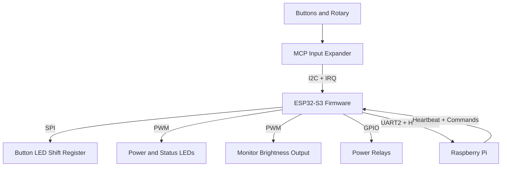

## 3. Hardware Architecture

### 3.1 Hardware Platform

- MCU: ESP32-S3.
- Board definition: `esp32-s3-devkitc-1-16mb`.
- Flash: 16 MB.
- Framework: ESP-IDF under PlatformIO.
- CPU clock configured to 240 MHz.
- Board definition advertises Wi-Fi and Bluetooth capability, but the firmware does not use either stack.

### 3.2 Attached Devices and Functions

- I2C device: one MCP23018-style 16-bit GPIO expander at address `0x20`.
- SPI device: one 16-bit LED driver or shift-register chain with a manual latch line.
- UART device: Raspberry Pi control link.
- Relays: seven GPIO-controlled outputs.
- LEDs:
  - active power LED,
  - standby power LED,
  - working status LED,
  - button status LED PWM output,
  - 16 SPI-driven button LEDs.
- Rotary encoder: represented in firmware as two MCP input bits and decoded in software.
- Display: no display protocol driver exists in firmware; the firmware only controls monitor brightness and a display-off brightness mode.
- Sensors: none present in code.
- Network peripherals: none initialized in firmware.

### 3.3 GPIO Allocation Table

| GPIO | Function | Direction | Notes |
|---|---|---|---|
| 1 | UART2 RX | Input | Raspberry Pi to ESP32 serial RX |
| 2 | UART2 TX | Output | ESP32 to Raspberry Pi serial TX |
| 3 | Active power LED PWM | Output | `PowerLed` active channel |
| 4 | Standby power LED PWM | Output | `PowerLed` standby channel |
| 5 | SPI LED latch | Output | Manual latch pulse after 16-bit transfer |
| 6 | SPI LED clock | Output | SPI2 SCLK |
| 7 | SPI LED data | Output | SPI2 MOSI |
| 9 | Output-stage power relay | Output | Power sequencing |
| 10 | Prototype DAC enable relay | Output | Exposed but not used in runtime policy |
| 11 | Raspberry Pi power relay | Output | Power sequencing |
| 12 | DAC power relay | Output | Power sequencing and toggle DAC action |
| 13 | Screen power relay | Output | Power sequencing |
| 15 | I2C SCL | Output/Open-drain | MCP bus clock |
| 16 | I2C SDA | Bidirectional/Open-drain | MCP bus data |
| 17 | I2C enable | Output | Gates external I2C hardware enable |
| 18 | MCP interrupt | Input | Negative-edge ISR source |
| 21 | Button status LED PWM | Output | `StatusLed` with default `SolidIdle` |
| 39 | General relay 2 | Output | Initialized but not used by action policy |
| 41 | ESP32 data-ready to Pi | Output | Asserted after UART transmit |
| 42 | Pi data-ready to ESP32 | Input | Rising-edge ISR source for UART RX |
| 43 | Monitor brightness PWM | Output | Backlight or brightness control |
| 47 | General relay 1 | Output | Initialized but not used by action policy |
| 48 | Activity status LED PWM | Output | `StatusLed` for work/idle/sleep patterns |

### 3.4 I2C Devices

| Device | Address | Role | Access Pattern |
|---|---:|---|---|
| MCP23018-style input expander | `0x20` | Reads 16 button lines and rotary bits | Interrupt-driven, read-on-change |

The code uses the MCP register model directly, enables pull-ups on both banks, and enables interrupt-on-change for all 16 inputs.

### 3.5 SPI Devices

| Device | Role | Data Width | Notes |
|---|---|---:|---|
| SPI LED driver / shift register | Drives button LEDs | 16 bits | Low byte sent first, then high byte |

### 3.6 UART Interfaces

| Interface | Port | Baud | Purpose |
|---|---|---:|---|
| Main control link | `UART_NUM_2` | 115200 | ESP32 <-> Raspberry Pi command protocol |

### 3.7 PWM Outputs

| Output | Implementation | Purpose |
|---|---|---|
| Active power LED | LEDC | ON state indication |
| Standby power LED | LEDC | OFF, sleep, and transition indication |
| Activity status LED | LEDC + timer/task | Work/active/sleep blips |
| Button status LED | LEDC + timer/task | Idle brightness and sleep/active blips |
| Monitor brightness | LEDC | Display backlight or monitor dimming |

### 3.8 Interrupt Sources

| Source | GPIO | Trigger | Consumer |
|---|---:|---|---|
| MCP interrupt | 18 | Negative edge | `McpInputHandler::gpioIsr()` |
| Pi data-ready | 42 | Positive edge | `UartTransport::gpioIsrHandler()` |

## 4. Software Architecture

### 4.1 Major Components

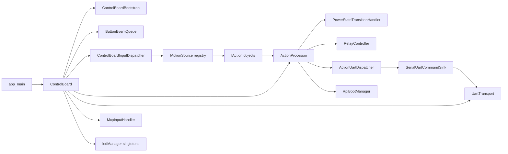

### 4.2 Component Responsibilities

| Component | Purpose | Inputs | Outputs | Dependencies |
|---|---|---|---|---|
| `ControlBoard` | Top-level runtime composition | `app_main()`, UART RX callbacks, MCP callbacks | System initialization, action execution | bootstrap helpers, UART transport, relays, input dispatcher, action processor |
| `ControlBoardBootstrap` | Boot-time wiring helpers | board config constants | Relay setup, serial config, MCP config, indicator startup | relays, `McpInputHandler`, `UartTransport`, indicators |
| `ButtonEventQueue` | Queue and dispatch raw input events | button/rotary callbacks | Calls into `ControlBoardInputDispatcher` | FreeRTOS queue/task |
| `ControlBoardInputDispatcher` | UI policy and event-to-action conversion | `ButtonEvent` objects | `IAction` objects plus LED changes | action map, indicator sink |
| `ControlBoardActionRegistry` | Populates the action map | static registration table | `ActionMap` entries | `Dynamic*Action` classes |
| `ActionProcessor` | Executes actions and enforces power gating | `IAction` objects, inbound UART messages | power transitions, relays, UART sends, brightness changes | transport, relay controller, power handler, indicators |
| `ActionUartDispatcher` | Converts actions into wire-format UART messages | executed actions | `UartMessage` sends | command catalog, UART sink |
| `UartTransport` | UART framing, handshake, RX task, heartbeat monitor | bytes from UART, GPIO42 IRQ | parsed `UartMessage` objects and heartbeat timeout callback | UART driver, GPIO ISR, `UartReceiver` |
| `McpInputHandler` | I2C expander access and rotary decode | GPIO18 IRQ and I2C reads | button and rotary callbacks | I2C driver, GPIO ISR |
| `PowerStateTransitionHandler` | Boot, sleep, and deep-sleep sequencing | power actions and current state | relay operations, LED state changes, waits | relay controller, boot manager, serial |
| `RpiBootManager` | Synchronizes heartbeat-based waits | heartbeat received/timeout events | boot/shutdown wait results | FreeRTOS event group |
| `RelayController` | Encapsulates relay operations | action/power requests | GPIO changes | `StandardRelay` |
| `MonitorBrightnessController` | Brightness persistence and display-off mode | brightness commands, power state changes | PWM duty changes, NVS writes | LEDC, NVS |
| `PowerLed` | User-visible power-state indicator | power state changes | active/standby LED patterns | LEDC, esp_timer |
| `StatusLed` | User-visible activity and button-status indication | status messages | LEDC duty and blink patterns | FreeRTOS queue, timer, tasks |
| `SpiBootIndicator` | Boot-wait/failure indicator using 16 button LEDs | boot outcome | SPI LED blink patterns | SPI LED driver |

### 4.3 Architectural Style

Three design choices dominate the codebase:

- Event capture is separated from policy. GPIO ISRs only wake tasks. The tasks then read hardware state and enqueue higher-level events.
- Button behavior is data-driven. `ControlBoardActionRegistry` uses a registration table so mapping changes mostly affect one file.
- Side effects are command-oriented. Buttons do not directly manipulate relays or UART; they create `IAction` objects that are executed later with an `ActionContext`.

### 4.4 Why It Was Designed This Way

The design reduces the amount of logic in interrupt context and avoids coupling user input semantics to transport or relay code. The Raspberry Pi is treated as an external application processor, so the ESP32 owns front-panel determinism, local safety, and power rails while delegating media behavior and UI context to the Pi.

The power model also explains several implementation choices:

- heartbeat is used as a boot-complete and shutdown-complete signal,
- toggle commands are normalized on the wire to avoid duplicating Raspberry Pi handlers,
- the monitor brightness controller persists state locally because brightness must survive Pi resets.

### 4.5 Incomplete Implementations

- `ActionProcessor::handleInboundUartMessage()` is explicitly a scaffold and currently only logs inbound non-heartbeat messages.
- No network stack, web API, Wi-Fi client, Ethernet, or MQTT code is present.
- `SystemAction` only performs meaningful work for `CMD_SYS_RPI_SHUTDOWN`; `CMD_EXIT_ITEM` is a log-only no-op.
- The board definition supports Wi-Fi and Bluetooth, but the firmware does not initialize them.

### 4.6 Dead Code, Compatibility Code, and Technical Debt

Observed dormant or compatibility-oriented paths:

- `actions::Action` in `actionsResponse.hpp` is a no-op test helper and is not produced by the live firmware pipeline.
- `SimpleCommandAction.hpp` is a backward-compatibility include shim; the implementation lives in `actionTemplates.hpp`.
- Template action sources `ToggleAction<>`, `TimedAction<>`, and `RotaryAction<>` remain defined, but the live registry uses `DynamicToggleAction`, `DynamicTimedAction`, and `DynamicRotaryAction`.
- `StatusLed::startBreatheEffect()` and `StatusLed::getBlinkInterval()` are defined but not referenced by the runtime path.
- `UartTransport::sendData(const char *p_message)` is declared in the header but has no implementation.
- `CMD_ROTARY_LEFT` and `CMD_ROTARY_RIGHT` remain in the protocol catalog, but the active runtime emits `CMD_ROTARY_ACTION` with parameter `0` or `1`.
- `ControlBoardPowerState::SHUTTING_DOWN` and `GOING_INTO_DEEP_SLEEP` are handled in indicators but are not emitted by the current transition policy.

Technical debt worth calling out:

- Power-management configuration in `app_main()` is annotated by the source as ineffective.
- A fixed 5-second startup delay exists solely to wait for power to stabilize.
- Hardware pin aliases are split between `board::...` namespaces and legacy `PIN_*` macros.
- Command routing rules are distributed across multiple places: the registration table, `ActionCommandRoutingPolicy`, and `ActionUartDispatcher` toggle normalization.

## 5. Application Startup Sequence

### 5.1 Step-by-Step Startup

1. Power is applied to the ESP32-S3 board.
2. ESP-IDF initializes the runtime and enters `app_main()`.
3. `app_main()` configures `esp_pm_config_t` with max 240 MHz, min 40 MHz, and light sleep enabled.
4. `app_main()` waits 5000 ms before any board work begins.
5. A `ControlBoard` instance is constructed.
6. `ControlBoard::init()` initializes NVS.
7. Startup indicators are prepared by setting the power LED state to `TURNING_ON`.
8. `ControlBoard::initTransport()` acquires the singleton UART transport and relay interface and configures serial RX and heartbeat callbacks.
9. `ControlBoard::initComponents()` allocates the action processor and input dispatcher.
10. Relay GPIOs are initialized and forced off.
11. The MCP input expander is initialized over I2C, its interrupt pin is configured, and `mcp_int_task` is created.
12. `ButtonEventQueue` creates its queue and `action_task`.
13. MCP callbacks are installed so button/rotary changes feed the queue.
14. UART is initialized, the Pi data-ready input ISR is attached, and `uart_rx_task` plus `heartbeat_task` are started.
15. The action map is populated.
16. A final fixed delay of 5000 ms is applied by `finalizeStartupIndicators()`.
17. `ActionProcessor::triggerInitialPowerOn()` synthesizes a power command.
18. Power-on sequencing enables screen, DAC, output stage, and Pi relays in order.
19. `SpiBootIndicator` flashes all button LEDs while the firmware waits for heartbeat.
20. If heartbeat arrives, the system enters `ON`; otherwise it falls back to `SLEEP` and initialization is reported as failed.
21. If initialization fails, `app_main()` deinitializes portions of the board, waits 1 second, and retries indefinitely.
22. If initialization succeeds, `app_main()` remains alive and all runtime work is performed by background tasks.

### 5.2 Startup Sequence Diagram

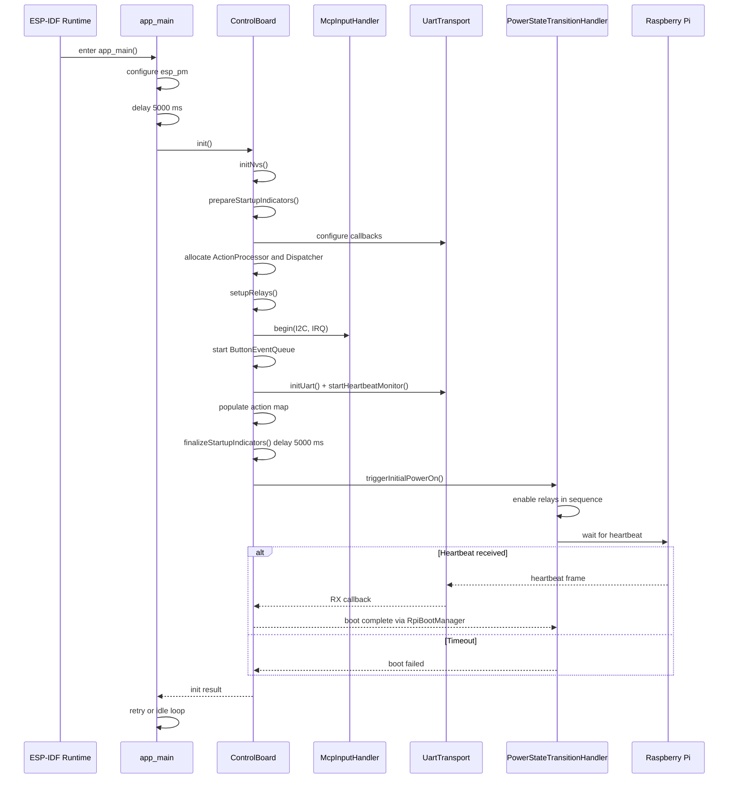

### 5.3 Network Initialization

There is no network initialization path. No Wi-Fi, Ethernet, TCP/IP, HTTP, or MQTT code is present in the firmware.

## 6. Task Architecture

### 6.1 Project-Created Tasks

| Task | Priority | Stack | Purpose | Execution Model | Dependencies |
|---|---:|---:|---|---|---|
| `action_task` | 5 | 4096 | Dequeue `ButtonEvent` objects and call the dispatcher | Blocks on queue receive | `ButtonEventQueue`, dispatcher |
| `uart_rx_task` | 10 | 4096 | Handle UART receive after GPIO42 data-ready interrupt | Woken by task notification | GPIO42 ISR, UART driver |
| `heartbeat_task` | 5 | 4096 | Poll last-RX timestamp and detect heartbeat timeout | 100 ms periodic loop | `esp_timer_get_time()`, callback |
| `mcp_int_task` | 10 | 4096 | Read MCP state and decode button/rotary changes | Woken by task notification | GPIO18 ISR, I2C driver |
| `LED_Task` (activity LED) | 5 | 4096 | Drive the activity-status LED state machine | Queue-driven | FreeRTOS queue and timer |
| `LED_Task` (button status LED) | 5 | 4096 | Drive the button-status LED state machine | Queue-driven | FreeRTOS queue and timer |
| `spi_boot_ind` | `tskIDLE_PRIORITY + 1` | 4096 | Flash all SPI LEDs during boot wait or failure | Delay loop until stop flag | SPI LED driver |
| `BreatheTask` | 5 | 2048 | Unused runtime breathe effect for `StatusLed` | Delay loop | Not referenced by live runtime |

Additional execution contexts used by the firmware:

- `app_main()` task from ESP-IDF.
- `esp_timer` callback context for `PowerLed::handleTimer()`.
- FreeRTOS software timer service task for `StatusLed` blink timers.

### 6.2 Task Interaction Diagram

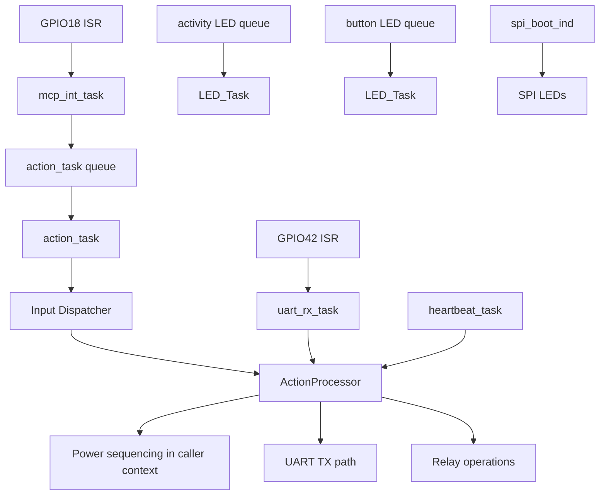

### 6.3 Design Implications

- Input processing is serialized through `action_task`, which simplifies button logic and avoids race-heavy action execution.
- Both MCP and UART receive work run at priority 10, above the action and status tasks.
- Heartbeat monitoring is coarse-grained at 100 ms, which is acceptable for 30-second liveness windows.
- Several blocking delays occur in the caller context of power transitions and UART TX signaling; those are acceptable for the current architecture because those paths are not ISR-bound, but they do reduce responsiveness during long sequencing steps.

## 7. Interrupt Architecture

### 7.1 Interrupt Inventory

| Source | Trigger | ISR | Actions Performed | Synchronization |
|---|---|---|---|---|
| MCP interrupt on GPIO18 | Negative edge | `McpInputHandler::gpioIsr()` | Notify `mcp_int_task` only | Task notification |
| Pi data-ready on GPIO42 | Positive edge | `UartTransport::gpioIsrHandler()` | Notify `uart_rx_task` only | Task notification |

The project follows a sound ISR policy: the ISR body only performs `vTaskNotifyGiveFromISR()` and optional `portYIELD_FROM_ISR()`.

### 7.2 Synchronization Primitives

Queues:

- `ButtonEventQueue` uses a depth-16 FreeRTOS queue to move input events from callback context to `action_task`.
- Each `StatusLed` instance owns a depth-1 queue and uses `xQueueOverwrite()` so the latest status always wins.

Task notifications:

- `mcp_int_task` waits on a notification from GPIO18.
- `uart_rx_task` waits on a notification from GPIO42.
- `StatusLed::sendStatus()` also uses task notification to wake the LED task quickly after queue overwrite.

Event groups:

- `RpiBootManager` owns one event group.
- One bit represents heartbeat received.
- One bit represents heartbeat timeout, which the code interprets as shutdown confirmation.

Semaphores:

- No explicit FreeRTOS semaphores are used by the application code.

Atomics:

- `SystemState::powerState` is atomic.
- `UartTransport` uses atomics for task-stop flags, initialization state, and last-RX timestamp.
- `StatusLed` and `SpiBootIndicator` use atomics for state and stop flags.

### 7.3 Interrupt-Related Risks

- The UART RX wakeup relies on a separate data-ready GPIO rather than the UART driver's own event queue, so any mismatch between GPIO handshake timing and UART framing can starve or burst the RX task.
- GPIO ISR service installation is attempted in both UART and MCP layers; the code tolerates `ESP_ERR_INVALID_STATE`, which is practical but indicates shared-global initialization concerns.

## 8. State Machines

### 8.1 Power State Machine

The primary state machine is `ControlBoardPowerState` plus `evaluatePowerTransition()`.

Actual decision states in the current runtime:

- `OFF`
- `TURNING_ON`
- `ON`
- `GOING_TO_SLEEP`
- `SLEEP`
- `DEEPSLEEP`

Declared but not actively emitted by the transition policy:

- `SHUTTING_DOWN`
- `GOING_INTO_DEEP_SLEEP`

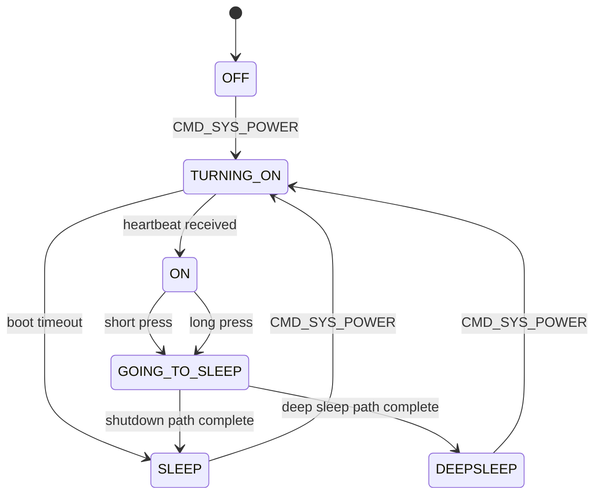

Entry and exit behavior:

- Enter `TURNING_ON`: set LED indicators, enable relays in order, start boot-wait SPI blink.
- Enter `ON`: stop boot indicator, restore brightness, set activity to active.
- Enter `SLEEP`: screen and Pi off, LEDs cleared, activity becomes sleeping.
- Enter `DEEPSLEEP`: screen, Pi, DAC, and output-stage rails off, activity becomes sleeping.

### 8.2 Input Action-State Machines

Button behavior is implemented by `IActionSource` variants rather than a single explicit enum.

Timed action state machine, used by the power button:

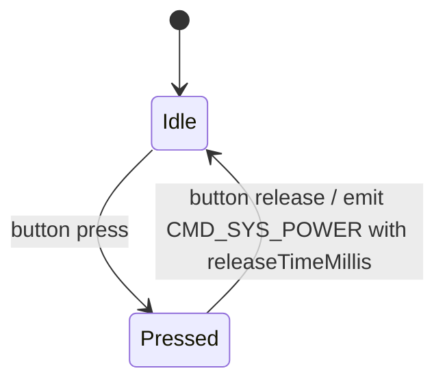

Toggle action state machine, used by cover, repeat, random, DAC, and meter toggles:

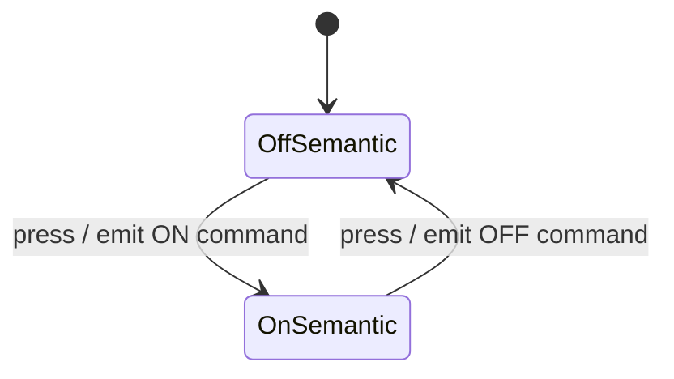

Rotary state machine:

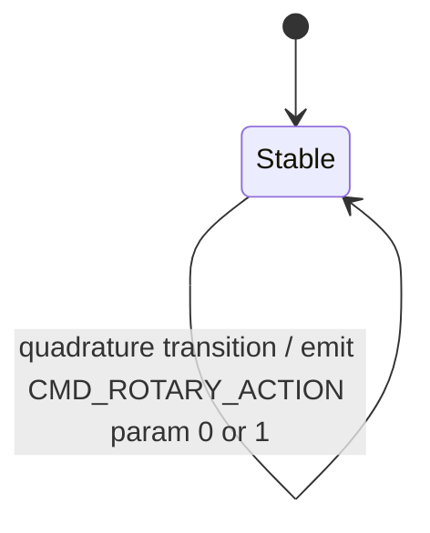

### 8.3 SPI Boot Indicator State Machine

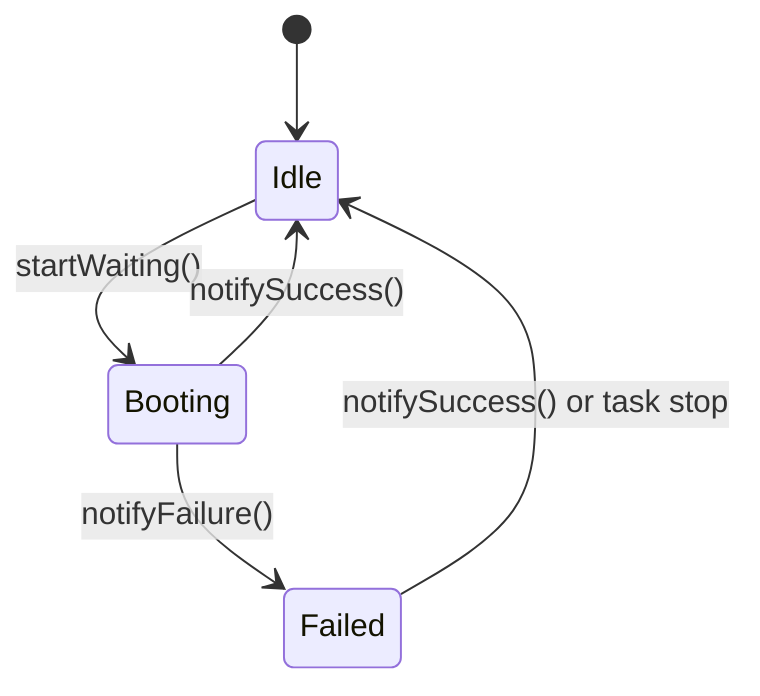

Behavior:

- `Booting`: flash all button LEDs at 500 ms half-period.
- `Failed`: flash all button LEDs at 150 ms half-period.

### 8.4 Brightness Control State Logic

The monitor brightness controller keeps an independent mode flag, `m_displayOffActive`, which temporarily forces brightness to zero and ignores further brightness changes until toggled back.

## 9. Communication Interfaces

### 9.1 UART

Configuration:

- port: `UART_NUM_2`
- baud rate: `115200`
- frame format: 8 data bits, no parity, 1 stop bit
- flow control: disabled
- receive buffer configured in firmware: 256 bytes requested from `board::serial::k_bufferSize`, doubled to 512 bytes when installing the driver

Packet structure:

| Byte(s) | Field | Meaning |
|---|---|---|
| 0 | Start byte | `0xAA` |
| 1 | Protocol version | `0x01` |
| 2 | Source app | `APP_ESP32` or `APP_PI` |
| 3 | Message type | command, status, ack, nack |
| 4 | Sequence | one-byte sequence number |
| 5-6 | Command ID | little-endian `CommandId` |
| 7-16 | Parameters | five little-endian 16-bit fields |
| 17 | Checksum | sum of bytes 1..16 modulo 256 |

Supported outbound command patterns:

- simple one-shot commands such as track controls,
- normalized toggle commands such as cover, repeat, meter, and random,
- `CMD_ROTARY_ACTION` with parameter 0 for left and 1 for right,
- `CMD_SYS_RPI_SHUTDOWN` for power sequencing.

Responses and inbound commands:

- heartbeat is fully handled,
- legacy heartbeat `0x9999` is still accepted,
- all other inbound messages are currently only logged.

UART protocol diagram:

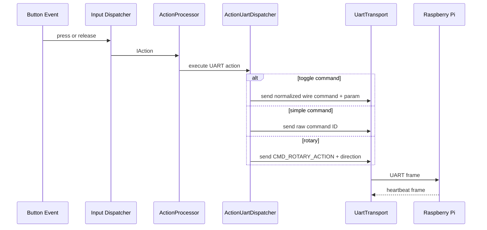

### 9.2 I2C

- one bus on GPIO15/16,
- one target at address `0x20`,
- 50 kHz clock rate,
- used only for MCP register access,
- interrupt-driven read-on-change, not periodic polling.

### 9.3 SPI

- SPI2 host,
- 1 MHz clock,
- MOSI-only data path,
- no chip-select line; latch is controlled manually on GPIO5,
- used only for button LED state output.

Data flow:

1. `ControlBoardInputDispatcher` decides LED policy.
2. `ControlBoard::setButtonLed()` calls `SpiLedDriver::setLed()`.
3. `SpiLedDriver` updates a 16-bit software bitmask.
4. The driver transmits 16 bits over SPI and pulses the latch GPIO.

### 9.4 Network

No network communication interface exists in the current firmware. There is no Wi-Fi station setup, no AP mode, no sockets, no HTTP endpoints, and no MQTT client.

## 10. Data Structures

### 10.1 Key Runtime Types

| Type | Purpose | Key Members |
|---|---|---|
| `UartMessage` | Wire-format message DTO | header fields, `commandId`, `params[5]`, `checksum` |
| `ButtonEvent` | Queue payload from input callbacks | `type`, `buttonId`, `rotaryDelta` |
| `SystemState` | Minimal cross-component runtime state | atomic `powerState` |
| `ButtonConfig` | Maps a button slot to behavior | `action`, `ledPolicy` |
| `ActionContext` | Dependency bundle for `IAction::execute()` | UART dispatcher, power handler, relays, serial, state, LEDs, brightness |
| `IAction` | Executable command object | `command`, `parameters`, `releaseTimeMillis`, virtual `execute()` |
| `IActionSource` | Event-to-action factory | virtual `produce(bool)` |

### 10.2 Relationships

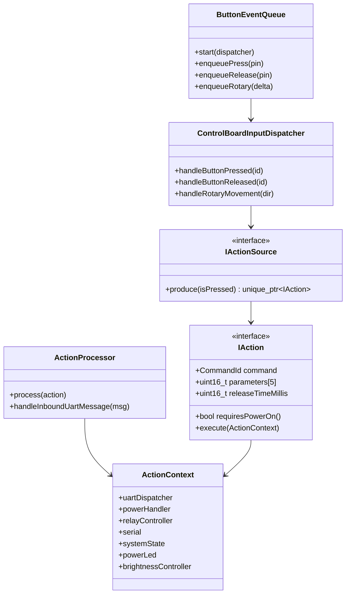

### 10.3 Buffers and Queues

| Item | Size | Purpose |
|---|---:|---|
| `ButtonEventQueue` queue | 16 events | Absorb bursty button and rotary activity |
| `StatusLed` queue | 1 status value | Keep only latest UI status |
| UART temporary buffer | 64 bytes | Pull chunks from driver |
| `UartReceiver` buffer | 256 bytes | Assemble frames and resynchronize on stream errors |
| ESP-IDF UART RX ring | 512 bytes | Installed as `bufferSize * 2` |

## 11. User Interface

### 11.1 Inputs

User-facing controls exposed by code:

| Button ID | Function | Behavior Type | Effect |
|---:|---|---|---|
| 0 | Power | timed | power on, sleep, or deep sleep depending on hold duration and current state |
| 1 | Previous track | simple | UART command |
| 2 | Next track | simple | UART command |
| 3 | Skip forward | simple | UART command |
| 4 | Skip back | simple | UART command |
| 5 | Play/pause | simple | UART command |
| 6 | Toggle display | simple local command | toggles monitor brightness blanking mode |
| 7 | Cover | toggle | normalized UART toggle command |
| 8 | Repeat | toggle | normalized UART toggle command |
| 9 | Random | toggle | normalized UART toggle command |
| 10 | Toggle DAC | toggle | local relay control |
| 11 | Next panel | simple | UART command |
| 12 | Toggle meter | toggle | normalized UART toggle command |
| 13 | Rotary left event | rotary | UART rotary command param `0` |
| 14 | Rotary right event | rotary | UART rotary command param `1` |
| 15 | Cycle brightness | simple local command | cycles persisted brightness level |

### 11.2 LED Semantics

Power LED meanings:

- `OFF`: standby LED medium brightness.
- `TURNING_ON`: standby LED flashes.
- `ON`: active LED steady at configured duty.
- `GOING_TO_SLEEP`: standby LED flashes.
- `SLEEP`: standby LED breathes.
- `DEEPSLEEP`: standby LED blips periodically.

Activity LED meanings:

- `doingWork`: full brightness steady on.
- `Active`: short periodic blip.
- `Idle`: off.
- `SolidIdle`: steady idle duty.
- `sleeping`: brief blip every 10 seconds.

Button LED meanings:

- momentary buttons light while pressed,
- toggle buttons flip retained LED state on each press,
- power button and rotary do not use button LED feedback,
- boot wait and boot failure temporarily override all button LEDs through `SpiBootIndicator`.

### 11.3 User Interaction Flow

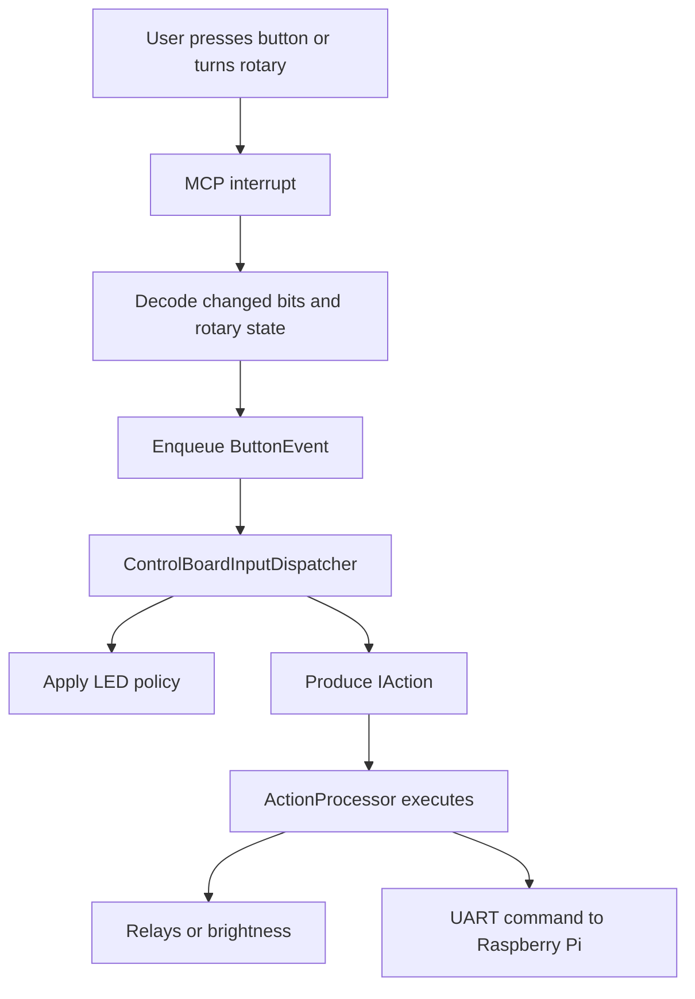

### 11.4 Sleep-Mode Input Policy

When the background status is `sleeping`, all inputs except the power button are suppressed. This prevents accidental wake-path side effects from transport or panel buttons while the system is in sleep or deep sleep.

## 12. Error Handling

### 12.1 Error Condition Table

| Error | Cause | Detection | Recovery |
|---|---|---|---|
| NVS init failure | partition issues or version mismatch | `nvs_flash_init()` result | erase-and-retry for known page/version errors; otherwise log warning and continue without persistence |
| Relay setup or UART init failure | GPIO or driver errors | return value from bootstrap helpers | fail `ControlBoard::init()` and retry whole board init from `app_main()` |
| MCP init failure | I2C or GPIO interrupt setup failure | `begin()` returns error | fail init, flash failure indicator, retry from `app_main()` |
| Button queue full | bursty input or blocked consumer | `xQueueSend()` failure | drop event and log every 16th drop |
| UART checksum or framing error | corrupted or partial byte stream | `deserializeMessage()` false | byte-by-byte resynchronization in `UartReceiver` |
| No Pi heartbeat during boot | Pi absent or link down | `waitForRpiToBoot()` timeout | set boot-failure blink pattern, move to `SLEEP`, report init failure |
| No Pi heartbeat while ON | Pi crash, cable issue, or heartbeat loss | `heartbeat_task` timeout callback | set event bit and force `SystemState` to `SLEEP` unless debug simulate mode is enabled |
| SPI LED driver not initialized | premature caller use | `m_started` guard | log warning and ignore request |
| Status LED task creation failure | heap or RTOS failure | `xTaskCreate()` return | log error; corresponding indicator may not function |

### 12.2 Recovery Strategy Summary

- Initialization errors are mostly handled by failing `ControlBoard::init()` and letting `app_main()` retry forever.
- Runtime UART corruption is handled by frame resynchronization rather than transport reset.
- Heartbeat loss is treated as a semantic system-state event, not just a communication error.
- Several low-level errors only log and continue, especially LED and NVS failures.

### 12.3 Potential Bugs and Behavioral Risks

1. `UartTransport::sendData()` checks `PIN_ESP32_DATA_READY` before transmit even though the log says it is testing whether the Raspberry Pi is ready. That condition appears to inspect the ESP32 output line rather than the Pi input-ready line, so the readiness guard is likely wrong.
2. `ActionProcessor::triggerInitialPowerOn()` returns failure when boot heartbeat times out, and `app_main()` responds by retrying initialization indefinitely. On a bench without a Pi, this can create repeated power-cycle behavior rather than a stable degraded mode.
3. `StatusLed` objects are global statics and call `init()` from their constructors. That means FreeRTOS objects and LEDC configuration are created during static initialization, which is an unusual lifetime model and increases startup-order risk.
4. `test/test_simple_command_action/test_main.cpp` still targets an old `ActionResponse`/`execute()` API, which suggests the embedded test suite contains drifted or stale tests.
5. `PowerStateTransitionHandler::runRpiShutdownSequence()` ignores the boolean result of `waitForRpiShutdown()`. The shutdown path proceeds even if no heartbeat-timeout confirmation ever arrives.

## 13. Logging and Diagnostics

The firmware uses `ESP_LOGI`, `ESP_LOGW`, and `ESP_LOGE` extensively. Logging is not centralized; each subsystem owns its own log tag.

Diagnostic capabilities visible in code:

- startup logs for each major initialization phase,
- relay and UART operation logs,
- heartbeat received and timeout logs,
- MCP interrupt and rotary decode logs,
- NVS restore/save logs for brightness,
- compatibility warning when legacy heartbeat `0x9999` is received.

Available test assets:

- host-side CMake test target for protocol, routing, and dispatcher logic,
- Unity-based embedded tests for UART protocol, SPI LED driver, SPI boot indicator, and power LED.

Diagnostic limitations:

- there is no structured fault manager,
- there are no persistent error counters,
- inbound UART ACK/NACK handling is not implemented,
- no watchdog-specific recovery behavior is present in project code,
- stale tests reduce confidence that all declared tests still represent the current runtime model.

Troubleshooting guidance for maintainers:

- verify GPIO18 and GPIO42 interrupts first when input or serial paths appear dead,
- inspect heartbeat timing before assuming a power-state bug,
- confirm `board::debug::k_simulateRpiBoot` build behavior before bench testing without a Pi,
- treat boot-failure SPI flashing and power LED state separately because they come from different subsystems.

## 14. Memory Usage

### 14.1 Allocation Model

Static allocation:

- global singleton-like indicator objects in `ledManager.cpp`,
- fixed-size buffers in `UartReceiver` and `UartTransport`,
- compile-time action registration table.

Dynamic allocation:

- `std::make_unique` for `ActionProcessor`, `ControlBoardInputDispatcher`, `SerialUartCommandSink`, `ActionUartDispatcher`, `RpiBootManager`, `RelayController`, and `PowerStateTransitionHandler`,
- `std::make_unique` for each registered `IActionSource`,
- one heap allocation per produced `IAction` via `createAction()`,
- FreeRTOS queues, tasks, software timers, and event groups,
- UART driver allocation inside ESP-IDF.

### 14.2 Risks

- Frequent short-lived action-object allocation can fragment heap over long runtimes if button usage is heavy.
- Multiple worker tasks with 4096-byte stacks consume nontrivial RAM on a device without PSRAM.
- The project does not expose any stack high-water-mark or heap telemetry.
- Static-initialization creation of `StatusLed` RTOS objects makes memory lifetime harder to reason about.
- Brightness persistence depends on NVS being available; if NVS is degraded the system silently falls back to nonpersistent behavior.

### 14.3 Optimization Opportunities

- Replace heap-allocated `IAction` objects with a fixed-capacity object pool or value-type command struct.
- Collapse the two `StatusLed` task implementations into a shared worker or more timer-driven design.
- Consider explicit stack watermark logging for the MCP, UART RX, and action tasks.

## 15. Performance Analysis

### 15.1 Timing-Critical Paths

- MCP interrupt handling, because it must preserve rapid button and rotary transitions.
- UART RX wake and frame parsing, because the data-ready handshake depends on timely consumption.
- Power sequencing, because it includes long waits and determines user-perceived boot behavior.

### 15.2 CPU and Latency Concerns

- The UART heartbeat task polls every 100 ms, which is cheap.
- Power transitions block in the caller context with `vTaskDelay()` calls ranging from hundreds of milliseconds to tens of seconds.
- `SpiBootIndicator` continuously toggles all LEDs with its own worker task, which is simple but not the cheapest way to generate patterns.
- `PowerLed` uses a 50 ms periodic `esp_timer` callback to maintain flash, breathe, and blip behavior.

### 15.3 Bottlenecks

- `action_task` is a single consumer for all input events.
- I2C reads are performed during every MCP interrupt handling pass and include multiple register reads.
- `UartReceiver` uses repeated `memmove()` while resynchronizing corrupted streams, which is acceptable at current protocol volume but not ideal for higher throughput.

### 15.4 Recommendations

1. Fix the UART handshake readiness check before attempting higher-rate command traffic.
2. Replace the hard-coded startup delays with explicit power-good or rail-ready signals if hardware supports them.
3. Consider a nonblocking or state-machine-based power sequencer if future work adds more concurrent runtime behavior.
4. If button traffic increases, move from heap-allocated actions to a fixed message structure.

## 16. Security Considerations

The firmware does not implement authentication, encryption, or secure session management. Security concerns are therefore limited to local robustness and input validation.

Observed protections:

- UART frame checksum validation,
- start-byte framing and resynchronization,
- bounds checks on LED indices and button IDs,
- fixed-size queues and buffers,
- command gating so most non-power actions are ignored when the system is not ON.

Observed gaps:

- any device on the UART link that can emit valid frames can control the Raspberry Pi-facing command path,
- no authorization layer exists for system or relay-affecting commands,
- no replay protection or sequence validation is enforced,
- no tamper detection exists on I2C or GPIO inputs.

## 17. Build System

### 17.1 PlatformIO Configuration

- Platform: `espressif32 @ ~6.5.0`
- Framework: `espidf`
- Default environment: `esp32-s3-devkitc-1-16mb`
- Release environment: `esp32-s3-devkitc-1-16mb-release`
- Monitor speed: `115200`
- CPU frequency: `240000000L`
- Partition table: `partitions.csv`
- Library dependency finder mode: `deep+`
- Shared build flag: `-Ilib`
- Release-only extra flag: `-DNDEBUG`

### 17.2 CMake Structure

- Top-level `CMakeLists.txt` registers an ESP-IDF project.
- `src/CMakeLists.txt` glob-registers all `.c` and `.cpp` files in `src/` and major `lib/` subtrees.
- `host_tests/CMakeLists.txt` builds a separate host executable for logic tests on a desktop compiler.

### 17.3 Build Behavior

- Debug builds enable `board::debug::k_simulateRpiBoot` unless overridden, which changes boot behavior materially.
- Release builds define `NDEBUG`, which disables simulated-RPi boot by default.

## 18. Dependency Analysis

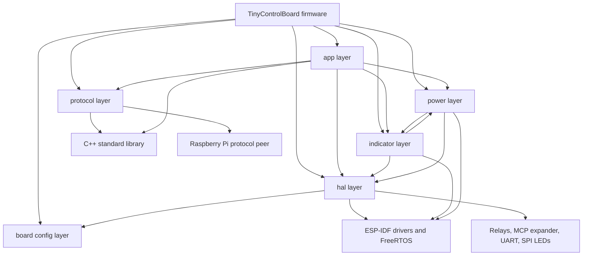

External dependencies actually used by code:

- ESP-IDF FreeRTOS primitives,
- ESP-IDF UART, GPIO, I2C, SPI, LEDC, NVS, and esp_timer APIs,
- C++ standard library features such as `std::unique_ptr`, `std::function`, `std::array`, and `std::atomic`.

## 19. Maintenance Guide

### 19.1 Adding a New Front-Panel Feature

For a new button-driven command:

1. Add the new `CommandId` in `uartProtocol.hpp` if it needs a protocol ID.
2. If it is a simple remote command, add one row to `ControlBoardActionRegistry.cpp`.
3. If it is a local-only action, also update `ActionCommandRoutingPolicy.hpp` and potentially `ActionFactory.cpp` if a new action class is needed.
4. If it is a toggle that should normalize to one wire command plus a boolean parameter, update `ActionUartDispatcher.cpp`.
5. Update tests for dispatcher, protocol, and any new runtime policy.

### 19.2 Adding a New Peripheral

1. Add pins and constants to `boardConfig.hpp`.
2. Encapsulate the peripheral in `lib/hal/` or `lib/indicators/` depending on whether it is generic hardware or UI-specific.
3. Expose it through `ControlBoard` only if it participates in application behavior.
4. Avoid direct ISR-to-policy coupling; follow the existing callback plus queue pattern.

### 19.3 Modifying the UART Protocol

1. Update `CommandId` or frame semantics in `uartProtocol.hpp` and `uartProtocol.cpp`.
2. Update command naming in `commandCatalog.cpp`.
3. Update `ActionUartDispatcher.cpp` if routing or normalization changes.
4. Update both host tests and Unity protocol tests.
5. Keep Raspberry Pi-side handlers synchronized, especially for normalized toggle commands and heartbeat IDs.

### 19.4 Areas Requiring Caution

1. Do not change power-state timing casually; it affects relay sequencing, user-visible LEDs, and Raspberry Pi boot assumptions.
2. Be careful with static object construction in `ledManager.cpp`; indicator lifetime is unusual and tightly coupled to runtime startup.
3. Avoid broadening ISR responsibilities. The current design depends on tasks doing the real work.
4. Treat debug-mode simulated Pi boot as a behavioral fork, not just a logging option.
5. Verify embedded tests before trusting them; at least one test target is stale relative to the runtime action API.

## 20. Appendix

### 20.1 File Structure

#### `src`

| File | Purpose |
|---|---|
| `src/main.cpp` | Firmware entry point, PM configuration, startup delay, init retry loop. |
| `src/main.h` | Minimal include wrapper that pulls `ControlBoard` into `main.cpp`. |

#### `lib/app`

| File | Purpose |
|---|---|
| `lib/app/ActionCommandRoute.hpp` | Enum describing intrinsic command routing categories. |
| `lib/app/ActionCommandRoutingPolicy.hpp` | Compile-time policy that maps command IDs to routing categories. |
| `lib/app/ActionContext.hpp` | Dependency bundle passed into `IAction::execute()`. |
| `lib/app/ActionFactory.cpp` | Creates concrete `IAction` implementations from command IDs. |
| `lib/app/ActionFactory.hpp` | Factory declaration for command-to-action creation. |
| `lib/app/actionProcessor.cpp` | Executes actions, enforces power gating, handles heartbeat, scaffolds inbound UART handling. |
| `lib/app/actionProcessor.hpp` | `ActionProcessor` public interface. |
| `lib/app/ActionUartDispatcher.cpp` | Normalizes and sends UART-facing actions. |
| `lib/app/ActionUartDispatcher.hpp` | `ActionUartDispatcher` and UART sink interface declarations. |
| `lib/app/ButtonEvent.hpp` | Queue payload type for press, release, and rotary events. |
| `lib/app/ButtonEventQueue.cpp` | FreeRTOS queue/task wrapper for serialized input dispatch. |
| `lib/app/ButtonEventQueue.hpp` | `ButtonEventQueue` declaration and queue/task constants. |
| `lib/app/ControlBoard.cpp` | Top-level orchestrator implementation and UART callback owner. |
| `lib/app/ControlBoard.hpp` | `ControlBoard` declaration and owned subsystem references. |
| `lib/app/ControlBoardActionRegistry.cpp` | Populates the button-to-action map from a registration table. |
| `lib/app/ControlBoardActionRegistry.hpp` | Registry declaration. |
| `lib/app/ControlBoardBootstrap.cpp` | Boot helper functions for relays, serial, MCP, and indicators. |
| `lib/app/ControlBoardBootstrap.hpp` | Bootstrap helper declarations and callback typedefs. |
| `lib/app/ControlBoardButtonIds.hpp` | Namespace alias from board button IDs into app code. |
| `lib/app/ControlBoardInputDispatcher.cpp` | Applies sleep suppression, LED policy, and action production for inputs. |
| `lib/app/ControlBoardInputDispatcher.hpp` | Dispatcher interfaces, LED policy enum, and action-map types. |
| `lib/app/SerialHeartbeatRouter.hpp` | Heartbeat compatibility constants and helper predicate. |
| `lib/app/SerialUartCommandSink.cpp` | Thin adapter from command sink interface to `UartTransport`. |
| `lib/app/SerialUartCommandSink.hpp` | `SerialUartCommandSink` declaration. |
| `lib/app/SystemState.hpp` | Atomic runtime power-state container. |

#### `lib/app/commands`

| File | Purpose |
|---|---|
| `lib/app/commands/BrightnessAction.cpp` | Executes local display-off and brightness-cycle commands. |
| `lib/app/commands/BrightnessAction.hpp` | Brightness action declaration. |
| `lib/app/commands/PowerTransitionAction.cpp` | Executes power-state transitions through the power handler. |
| `lib/app/commands/PowerTransitionAction.hpp` | Power transition action declaration. |
| `lib/app/commands/RelayAction.cpp` | Executes local DAC relay toggles. |
| `lib/app/commands/RelayAction.hpp` | Relay action declaration. |
| `lib/app/commands/SystemAction.cpp` | Executes local system commands such as Pi shutdown. |
| `lib/app/commands/SystemAction.hpp` | System action declaration. |
| `lib/app/commands/UartDispatchAction.cpp` | Executes remote-command dispatch via `ActionUartDispatcher`. |
| `lib/app/commands/UartDispatchAction.hpp` | UART dispatch action declaration. |

#### `lib/board`

| File | Purpose |
|---|---|
| `lib/board/boardButtonIds.hpp` | Canonical button and rotary ID assignments. |
| `lib/board/boardConfig.hpp` | Timing, serial, I2C, relay, indicator, and debug configuration constants. |
| `lib/board/boardIdentity.hpp` | Board identity strings such as model and firmware version. |

#### `lib/hal/buttons`

| File | Purpose |
|---|---|
| `lib/hal/buttons/mcpInputHandler.cpp` | MCP input expander driver, interrupt-task loop, and rotary decode. |
| `lib/hal/buttons/mcpInputHandler.hpp` | MCP register constants, callbacks, and class declaration. |
| `lib/hal/buttons/project_cfg.hpp` | Optional MCP debug-scan compile-time flag holder. |

#### `lib/hal/leds`

| File | Purpose |
|---|---|
| `lib/hal/leds/pwmLed.cpp` | Small LEDC wrapper implementation. |
| `lib/hal/leds/pwmLed.hpp` | `LedPwm` abstraction declaration. |
| `lib/hal/leds/spiLedDriver.cpp` | SPI-backed 16-bit LED driver implementation. |
| `lib/hal/leds/spiLedDriver.hpp` | SPI LED driver declaration and LED count constant. |

#### `lib/hal/relay`

| File | Purpose |
|---|---|
| `lib/hal/relay/relay.cpp` | GPIO-based relay initialization and state setting. |
| `lib/hal/relay/relay.hpp` | Relay pin aliases and `StandardRelay` singleton interface. |

#### `lib/hal/storage`

| File | Purpose |
|---|---|
| `lib/hal/storage/nvsStorage.cpp` | Generic NVS read/write wrapper implementation. |
| `lib/hal/storage/nvsStorage.hpp` | NVS wrapper declaration for typed key-value access. |

#### `lib/hal/uart`

| File | Purpose |
|---|---|
| `lib/hal/uart/serial.cpp` | UART transport implementation, GPIO handshake, RX task, and heartbeat monitor. |
| `lib/hal/uart/serial.hpp` | UART transport declaration, pin aliases, and buffer members. |
| `lib/hal/uart/uartReceiver.cpp` | Byte-stream framing and resynchronization logic. |
| `lib/hal/uart/uartReceiver.hpp` | `UartReceiver` declaration and fixed buffer sizes. |

#### `lib/indicators`

| File | Purpose |
|---|---|
| `lib/indicators/activityStatus.hpp` | Working-status enum and activity-status sink interface. |
| `lib/indicators/ledDefinitions.hpp` | LEDC channel and timing macros. |
| `lib/indicators/ledManager.cpp` | Singleton-style construction and lazy init accessors for indicators. |
| `lib/indicators/ledManager.hpp` | Indicator accessor declarations. |
| `lib/indicators/MonitorBrightnessController.cpp` | Brightness persistence, display-off mode, and PWM updates. |
| `lib/indicators/monitorBrightnessController.hpp` | Brightness controller declaration and state members. |
| `lib/indicators/powerLed.cpp` | Dual-LED power-state indicator with timer-driven patterns. |
| `lib/indicators/powerLed.hpp` | Power LED class declaration. |
| `lib/indicators/SpiBootIndicator.cpp` | Boot/failure flashing task over SPI button LEDs. |
| `lib/indicators/SpiBootIndicator.hpp` | SPI boot indicator declaration and state enum. |
| `lib/indicators/statusLed.cpp` | Queue-driven status LED controller with blink and breathe helpers. |
| `lib/indicators/statusLed.hpp` | Status LED declaration. |

#### `lib/input`

| File | Purpose |
|---|---|
| `lib/input/input.hpp` | Aggregation header for input-related includes. |

#### `lib/input/actions`

| File | Purpose |
|---|---|
| `lib/input/actions/actionsResponse.cpp` | Empty implementation unit retained for build compatibility. |
| `lib/input/actions/actionsResponse.hpp` | Test-helper no-op `Action` implementation. |
| `lib/input/actions/actionTemplates.hpp` | Live `IActionSource` implementations for simple, toggle, timed, and rotary behavior. |
| `lib/input/actions/buttonAction.hpp` | `IActionSource` interface declaration. |
| `lib/input/actions/IAction.hpp` | Core executable action interface and payload fields. |
| `lib/input/actions/SimpleCommandAction.hpp` | Backward-compatibility include shim for the simple action source. |

#### `lib/power`

| File | Purpose |
|---|---|
| `lib/power/powerState.hpp` | Power-state enum. |
| `lib/power/PowerStateTransitionHandler.cpp` | Boot, sleep, and deep-sleep sequencing logic. |
| `lib/power/PowerStateTransitionHandler.hpp` | Power transition handler declaration. |
| `lib/power/PowerStateTransitionPolicy.hpp` | Power-button decision policy based on current state and hold time. |
| `lib/power/RelayController.cpp` | Relay-sequencing helper implementation. |
| `lib/power/RelayController.hpp` | Relay controller declaration. |
| `lib/power/RPIBootManager.cpp` | Event-group-based boot and shutdown wait logic. |
| `lib/power/RPIBootManager.hpp` | Boot manager declaration and event bits. |

#### `lib/protocol`

| File | Purpose |
|---|---|
| `lib/protocol/commandCatalog.cpp` | Maps command IDs to names and simple UART log tags. |
| `lib/protocol/commandCatalog.hpp` | Command-catalog lookup declarations. |
| `lib/protocol/uartProtocol.cpp` | UART serialization, deserialization, and checksum implementation. |
| `lib/protocol/uartProtocol.hpp` | Protocol constants, enums, and `UartMessage` definition. |

#### `host_tests`

| File | Purpose |
|---|---|
| `host_tests/host_test_action_stubs.cpp` | Desktop-link stubs for action execute methods. |
| `host_tests/test_logic.cpp` | Host-side unit tests for protocol, routing, dispatcher, and heartbeat helpers. |

#### `test`

| File | Purpose |
|---|---|
| `test/test_power_led/test_main.cpp` | Unity tests for power LED constructor defaults and brightness clamping. |
| `test/test_simple_command_action/test_main.cpp` | Embedded test targeting an older simple-action API; appears stale relative to current code. |
| `test/test_spi_boot_indicator/test_main.cpp` | Unity tests for SPI boot-indicator state and task behavior. |
| `test/test_spi_led_driver/test_main.cpp` | Unity tests for SPI LED driver guards and constants. |
| `test/test_uart_protocol/test_main.cpp` | Unity tests for UART message defaults, serialization, and checksum validation. |

### 20.2 Configuration Parameters

| Parameter | Value | Meaning |
|---|---:|---|
| `board::timing::k_heartbeatTimeoutMs` | 30000 ms | Loss-of-heartbeat threshold |
| `board::timing::k_initDelayMs` | 5000 ms | Additional startup settle delay in bootstrap |
| `board::timing::k_powerSettleDelayMs` | 1500 ms | Delay after enabling DAC/output-stage rails |
| `board::timing::k_screenOnDelayMs` | 1000 ms | Screen and Pi power-on delay |
| `board::timing::k_rpiBootTimeoutMs` | 60000 ms | Max wait for boot heartbeat |
| `board::timing::k_rpiShutdownTimeoutMs` | 60000 ms | Max wait for shutdown confirmation |
| `board::timing::k_rpiShutdownSettleDelayMs` | 500 ms | Delay after Pi relay off |
| `board::timing::k_screenPowerOffDelayMs` | 5000 ms | Delay before sleep finalization |
| `board::serial::k_baudRate` | 115200 | UART link speed |
| `board::serial::k_bufferSize` | 256 bytes | Requested UART buffer size |
| `board::i2c::k_clockSpeedHz` | 50000 Hz | I2C bus speed |
| `board::i2c::k_mcpTimeoutMs` | 10 ms | I2C command timeout |
| `controlSystem::kLongPressThresholdMs` | 3000 ms | Power short-vs-long press threshold |

### 20.3 Important Constants and Definitions

| Constant | Value | Notes |
|---|---:|---|
| `UART_START_BYTE` | `0xAA` | Start of frame |
| `UART_PROTOCOL_VERSION` | `0x01` | Protocol version |
| `UART_PACKET_SIZE` | `18` | Fixed frame length |
| `APP_ESP32` | `0x01` | Source app ID |
| `APP_PI` | `0x02` | Peer app ID |
| `MSG_COMMAND` | `0x01` | UART message type |
| `MSG_STATUS` | `0x02` | UART message type |
| `MSG_ACK` | `0x03` | UART message type |
| `MSG_NACK` | `0x04` | UART message type |
| `board::debug::k_simulateRpiBoot` | build-dependent | true by default in debug, false by default in release |
| `kLegacyHeartbeatCommandId` | `0x9999` | Backward compatibility heartbeat alias |

### 20.4 Summary of Highest-Value Follow-Up Work

1. Fix the UART handshake readiness check so transmit gating uses the correct peer-ready signal.
2. Decide whether missing Pi heartbeat at boot should produce a stable degraded mode instead of perpetual init retries.
3. Replace or validate stale embedded tests, especially the simple-command action test target.
4. Consolidate command-routing rules so adding a new command does not require touching multiple disconnected tables.
5. Remove or explicitly classify dormant helper code to reduce ambiguity for future maintainers.