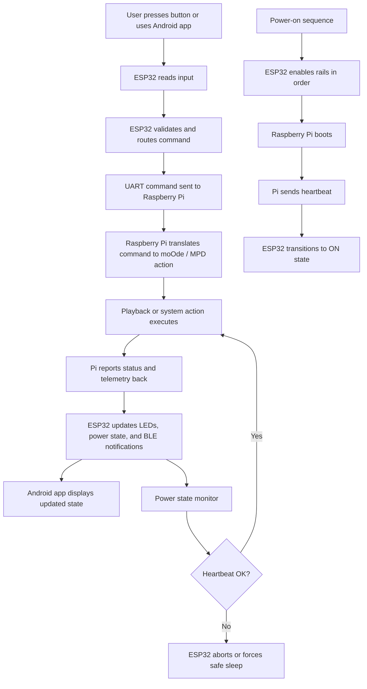

# TinyControlBoard Service Theory of Operation

## Simple Process Diagram

## One-line summary

The system operates as a control loop: user input is handled by the ESP32, transmitted to the Raspberry Pi for media execution, and the resulting status is fed back through the ESP32 to the front panel and Android app.

## Key roles

- ESP32: hardware input, power sequencing, UART bridge, BLE interface, state controller
- Raspberry Pi: media execution engine and command interpreter
- Android app: user interface and remote control client

## Operational flow

1. The user interacts with the hardware or phone app.
2. The ESP32 captures and routes the request.
3. The Raspberry Pi executes the actual media/system command.
4. The Pi returns status such as playback, progress, and heartbeat.
5. The ESP32 updates the device state and sends status to the app.
6. If the Pi stops responding, the ESP32 falls back to a safe power/sleep state.
