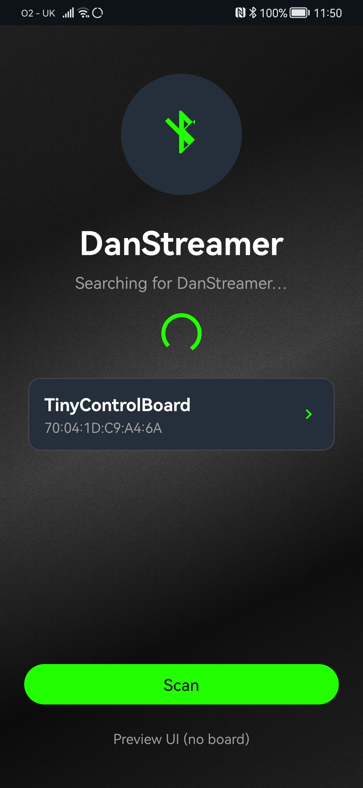
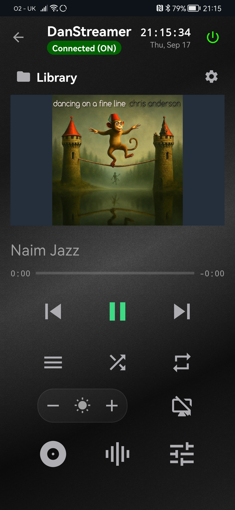
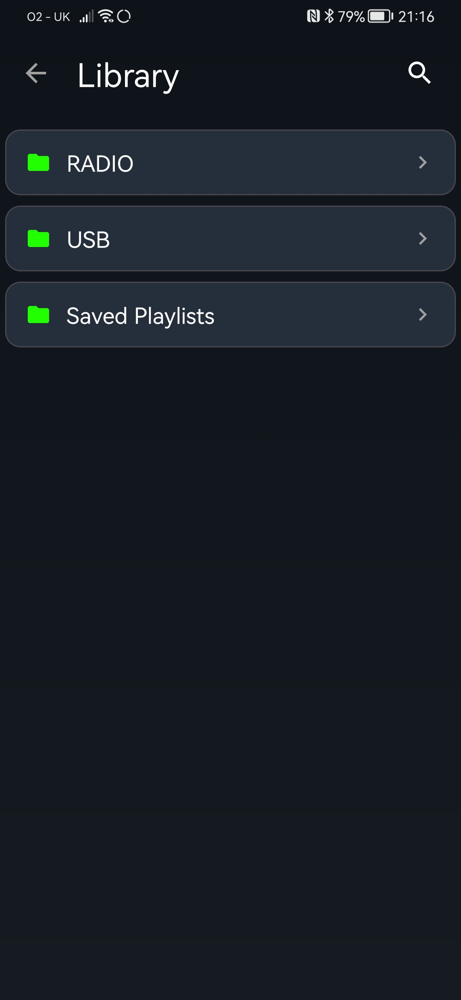
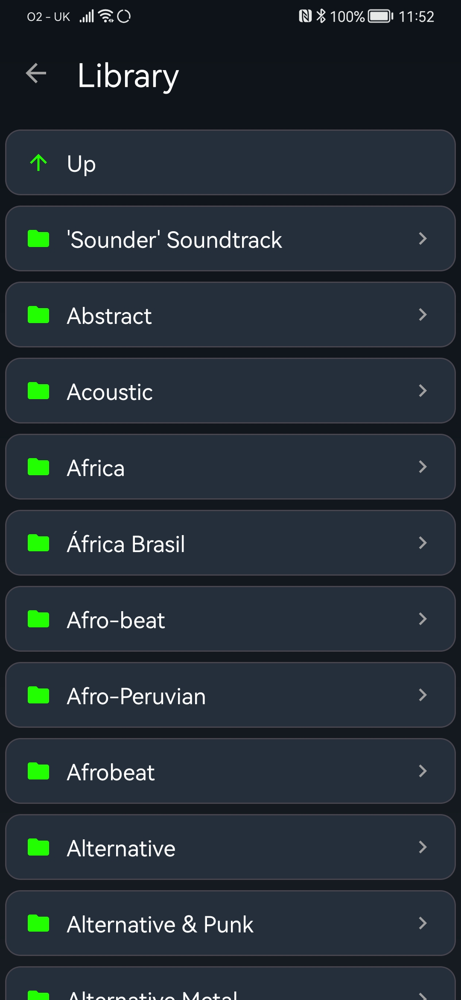
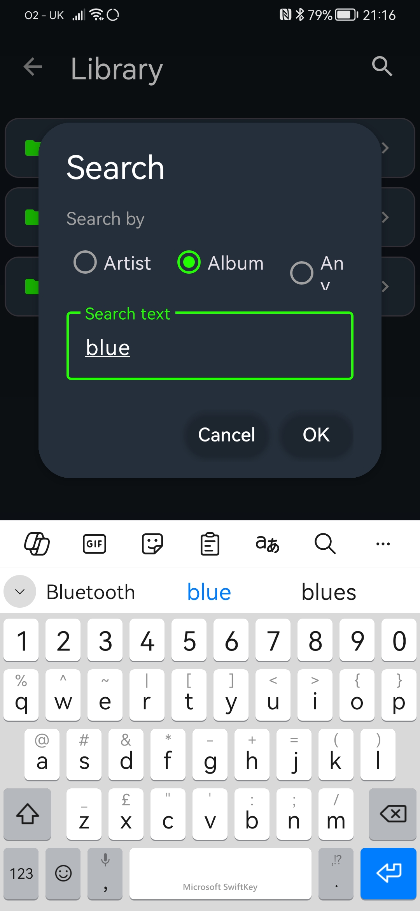
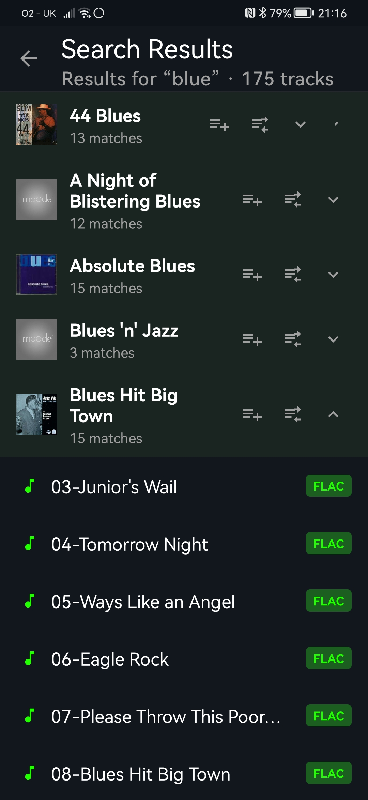
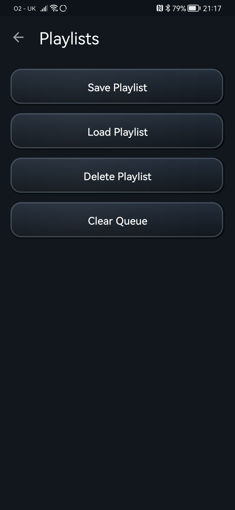
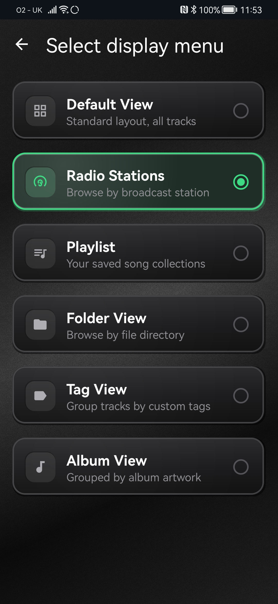
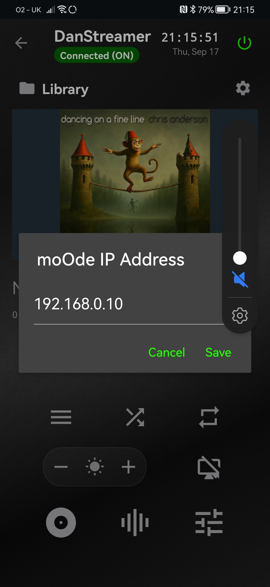
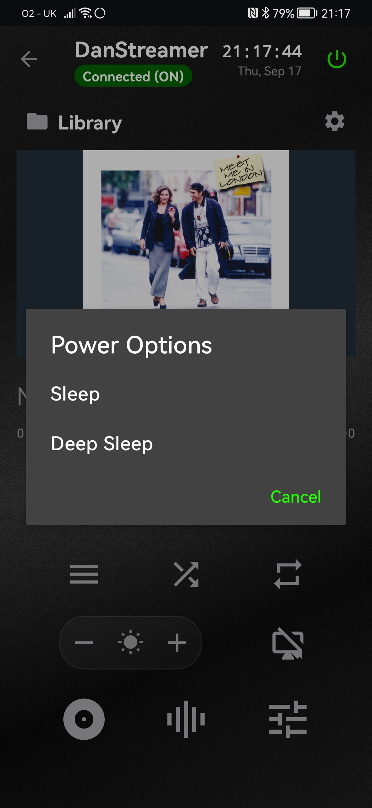

# DanStreamer Phone App User Guide

Use DanStreamer to control your TinyControlBoard music player from an Android phone. You can start and pause music, choose what to play, manage the queue, and put the player to sleep.

You do not need technical knowledge to use the app. The phone is a remote control: music continues to play through your connected audio system, not through the phone.

**App:** DanStreamer

**Manual version:** 3.0

**Updated:** 19 September 2026

## Start Here

Before you begin, make sure that:

- your TinyControlBoard and audio system are switched on;
- Bluetooth is switched on on your phone;
- your phone is close to the player;
- DanStreamer is installed on your phone.

### Connect for the first time

1. Open **DanStreamer**.
2. When Android asks to find and connect to nearby devices, choose **Allow**.
3. Tap **Scan**.
4. Wait for **TinyControlBoard** to appear.
5. Tap **TinyControlBoard**.
6. Wait for the main control screen to open.

> **Find your player**
>
> 
>
> *Tap TinyControlBoard to connect.*

If the player does not appear, see [Can't find the player](#cant-find-the-player).

## At a Glance

The main screen is where you will normally control your music. It shows the song that is playing, album artwork when available, and the most useful controls.

> **Main controls**
>
> 
>
> Library, current song, previous, play/pause, next, shuffle, repeat, screen brightness, display on/off, settings, and power.

| Icon | Control | Use it to |
| --- | --- | --- |
|  | **Library** | Find music by browsing folders or searching. |
| Text | **Current song** | Open the current queue. |
|  | **Previous** | Go back to the previous track. |
|   | **Play / Pause** | Start or pause music. The icon changes to show the available action. |
|  | **Next** | Skip to the next track. |
|  | **Menu** | Choose the view shown on the player's display. |
|  | **Shuffle** | Play tracks in a random order. Tap again to turn it off. |
|  | **Repeat** | Repeat the queue. Tap again to turn it off. |
|    | **Brightness - / +** | Make the player's display dimmer or brighter. |
|  | **Display On / Off** | Turn the player's display on or off without stopping music. |
|  | **Settings** | Set the moOde player address for album artwork and song details. |
|  | **Power** | Wake the player, or choose Sleep or Deep Sleep. |

When shuffle, repeat, cover, meter, or DAC mode is active, its button is highlighted. A highlighted button means that option is currently on.

## Play Music

### Pause, resume, or skip

- Tap **Play / Pause** to stop or resume music.
- Tap **Previous** to go back one track.
- Tap **Next** to skip one track.
- Tap **Shuffle** or **Repeat** to change how the queue plays.

The song name appears above the controls. Tap it at any time to open the current queue.

### Choose a track from the library

1. Tap **Library**.
2. Tap a folder to see what is inside.
3. Tap a track to add it to the queue.
4. Tap the current song on the main screen to open the queue.
5. Tap the track you want to hear and choose **Play Now**.

> **Screenshot placeholder 3 - Browse your music**
>
> 
> 
>*Open a folder, then tap a track to add it to your queue.*

### Add or play a whole folder

When you tap a folder, choose one of these options:

- **Open**: look inside the folder;
- **Add folder to playlist**: add its music after the tracks already in your queue;
- **Replace playlist**: remove the current queue and use this folder instead.

> **Screenshot placeholder 3 - Browse your music**
>
> 
> 
>*Open a folder, then tap a track to add it to your queue.*

Use **Up** inside the library to return to the previous folder.

> **Tip:** Choose **Replace playlist** when you want to start fresh. Choose **Add folder to playlist** when you want to keep what is already queued.

## Search for Music

1. Open **Library**.
2. Tap **Search**.
3. Choose **Artist**, **Album**, or **Any**.
4. Type what you want to find.
5. Tap **OK**.

Results are grouped by album. Tap a track to add it to the queue. Use an album heading to add the whole album or replace the current queue with it.

> **Screenshot placeholder 4 - Search**
>
>
>
> Suggested caption: *Choose what to search for, enter a name, then tap OK.*

> **Screenshot placeholder 5 - Search results**
>
> 
>
> Suggested caption: *Tap a track, or add a whole album at once.*

## Manage the Current Queue

The queue is the list of tracks waiting to play. It is sometimes called the current playlist in the app. It is different from a saved playlist.

### Open the queue

Tap the song name on the main screen, or tap **Playlist** if it is shown on your main screen.

### Change the queue

- Tap a track to play it now.
- Use a track's options to choose **Play Now** or **Remove**.
- Drag a track to move it to a new position.
- Swipe left on a track to remove it.

> **Screenshot placeholder 6 - Current queue**
>
>
> Insert a portrait screenshot of the Current Playlist screen with a drag handle and one track action visible.
>
> Suggested caption: *Drag to reorder, swipe left to remove, or tap a track to play it.*

## Save Playlists for Later

To save, load, delete, or clear a queue, open the current queue and tap **Playlist Management**.

### Save the queue

1. Tap **Save Playlist**.
2. Enter a name.
3. Tap **Save Tracks as Playlist**.
4. If asked, choose whether to replace a playlist with the same name.

### Load a saved playlist

1. Tap **Load Playlist**.
2. Tap the playlist you want.
3. Wait for the confirmation message.

### Delete a saved playlist

1. Tap **Delete Playlist**.
2. Tap the playlist.
3. Confirm the deletion.

### Clear the queue

1. Tap **Clear Queue**.
2. Read the warning.
3. Tap **Clear** to remove all tracks, or **Cancel** to keep them.

> **Screenshot placeholder 7 - Playlist management**
> 
>
>
> *Save a queue for later, or load one you already saved.*

## Change the Player Display

The app can ask the player to show a different view on its own display.

1. On the main screen, tap **Menu**.
2. Tap the view you want.
3. Use the back arrow to return to the main screen.

Available views may include **Default View**, **Radio Stations**, **Playlist**, **Folder View**, **Tag View**, and **Album View**.

> **Screenshot placeholder 8 - Choose a display view**
>  
>
> Insert a portrait screenshot of the Select display menu screen with one selected row.
>
> *Choose what you want to see on the player's display.*

## Album Artwork and Song Details

DanStreamer can show the current song name and album artwork. If you see a default music image or no song details, set the address of your moOde player:

1. On the main screen, tap the gear icon.
2. Enter the moOde player's address. This is usually an address such as `192.168.0.10` or a name such as `moode.local`.
3. Save the address.
4. Return to the main screen and wait a moment for the artwork to refresh.

This setting is only for album artwork and song details. Your normal remote controls use Bluetooth.

> **Screenshot placeholder 9 - Album art setup**
> 
>
> Insert a portrait screenshot of the moOde IP Address dialog.
>
> *Enter the address of your moOde player to show artwork and song details.*

## Power Options

Tap the power button on the main screen:

- If the player is asleep or off, the app asks it to turn on.
- If the player is on, choose **Sleep** for normal standby.
- Choose **Deep Sleep** when you will not use the player for a longer time.

Wait for a power change to finish before sending more commands. The status beside the app title shows whether the player is on, sleeping, or changing state.

> **Screenshot placeholder 10 - Power options**
>
>
>
>*Choose Sleep for everyday use or Deep Sleep for longer breaks.*

## Troubleshooting

### Can't find the player

1. Check that the TinyControlBoard and audio system are on.
2. Check that Bluetooth is on on your phone.
3. Move your phone closer to the player.
4. Return to the app and tap **Scan** again.
5. If Android asks for permission, choose **Allow**.

On older Android phones, Android may also request Location permission to search for Bluetooth devices. Allow it for the scan to work.

### The app says Bluetooth permissions are required

Open your phone's settings, find **Apps**, choose **DanStreamer**, then allow Nearby devices or Bluetooth permission. On Android 6 to Android 11, also allow Location permission.

### A button does not seem to work

Make sure the status shows that the player is on and connected. If it is changing power state, wait until it finishes, then try again.

### I cannot see my music library or search results

Check that the player is still connected and that its music library is available. Search results depend on the music library held by the player, not by the phone.

### Album artwork is missing

Open the gear icon and check the moOde player address. Make sure the phone can reach that address on your home network. Music controls can still work even if artwork does not load.

### I cannot save or load a playlist

Try again after a few seconds. If it continues to fail, check that the player is connected and supports saved playlists. You cannot save an empty queue.

## Common Questions

### Does the phone play the music?

No. The player and audio system play the music. The phone is the remote control.

### Does the phone need Wi-Fi?

Bluetooth is used for everyday controls. Wi-Fi is only needed when you want DanStreamer to load album artwork and song details from the moOde player.

### How do I disconnect?

Use the Android back action or the back arrow from a connected screen to return to the scan screen. The app disconnects from the player.

### What is the difference between the queue and a saved playlist?

The queue is what is ready to play now. A saved playlist is a named copy you can load again later.

## For Installers and Support

This section is not needed for everyday use.

- App name: **DanStreamer**
- Android package: `com.tinycb.remote`
- Android support: Android 6.0 and later
- Connection: Bluetooth Low Energy to one TinyControlBoard at a time
- Artwork and current-song details: fetched from the configured moOde player over the home network

## Image Checklist

Replace each screenshot placeholder with a current portrait screenshot before publishing. Capture real app states with no personal music-library information, device identifiers, IP addresses, or notification content visible.

1. Scan screen with a discovered TinyControlBoard.
2. Connected main screen with a playing track and album art.
3. Library browser with folders and tracks.
4. Search dialog.
5. Search results grouped by album.
6. Current queue with reordering and track actions.
7. Playlist Management screen.
8. Select display menu screen.
9. moOde IP Address dialog.
10. Power Options dialog.
