# DanStreamer Phone App User Guide

DanStreamer lets you control your TinyControlBoard music player from an Android phone. Use it to manage playback, find and queue music, adjust the player's display, and control its power state.

The phone acts as a remote control. Music plays through the player and your connected audio system, not through the phone.

**App:** DanStreamer

**App version (repository build):** 1.0

**Guide revision:** 3.2

**Updated:** 4 October 2026

## Requirements and Permissions

- An Android phone or tablet running Android 6.0 (API 23) or later with Bluetooth Low Energy.
- A powered TinyControlBoard running firmware with the BLE service enabled. The board accepts one BLE connection at a time.
- Bluetooth enabled on the phone. For album artwork, the phone must also be able to reach the moOde player on the home network. MusicBrainz information requires internet access.

When you start scanning, DanStreamer requests:

- **Nearby devices / Bluetooth scan and connect** on Android 12 or later, to find and control the board.
- **Location** on Android 6–11, because those Android versions require it for BLE scanning. DanStreamer does not use your location.
- The app also uses **Internet access** for album artwork and online artist/album information. Android grants this at installation rather than showing a runtime permission prompt. Normal control commands are sent over Bluetooth.

## Connect to the Player

Before you connect, install DanStreamer, power on the player, enable Bluetooth on your phone, and move the phone near the player.

1. Open **DanStreamer**.
2. If Android asks for permission to find and connect to nearby devices, tap **Allow**.
3. Tap **Scan**.
4. Wait for **TinyControlBoard** to appear, then tap it.
5. Wait for the main control screen to open.

> **Find your player**
>
> 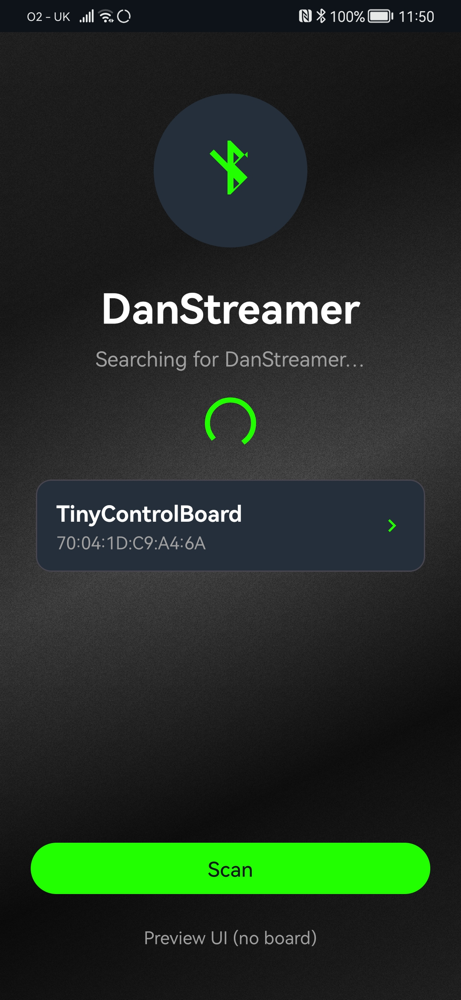
>
> *Tap TinyControlBoard to connect.*

If the player does not appear, see [Can't find the player](#cant-find-the-player).

## Main Screen and Playback

The main screen shows the current song, album artwork when available, and the playback and player controls. Tap the song name to open the queue.

> **Main controls**
>
> 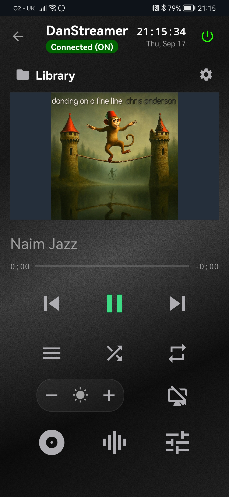
>
> *The main screen provides playback, display, settings, and power controls.*

| Icon | Control | Use it to |
|---|---|---|
|  | **Library** | Browse folders or search for music. |
| Text | **Current song** | Open the current queue. |
|  | **Previous** | Go back to the previous track. |
|   | **Play / Pause** | Start or pause playback. The icon shows the available action. |
|  | **Next** | Skip to the next track. |
|  | **Menu** | Choose the view shown on the player's display. |
|  | **Shuffle** | Play tracks in random order. Tap again to turn it off. |
|  | **Repeat** | Repeat the queue. Tap again to turn it off. |
|    | **Brightness - / +** | Make the player's display dimmer or brighter. |
|  | **Display On / Off** | Turn the player's display off or on without stopping music. |
|  | **Settings** | Set the moOde player address used to retrieve album artwork. |
|  | **Power** | Wake the player or choose Sleep or Deep Sleep. |

Tap **Play / Pause** to pause or resume playback. Use **Previous** and **Next** to move between tracks, or **Shuffle** and **Repeat** to change how the queue plays.

When shuffle, repeat, cover, meter, or alternate DAC mode is active, its control is highlighted.

When track duration is available, the progress bar shows the elapsed and remaining time. Touch or drag along the bar to seek to that position in the track. Seeking requires an active connection and a track with a known duration.

## Find and Play Music

### Browse the library

1. Tap **Library**.
2. Tap a folder to open it.
3. Tap a track to add it to the queue.
4. Return to the main screen and tap the song name to open the queue.
5. Tap the track you want to hear, then choose **Play Now**.

> **Browse your music**
>
> 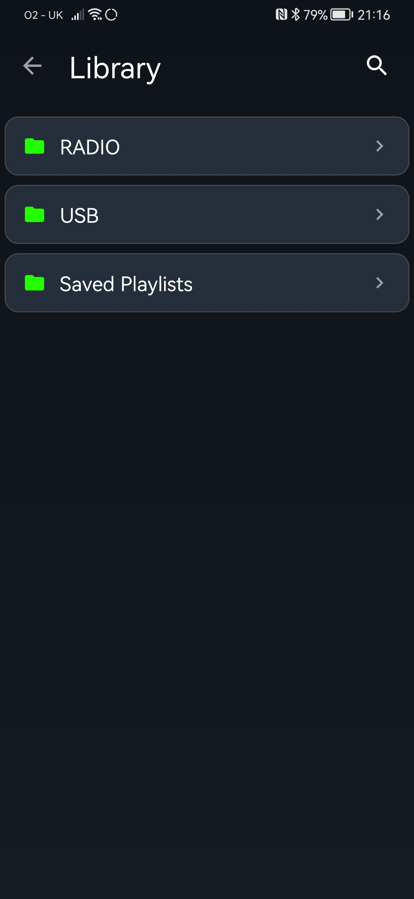
>
> *Open a folder, then tap a track to add it to the queue.*

When you tap a folder, choose what to do:

- **Open** to view its contents.
- **Add folder to playlist** to add its music after the tracks already in the queue.
- **Replace playlist** to replace the current queue with the folder's music.

Use **Up** inside the library to return to the previous folder.

> 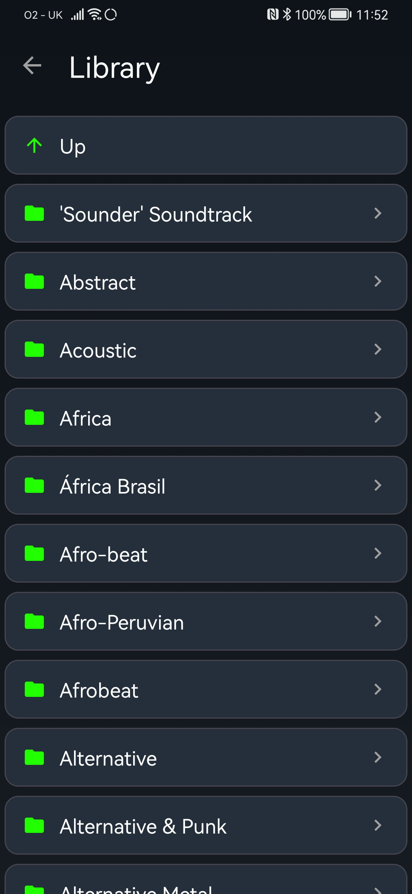
>
> *Open a folder, add its tracks to the queue, or replace the queue.*

> **Tip:** Choose **Replace playlist** to start fresh. Choose **Add folder to playlist** to keep the tracks already queued.

### Search the library

1. Open **Library**.
2. Tap **Search**.
3. Choose **Artist**, **Album**, or **Any**.
4. Enter your search text and tap **OK**.

Search results are grouped by album. Tap a track to add it to the queue. Tap an album heading to add the album or replace the queue with it.

> 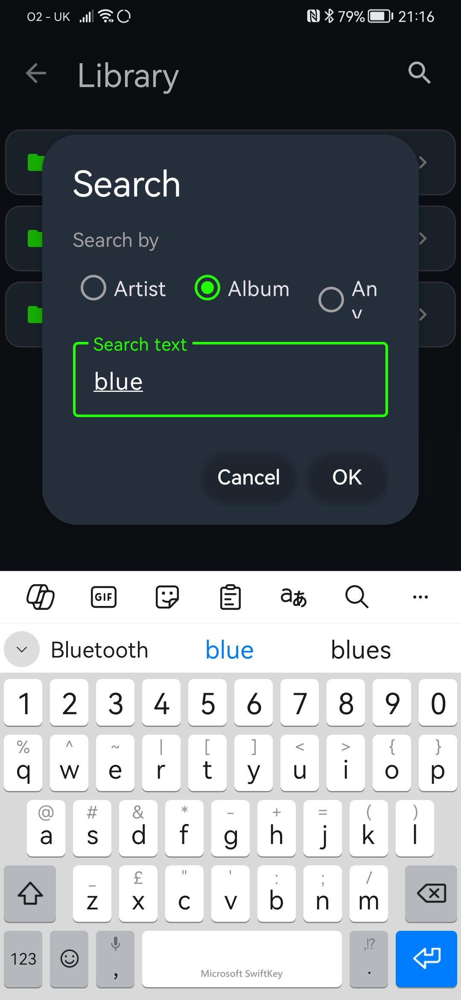
>
> *Choose what to search for, enter a name, then tap OK.*
>
> 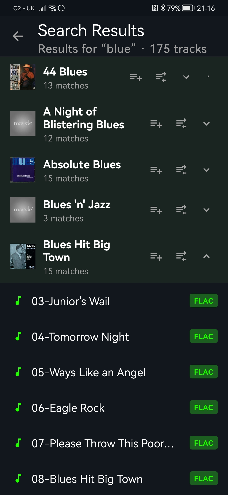
>
> *Tap a track, or use an album heading to add an album.*

## Manage the Queue and Playlists

The **queue** is the list of tracks waiting to play. The app may also call it the current playlist. A saved playlist is a separate list that you can load later.

### Open and change the queue

Tap the song name on the main screen, or tap **Playlist** if it is shown there.

- Tap a track to play it now.
- Use a track's options to choose **Play Now** or **Remove**.
- Drag a track to move it to a different position.
- Swipe left on a track to remove it.

> 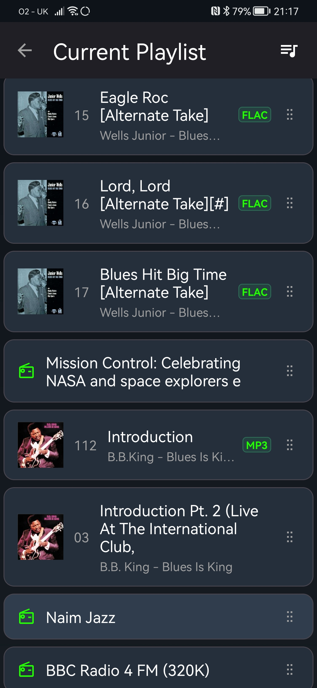
>
> *Drag to reorder, swipe left to remove, or tap a track to play it.*

### Save, load, or delete a playlist

From the current queue screen, tap the queue/music-note icon beside **Current Playlist** to open **Playlists**.

To save the queue:

1. Tap **Save Playlist**.
2. Enter a name.
3. Tap **Save Tracks as Playlist**.
4. If prompted, choose whether to replace a playlist with the same name.

To load a saved playlist:

1. Tap **Load Playlist**.
2. Tap the playlist you want.
3. Wait for the confirmation message.

To delete a saved playlist:

1. Tap **Delete Playlist**.
2. Tap the playlist.
3. Confirm the deletion.

To clear the current queue:

1. Tap **Clear Queue**.
2. Read the warning.
3. Tap **Clear** to remove all tracks, or **Cancel** to keep them.

> 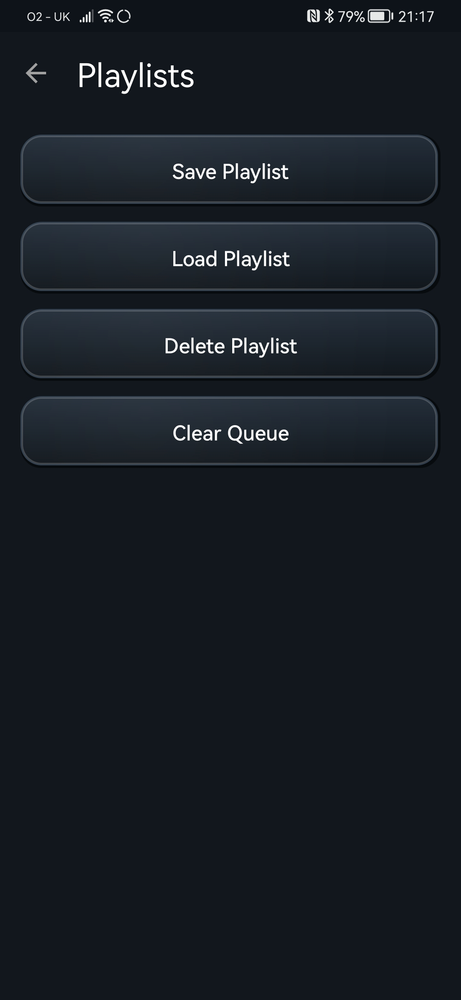
>
> *Save a queue for later, or load a saved playlist.*

## Display, Artwork, and Power

### Change the player's display view

1. On the main screen, tap **Menu**.
2. Tap the view you want.
3. Use the back arrow to return to the main screen.

The available views are **Default View**, **Radio Stations**, **Playlist**, **Folder View**, **Tag View**, and **Album View**. The screen title is **Select display menu**.

> 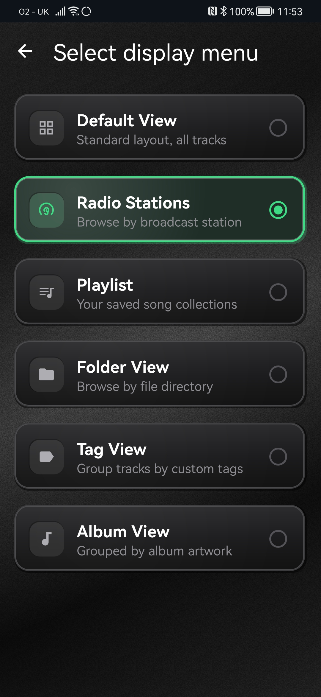
>
> *Choose what you want to see on the player's display.*

### Set up album artwork

The current-song text and playback status arrive from the player over Bluetooth. DanStreamer retrieves album artwork separately from moOde over your home network. If artwork is missing, enter the address of your moOde player:

1. On the main screen, tap the gear icon.
2. Enter the moOde player's address, usually an address such as `192.168.0.10` or a name such as `moode.local`.
3. Save the address.
4. Return to the main screen and wait for the artwork to refresh.

This address is used for album artwork, not for the current-song text or playback controls. Bluetooth remains the transport for normal remote-control functions.

> 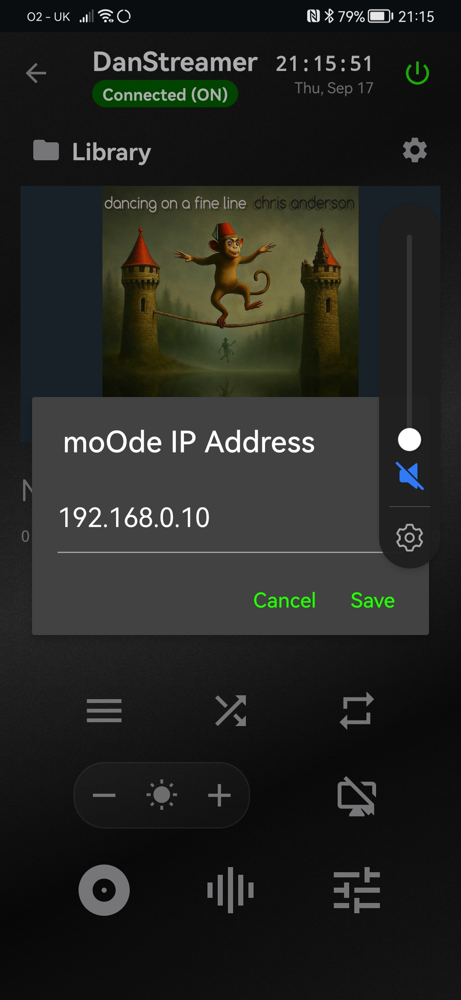
>
> *Enter the address of your moOde player to retrieve album artwork.*

### Use power options

Tap the power button on the main screen to open the power options:

- If the player is asleep or off, tap the power button to wake it.
- If the player is on, choose **Sleep** for normal standby.
- Choose **Deep Sleep** when you will not use the player for a longer time.

Wait for the power change to finish before sending another command. The status beside the app title shows whether the player is on, asleep, or changing state.

> 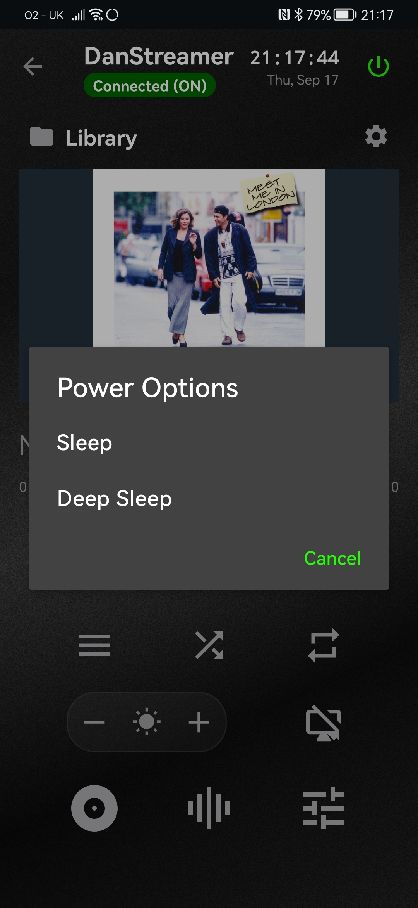
>
> *Choose Sleep for everyday use or Deep Sleep for a longer break.*

## Artist and Album Information

DanStreamer can look up information about the artist or album currently reported by the player. Looking up information does not interrupt playback.

1. On the main screen, double-tap the album artwork or press and hold it.
2. In the **MusicBrainz information** dialog, leave the name field blank to use the current track, or enter an artist or album name.
3. Choose **Artist** or **Album**.
4. Wait while DanStreamer searches MusicBrainz and loads the information.

> 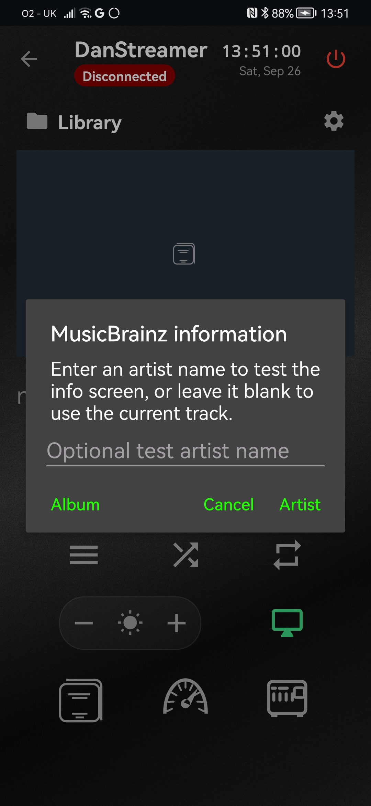
>
> *Choose whether to view information about the current artist or album.*

Opening an information screen does not affect the player connection or playback. Tap **X** or use Android's back action to return to the main screen.

The artist screen may show an image and short biography when available. The image is supplied by Wikipedia and includes a small attribution. Missing images or fields may be omitted or shown with a placeholder.

- **About** shows a short biography. Tap **Show more** or **Show less** to expand or collapse it.
- **Sounds like** combines MusicBrainz genres and tags into chips. Tap **+N more** to show the remaining entries.
- **Aliases** shows relevant aliases. Tap **+N more** to expand the list.
- **Active** and **Origin** show dates and country when available.
- **Open MusicBrainz page** opens the artist or release-group page in a browser.

> 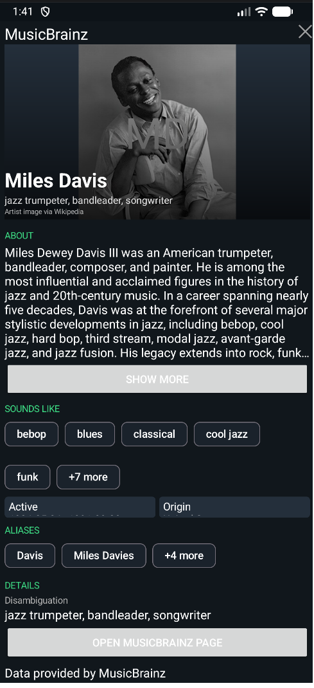
>
> *Artist information is grouped into an image header, biography, and sound tags.*
>
> 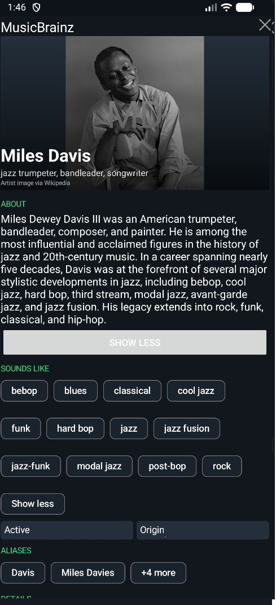
>
> *Use Show more and +N more to view the complete information.*

Album information may include the title, artist, release date and details, genres, tags, external links, and a scrollable track listing, depending on the information available from MusicBrainz.

MusicBrainz lookups require internet access. This connection is separate from Bluetooth, so playback controls can continue to work if MusicBrainz is temporarily unavailable.

## Troubleshooting

### Can't find the player

1. Check that the TinyControlBoard is powered on and running firmware with BLE enabled.
2. Check that Bluetooth is enabled on your phone.
3. Move your phone closer to the player.
4. Return to the app and tap **Scan** again.
5. If Android asks for permission, tap **Allow**.

On Android 6 to 11, allow Location permission so Android can perform BLE scanning. DanStreamer does not use your location. On Android 12 or later, allow Nearby devices/Bluetooth scan and connect permissions.

If the scan fails, enable Bluetooth and try **Scan** again. If the connection times out or is lost, keep the app open briefly while it attempts to reconnect. If it does not reconnect, return to the scan screen and scan again.

### The app says Bluetooth permissions are required

Open your phone's **Settings**, go to **Apps**, select **DanStreamer**, and allow Nearby devices or Bluetooth access on Android 12 or later. On Android 6 to 11, allow Location access for BLE scanning; the app does not use your location.

### A button does not seem to work

Check that the app is connected and the player status shows **ON**. If the player is changing power state, wait for the change to finish before trying again.

### I cannot see my music library or search results

Check that the app is still connected and the player's music library is available. Search results come from the player, not from music stored on your phone. If the connection was lost, wait briefly for reconnection or return to the scan screen and connect again.

### Album artwork is missing

Tap the gear icon and check the moOde player address. Make sure your phone can reach that address on the home network. Playback controls can still work even if artwork does not load.

### MusicBrainz information is missing

Check that your phone has internet access. MusicBrainz lookups use the internet, while player controls use Bluetooth. Information may be unavailable if there is no matching entry or the service is temporarily unavailable.

### I cannot save or load a playlist

Wait a few seconds, then try again. If the problem persists, check that the app is connected and the player supports saved playlists. You cannot save an empty queue.

## Common Questions

### Does the phone play the music?

No. The player and audio system play the music; the phone is the remote control.

### Does the phone need Wi-Fi?

Bluetooth handles everyday player controls and supplies the current-song text. To load album artwork from moOde, your phone must be able to reach the player on your home network. MusicBrainz lookups require internet access.

### How do I disconnect?

From the main control screen, use Android's Back action or the back arrow to return to the scan screen and disconnect. From a library, queue, or other secondary screen, go back to the main control screen first.

### What is the difference between the queue and a saved playlist?

The queue contains tracks waiting to play now. A saved playlist is a named list that you can load again later.

## For Installers and Support

The following reference information is intended for installers and support:

- App name: **DanStreamer**
- Android package: `com.tinycb.remote`
- Android support: Android 6.0 (API 23) and later; Bluetooth Low Energy required
- Connection: Bluetooth Low Energy to one TinyControlBoard at a time
- Current-song text and playback status: received over Bluetooth from the control board
- Album artwork: fetched from the configured moOde player over the home network
