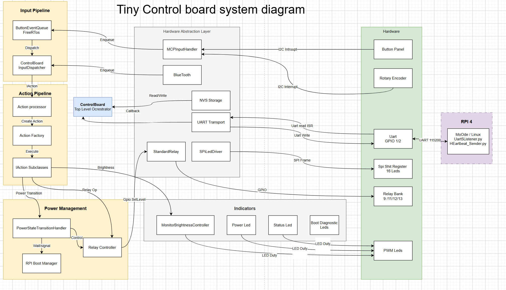

# Riverbank Streamer Dac: DIY Streamer & DAC Build Guide

**Service Manual**

*Author: Anthony Roy*

<figure>

<figcaption>
Streamer Dac
</figcaption>
</figure>

**⚠️ CRITICAL SAFETY WARNINGS & LIABILITY DISCLAIMER**

- **LETHAL AC MAINS VOLTAGE:** This project uses a **toroidal transformer** connected directly to 110V/230V AC mains electricity. Exposed AC terminals can cause **instant death or severe injury via electrocution**.

- **INSULATION REQUIREMENT:** All mains voltage connections (IEC inlet, fuse holder, power switch, and transformer primary wires) **must** be insulated with heat-shrink tubing. Never work inside the chassis while the AC power cord is plugged into the wall.

- **FIRE SAFETY & FUSING:** A slow-blow fuse matching your transformer's primary current rating **must** be installed on the live AC line. Toroidal transformers exhibit massive inrush currents upon startup; unfused builds are a severe fire hazard.

- **POLARITY & ESD HAZARD:** Reversing DC power polarity (+ and -) will instantly destroy your microcontrollers or DAC chips. Use an anti-static wrist strap when handling exposed silicon.

- **DISCLAIMER:** This documentation is for educational purposes. You assume all physical and financial risks associated with the assembly and operation of this high-voltage device.

References: [\[1\]](https://electro-dan.co.uk/electronics/wiringtrans.aspx) [\[2\]](https://soundtraxx.com/content/Reference/Manuals/Tsunami2/Installation-Guide.pdf)

------------------------------------------------------------------------

## Table of Contents

- [Project Overview & Architecture](#project-overview--architecture)
- [System Overview](#system-overview)
- [Component Descriptions](#component-descriptions-)
- [Physical Construction & Wiring](#physical-construction--wiring)
- [Power Supplies](#power-supplies)
- [Digital Audio Section](#digital-audio-section)
- [Assembly Procedure (TODO)](#assembly-procedure-todo)
- [Appendices (TODO)](#appendices-todo)

------------------------------------------------------------------------

# Project Overview & Architecture

## Introduction

Welcome to the build manual for this high-performance, multi-source digital audio streamer and DAC. Designed for audiophiles who enjoy both music reproduction and DIY construction, this project serves as a versatile digital audio hub capable of delivering high-resolution, low-noise audio from a variety of modern digital sources.

#### **Overview** 

At its core, the system combines a Raspberry Pi network streamer running moOde Audio with a dedicated ESP32-based control system. The Raspberry Pi provides a flexible software platform for network audio playback, while the ESP32 manages user interaction, input selection, display control, relay switching, system monitoring, and communication between the various hardware subsystems.

#### **Dac components**

The digital audio path is built around several well-regarded audio modules designed by Ian Canada. Audio data from the Raspberry Pi is first processed by the FIFOPi Q7 reclocking stage, which isolates and reclocks the I2S audio stream using high-performance local oscillators to minimise timing errors and jitter. The reclocked audio is then routed to either an ESS-based DAC or a ProtoDAC, allowing the listener to select between two distinct DAC architectures.

The primary DAC stage is based on Ian Canada's ESS DAC platform, which provides high-resolution digital-to-analogue conversion with excellent measured performance and low distortion. Supporting modules such as the StationPi Pro provide source selection, signal routing, and system integration between the various digital audio components.

#### **Power Supply**

Particular attention has been paid to power supply design. Multiple independent linear power supplies are used throughout the system to isolate digital, analogue, control, and clock domains. Critical audio circuits are powered through Ian Canada's ultra-capacitor-based UcPure modules, which provide exceptionally low-noise local energy storage and power conditioning. This approach helps minimise power supply noise and interference while providing stable power delivery to sensitive audio circuitry.

The completed unit supports multiple digital audio sources, including:

Raspberry Pi network streaming via I2S

Optical (TOSLINK) SPDIF input

Coaxial SPDIF input

USB input

**Displays**

The system incorporates a large front-panel display for album artwork and playback information, together with a secondary OLED display used for input selection, system status, and configuration feedback. A custom front panel with illuminated controls provides direct hardware access to the most commonly used functions.

#### **Target Performance**

- High-fidelity, ultra-low-noise audio playback

- Low-jitter digital audio architecture

- Multiple independently regulated power domains

- Flexible source selection and control

- High-resolution network audio streaming

#### **Software Stack**

- Raspberry Pi running moOde Audio ™

- Custom ESP32 firmware written in C++

- UART-based communication between the Raspberry Pi and ESP32 control system

#### **Skill Level Required**

Advanced This project involves:

- Working with mains AC voltages

- Metal chassis fabrication and modification

- Low-voltage electronic assembly

- Linux command-line operation

- Firmware compilation and deployment

- System integration and troubleshooting

#### **Estimated Build Time**

Approximately 20–30 hours, typically spread over one to two weeks depending on chassis fabrication requirements and testing procedures.

#### **Design Goals**

- Achieve high-quality digital audio reproduction through low-jitter clocking and signal isolation

- Support multiple digital audio sources within a single chassis

- Provide the ability to switch between two different DAC architectures

- Employ extensive linear power supply regulation throughout the system

- Minimise noise through careful grounding, shielding, and power distribution

- Provide a modern user interface with artwork display and hardware controls

- Create a serviceable and maintainable design suitable for long-term DIY ownership

- Document the complete construction process for replication by other builders

#### **Key Features**

- Raspberry Pi network streamer running moOde Audio

- ESP32-based control and monitoring system

- Ian Canada FIFOPi Q7 ultra-low-jitter I2S reclocking stage

- Ian Canada ESS DAC implementation

- ProtoDAC implementation for alternative sonic presentation

- StationPi Pro digital audio interface and routing platform

- UcPure ultra-capacitor power conditioning modules

- Multiple independent linear power supplies

- Optical (TOSLINK) SPDIF input

- Coaxial SPDIF input

- I2S audio transport architecture

- Large front-panel display for album artwork and playback information

- Secondary OLED status and input display

- Relay-based source and DAC selection

- Fully enclosed custom chassis construction

System Overview

## 

#### Overall System Chart

Overall, Power Connection Diagram

## Component Descriptions 

## Power Supply

LinearPIPro x 2

For details on this product go ian Canada’s documentation on this product [here](https://github.com/iancanada/DocumentDownload/blob/master/LinearPi/LinearPiMkIIDual.jpg)

LHY 5v

LED Board

UCPure To see the details of this product go to ian Canada’s site [here](https://github.com/iancanada/DocumentDownload/blob/master/UltraCapacitorPowerSupply/UcPure/OLD/UcPureMkIIManual.pdf)

Transformers

## Streamer board 

## ESS DAC board 

## Clock board 

## Power supply boards 

## Display 

To see detals of this product go to the waveshare website [here](https://www.waveshare.com/wiki/9.3inch_1600x600_LCD#Working_with_Raspberry_Pi)

## Control board

## Single to differential Output stage 

## Differential to Single Ended Board

Proto Dac Board

Relay Dac output switch

Power Relay Board

RPI Dac Power

Streamer Dac Case Build

Capictor Bank

FRONT Panel

Side Panels

Streamer Top

Top Panel for streamer and Dac

Inner Case

**Final Assembly**

**MonitorPi Pro**

**PCB Stackup order**

**To see the details of this component pop off to ian canada’s web site [here](https://github.com/iancanada/DocumentDownload/blob/master/MonitorPi/MonitorPiPro/MonitorPiProManual.pdf)**

<table style="width:93%;">
<colgroup>
<col style="width: 24%" />
<col style="width: 41%" />
<col style="width: 26%" />
</colgroup>
<thead>
<tr>
<th><strong><u>DESCRIPTION</u></strong></th>
<th><strong><u>PART NUMBER</u></strong></th>
<th style="text-align: center;"><strong><u>ITEMS</u></strong></th>
</tr>
</thead>
<tbody>
<tr>
<td> </td>
<td> </td>
<td style="text-align: center;"> </td>
</tr>
<tr>
<td> </td>
<td> </td>
<td style="text-align: center;"> </td>
</tr>
<tr>
<td> </td>
<td> </td>
<td style="text-align: center;"> </td>
</tr>
<tr>
<td> </td>
<td> </td>
<td style="text-align: center;"> </td>
</tr>
<tr>
<td>Super Capacitors 25f</td>
<td><a href="https://www.mouser.co.uk/ProductDetail/723-BCAP0325P270S19"><u>723-BCAP0325P270S19</u></a></td>
<td style="text-align: center;">4</td>
</tr>
<tr>
<td>Power Transformer</td>
<td>546-1182N6</td>
<td style="text-align: center;">1</td>
</tr>
<tr>
<td>Transformer</td>
<td>546-1182M9</td>
<td style="text-align: center;">1</td>
</tr>
<tr>
<td>Power Transformer</td>
<td><a href="https://uk.farnell.com/vigortronix/vtx-146-060-206/60va-toroidal-transformer-2x6v/dp/2817656"><u> VTX-146-060-206</u></a></td>
<td style="text-align: center;">1</td>
</tr>
<tr>
<td>schaffner Filter</td>
<td>FN9290-4-06</td>
<td style="text-align: center;">1</td>
</tr>
<tr>
<td>Fuses</td>
<td>BK8-HTC-603M</td>
<td style="text-align: center;">5</td>
</tr>
<tr>
<td>USB Adapters</td>
<td>NAUSB3-B</td>
<td style="text-align: center;">2</td>
</tr>
<tr>
<td>HDMI</td>
<td>NAHDMI-W-B</td>
<td style="text-align: center;">1</td>
</tr>
<tr>
<td>SPDIF</td>
<td>NF2D-B-0</td>
<td style="text-align: center;">1</td>
</tr>
<tr>
<td>XLR out</td>
<td><a href="https://www.mouser.co.uk/ProductDetail/Neutrik/NC3MDM3LBAG-1?qs=%252B86TLfaev29PPTEig8yI5g%3D%3D"><u>NC3MDM3LBAG-1</u></a></td>
<td style="text-align: center;">2</td>
</tr>
<tr>
<td>Etherenet Panel</td>
<td>ENCOS24D2S65R</td>
<td style="text-align: center;">1</td>
</tr>
<tr>
<td>Optical Inpt</td>
<td>CP30217MB</td>
<td style="text-align: center;">1</td>
</tr>
<tr>
<td>PX0794/S</td>
<td>PX0794/S</td>
<td style="text-align: center;">2</td>
</tr>
<tr>
<td>PX0794/P</td>
<td>PX0794/P</td>
<td style="text-align: center;">2</td>
</tr>
<tr>
<td>control pushbutton</td>
<td>PV0H24011-311</td>
<td style="text-align: center;">12</td>
</tr>
<tr>
<td>PX0708/P/12</td>
<td> </td>
<td style="text-align: center;">1</td>
</tr>
<tr>
<td>PX0708/S/12</td>
<td> </td>
<td style="text-align: center;">1</td>
</tr>
<tr>
<td>177-PX0709/P/07</td>
<td></td>
<td style="text-align: center;">1</td>
</tr>
<tr>
<td>167-PX0709/S/07</td>
<td></td>
<td style="text-align: center;">1</td>
</tr>
<tr>
<td><a href="https://www.mouser.co.uk/ProductDetail/167-PX0745-P-07"><u>167-PX0745/P/07</u></a></td>
<td></td>
<td style="text-align: center;">1</td>
</tr>
<tr>
<td><a href="https://www.mouser.co.uk/ProductDetail/167-PX0745-S"><u>167-PX0745/S</u></a></td>
<td></td>
<td style="text-align: center;">1</td>
</tr>
<tr>
<td><a href="https://www.mouser.co.uk/ProductDetail/157-SA3348-1"><u>157-SA3348/1</u></a></td>
<td></td>
<td style="text-align: center;">2</td>
</tr>
<tr>
<td><a href="https://www.mouser.co.uk/ProductDetail/157-SA3347-1"><u>157-SA3347/1</u></a></td>
<td></td>
<td style="text-align: center;">2</td>
</tr>
<tr>
<td>157-13027/1</td>
<td></td>
<td style="text-align: center;">1</td>
</tr>
<tr>
<td>Encoder</td>
<td><strong>62D11-02-060C</strong></td>
<td style="text-align: center;">1</td>
</tr>
<tr>
<td>Encoder Plug</td>
<td>06SR-3S</td>
<td style="text-align: center;">2</td>
</tr>
<tr>
<td style="text-align: center;"></td>
<td><a href="https://www.audiophonics.fr/en/accessories-and-cases/ian-canada-fifopi-q7-synchronous-fifo-reclocker-board-i2s-32bit-768khz-dsd1024-dop256-p-16855.html"><u>IAN CANADA FIFOPI Q7 Synchronous FIFO Reclocker Board I2S 32bit 768kHz DSD1024 DoP256</u></a></td>
<td style="text-align: center;"><strong>1</strong></td>
</tr>
<tr>
<td style="text-align: center;"></td>
<td><a href="https://www.audiophonics.fr/en/linear-regulated-psu/ian-canada-linearpi-dual-ultra-low-noise-linear-power-supply-module-2x-5v-33v-25a-p-14760.html"><u>IAN CANADA LINEARPI DUAL Ultra-Low Noise Linear Power Supply Module 2x +/-5V / +/-3.3V 2.5A</u></a></td>
<td style="text-align: center;"><strong>1</strong></td>
</tr>
<tr>
<td style="text-align: center;"></td>
<td><a href="https://www.audiophonics.fr/en/accessories-and-cases/ian-canada-stationpi-pro-raspberry-pi-and-hat-boards-adapter-station-p-16550.html"><u>IAN CANADA STATIONPI PRO Raspberry Pi and HAT Boards Adapter Station</u></a></td>
<td style="text-align: center;"><strong>1</strong></td>
</tr>
<tr>
<td style="text-align: center;"></td>
<td><a href="https://www.audiophonics.fr/en/composants-electronique-horloges/crystek-cchd-957-ultra-low-phase-noise-clock-451584mhz-33v-25ppm-p-14165.html"><u>CRYSTEK CCHD-957 Ultra Low Phase Noise Clock 45.1584MHz 3.3V 25ppm</u></a></td>
<td style="text-align: center;"><strong>1</strong></td>
</tr>
<tr>
<td style="text-align: center;"></td>
<td><a href="https://www.audiophonics.fr/en/composants-electronique-horloges/crystek-cchd-957-ultra-low-phase-noise-clock-49152mhz-33v-25ppm-p-14166.html"><u>CRYSTEK CCHD-957 Ultra Low Phase Noise Clock 49.152MHz 3.3V 25ppm</u></a></td>
<td style="text-align: center;"><strong>1</strong></td>
</tr>
<tr>
<td style="text-align: center;"></td>
<td><a href="https://www.audiophonics.fr/en/composants-electronique-horloges/ian-canada-cchd957-supports-adaptateurs-pour-horloges-xo-x2-p-13825.html"><u>IAN CANADA CCHD957 Adapter Supports for XO Clocks and SMT Capacitors (x2)</u></a></td>
<td style="text-align: center;"><strong>1</strong></td>
</tr>
<tr>
<td style="text-align: center;"></td>
<td><a href="https://www.audiophonics.fr/en/linear-regulated-psu/ian-canada-linearpi-mkii-solo-ultra-low-noise-linear-power-supply-module-5v-33v-12v-25a-p-17611.html"><u>IAN CANADA LINEARPI MKII SOLO Ultra-Low Noise Linear Power Supply Module 5V / 3.3V / 12V 2.5A</u></a></td>
<td style="text-align: center;"><strong>2</strong></td>
</tr>
<tr>
<td style="text-align: center;"></td>
<td><a href="https://www.audiophonics.fr/en/composants-electronique-horloges/accusilicon-as318-b-451584-ultra-low-jitter-clock-45mhz-p-14033.html"><u>ACCUSILICON AS318-B-451584 Ultra Low Jitter Clock 45MHz</u></a></td>
<td style="text-align: center;"><strong>1</strong></td>
</tr>
<tr>
<td style="text-align: center;"></td>
<td><a href="https://www.audiophonics.fr/en/composants-electronique-horloges/accusilicon-as318-b-491520-ultra-low-jitter-clock-49mhz-p-14034.html"><u>ACCUSILICON AS318-B-491520 Ultra Low Jitter Clock 49MHz</u></a></td>
<td style="text-align: center;"><strong>1</strong></td>
</tr>
<tr>
<td style="text-align: center;"></td>
<td><a href="https://www.audiophonics.fr/en/accessories-and-cases/ian-canada-monitorpi-pro-control-center-and-signal-analyzer-with-display-for-raspberry-pi-p-18285.html"><u>IAN CANADA MONITORPI PRO Control Center and Signal Analyzer with Display for Raspberry Pi</u></a></td>
<td style="text-align: center;"><strong>1</strong></td>
</tr>
<tr>
<td style="text-align: center;"></td>
<td><a href="https://www.audiophonics.fr/en/dac-and-interface-modules/ian-canada-receiverpi-pro-ii-interface-spdif-i2s-hdmi-for-raspberry-pi-p-18283.html"><u>IAN CANADA RECEIVERPI PRO II Interface SPDIF I2S HDMI for Raspberry Pi</u></a></td>
<td style="text-align: center;"><strong>1</strong></td>
</tr>
<tr>
<td style="text-align: center;"></td>
<td><a href="https://www.audiophonics.fr/en/power-supply-accessories/ian-canada-ucconditioner-mkii-ultra-capacitor-conditioner-board-33v-p-17924.html"><u>IAN CANADA UCCONDITIONER MKII Ultra Capacitor Conditioner Board 3.3V</u></a></td>
<td style="text-align: center;"><strong>1</strong></td>
</tr>
<tr>
<td style="text-align: center;"></td>
<td><a href="https://www.audiophonics.fr/en/aluminium-boxes-cases/100-aluminium-diy-box-case-round-corners-319x239x89mm-black-p-11342.html"><u>100% Aluminium DIY Box / Case round corners 320x240x90mm Black</u></a></td>
<td style="text-align: center;"><strong>1</strong></td>
</tr>
<tr>
<td style="text-align: center;"></td>
<td><a href="https://www.audiophonics.fr/en/accessories-and-cases/ian-canada-gpio-40pin-extension-kit-for-raspberry-pi-p-16816.html"><u>IAN CANADA GPIO 40PIN Extension Kit for Raspberry Pi</u></a></td>
<td style="text-align: center;"><strong>1</strong></td>
</tr>
<tr>
<td style="text-align: center;"></td>
<td><a href="https://www.audiophonics.fr/en/power-supply-accessories/ian-canada-ucconditioner-mkii-ultra-capacitor-conditioner-board-5v-p-17923.html"><u>IAN CANADA UCCONDITIONER MKII Ultra Capacitor Conditioner Board 5V</u></a></td>
<td style="text-align: center;"><strong>1</strong></td>
</tr>
<tr>
<td rowspan="3" style="text-align: center;"></td>
<td><a href="https://www.audiophonics.fr/en/knobs-6mm/aluminum-button-d-shaft-40mm-o6mm-black-p-15050.html"><u>Aluminum Button D Shaft 40mm Ø6mm Black</u></a></td>
<td style="text-align: center;"><strong>4</strong></td>
</tr>
<tr>
<td><a href="https://www.audiophonics.fr/en/cylindrical-head-screw/hollow-head-screw-steel-btr-m3x5mm-x10-p-11549.html"><u>Hollow Head Screw Steel BTR M3x5mm (x10)</u></a></td>
<td style="text-align: center;"><strong>2</strong></td>
</tr>
<tr>
<td><a href="https://www.audiophonics.fr/en/linear-regulated-psu/ian-canada-linearpi-mkii-solo-ultra-low-noise-linear-power-supply-module-5v-33v-12v-25a-p-17611.html"><u>IAN CANADA LINEARPI MKII SOLO Ultra-Low Noise Linear Power Supply Module 5V / 3.3V / 12V 2.5A</u></a></td>
<td style="text-align: center;"><strong>1</strong></td>
</tr>
<tr>
<td style="text-align: center;"></td>
<td><a href="https://www.audiophonics.fr/en/linear-regulated-psu/lhy-audio-dual-linear-power-supply-module-lt3042-2x5v-15a-p-17276.html"><u>LHY AUDIO Dual Linear Power Supply Module LT3042 2x5V 1.5A</u></a></td>
<td style="text-align: center;"><strong>1</strong></td>
</tr>
<tr>
<td style="text-align: center;"></td>
<td><a href="https://www.audiophonics.fr/en/power-supply-accessories/micro-usb-male-to-to-bare-wire-power-cable-raspberry-pi-24awg-20cm-p-9405.html"><u>Micro USB male to to bare wire Power Cable Raspberry Pi 24AWG 20cm</u></a></td>
<td style="text-align: center;"><strong>2</strong></td>
</tr>
<tr>
<td style="text-align: center;"></td>
<td><a href="https://www.audiophonics.fr/en/selector-sources-module/single-ended-to-balanced-converter-module-xlr-rca-stereo-p-18248.html"><u>Single-Ended to Balanced Converter Module XLR / RCA Stereo</u></a></td>
<td style="text-align: center;"><strong>1</strong></td>
</tr>
<tr>
<td style="text-align: center;"></td>
<td><a href="https://www.audiophonics.fr/en/transformers-accessories/toroid-cover-metal-iron-shield-transformer-88x62mm-p-11513.html"><u>Toroid Cover Metal Iron Shield Transformer 88x62mm</u></a></td>
<td style="text-align: center;"><strong>2</strong></td>
</tr>
<tr>
<td>

<table style="width:22%;">
<colgroup>
<col style="width: 22%" />
</colgroup>
<thead>
<tr>
<th style="text-align: center;"> </th>
</tr>
</thead>
<tbody>
</tbody>
</table></td>
<td><a href="https://www.audiophonics.fr/en/toroidal-transformers/toroidal-transformer-15va-2x12v-p-7040.html"><u>Toroidal Transformer 15VA 2x12V</u></a></td>
<td style="text-align: center;"><strong>1</strong></td>
</tr>
</tbody>
</table>

## Physical Construction & Wiring

*The sections below are still being completed with photos, diagrams, and measured values. Items marked (TODO) are outstanding.*

### Chassis Layout (TODO)

*Photo of the complete internal layout.*

#### Board Placement (TODO)

*Photo for each board location.*

#### Front Panel Assembly (TODO)

*Buttons, LEDs, display.*

#### Rear Panel Assembly (TODO)

*Connectors, switches, fuses.*

#### Transformer Placement (TODO)

*Photos and dimensions.*

### Wiring Guide

#### Wiring Conventions

Wire colours, cable types, shielding, and connector types used throughout the build:

| Function  | Colour |
|-----------|--------|
| +5V       | Red    |
| Ground    | Black  |
| I2S Data  | Blue   |
| I2S Clock | Yellow |

#### Interconnect Diagram (TODO)

*Full system wiring diagram.*

#### Power Wiring (TODO)

*Detailed diagrams.*

#### Signal Wiring (TODO)

*Detailed diagrams.*

#### Grounding Scheme (TODO)

*Very important for DAC builders — show chassis earth, signal ground, power ground, and shield connections.*

## Power Supplies

### Supply Overview

<table>
<colgroup>
<col style="width: 86%" />
<col style="width: 6%" />
<col style="width: 6%" />
</colgroup>
<thead>
<tr>
<th>Rail</th>
<th>Voltage</th>
<th>Current</th>
</tr>
</thead>
<tbody>
<tr>
<td>Digital</td>
<td>5V</td>
<td>xxx mA</td>
</tr>
<tr>
<td>DAC Core</td>
<td>3.3V</td>
<td>xxx mA</td>
</tr>
<tr>
<td>Analogue</td>
<td>±15V</td>
<td>xxx mA</td>
</tr>
</tbody>
</table>

#### Bill of Materials

<table style="width:86%;">
<colgroup>
<col style="width: 17%" />
<col style="width: 15%" />
<col style="width: 12%" />
<col style="width: 41%" />
</colgroup>
<thead>
<tr>
<th style="text-align: center;">ProductID</th>
<th style="text-align: center;">Description</th>
<th style="text-align: center;">URL</th>
<th style="text-align: center;">Image</th>
</tr>
</thead>
<tbody>
<tr>
<td style="text-align: center;">723-BCAP0325P270S19</td>
<td style="text-align: center;">Super Capacitor 325F 2.7V (Maxwell/Eaton)</td>
<td style="text-align: center;"><a href="https://www.mouser.com/ProductDetail/723-BCAP0325P270S19">Mouser</a></td>
<td style="text-align: center;"></td>
</tr>
<tr>
<td style="text-align: center;">546-1182N6</td>
<td style="text-align: center;">Hammond Power Transformer 6V+6V 20VA</td>
<td style="text-align: center;"><a href="https://www.mouser.com/ProductDetail/546-1182N6">Mouser</a></td>
<td style="text-align: center;"></td>
</tr>
<tr>
<td style="text-align: center;">546-1182M9</td>
<td style="text-align: center;">Hammond Power Transformer 9V+9V 20VA</td>
<td style="text-align: center;"><a href="https://www.mouser.com/ProductDetail/546-1182M9">Mouser</a></td>
<td style="text-align: center;"></td>
</tr>
<tr>
<td style="text-align: center;">VTX-146-060-206</td>
<td style="text-align: center;">Vigortronix Power Transformer 6VA 2x6V</td>
<td style="text-align: center;"><a href="https://www.switchelectronics.co.uk/products/vtx-146-050-206-toroidal-transformer-50va-0-6v-vigortronix?currency=GBP&amp;country=GB&amp;variant=45694220206389&amp;utm_source=google&amp;utm_medium=cpc&amp;utm_campaign=Google%20Shopping&amp;stkn=bbf1d20e1ed7&amp;gad_source=1&amp;gad_campaignid=23321857875&amp;gbraid=0AAAAAqEgT0BQfVbHs8KwmvJlH6DAzkAyo&amp;gclid=Cj0KCQjwjIPSBhCCARIsABGyK7vJPmnLQInHhnEMVQb2GtcvyNNqW93mJx-GKBlvhf_wyRRO4Ft1ehoaAvjYEALw_wcB">switch Electronics</a></td>
<td style="text-align: center;"></td>
</tr>
<tr>
<td style="text-align: center;">FN9290-4-06</td>
<td style="text-align: center;">Schaffner EMC Power Line Filter 4A</td>
<td style="text-align: center;"><a href="https://www.mouser.com/Search/Refine?Keyword=FN9290-4-06">Mouser Search</a></td>
<td style="text-align: center;"></td>
</tr>
<tr>
<td style="text-align: center;">BK8-HTC-603M</td>
<td style="text-align: center;">Eaton/Bussmann Fuse Holder with Fuses</td>
<td style="text-align: center;"><a href="https://www.mouser.co.uk/ProductDetail/Eaton-Electronics/BK8-HTC-603M?qs=DRkmTr78QAR4GxQA20iXeg%3D%3D&amp;srsltid=AfmBOooluWFogsZrJNLhNb5vHrr31zGF7_oef6-Sheq1SS1CPsoGj9U4">Mouser</a></td>
<td style="text-align: center;"></td>
</tr>
<tr>
<td style="text-align: center;">NAUSB3-B</td>
<td style="text-align: center;">Neutrik USB 3.0 Feed-Through Adapter, Black D-shape</td>
<td style="text-align: center;"><a href="https://www.neutrik.com/en/product/nausb3-b">Neutrik</a></td>
<td style="text-align: center;"></td>
</tr>
<tr>
<td style="text-align: center;">NAHDMI-W-B</td>
<td style="text-align: center;">Neutrik HDMI 2.0 Feed-Through Adapter, Black D-shape</td>
<td style="text-align: center;"><a href="https://www.neutrik.com/en/product/nahdmi-w-b">Neutrik</a></td>
<td style="text-align: center;"></td>
</tr>
<tr>
<td style="text-align: center;">NF2D-B-0</td>
<td style="text-align: center;">Neutrik Phono/RCA Socket, Black D-shape (SPDIF)</td>
<td style="text-align: center;"><a href="https://www.neutrik.com/en/product/nf2d-b-0">Neutrik</a></td>
<td style="text-align: center;"></td>
</tr>
<tr>
<td style="text-align: center;">NC3MDM3LBAG-1</td>
<td style="text-align: center;">Neutrik XLR 3-pole Male Receptacle, Black D-shape, Silver Contacts</td>
<td style="text-align: center;"><a href="https://www.neutrik.com/en/product/nc3mdm3lbag-1">Neutrik</a></td>
<td style="text-align: center;"></td>
</tr>
<tr>
<td style="text-align: center;">ENCOS24D2S65R</td>
<td style="text-align: center;">Panel Mount Ethernet Connector (RJ45 Coupler)</td>
<td style="text-align: center;"><a href="https://www.mouser.com/Search/Refine?Keyword=ENCOS24D2S65R">Mouser Search</a></td>
<td style="text-align: center;"></td>
</tr>
<tr>
<td style="text-align: center;">CP30217MB</td>
<td style="text-align: center;">Panel Mount Optical (TOSLINK) Input Connector</td>
<td style="text-align: center;"><a href="https://uk.farnell.com/cliff-electronic-components/cp30217mb/fibre-optic-adapter-toslink-toslink/dp/3490624">Farnell</a></td>
<td style="text-align: center;"></td>
</tr>
<tr>
<td style="text-align: center;">PX0794/S</td>
<td style="text-align: center;">Bulgin PX0794 Circular Connector, Socket</td>
<td style="text-align: center;"><a href="https://www.mouser.co.uk/ProductDetail/Bulgin/PX0794-S?qs=fZ%2FLqxhLDmlcL7BQN2egOg%3D%3D">Mouser</a></td>
<td style="text-align: center;"></td>
</tr>
<tr>
<td style="text-align: center;">PX0794/P</td>
<td style="text-align: center;">Bulgin PX0794 Circular Connector, Plug</td>
<td style="text-align: center;"><a href="https://www.mouser.co.uk/ProductDetail/Bulgin/PX0794-P?qs=1heAGhfc8RDP1j2J1H7tmQ%3D%3D">Mouser</a></td>
<td style="text-align: center;"></td>
</tr>
<tr>
<td style="text-align: center;">PV0H24011-311</td>
<td style="text-align: center;">Panel Mount Illuminated Pushbutton Switch</td>
<td style="text-align: center;"><a href="https://www.mouser.co.uk/ProductDetail/E-Switch/PV0H24011-311?qs=QvRObDHRS1%252BbpJ%252BDa6XY%2Fg%3D%3D">Mouser</a></td>
<td style="text-align: center;"></td>
</tr>
<tr>
<td style="text-align: center;">PX0708/P/12</td>
<td style="text-align: center;">Bulgin PX0708 12-way Circular Connector, Plug</td>
<td style="text-align: center;"><a href="https://www.bulgin.com/en/search#q=PX0708">Bulgin Search</a></td>
<td style="text-align: center;"></td>
</tr>
<tr>
<td style="text-align: center;">PX0708/S/12</td>
<td style="text-align: center;">Bulgin PX0708 12-way Circular Connector, Socket</td>
<td style="text-align: center;"><a href="https://www.bulgin.com/en/search#q=PX0708">Bulgin Search</a></td>
<td style="text-align: center;"></td>
</tr>
<tr>
<td style="text-align: center;">177-PX0709/P/07</td>
<td style="text-align: center;">Bulgin PX0709 7-way Circular Connector, Plug</td>
<td style="text-align: center;"><a href="https://www.mouser.com/Search/Refine?Keyword=PX0709%2FP%2F07">Mouser Search</a></td>
<td style="text-align: center;"></td>
</tr>
<tr>
<td style="text-align: center;">167-PX0709/S/07</td>
<td style="text-align: center;">Bulgin PX0709 7-way Circular Connector, Socket</td>
<td style="text-align: center;"><a href="https://www.mouser.com/Search/Refine?Keyword=PX0709%2FS%2F07">Mouser Search</a></td>
<td style="text-align: center;"></td>
</tr>
<tr>
<td style="text-align: center;">167-PX0745/P/07</td>
<td style="text-align: center;">Bulgin PX0745 7-way Circular Connector, Plug</td>
<td style="text-align: center;"><a href="https://www.mouser.com/Search/Refine?Keyword=PX0745%2FP%2F07">Mouser Search</a></td>
<td style="text-align: center;"></td>
</tr>
<tr>
<td style="text-align: center;">167-PX0745/S</td>
<td style="text-align: center;">Bulgin PX0745 Circular Connector, Socket</td>
<td style="text-align: center;"><a href="https://www.mouser.com/Search/Refine?Keyword=PX0745%2FS">Mouser Search</a></td>
<td style="text-align: center;"></td>
</tr>
<tr>
<td style="text-align: center;">157-SA3348/1</td>
<td style="text-align: center;">Bulgin SA3348 Connector Accessory / Back-Shell</td>
<td style="text-align: center;"><a href="https://uk.rs-online.com/web/c/?searchTerm=SA3348%2F1">RS Components</a></td>
<td style="text-align: center;"></td>
</tr>
<tr>
<td style="text-align: center;">157-SA3347/1</td>
<td style="text-align: center;">Bulgin SA3347 Connector Accessory / Back-Shell</td>
<td style="text-align: center;"><a href="https://uk.rs-online.com/web/c/?searchTerm=SA3347%2F1">RS Components</a></td>
<td style="text-align: center;"></td>
</tr>
<tr>
<td style="text-align: center;">157-13027/1</td>
<td style="text-align: center;">Bulgin 13027 Connector Accessory</td>
<td style="text-align: center;"><a href="https://uk.rs-online.com/web/c/?searchTerm=13027%2F1">RS Components</a></td>
<td style="text-align: center;"></td>
</tr>
<tr>
<td style="text-align: center;">62D11-02-060C</td>
<td style="text-align: center;">Grayhill Premium Haptic Optical Rotary Encoder, 32 PPR, w/ Pushbutton</td>
<td style="text-align: center;"><a href="https://www.grayhill.com/products/62d11-02-060c">Grayhill</a></td>
<td style="text-align: center;"></td>
</tr>
<tr>
<td style="text-align: center;">06SR-3S</td>
<td style="text-align: center;">JST/Molex 3-pin Encoder Cable Connector (Plug)</td>
<td style="text-align: center;"><a href="https://www.mouser.com/Search/Refine?Keyword=06SR-3S">Mouser Search</a></td>
<td style="text-align: center;"></td>
</tr>
<tr>
<td style="text-align: center;">#1D</td>
<td style="text-align: center;">IAN CANADA — FifoPi Q7 Synchronous FIFO Reclocker Board, I2S 32-bit 768kHz DSD1024 DoP256</td>
<td style="text-align: center;"><a href="https://iancanada.ca/products/1d-fifopi-q7-flagship-i2s-dsd-dop-fifo-with-isolator-re-clocker-and-low-phase-noise-xos">Ian Canada</a></td>
<td style="text-align: center;"></td>
</tr>
<tr>
<td style="text-align: center;">#38A</td>
<td style="text-align: center;">IAN CANADA — LinearPi Dual Ultra-Low Noise Linear Power Supply Module 2x +/-5V / +/-3.3V 2.5A</td>
<td style="text-align: center;"><a href="https://iancanada.ca/products/linearpi-pro-high-current-ultra-low-noise-linear-power-supply-full-smt">Ian Canada</a></td>
<td style="text-align: center;"></td>
</tr>
<tr>
<td style="text-align: center;">#35B</td>
<td style="text-align: center;">IAN CANADA — StationPi PRO Raspberry Pi and HAT Boards Adapter Station</td>
<td style="text-align: center;"><a href="https://iancanada.ca/products/35b-stationpi-pro-fully-finished">Ian Canada</a></td>
<td style="text-align: center;"></td>
</tr>
<tr>
<td style="text-align: center;">CCHD-957-45</td>
<td style="text-align: center;">CRYSTEK CCHD-957 Ultra Low Phase Noise Clock, 45.1584 MHz, 3.3 V, 25 ppm</td>
<td style="text-align: center;"><a href="https://www.crystek.com/crystal/spec-sheets/clock/CCHD-957.pdf">Crystek Datasheet</a></td>
<td style="text-align: center;"></td>
</tr>
<tr>
<td style="text-align: center;">CCHD-957-49</td>
<td style="text-align: center;">CRYSTEK CCHD-957 Ultra Low Phase Noise Clock, 49.152 MHz, 3.3 V, 25 ppm</td>
<td style="text-align: center;"><a href="https://www.crystek.com/crystal/spec-sheets/clock/CCHD-957.pdf">Crystek Datasheet</a></td>
<td style="text-align: center;"></td>
</tr>
<tr>
<td style="text-align: center;">CCHD957-Adapter</td>
<td style="text-align: center;">IAN CANADA — CCHD957 XO Clock Adapter, supports SMT Capacitors (pair)</td>
<td style="text-align: center;"><a href="https://iancanada.ca/">Ian Canada</a></td>
<td style="text-align: center;"></td>
</tr>
<tr>
<td style="text-align: center;">#32B</td>
<td style="text-align: center;">IAN CANADA — LinearPi MKII SOLO Ultra-Low Noise Linear Power Supply Module, 5V / 3.3V / 12V, 2.5A</td>
<td style="text-align: center;"><a href="https://iancanada.ca/products/linearpi-mkii-ultra-low-noise-smt-linear-power-supply">Ian Canada</a></td>
<td style="text-align: center;"></td>
</tr>
<tr>
<td style="text-align: center;">AS318-B-451584</td>
<td style="text-align: center;">ACCUSILICON AS318-B Ultra Low Jitter Audio Clock, 45.1584 MHz</td>
<td style="text-align: center;"><a href="https://www.accusilicon.com/">AccuSilicon</a></td>
<td style="text-align: center;"></td>
</tr>
<tr>
<td style="text-align: center;">AS318-B-491520</td>
<td style="text-align: center;">ACCUSILICON AS318-B Ultra Low Jitter Audio Clock, 49.152 MHz</td>
<td style="text-align: center;"><a href="https://www.accusilicon.com/">AccuSilicon</a></td>
<td style="text-align: center;"></td>
</tr>
<tr>
<td style="text-align: center;">#49B</td>
<td style="text-align: center;">IAN CANADA — MonitorPi PRO Control Center and Signal Analyzer with Display for Raspberry Pi</td>
<td style="text-align: center;"><a href="https://iancanada.ca/products/49b-monitorpi-pro-integrated-control-center-and-signal-analyzer">Ian Canada</a></td>
<td style="text-align: center;"></td>
</tr>
<tr>
<td style="text-align: center;">#19C</td>
<td style="text-align: center;">IAN CANADA — ReceiverPi PRO II Interface, SPDIF / I2S / HDMI for Raspberry Pi</td>
<td style="text-align: center;"><a href="https://iancanada.ca/products/19c-receiverpi-pro-ii">Ian Canada</a></td>
<td style="text-align: center;"></td>
</tr>
<tr>
<td style="text-align: center;">UcCond-MKII-3V3</td>
<td style="text-align: center;">IAN CANADA — UcConditioner MKII Ultra Capacitor Conditioner Board, 3.3V</td>
<td style="text-align: center;"><a href="https://iancanada.ca/products/ucconditionermkii-5v-or-3-3v">Ian Canada</a></td>
<td style="text-align: center;"></td>
</tr>
<tr>
<td style="text-align: center;">UcCond-MKII-5v</td>
<td style="text-align: center;">IAN CANADA — UcConditioner MKII Ultra Capacitor Conditioner Board, 5V</td>
<td style="text-align: center;"></td>
<td style="text-align: center;"></td>
</tr>
<tr>
<td style="text-align: center;">UCPure Balancer</td>
<td style="text-align: center;"><strong>UcBalancer protection board KIT</strong></td>
<td style="text-align: center;"><a href="https://iancanada.ca/products/41f-ucbalancer-protection-board-kit">Ian Canada</a></td>
<td style="text-align: center;"></td>
</tr>
<tr>
<td style="text-align: center;">Alu-Case-320x240x90</td>
<td style="text-align: center;">100% Aluminium DIY Box / Case, Round Corners, 320×240×90 mm, Black</td>
<td style="text-align: center;"><a href="https://www.aliexpress.com/wholesale?SearchText=aluminium+case+320x240x90">Search AliExpress</a></td>
<td style="text-align: center;"></td>
</tr>
<tr>
<td style="text-align: center;">#50A</td>
<td style="text-align: center;">IAN CANADA — GPIO 40-PIN Extension Kit for Raspberry Pi (with 6″ &amp; 12″ FFC cables)</td>
<td style="text-align: center;"><a href="https://iancanada.ca/products/50a-universal-raspberrypi-gpio-extension-kit-with-6-12-ffc-cables">Ian Canada</a></td>
<td style="text-align: center;"></td>
</tr>
<tr>
<td style="text-align: center;"></td>
<td style="text-align: center;"></td>
<td style="text-align: center;"></td>
<td style="text-align: center;"></td>
</tr>
<tr>
<td style="text-align: center;">D-Shaft-Button-40mm</td>
<td style="text-align: center;">Aluminum Knob — D-Shaft, 40 mm diameter, Ø6 mm bore, Black</td>
<td style="text-align: center;"><a href="https://www.aliexpress.com/wholesale?SearchText=aluminum+knob+d+shaft+40mm+6mm">Search AliExpress</a></td>
<td style="text-align: center;"></td>
</tr>
<tr>
<td style="text-align: center;">BTR-M3x5</td>
<td style="text-align: center;">Socket Head Cap Screw, Steel, M3×5 mm (Pack of 10)</td>
<td style="text-align: center;"><a href="https://www.mouser.com/Search/Refine?Keyword=M3+5mm+socket+head">Search</a></td>
<td style="text-align: center;"></td>
</tr>
<tr>
<td style="text-align: center;">LHY-LT3042-2x5V</td>
<td style="text-align: center;">LHY AUDIO — Dual Linear Power Supply Module LT3042, 2×5V, 1.5A</td>
<td style="text-align: center;"><a href="https://www.audiophonics.fr/en/regulated-psu/lhy-audio-dual-linear-power-supply-module-lt3042-2x5v-15a-p-17276.html">audiophonics</a></td>
<td style="text-align: center;"></td>
</tr>
<tr>
<td style="text-align: center;">MicroUSB-Bare-20cm</td>
<td style="text-align: center;">Micro USB Male to Bare Wire Power Cable, 24AWG, 20 cm</td>
<td style="text-align: center;"><a href="https://www.aliexpress.com/wholesale?SearchText=micro+usb+male+bare+wire+20cm">Search AliExpress</a></td>
<td style="text-align: center;"></td>
</tr>
<tr>
<td style="text-align: center;">SE-BAL-XLR-RCA</td>
<td style="text-align: center;">Single-Ended to Balanced Converter Module, XLR / RCA Stereo</td>
<td style="text-align: center;"><a href="https://www.aliexpress.com/wholesale?SearchText=single+ended+balanced+converter+XLR+RCA">Search AliExpress</a></td>
<td style="text-align: center;"></td>
</tr>
<tr>
<td style="text-align: center;">Toroid-Cover-88x62</td>
<td style="text-align: center;">Toroid Cover — Metal Iron Shield for Transformer, 88×62 mm</td>
<td style="text-align: center;"><a href="https://www.aliexpress.com/wholesale?SearchText=toroid+cover+transformer+shield+88mm">Search AliExpress</a></td>
<td style="text-align: center;"></td>
</tr>
<tr>
<td style="text-align: center;">Toroidal-15VA-2x12V</td>
<td style="text-align: center;">Toroidal Transformer, 15VA, 2×12V AC</td>
<td style="text-align: center;"><a href="https://www.mouser.com/Search/Refine?Keyword=toroidal+transformer+15VA+12V">Search</a></td>
<td style="text-align: center;"></td>
</tr>
</tbody>
</table>

### Power Distribution (TODO)

*Diagram showing every rail.*

### Transformer Connections (TODO)

*Photos plus wiring diagrams.*

## Digital Audio Section

### Streamer

### I2S Routing

### Clock Distribution

### Control Interface

#### Component Connections (TODO)

*Document Raspberry Pi connections, ESP32 connections, UART links, I2S routing, and clock routing.*

##### Raspberry Pi Connections

##### ESP32 Connections

##### UART Links

##### I2S Routing

##### Clock Routing

### Analogue Audio Section

#### DAC Stage

#### Output Stage

#### Balanced Outputs

#### Single-Ended Outputs

*(TODO: explain signal flow.)*

## Assembly Procedure (TODO)

*Step-by-step build order.*

### Chassis Preparation

### Mounting Boards

### Installing Transformers

### Power Wiring

### Signal Wiring

### Final Inspection

*Lots of photos here.*

### Testing and Commissioning

#### Pre-Power Checks (TODO)

*Resistance checks.*

#### First Power-Up (TODO)

*Expected voltages.*

#### Functional Testing (TODO)

*Expected LED states.*

#### Audio Testing (TODO)

*Signal path verification.*

### Troubleshooting

*Very useful for builders.*

- No Power
- Display Not Working
- Streamer Not Booting
- No Audio
- Distorted Audio
- Relay Problems
- Clock Problems

*(TODO: include photos of error indicators if you have them.)*

### Parts List (BOM)

#### Purchased Assemblies

#### Custom PCBs

#### Connectors

#### Hardware

#### Revision History

| Revision | Date | Changes |
|----------|------|---------|
| 1.0 | xx/xx/xxxx | Initial Release |

## Appendices (TODO)

- Wiring Diagram
- Connector Pinouts
- Voltage Reference Table
- Board-to-Board Connection Tables
- Software/Firmware Versions

---

> **Author's note:** priority areas for future documentation effort are System Architecture (block diagrams), Mechanical Construction (photos), the Wiring Guide (board-to-board connections), and Testing & Commissioning (expected voltages and LED indications) — these are the sections future builders will reference most.
