# Riverbank Streamer DAC

## Service and Build Guide

**Author:** Anthony Roy

<figure>

<figcaption>
Riverbank Streamer DAC
</figcaption>
</figure>

## Safety Information

> **Warning — hazardous mains voltage:** This project uses a toroidal transformer connected to 110 V or 230 V AC mains. Contact with exposed mains connections can cause fatal electric shock or severe injury.

- Insulate all mains connections—including the IEC inlet, fuse holder, power switch, and transformer primary wiring—with suitable heat-shrink tubing or equivalent insulation.
- Disconnect the power cord from the wall outlet before opening the chassis or working on the equipment.
- Install a slow-blow fuse of the correct rating in the live AC line. Select the fuse for the transformer and the local mains supply; transformer inrush current can be high.
- Observe DC polarity. Reversed connections can damage microcontrollers, DACs, and other components. Use ESD precautions when handling exposed semiconductor devices.

This guide is provided for informational and educational purposes. Construction and use are undertaken at the builder's own risk. Mains-powered equipment should be assembled, inspected, and tested only by people qualified to work safely with hazardous voltages.

**Reference:** [Transformer wiring](https://electro-dan.co.uk/electronics/wiringtrans.aspx)

------------------------------------------------------------------------

## Table of Contents

- [Project Overview](#project-overview)
- [System Architecture](#system-architecture)
- [Component Overview](#component-overview)
- [Board Documentation and Service Guides](#board-documentation-and-service-guides)
  - [Tiny Control Board](#tiny-control-board-for-raspberry-pi-4)
  - [Single-Ended to Balanced Line Driver](#single-ended-to-balanced-line-driver)
  - [Raspberry Pi Interface Board](#raspberry-pi-interface-board)
  - [Input Selector Board](#input-selector-board)
  - [6-Channel Relay Board](#6-channel-relay-board)
  - [Current-Limited Power Switch and Capacitor Bank](#current-limited-power-switch-and-capacitor-bank)
- [Mechanical Construction and Wiring](#mechanical-construction-and-wiring)
- [Power Supplies](#power-supplies)
- [Digital Audio and Control](#digital-audio-and-control)
- [Analogue Audio](#analogue-audio)
- [Assembly and Commissioning](#assembly-and-commissioning)
- [Parts List](#parts-list)
- [Revision History](#revision-history)
- [Appendices](#appendices)

------------------------------------------------------------------------

## Project Overview

### Introduction

The Riverbank Streamer DAC is a multi-source digital audio streamer and DAC designed as both a high-quality listening system and a substantial DIY electronics project. It combines network playback, digital input selection, reclocking, DAC conversion, and an ESP32-based control interface in a custom enclosure.

#### System Overview

The system combines a Raspberry Pi network streamer running moOde Audio with a dedicated ESP32 control system. The Raspberry Pi handles network playback; the ESP32 manages user input, source selection, display control, relay switching, system monitoring, and communication with other subsystems.

#### Digital Audio Components

The digital audio path uses several audio modules, including Ian Canada's FIFOPi Q7 reclocking stage. It isolates and reclocks the Raspberry Pi's I2S stream using local oscillators. The reclocked signal can then be routed to either an ESS-based DAC or a ProtoDAC.

The ESS platform provides the primary digital-to-analogue conversion stage. Supporting modules, including the StationPi Pro, provide source selection, signal routing, and integration between audio components.

#### Power Supplies

Multiple independent linear power supplies serve the digital, analogue, control, and clock domains. UcPure ultra-capacitor modules provide local energy storage and power conditioning for selected audio circuits.

The system is designed to support these digital audio sources:

- Raspberry Pi network streaming via I2S
- Optical (TOSLINK) S/PDIF input
- Coaxial S/PDIF input
- USB input

#### Displays and Controls

The front-panel display presents album artwork and playback information. A secondary OLED display provides input, status, and configuration feedback. Illuminated controls provide direct access to commonly used functions.

#### Design Objectives

- High-quality digital audio reproduction using low-jitter clocking and signal isolation
- Multiple digital audio sources and selectable DAC architectures
- Independent linear power regulation for system power domains
- Noise control through grounding, shielding, and careful power distribution
- A serviceable enclosure with a modern display and hardware controls

#### Software and Build Requirements

- Raspberry Pi running moOde Audio
- Custom ESP32 firmware written in C++
- UART communication between the Raspberry Pi and ESP32
- Advanced skill level: the build involves mains wiring, metal chassis work, electronics assembly, Linux command-line use, firmware deployment, and system troubleshooting
- Estimated build time: approximately 20–30 hours, depending on enclosure work and testing

## System Architecture

### Control and Communication Architecture

### Audio System Overview

### Power Connection Diagram

## Component Overview

### Power Supply Modules

Two LinearPi Pro modules are used.

See Ian Canada's [LinearPi documentation](https://github.com/iancanada/DocumentDownload/blob/master/LinearPi/LinearPiMkIIDual.jpg).

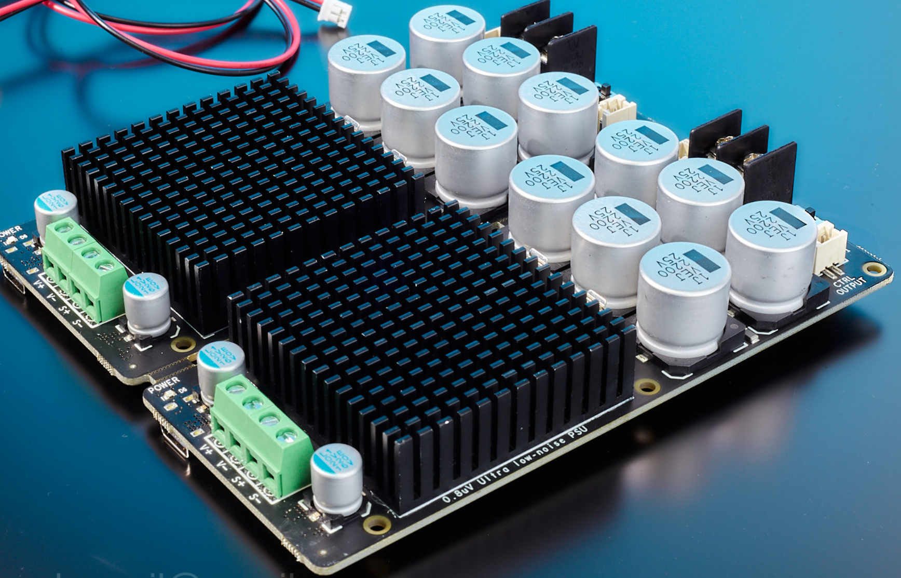

#### UcPure Modules

See Ian Canada's [UcPure manual](https://github.com/iancanada/DocumentDownload/blob/master/UltraCapacitorPowerSupply/UcPure/OLD/UcPureMkIIManual.pdf).

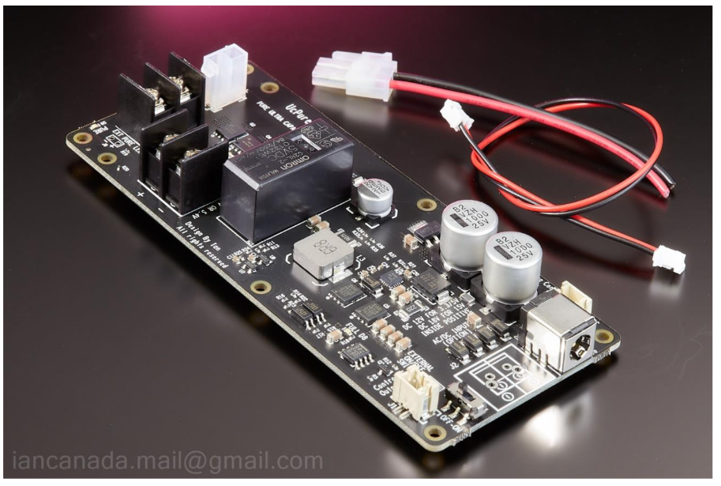

Other power components include an LHY 5 V supply, an LED board, and transformers. Refer to the [power supply documentation](#power-supplies) for the current parts list and distribution details.

### Other Assemblies

- **Streamer:** Raspberry Pi network streamer running moOde Audio.
- **DACs:** ESS DAC and ProtoDAC implementations provide selectable conversion architectures.
- **Clocking:** FIFOPi Q7 reclocking stage with local oscillator clocks.
- **Control:** ESP32-based controller; see the [Tiny Control Board service guide](#tiny-control-board-for-raspberry-pi-4).

### Display

See the [Waveshare display documentation](https://www.waveshare.com/wiki/9.3inch_1600x600_LCD#Working_with_Raspberry_Pi).

## Board Documentation and Service Guides

### Tiny Control Board for Raspberry Pi 4

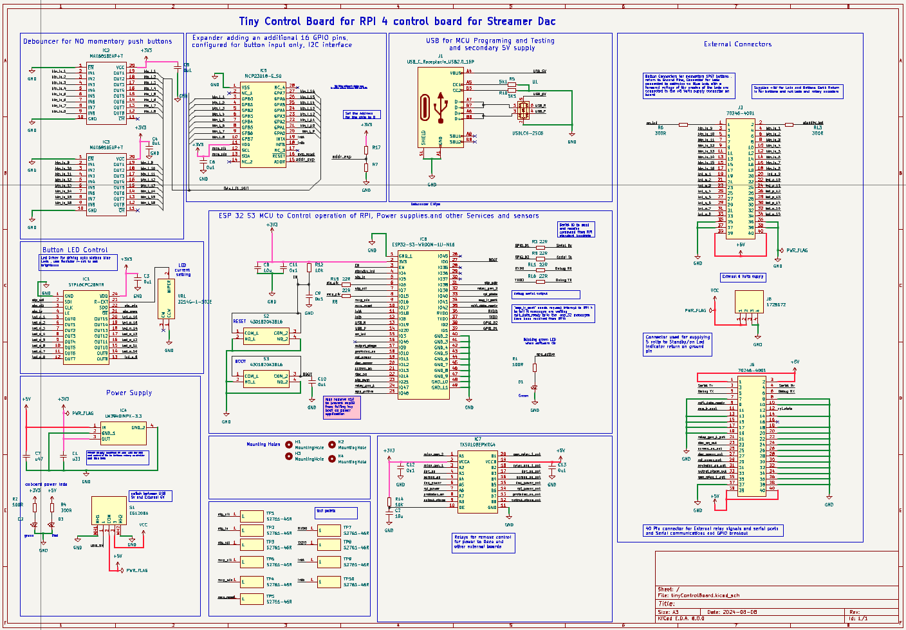

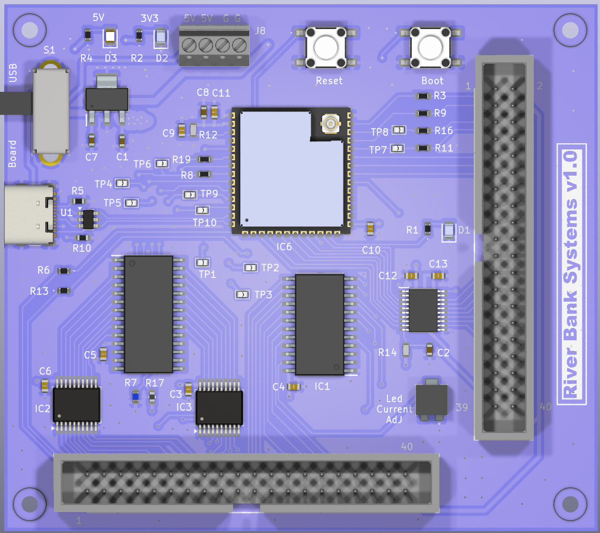

Control board for the RPi 4 Streamer DAC (`tinyControlBoard.kicad_sch`, KiCad 8.0.0, 2024-08-08).

#### What It Does

An ESP32-S3 handles the housekeeping for the Raspberry Pi:

- Reads 16 debounced front-panel buttons.
- Drives 16 button LEDs with adjustable brightness.
- Switches power to the Pi, DAC, screen and other boards through relay control lines.
- Talks to the Pi over serial, with two handshake lines.

#### Block Overview

| Block | Part | Function |
|---|---|---|
| MCU | IC8 ESP32-S3-WROOM-1U-N16 | Main controller |
| Debouncers | IC2, IC3 MAX6818 | Debounce buttons 1-8 and 9-16 |
| I/O expander | IC5 MCP23018 | Reads the 16 button signals over I2C |
| LED driver | IC1 STP16CPC26 | 16 constant-current LED outputs; VR1 sets brightness |
| Level shifter | IC7 TXS0108E | 3.3 V to 5 V for the relay/power control lines |
| 3.3 V regulator | IC4 LM3940-3.3 | +5V to +3V3 |
| USB-C | J1 (ESD: U1 USBLC6-2SC6) | Programming, testing, backup 5 V |

#### Power

- **Source select (S1):** position 1 = USB 5 V, position 3 = external supply (J8). Output is the +5V rail.
- **+3V3** comes from IC4 and powers the MCU, debouncers, expander, LED driver and level shifter (A side).
- **+5V** powers the button LEDs, level shifter (B side), and the 5 V pins on J3 and J6.
- **Indicators:** D2 green = 3V3 present, D3 red = 5 V present.
- **Status LED:** D1 green blinks when the ESP32 software is running.

#### Connectors

| Ref | Use |
|---|---|
| J1 | USB-C for programming and testing |
| J3 (2x20) | Buttons 1-16, LEDs 1-16, on/standby LEDs. Buttons return to GND pins; LED anodes go to the +5V pins |
| J6 (2x20) | Pi serial (Tx/Rx), debug serial, handshake lines, relay/power outputs, 5 V and GND |
| J8 | External supply input |

##### J6 Signals

| Pin | Signal |
|---|---|
| 3 / 4 | Serial Tx / Rx |
| 5 / 6 | Debug Tx / Rx |
| 9 | `rpi_data_ready` |
| 11 | `msg_ir_wait` |
| 12 | `rpi_status` |
| 21 | `relay_pwr_1` out |
| 23 | `dac_on` out |
| 25 | `screen_on` out |
| 27 | `dac_power` out |
| 29 | `rpi_power` out |
| 31 | `protodac_on` out |
| 33 | `output_stage` out |
| 35 | `relay_pwr_2` out |
| 1, 2, 39, 40 | +5V |

#### Controls and Adjustments

- **S2 RESET:** resets the ESP32.
- **S3 BOOT:** hold during reset or power-up to enter the ESP32 download mode.
- **VR1:** trimmer that sets the brightness of all button LEDs.

#### Test Points

TP1-TP10 cover the LED-driver serial lines, expander I2C and reset, debug UART and interrupt lines. See the board silkscreen for each label.

#### Quick Troubleshooting

| Symptom | Check |
|---|---|
| No power LEDs | S1 position, supply at J8 or USB, then IC4 output on +3V3 |
| 5 V LED on, 3.3 V LED off | IC4 and its 33 µF output capacitor |
| D1 not blinking | ESP32 not running; try S2 reset, check debug serial output |
| Cannot program the ESP32 | Use S3 BOOT with S2 reset; check the USB cable and J1 |
| One button not responding | Wiring on J3, then the matching debouncer input and output |
| All buttons dead | I2C lines (`mcp_clk`, `mcp_sda`), expander reset, +3V3 |
| LEDs dark or dim | VR1 setting, LED driver supply, +5V at J3 |
| Relay/power outputs inactive | Level shifter supplies (3V3 and 5V), then the signal at J6 |
| Pi and ESP32 not communicating | Serial wiring on J6 pins 3/4, then `msg_ir_wait` and `rpi_data_ready` |

#### Notes

### Single-Ended to Balanced Line Driver

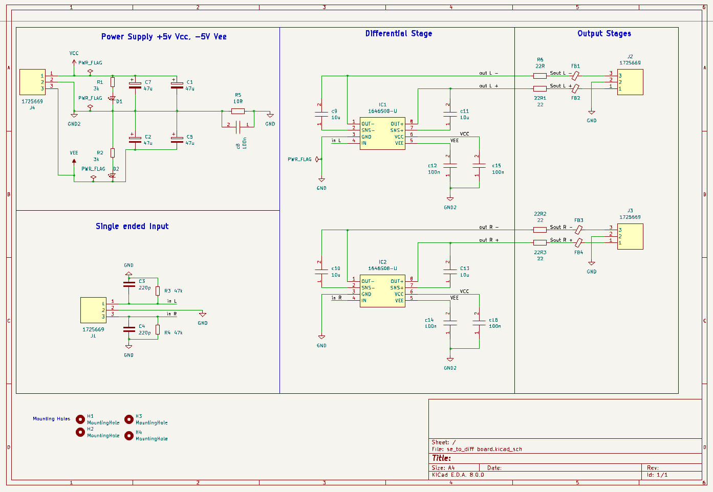

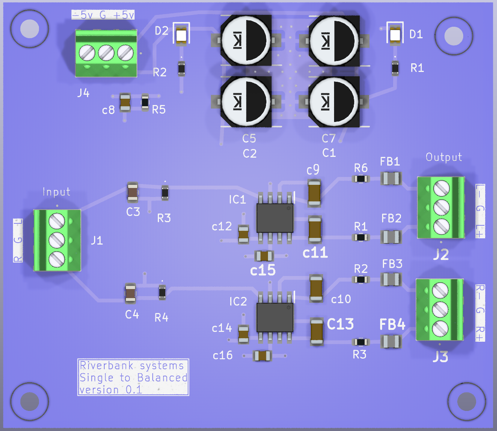

Stereo converter board: unbalanced stereo input in, balanced stereo output out, powered from a dual ±5 V supply.

#### What It Does

Each channel passes through one THAT 1646 balanced line driver (IC1 left, IC2 right; the schematic label reads `1646S08-U`). The driver converts the single-ended input into a differential output, which leaves through a 22 Ω resistor and a ferrite bead on each leg.

**Signal path:** J1 (input) → input network → IC1 / IC2 → 22 Ω + ferrite bead per leg → J2 (left out) / J3 (right out)

#### Connectors

All connectors are 3-pin (1725669).

| Ref | Use | Pin 1 | Pin 2 | Pin 3 |
|---|---|---|---|---|
| J1 | Input | In L | GND | In R |
| J2 | Left output | Sout L + | GND | Sout L − |
| J3 | Right output | Sout R + | GND | Sout R − |
| J4 | Power input | VCC (+5 V) | GND2 (0 V) | VEE (−5 V) |

#### Power Supply

- J4 takes a **dual supply: +5 V (VCC) and −5 V (VEE), with 0 V on GND2**.
- Each rail has 2 x 47 µF bulk capacitors: C7 and C1 on VCC, C2 and C5 on VEE.
- **D1** (with R1, 3 kΩ) and **D2** (with R2, 3 kΩ) are indicator LEDs on the +5 V and −5 V rails *(verify)*.
- **GND2** is the supply ground. It joins the signal **GND** only through **R5 (10 Ω) in parallel with C8 (100 nF)**.
- Each driver has 100 nF decoupling on its supply pins: C12 and C15 on IC1, C14 and C16 on IC2, all returned to GND2.

#### Input Stage

For each channel, a **47 kΩ resistor in parallel with 220 pF** goes from the input to GND (R3 and C3 for left, R4 and C4 for right). This sets the input impedance and filters RF. The signal then goes directly to pin 4 (IN) of the driver.

#### Driver Stage (IC1 Left, IC2 Right)

| Pin | Name | Connection |
|---|---|---|
| 1 | OUT− | `out −` net |
| 2 | SNS− | Via 10 µF to `out −` (C9 left, C10 right) |
| 3 | GND | GND (signal ground) |
| 4 | IN | Input signal |
| 5 | VEE | −5 V |
| 6 | VCC | +5 V |
| 7 | SNS+ | Via 10 µF to `out +` (C11 left, C13 right) |
| 8 | OUT+ | `out +` net |

#### Output Stage

Each output leg has a **22 Ω series resistor** followed by a **ferrite bead**:

| Channel | Resistors | Ferrite beads |
|---|---|---|
| Left | R6, 22R1 | FB1 (−), FB2 (+) |
| Right | 22R2, 22R3 | FB3 (−), FB4 (+) |

#### Quick Checks

| Check | Expected |
|---|---|
| J4 pin 1 to pin 2 | +5 V |
| J4 pin 3 to pin 2 | −5 V |
| IC pin 6 to GND2 | +5 V |
| IC pin 5 to GND2 | −5 V |
| D1 and D2 | Both lit |

#### Quick Troubleshooting

| Symptom | Check |
|---|---|
| No output on either channel | J4 supply, D1 and D2, then VCC and VEE at the driver pins |
| One channel dead | Input wiring on J1, then pin 4 signal, supply pins and output on the affected IC |
| One output leg dead | The 22 Ω resistor and ferrite bead on that leg, then the connector |
| Hum or noise | R5 / C8 ground link, GND and GND2 connections, input cable |
| Distortion or low level | Output loading, supply voltage under load, sense capacitors (C9, C11 left; C10, C13 right) |
| One rail missing | Supply wiring, the bulk capacitors on that rail, and the supply itself |

#### Notes

- The two grounds are intentional: **GND** is the signal ground (input and driver pin 3) and **GND2** is the supply return. Do not link them anywhere except through R5 and C8.
- The driver part number is read from the schematic label. Confirm against the BOM before ordering replacements.

### Differential-to-Single-Ended Output Board

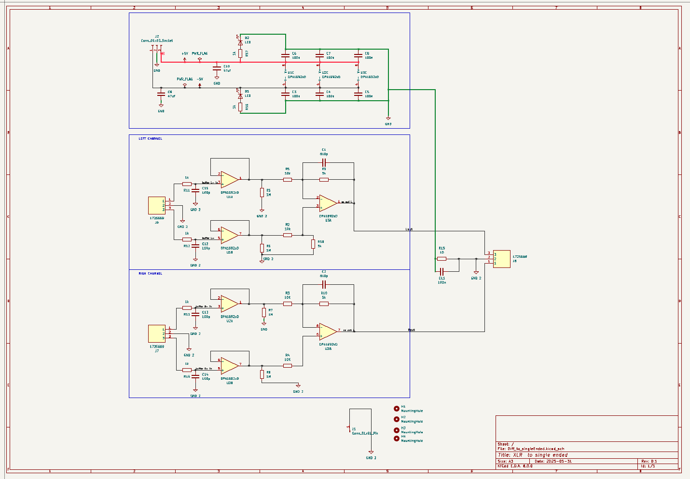

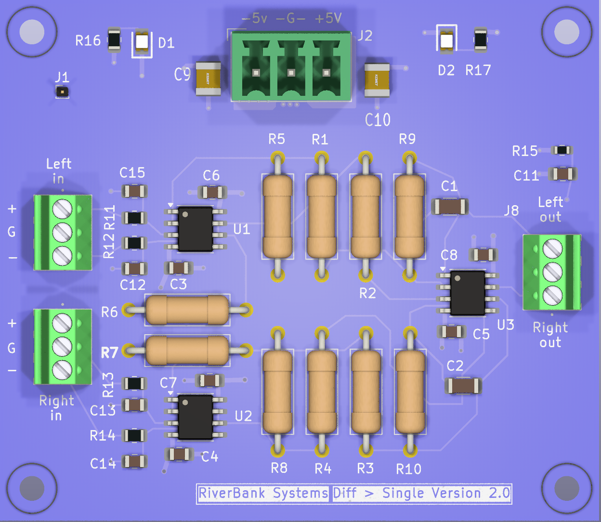

### ProtoDAC Board

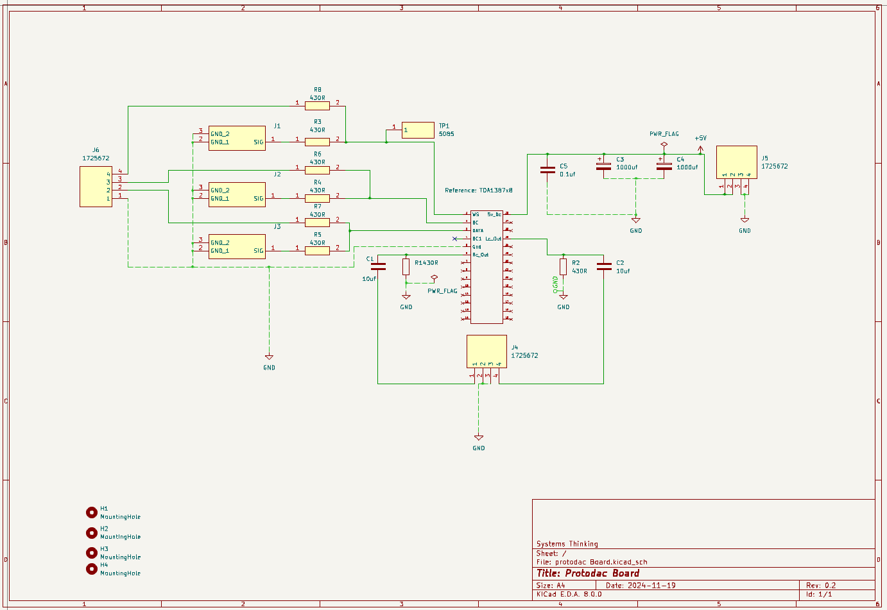

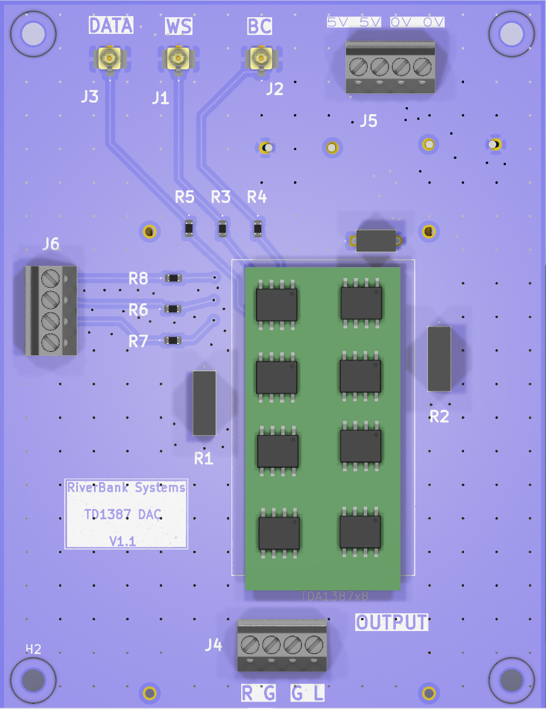

### Raspberry Pi Interface Board

A board that mates with a Raspberry Pi 40-pin header. It provides a filtered 5 V supply for the Pi and brings the I2S and I2C signals out to five signal connectors through 22 Ω series resistors. A few other GPIO lines are named for use elsewhere in the system.

#### What It Does

- **5 V in:** J7 supplies +5 V to the Pi through header pins 2 and 4, with bulk and decoupling capacitors on the rail.
- **Digital audio out:** I2S data, word clock and bit clock go to three signal connectors through 22 Ω resistors.
- **I2C out:** SDA and SCL go to two more signal connectors through 22 Ω resistors.
- **System lines:** a handshake pair, a serial pair and a PWM monitor line are named on the header (see below).

#### Connectors

| Ref | Part | Use |
|---|---|---|
| J3 | 70246-4001 (2 x 20) | Raspberry Pi 40-pin header |
| J7 | 1x03 socket | 5 V power input: pins 1 and 2 = +5 V, pin 3 = GND |
| J6 | 1725672 (4-pin) | Ground terminal, all four pins tied to GND |
| J4, J5, J8, J13 | Single pin | +5 V take-off pins |
| J14 | Single pin | Connected to GND2, labelled "5v pin" (see Notes) |
| 5 signal connectors | SIG, GND_1, GND_2 | One per signal below (refs J2, J9, J10, J11 and one more; ref positions not clear on the screenshot) |
| J1 | 2 x 20 "GPIO" header | No connections drawn on this sheet (see Notes) |

#### Signal Outputs

Each signal passes through a 22 Ω series resistor to pin 1 (SIG) of its connector. Pins 2 and 3 are GND.

| Signal | Pi GPIO | Header pin | Resistor |
|---|---|---|---|
| I2S data out | GPIO21 / I2S DOUT | 40 | R1 |
| I2S word clock | GPIO19 / I2S LRCK | 35 | R2 |
| I2S bit clock | GPIO18 / I2S BCL | 12 | R3 |
| I2C clock | GPIO3 / SCL1 | 5 | R4 |
| I2C data | GPIO2 / SDA1 | 3 | R5 |

#### Other Named Lines on J3

These lines are labelled on the header with no connection shown on this sheet.

| Signal | Pi GPIO | Header pin |
|---|---|---|
| ESP DRY | GPIO23 | 16 |
| RPI DRY | GPIO24 | 18 |
| Serial TX | GPIO12 | 32 |
| Serial RX | GPIO13 | 33 |
| Mon PWM | GPIO26 | 37 |

All other header pins (SPI, UART0, ID EEPROM, GPIO4, 5, 6, 7, 8, 16, 17, 20, 22, 25, 27 and others) are marked no-connect.

#### Power

| Item | Detail |
|---|---|
| Input | J7 pins 1 and 2 = +5 V, pin 3 = GND |
| To Pi | +5 V on J3 pins 2 and 4 |
| 3.3 V | J3 pins 1 and 17 (from the Pi; only a power flag on this sheet) |
| GND | J3 pins 6, 9, 14, 20, 25, 30, 34, 39 |
| Bulk capacitance | C2, C3, C5, C6 (470 µF each, 1880 µF total) |
| Other capacitors | C4 (4.7 µF), C7 (0.1 µF) |
| Indicator | D1 with R6 (1 kΩ), lit when +5 V is present |

#### Quick Checks

| Check | Expected |
|---|---|
| J7 pin 1 or 2 to pin 3 | +5 V |
| D1 | Lit |
| J3 pin 2 or 4 to GND | +5 V |
| J3 pin 1 or 17 to GND | +3.3 V (Pi running) |
| Signal pin on a connector | 3.3 V logic from the Pi when active |

#### Quick Troubleshooting

| Symptom | Check |
|---|---|
| D1 off | Supply on J7, polarity, then R6 and D1 |
| Pi does not power up | +5 V at J3 pins 2 and 4, supply current capability, connector seating on the Pi |
| No I2S or I2C signal at a connector | Pi software configuration, then the 22 Ω resistor, then the connector |
| I2S output distorted or missing | Check all three I2S signals (clock, word clock, data) are reaching their connectors |
| Rail droops or Pi resets | Supply wiring and capacity, bulk capacitors C2, C3, C5, C6 |
| Noisy signals | Ground connections at pins 2 and 3 of each signal connector, GND link to J6 |

#### Notes

- **Powering the Pi from the 40-pin header** bypasses the Pi's own input protection. Use a supply of the correct voltage and rating, and do not connect USB power at the same time as J7.
- **J14** is labelled "5v pin" but is connected to GND2, which has no other connection on this sheet. Check whether it is a mislabelled ground pin.
- **J1** shows no wiring on this sheet. It may be a footprint-only or unfinished part; confirm in the KiCad project.
- **I2C lines** have only 22 Ω series resistors on this sheet and no pull-ups. The Pi has on-board pull-ups on GPIO2 and GPIO3, but check the downstream device if I2C is unreliable.
- Pin and net details were read from a screenshot. Confirm against the KiCad schematic before using them for repairs.

### DAC Output Relay Switch

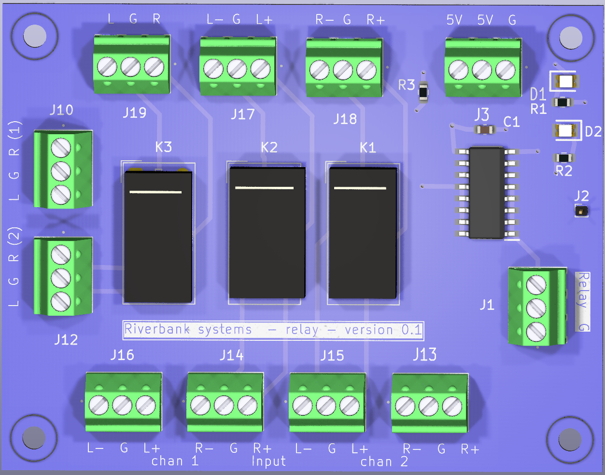

### Input Selector Board

A two-input analogue source selector. Three relays switch between **Input 1** and **Input 2** for stereo balanced and stereo single-ended signals. All relays switch together from one control input.

#### What It Does

- **K1** switches the left balanced signal, **K2** the right balanced signal, and **K3** the stereo single-ended signal.
- Each relay is a two-pole changeover. With the relay **off**, **Input 1** is routed to the output. With the relay **on**, **Input 2** is routed to the output.
- A ULN2003LV driver (IC1) energises all three relay coils together when the control input is driven.

**Signal path:** input connectors → K1 / K2 / K3 contacts → output connectors J17, J18, J19

#### Connectors

All connectors are 3-pin (1725669) unless noted.

##### Signal Inputs

| Ref | Signal | Pin 1 | Pin 2 | Pin 3 |
|---|---|---|---|---|
| J15 | Input 1 balanced left | − | sig ground | + |
| J16 | Input 1 balanced right | − | sig ground | + |
| J13 | Input 2 balanced left | − | sig ground | + |
| J14 | Input 2 balanced right | − | sig ground | + |
| J10 | Input 1 single-ended | L | sig ground | R |
| J12 | Input 2 single-ended | L | sig ground | R |

##### Signal Outputs

| Ref | Signal | Pin 1 | Pin 2 | Pin 3 |
|---|---|---|---|---|
| J18 | Balanced left out | + | sig ground | − |
| J17 | Balanced right out | + | sig ground | − |
| J19 | Single-ended out | R | sig ground | L |

**The output pin order is reversed compared with the inputs.** On the balanced outputs, pin 1 is + and pin 3 is −. On the single-ended output, pin 1 is R and pin 3 is L.

##### Power and Control

| Ref | Use | Pins |
|---|---|---|
| J3 | 5 V DC power | 1 = GND, 2 and 3 = +5 V |
| J1 | Switch control input | 1 = GND, 2 and 3 = control (tied together) |
| J2 | Earth | Single socket to chassis earth |

#### Relays

| Ref | Part | Switches | Off (Input 1) | On (Input 2) |
|---|---|---|---|---|
| K1 | EC2-5SNU | Balanced left | Pins 3 and 10 | Pins 5 and 8 |
| K2 | EC2-5SNU | Balanced right | Pins 3 and 10 | Pins 5 and 8 |
| K3 | EC2-5SNU | Single-ended L and R | Pins 3 and 10 | Pins 5 and 8 |

- Common (output) contacts are pin 4 (− or L) and pin 9 (+ or R).
- The coil is between +5 V (pin 1) and `switch power` (pin 12), which IC1 pulls to ground.

#### Control Circuit

- **J1:** driving the control input high turns all three relays on.
- **IC1 (ULN2003LVDR):** IN1 to IN5 are tied together, and OUT1 to OUT5 are tied together, which gives one high-current sink for all three coils. IN6, IN7, OUT6 and OUT7 are unused. COM goes to +5 V.
- **D2 and R2 (1 kΩ):** indicator LED, lit when the control input is high.
- A schematic note says all lines are switched together unless testing.

#### Power

- **J3** supplies +5 V. **D1 with R1 (1 kΩ)** is the power indicator.
- **C1 (100 nF)** decouples the 5 V rail.
- **R3 (10 Ω)** links the signal ground (`sig ground`) to the power ground (`GND2`). They are not connected directly.

#### Quick Checks

| Check | Expected |
|---|---|
| J3 pin 2 or 3 to pin 1 | +5 V |
| D1 | Lit when powered |
| J1 control low | D2 off, relays off, Input 1 selected |
| J1 control high | D2 lit, relays click, Input 2 selected |
| Relay coil voltage (pin 1 to pin 12) | About 5 V when control is high, 0 V when low |

#### Quick Troubleshooting

| Symptom | Check |
|---|---|
| No power LED | J3 supply and polarity, then R1 and D1 |
| No relay operates | +5 V on the relay rail, IC1 GND (pin 8) and COM (pin 9), control signal at J1 |
| D2 lit but relays do not switch | IC1 outputs, `switch power` net, relay coils |
| D2 never lights | Control signal on J1, R2 and D2 |
| No signal at output | Selected input connected, relay contacts, output wiring |
| Left or right channel reversed or inverted | Output pin order is reversed (see connectors) |
| Hum or noise | R3 ground link, input grounds, earth connection on J2 |

#### Notes

- Relay symbols show S+ and R+ coil markings. The part (EC2-5SNU) should be a single-coil non-latching relay; confirm with the datasheet if a relay does not return to Input 1 when control is released.
- The control input has no stated voltage range in the schematic. Check the ULN2003LV datasheet for the input threshold before connecting a controller.
- Pin and net details were read from a screenshot. Confirm against the KiCad schematic before using them for repairs.

### Power Relay Board

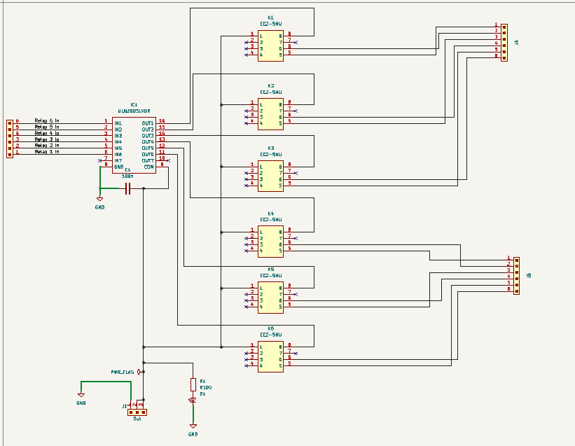

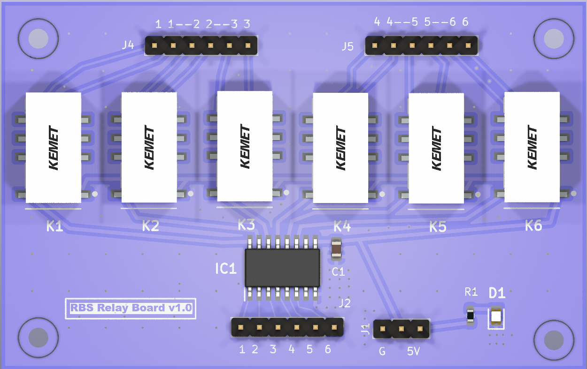

### 6-Channel Relay Board

A six-relay switching board. Logic-level control inputs drive a ULN2003LV transistor array, which energises six 5 V relays. Each relay brings out one switched contact pair on a screw terminal.

#### What It Does

**Signal path:** J2 (control inputs) → IC1 ULN2003LVDR → relay coils K1–K6 → contact pairs on J4 and J5

An input going high turns on the matching driver output, which pulls the relay coil to GND and closes the relay.

#### Connectors

| Ref | Use | Pins |
|---|---|---|
| J1 | Power input | 1 = GND, 2 and 3 = supply (+5 V, see Notes) |
| J2 | Control inputs | 1 to 6 = Relay 1 In to Relay 6 In |
| J4 | Relay contacts, K1 to K3 | 1-2 = K1, 3-4 = K2, 5-6 = K3 |
| J5 | Relay contacts, K4 to K6 | 1-2 = K4, 3-4 = K5, 5-6 = K6 |

All connectors are screw terminals.

#### Input-to-Relay Mapping

**The numbering is reversed between the inputs and the relays.**

| J2 input | IC1 input | IC1 output | Relay | Contacts at |
|---|---|---|---|---|
| Relay 6 In (pin 6) | IN1 | OUT1 | K1 | J4 pins 1-2 |
| Relay 5 In (pin 5) | IN2 | OUT2 | K2 | J4 pins 3-4 |
| Relay 4 In (pin 4) | IN3 | OUT3 | K3 | J4 pins 5-6 |
| Relay 3 In (pin 3) | IN4 | OUT4 | K4 | J5 pins 1-2 |
| Relay 2 In (pin 2) | IN5 | OUT5 | K5 | J5 pins 3-4 |
| Relay 1 In (pin 1) | IN6 | OUT6 | K6 | J5 pins 5-6 |

IN7 and OUT7 are not used.

#### Components

| Ref | Part | Function |
|---|---|---|
| IC1 | ULN2003LVDR | 7-channel low-voltage Darlington driver; 6 channels used |
| K1–K6 | EE2-5NU | 5 V coil signal relays |
| C1 | 100 nF | Decoupling on the supply rail |
| R1 + D1 | 300 Ω + LED | Power-on indicator |

##### Relay Wiring

- **Coil:** pin 1 goes to the supply rail and pin 8 to the driver output.
- **Contacts:** only pins 5 and 6 of each relay are brought out, so each relay gives one switched contact pair. Pin 7 and pins 2 to 4 are unused.
- IC1 pin 9 (COM) is tied to the supply rail, which connects the driver's internal flyback diodes to the coil supply.

#### Quick Checks

| Check | Expected |
|---|---|
| J1 pin 2 or 3 to pin 1 | Supply voltage (+5 V) |
| D1 | Lit when powered |
| Relay coil (pin 1 to pin 8) with input high | About supply voltage, relay clicks |
| Relay coil with input low | 0 V across the coil |

#### Quick Troubleshooting

| Symptom | Check |
|---|---|
| D1 off | Supply on J1, polarity, then R1 and D1 |
| No relay operates | Supply on the relay rail, IC1 pin 8 (GND) and pin 9 (COM) |
| One relay does not operate | Input signal on J2, then IC1 input and output, then the coil |
| Wrong relay switches | Input numbering is reversed (see mapping table) |
| Relay clicks but no contact change | Wiring on J4 or J5, then the relay contacts |
| Relay stuck on | Input pin held high, shorted IC1 output, or damaged relay |
| Intermittent resets or noise | C1 and the supply rail |

#### Notes

- The supply voltage is not labelled in the schematic. The EE2-5NU coils are 5 V, so it should be +5 V. Confirm before connecting.
- The reversed numbering between J2 and the relays is easy to miss. Check which relay you are testing.
- Whether the contact on pin 5 is normally open or normally closed depends on the relay datasheet. Confirm before wiring the load.
- Pin and net details were read from a screenshot. Confirm against the KiCad schematic before using them for repairs.

### Raspberry Pi DAC Power Board

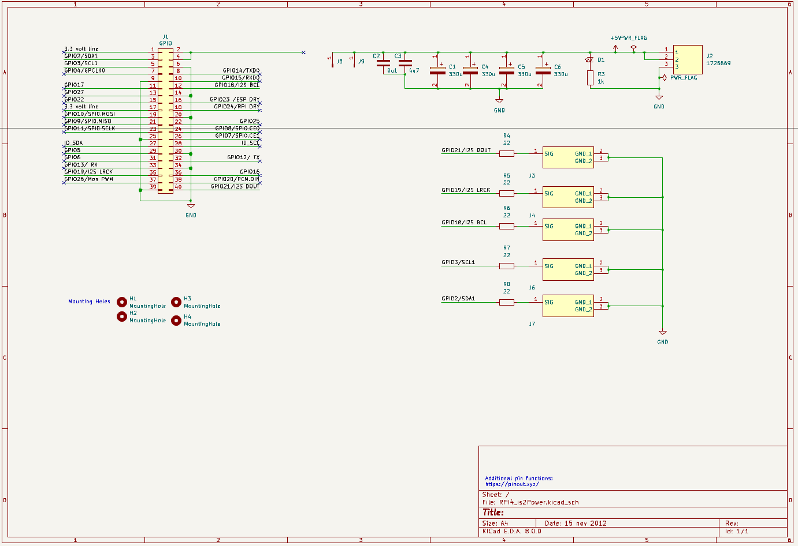

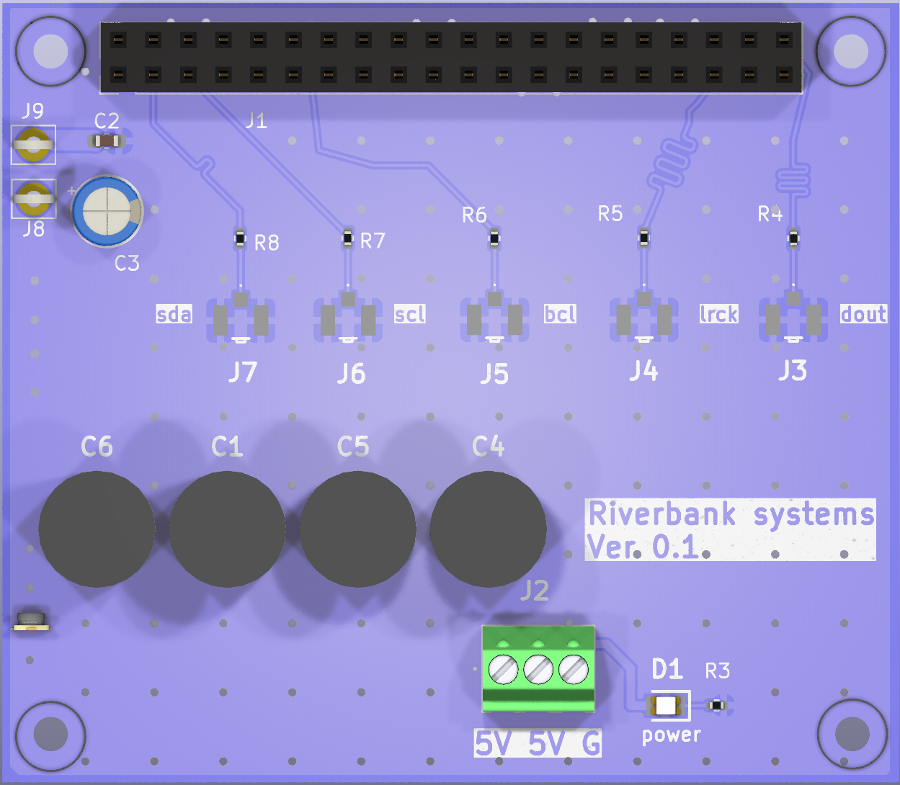

# Raspberry Pi Interface Board (5 V Supply and I2S / I2C Outputs): Service Guide

A board that mates with a Raspberry Pi 40-pin header. It provides a filtered 5 V supply for the Pi and brings the I2S and I2C signals out to five signal connectors through 22 Ω series resistors. A few other GPIO lines are named for use elsewhere in the system.

## What it does

- **5 V in:** J7 supplies +5 V to the Pi through header pins 2 and 4, with bulk and decoupling capacitors on the rail.
- **Digital audio out:** I2S data, word clock and bit clock go to three signal connectors through 22 Ω resistors.
- **I2C out:** SDA and SCL go to two more signal connectors through 22 Ω resistors.
- **System lines:** a handshake pair, a serial pair and a PWM monitor line are named on the header (see below).

## Connectors

| Ref | Part | Use |
|---|---|---|
| J3 | 70246-4001 (2 x 20) | Raspberry Pi 40-pin header |
| J7 | 1x03 socket | 5 V power input: pins 1 and 2 = +5 V, pin 3 = GND |
| J6 | 1725672 (4-pin) | Ground terminal, all four pins tied to GND |
| J4, J5, J8, J13 | Single pin | +5 V take-off pins |
| J14 | Single pin | Connected to GND2, labelled "5v pin" (see Notes) |
| 5 signal connectors | SIG, GND_1, GND_2 | One per signal below (refs J2, J9, J10, J11 and one more; ref positions not clear on the screenshot) |
| J1 | 2 x 20 "GPIO" header | No connections drawn on this sheet (see Notes) |

## Signal outputs

Each signal passes through a 22 Ω series resistor to pin 1 (SIG) of its connector. Pins 2 and 3 are GND.

| Signal | Pi GPIO | Header pin | Resistor |
|---|---|---|---|
| I2S data out | GPIO21 / I2S DOUT | 40 | R1 |
| I2S word clock | GPIO19 / I2S LRCK | 35 | R2 |
| I2S bit clock | GPIO18 / I2S BCL | 12 | R3 |
| I2C clock | GPIO3 / SCL1 | 5 | R4 |
| I2C data | GPIO2 / SDA1 | 3 | R5 |

## Other named lines on J3

These lines are labelled on the header with no connection shown on this sheet.

| Signal | Pi GPIO | Header pin |
|---|---|---|
| ESP DRY | GPIO23 | 16 |
| RPI DRY | GPIO24 | 18 |
| Serial TX | GPIO12 | 32 |
| Serial RX | GPIO13 | 33 |
| Mon PWM | GPIO26 | 37 |

All other header pins (SPI, UART0, ID EEPROM, GPIO4, 5, 6, 7, 8, 16, 17, 20, 22, 25, 27 and others) are marked no-connect.

## Power

| Item | Detail |
|---|---|
| Input | J7 pins 1 and 2 = +5 V, pin 3 = GND |
| To Pi | +5 V on J3 pins 2 and 4 |
| 3.3 V | J3 pins 1 and 17 (from the Pi; only a power flag on this sheet) |
| GND | J3 pins 6, 9, 14, 20, 25, 30, 34, 39 |
| Bulk capacitance | C2, C3, C5, C6 (470 µF each, 1880 µF total) |
| Other capacitors | C4 (4.7 µF), C7 (0.1 µF) |
| Indicator | D1 with R6 (1 kΩ), lit when +5 V is present |

## Quick checks

| Check | Expected |
|---|---|
| J7 pin 1 or 2 to pin 3 | +5 V |
| D1 | Lit |
| J3 pin 2 or 4 to GND | +5 V |
| J3 pin 1 or 17 to GND | +3.3 V (Pi running) |
| Signal pin on a connector | 3.3 V logic from the Pi when active |

## Quick troubleshooting

| Symptom | Check |
|---|---|
| D1 off | Supply on J7, polarity, then R6 and D1 |
| Pi does not power up | +5 V at J3 pins 2 and 4, supply current capability, connector seating on the Pi |
| No I2S or I2C signal at a connector | Pi software configuration, then the 22 Ω resistor, then the connector |
| I2S output distorted or missing | Check all three I2S signals (clock, word clock, data) are reaching their connectors |
| Rail droops or Pi resets | Supply wiring and capacity, bulk capacitors C2, C3, C5, C6 |
| Noisy signals | Ground connections at pins 2 and 3 of each signal connector, GND link to J6 |

## Notes

- **Powering the Pi from the 40-pin header** bypasses the Pi's own input protection. Use a supply of the correct voltage and rating, and do not connect USB power at the same time as J7.
- **J14** is labelled "5v pin" but is connected to GND2, which has no other connection on this sheet. Check whether it is a mislabelled ground pin.
- **J1** shows no wiring on this sheet. It may be a footprint-only or unfinished part; confirm in the KiCad project.
- **I2C lines** have only 22 Ω series resistors on this sheet and no pull-ups. The Pi has on-board pull-ups on GPIO2 and GPIO3, but check the downstream device if I2C is unreliable.
- Pin and net details were read from a screenshot. Confirm against the KiCad schematic before using them for repairs.

### Current-Limited Power Switch and Capacitor Bank

#### Circuit Schematic and Board

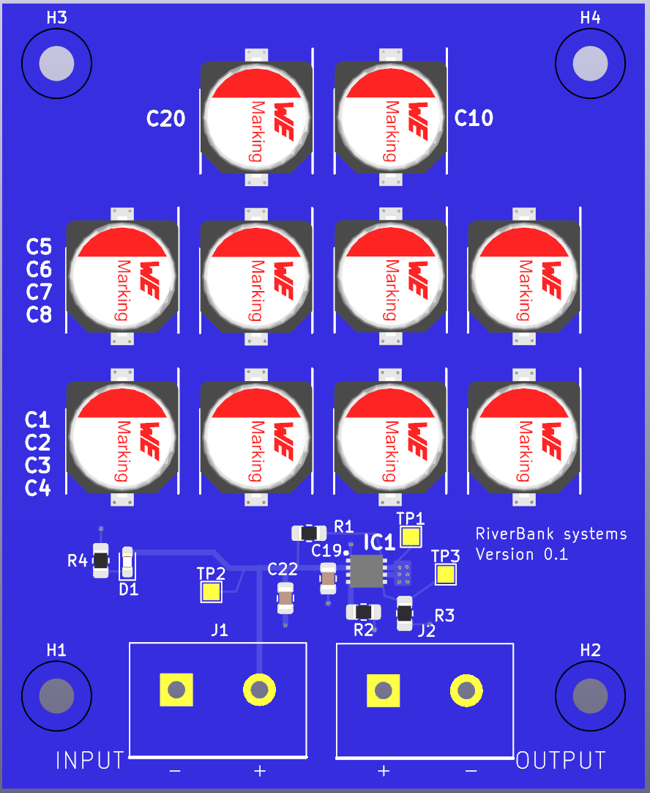

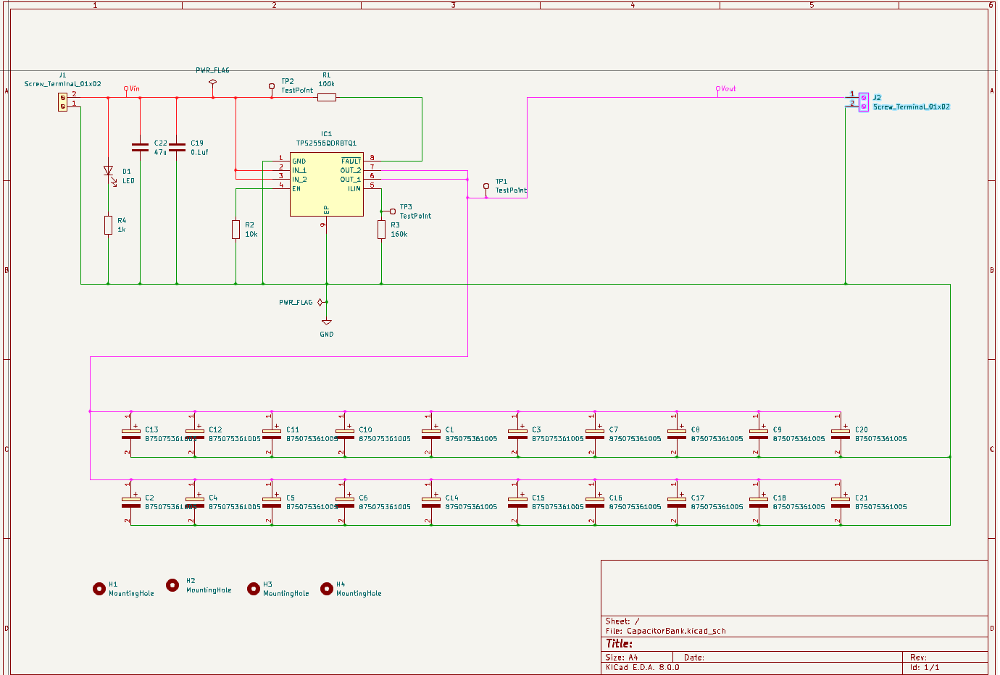

A DC supply passes through a TPS2556-Q1 current-limited power switch into a large capacitor bank and an output connector. The switch limits inrush and overload current.

#### What It Does

- **IC1 (TPS2556QDRBTQ1)** is an adjustable current-limit high-side switch. It is always enabled and limits output current to a level set by R3.
- Twenty parallel capacitors on the output (C1 to C18, C20, C21) form a bulk store.
- A fault flag (`FAULT`) goes low when the switch is in overcurrent or thermal shutdown.

**Power path:** J1 (Vin) → IC1 → Vout → J2, with the capacitor bank on Vout

#### Connectors

| Ref | Pin | Net |
|---|---|---|
| J1 | 2 | Vin (supply +) |
| J1 | 1 | GND |
| J2 | 1 | Vout (protected +) |
| J2 | 2 | GND |

#### Components

| Ref | Value | Function |
|---|---|---|
| IC1 | TPS2556QDRBTQ1 | Current-limited power switch |
| R1 | 100k | Pull-up on `FAULT` (open-drain, active low) |
| R2 | 10k | Pull-down on EN to GND; keeps the switch enabled |
| R3 | 160k | ILIM resistor, sets the current limit |
| R4 + D1 | 1k + LED | Power-present indicator on Vin |
| C22 | 47 µF | Input bulk capacitor |
| C19 | 0.1 µF | Input decoupling |
| C1 to C18, C20, C21 | 875075361005 (x20) | Output bulk capacitors, all in parallel |
| TP1 | Test point | Vout |
| TP2 | Test point | Vin |
| TP3 | Test point | ILIM node |

##### IC1 Pin Connections

| Pin | Name | Connection |
|---|---|---|
| 1 | GND | GND |
| 2, 3 | IN_1, IN_2 | Vin |
| 4 | EN | GND through R2 |
| 5 | ILIM | R3 to GND, TP3 |
| 6, 7 | OUT_1, OUT_2 | Vout |
| 8 | FAULT | Pulled to Vin by R1 |
| 9 (EP) | Thermal pad | GND |

#### Operation

1. With Vin applied, D1 lights.
2. EN is held low, so IC1 turns on and charges the output bank.
3. If the load or bank charge current reaches the limit set by R3, IC1 holds the current at that limit instead of passing more.
4. In a sustained overload or over-temperature condition, `FAULT` goes low and the switch protects itself.

#### Quick Checks

| Check | Expected |
|---|---|
| J1 pin 2 to pin 1 | Supply voltage, within 2.5 V to 6.5 V |
| D1 | Lit |
| TP2 | Same as supply voltage |
| TP1 (Vout) | Close to Vin once the bank has charged |
| IC1 pin 8 (`FAULT`) | High (about Vin) in normal operation |
| IC1 pin 4 (EN) | Low (0 V) |

#### Quick Troubleshooting

| Symptom | Check |
|---|---|
| D1 off | Supply on J1, polarity, then R4 and D1 |
| No Vout | Vin at IC1 pins 2 and 3, EN at 0 V, `FAULT` state, then IC1 |
| `FAULT` low | Overcurrent or over-temperature; check for a short or an overloaded output, then remove the load |
| Vout rises slowly or cycles on and off | Bank charging at the current limit; IC1 may be heating and restarting. Check for shorts, then check that the load is not drawing current during start-up |
| Vout low under load | Load current is above the limit set by R3 |
| IC1 very hot | Output short, load above the limit, or a large bank charging at the limit |
| Limit looks wrong | R3 value and its connection to ILIM (TP3), then the datasheet table |

#### Notes

- **Current limit:** R3 = 160k. For reference, the datasheet lists 61.9k as about 1.8 A typical, so 160k should be roughly 0.7 A. This is an estimate; confirm with the datasheet equation and tolerance table.
- **EN polarity:** the TPS2556 enable is active low, so pulling EN to GND through R2 leaves the switch on permanently. Do not change this to a pull-up.
- **Input range:** 2.5 V to 6.5 V. Check that Vin and every output capacitor rating fit this range.
- **Bank capacitance:** the total is 20 times the single-part value (see the BOM). Charge time is roughly total capacitance x Vin / current limit.
- **FAULT** is not routed to a connector or test point. Probe IC1 pin 8 or the right-hand end of R1.
- Pin and net details were read from a screenshot. Confirm against the KiCad schematic before using them for repairs.

## Mechanical Construction and Wiring

### Enclosure Drawings

#### Streamer and DAC Enclosure

##### Front Panel

##### Side Panels

##### Top Panel

Top panel for the streamer and DAC enclosure.

#### Power Supply Enclosure

##### Front Panel

##### Rear Panel

#### Inner Case

##### Front Panel

##### Rear Panel

#### Final Assembly

#### MonitorPi Pro

##### PCB Stack-up

See the [MonitorPi Pro manual](https://github.com/iancanada/DocumentDownload/blob/master/MonitorPi/MonitorPiPro/MonitorPiProManual.pdf) for component details.

### Main Assembly Bill of Materials

<table style="width:93%;">
<colgroup>
<col style="width: 24%" />
<col style="width: 41%" />
<col style="width: 26%" />
</colgroup>
<thead>
<tr>
<th>Description</th>
<th>Part number</th>
<th style="text-align: center;">Quantity</th>
</tr>
</thead>
<tbody>
<tr>
<td>Super Capacitors 25f</td>
<td><a href="https://www.mouser.co.uk/ProductDetail/723-BCAP0325P270S19"><u>723-BCAP0325P270S19</u></a></td>
<td style="text-align: center;">4</td>
</tr>
<tr>
<td>Power Transformer</td>
<td>546-1182N6</td>
<td style="text-align: center;">1</td>
</tr>
<tr>
<td>Transformer</td>
<td>546-1182M9</td>
<td style="text-align: center;">1</td>
</tr>
<tr>
<td>Power Transformer</td>
<td><a href="https://uk.farnell.com/vigortronix/vtx-146-060-206/60va-toroidal-transformer-2x6v/dp/2817656"><u> VTX-146-060-206</u></a></td>
<td style="text-align: center;">1</td>
</tr>
<tr>
<td>Schaffner filter</td>
<td>FN9290-4-06</td>
<td style="text-align: center;">1</td>
</tr>
<tr>
<td>Fuses</td>
<td>BK8-HTC-603M</td>
<td style="text-align: center;">5</td>
</tr>
<tr>
<td>USB Adapters</td>
<td>NAUSB3-B</td>
<td style="text-align: center;">2</td>
</tr>
<tr>
<td>HDMI</td>
<td>NAHDMI-W-B</td>
<td style="text-align: center;">1</td>
</tr>
<tr>
<td>SPDIF</td>
<td>NF2D-B-0</td>
<td style="text-align: center;">1</td>
</tr>
<tr>
<td>XLR out</td>
<td><a href="https://www.mouser.co.uk/ProductDetail/Neutrik/NC3MDM3LBAG-1?qs=%252B86TLfaev29PPTEig8yI5g%3D%3D"><u>NC3MDM3LBAG-1</u></a></td>
<td style="text-align: center;">2</td>
</tr>
<tr>
<td>Ethernet panel</td>
<td>ENCOS24D2S65R</td>
<td style="text-align: center;">1</td>
</tr>
<tr>
<td>Optical input</td>
<td>CP30217MB</td>
<td style="text-align: center;">1</td>
</tr>
<tr>
<td>PX0794/S</td>
<td>PX0794/S</td>
<td style="text-align: center;">2</td>
</tr>
<tr>
<td>PX0794/P</td>
<td>PX0794/P</td>
<td style="text-align: center;">2</td>
</tr>
<tr>
<td>control pushbutton</td>
<td>PV0H24011-311</td>
<td style="text-align: center;">12</td>
</tr>
<tr>
<td>PX0708/P/12</td>
<td> </td>
<td style="text-align: center;">1</td>
</tr>
<tr>
<td>PX0708/S/12</td>
<td> </td>
<td style="text-align: center;">1</td>
</tr>
<tr>
<td>177-PX0709/P/07</td>
<td></td>
<td style="text-align: center;">1</td>
</tr>
<tr>
<td>167-PX0709/S/07</td>
<td></td>
<td style="text-align: center;">1</td>
</tr>
<tr>
<td><a href="https://www.mouser.co.uk/ProductDetail/167-PX0745-P-07"><u>167-PX0745/P/07</u></a></td>
<td></td>
<td style="text-align: center;">1</td>
</tr>
<tr>
<td><a href="https://www.mouser.co.uk/ProductDetail/167-PX0745-S"><u>167-PX0745/S</u></a></td>
<td></td>
<td style="text-align: center;">1</td>
</tr>
<tr>
<td><a href="https://www.mouser.co.uk/ProductDetail/157-SA3348-1"><u>157-SA3348/1</u></a></td>
<td></td>
<td style="text-align: center;">2</td>
</tr>
<tr>
<td><a href="https://www.mouser.co.uk/ProductDetail/157-SA3347-1"><u>157-SA3347/1</u></a></td>
<td></td>
<td style="text-align: center;">2</td>
</tr>
<tr>
<td>157-13027/1</td>
<td></td>
<td style="text-align: center;">1</td>
</tr>
<tr>
<td>Encoder</td>
<td><strong>62D11-02-060C</strong></td>
<td style="text-align: center;">1</td>
</tr>
<tr>
<td>Encoder Plug</td>
<td>06SR-3S</td>
<td style="text-align: center;">2</td>
</tr>
<tr>
<td style="text-align: center;"></td>
<td><a href="https://www.audiophonics.fr/en/accessories-and-cases/ian-canada-fifopi-q7-synchronous-fifo-reclocker-board-i2s-32bit-768khz-dsd1024-dop256-p-16855.html"><u>IAN CANADA FIFOPI Q7 Synchronous FIFO Reclocker Board I2S 32bit 768kHz DSD1024 DoP256</u></a></td>
<td style="text-align: center;"><strong>1</strong></td>
</tr>
<tr>
<td style="text-align: center;"></td>
<td><a href="https://www.audiophonics.fr/en/linear-regulated-psu/ian-canada-linearpi-dual-ultra-low-noise-linear-power-supply-module-2x-5v-33v-25a-p-14760.html"><u>IAN CANADA LINEARPI DUAL Ultra-Low Noise Linear Power Supply Module 2x +/-5V / +/-3.3V 2.5A</u></a></td>
<td style="text-align: center;"><strong>1</strong></td>
</tr>
<tr>
<td style="text-align: center;"></td>
<td><a href="https://www.audiophonics.fr/en/accessories-and-cases/ian-canada-stationpi-pro-raspberry-pi-and-hat-boards-adapter-station-p-16550.html"><u>IAN CANADA STATIONPI PRO Raspberry Pi and HAT Boards Adapter Station</u></a></td>
<td style="text-align: center;"><strong>1</strong></td>
</tr>
<tr>
<td style="text-align: center;"></td>
<td><a href="https://www.audiophonics.fr/en/composants-electronique-horloges/crystek-cchd-957-ultra-low-phase-noise-clock-451584mhz-33v-25ppm-p-14165.html"><u>CRYSTEK CCHD-957 Ultra Low Phase Noise Clock 45.1584MHz 3.3V 25ppm</u></a></td>
<td style="text-align: center;"><strong>1</strong></td>
</tr>
<tr>
<td style="text-align: center;"></td>
<td><a href="https://www.audiophonics.fr/en/composants-electronique-horloges/crystek-cchd-957-ultra-low-phase-noise-clock-49152mhz-33v-25ppm-p-14166.html"><u>CRYSTEK CCHD-957 Ultra Low Phase Noise Clock 49.152MHz 3.3V 25ppm</u></a></td>
<td style="text-align: center;"><strong>1</strong></td>
</tr>
<tr>
<td style="text-align: center;"></td>
<td><a href="https://www.audiophonics.fr/en/composants-electronique-horloges/ian-canada-cchd957-supports-adaptateurs-pour-horloges-xo-x2-p-13825.html"><u>IAN CANADA CCHD957 Adapter Supports for XO Clocks and SMT Capacitors (x2)</u></a></td>
<td style="text-align: center;"><strong>1</strong></td>
</tr>
<tr>
<td style="text-align: center;"></td>
<td><a href="https://www.audiophonics.fr/en/linear-regulated-psu/ian-canada-linearpi-mkii-solo-ultra-low-noise-linear-power-supply-module-5v-33v-12v-25a-p-17611.html"><u>IAN CANADA LINEARPI MKII SOLO Ultra-Low Noise Linear Power Supply Module 5V / 3.3V / 12V 2.5A</u></a></td>
<td style="text-align: center;"><strong>2</strong></td>
</tr>
<tr>
<td style="text-align: center;"></td>
<td><a href="https://www.audiophonics.fr/en/composants-electronique-horloges/accusilicon-as318-b-451584-ultra-low-jitter-clock-45mhz-p-14033.html"><u>ACCUSILICON AS318-B-451584 Ultra Low Jitter Clock 45MHz</u></a></td>
<td style="text-align: center;"><strong>1</strong></td>
</tr>
<tr>
<td style="text-align: center;"></td>
<td><a href="https://www.audiophonics.fr/en/composants-electronique-horloges/accusilicon-as318-b-491520-ultra-low-jitter-clock-49mhz-p-14034.html"><u>ACCUSILICON AS318-B-491520 Ultra Low Jitter Clock 49MHz</u></a></td>
<td style="text-align: center;"><strong>1</strong></td>
</tr>
<tr>
<td style="text-align: center;"></td>
<td><a href="https://www.audiophonics.fr/en/accessories-and-cases/ian-canada-monitorpi-pro-control-center-and-signal-analyzer-with-display-for-raspberry-pi-p-18285.html"><u>IAN CANADA MONITORPI PRO Control Center and Signal Analyzer with Display for Raspberry Pi</u></a></td>
<td style="text-align: center;"><strong>1</strong></td>
</tr>
<tr>
<td style="text-align: center;"></td>
<td><a href="https://www.audiophonics.fr/en/dac-and-interface-modules/ian-canada-receiverpi-pro-ii-interface-spdif-i2s-hdmi-for-raspberry-pi-p-18283.html"><u>IAN CANADA RECEIVERPI PRO II Interface SPDIF I2S HDMI for Raspberry Pi</u></a></td>
<td style="text-align: center;"><strong>1</strong></td>
</tr>
<tr>
<td style="text-align: center;"></td>
<td><a href="https://www.audiophonics.fr/en/power-supply-accessories/ian-canada-ucconditioner-mkii-ultra-capacitor-conditioner-board-33v-p-17924.html"><u>IAN CANADA UCCONDITIONER MKII Ultra Capacitor Conditioner Board 3.3V</u></a></td>
<td style="text-align: center;"><strong>1</strong></td>
</tr>
<tr>
<td style="text-align: center;"></td>
<td><a href="https://www.audiophonics.fr/en/aluminium-boxes-cases/100-aluminium-diy-box-case-round-corners-319x239x89mm-black-p-11342.html"><u>100% Aluminium DIY Box / Case round corners 320x240x90mm Black</u></a></td>
<td style="text-align: center;"><strong>1</strong></td>
</tr>
<tr>
<td style="text-align: center;"></td>
<td><a href="https://www.audiophonics.fr/en/accessories-and-cases/ian-canada-gpio-40pin-extension-kit-for-raspberry-pi-p-16816.html"><u>IAN CANADA GPIO 40PIN Extension Kit for Raspberry Pi</u></a></td>
<td style="text-align: center;"><strong>1</strong></td>
</tr>
<tr>
<td style="text-align: center;"></td>
<td><a href="https://www.audiophonics.fr/en/power-supply-accessories/ian-canada-ucconditioner-mkii-ultra-capacitor-conditioner-board-5v-p-17923.html"><u>IAN CANADA UCCONDITIONER MKII Ultra Capacitor Conditioner Board 5V</u></a></td>
<td style="text-align: center;"><strong>1</strong></td>
</tr>
<tr>
<td rowspan="3" style="text-align: center;"></td>
<td><a href="https://www.audiophonics.fr/en/knobs-6mm/aluminum-button-d-shaft-40mm-o6mm-black-p-15050.html"><u>Aluminum Button D Shaft 40mm Ø6mm Black</u></a></td>
<td style="text-align: center;"><strong>4</strong></td>
</tr>
<tr>
<td><a href="https://www.audiophonics.fr/en/cylindrical-head-screw/hollow-head-screw-steel-btr-m3x5mm-x10-p-11549.html"><u>Hollow Head Screw Steel BTR M3x5mm (x10)</u></a></td>
<td style="text-align: center;"><strong>2</strong></td>
</tr>
<tr>
<td><a href="https://www.audiophonics.fr/en/linear-regulated-psu/ian-canada-linearpi-mkii-solo-ultra-low-noise-linear-power-supply-module-5v-33v-12v-25a-p-17611.html"><u>IAN CANADA LINEARPI MKII SOLO Ultra-Low Noise Linear Power Supply Module 5V / 3.3V / 12V 2.5A</u></a></td>
<td style="text-align: center;"><strong>1</strong></td>
</tr>
<tr>
<td style="text-align: center;"></td>
<td><a href="https://www.audiophonics.fr/en/linear-regulated-psu/lhy-audio-dual-linear-power-supply-module-lt3042-2x5v-15a-p-17276.html"><u>LHY AUDIO Dual Linear Power Supply Module LT3042 2x5V 1.5A</u></a></td>
<td style="text-align: center;"><strong>1</strong></td>
</tr>
<tr>
<td style="text-align: center;"></td>
<td><a href="https://www.audiophonics.fr/en/power-supply-accessories/micro-usb-male-to-to-bare-wire-power-cable-raspberry-pi-24awg-20cm-p-9405.html"><u>Micro USB male-to-bare-wire power cable, Raspberry Pi, 24 AWG, 20 cm</u></a></td>
<td style="text-align: center;"><strong>2</strong></td>
</tr>
<tr>
<td style="text-align: center;"></td>
<td><a href="https://www.audiophonics.fr/en/selector-sources-module/single-ended-to-balanced-converter-module-xlr-rca-stereo-p-18248.html"><u>Single-Ended to Balanced Converter Module XLR / RCA Stereo</u></a></td>
<td style="text-align: center;"><strong>1</strong></td>
</tr>
<tr>
<td style="text-align: center;"></td>
<td><a href="https://www.audiophonics.fr/en/transformers-accessories/toroid-cover-metal-iron-shield-transformer-88x62mm-p-11513.html"><u>Toroid Cover Metal Iron Shield Transformer 88x62mm</u></a></td>
<td style="text-align: center;"><strong>2</strong></td>
</tr>
<tr>
<td>

<table style="width:22%;">
<colgroup>
<col style="width: 22%" />
</colgroup>
<thead>
<tr>
<th style="text-align: center;"> </th>
</tr>
</thead>
<tbody>
</tbody>
</table></td>
<td><a href="https://www.audiophonics.fr/en/toroidal-transformers/toroidal-transformer-15va-2x12v-p-7040.html"><u>Toroidal Transformer 15VA 2x12V</u></a></td>
<td style="text-align: center;"><strong>1</strong></td>
</tr>
</tbody>
</table>

### Wiring Guide

*Wiring documentation is still in progress. Items marked “To do” need diagrams, photographs, or measured values before the build procedure is complete.*

#### Chassis Layout — To Do

*Photo of the complete internal layout.*

##### Board Placement — To Do

*Photo for each board location.*

##### Front Panel Assembly — To Do

*Buttons, LEDs, display.*

##### Rear Panel Assembly — To Do

*Connectors, switches, fuses.*

##### Transformer Placement — To Do

*Photos and dimensions.*

#### Wiring Conventions

Wire colours, cable types, shielding, and connector types used throughout the build:

| Function  | Colour |
|-----------|--------|
| +5V       | Red    |
| Ground    | Black  |
| I2S Data  | Blue   |
| I2S Clock | Yellow |

#### Interconnect Diagram — To Do

*Full system wiring diagram.*

#### Power Wiring — To Do

*Detailed diagrams.*

#### Signal Wiring — To Do

*Detailed diagrams.*

#### Grounding Scheme — To Do

*Document chassis earth, signal ground, power ground, and cable-shield connections.*

## Power Supplies

*Supply currents and distribution details are still to be confirmed; replace placeholder values with measured or verified specifications before construction.*

### Supply Overview

<table>
<colgroup>
<col style="width: 86%" />
<col style="width: 6%" />
<col style="width: 6%" />
</colgroup>
<thead>
<tr>
<th>Rail</th>
<th>Voltage</th>
<th>Current</th>
</tr>
</thead>
<tbody>
<tr>
<td>Digital</td>
<td>5V</td>
<td>xxx mA</td>
</tr>
<tr>
<td>DAC Core</td>
<td>3.3V</td>
<td>xxx mA</td>
</tr>
<tr>
<td>Analogue</td>
<td>±15V</td>
<td>xxx mA</td>
</tr>
</tbody>
</table>

#### Bill of Materials

<table style="width:86%;">
<colgroup>
<col style="width: 17%" />
<col style="width: 15%" />
<col style="width: 12%" />
<col style="width: 41%" />
</colgroup>
<thead>
<tr>
<th style="text-align: center;">ProductID</th>
<th style="text-align: center;">Description</th>
<th style="text-align: center;">URL</th>
<th style="text-align: center;">Image</th>
</tr>
</thead>
<tbody>
<tr>
<td style="text-align: center;">723-BCAP0325P270S19</td>
<td style="text-align: center;">Super Capacitor 325F 2.7V (Maxwell/Eaton)</td>
<td style="text-align: center;"><a href="https://www.mouser.com/ProductDetail/723-BCAP0325P270S19">Mouser</a></td>
<td style="text-align: center;"></td>
</tr>
<tr>
<td style="text-align: center;">546-1182N6</td>
<td style="text-align: center;">Hammond Power Transformer 6V+6V 20VA</td>
<td style="text-align: center;"><a href="https://www.mouser.com/ProductDetail/546-1182N6">Mouser</a></td>
<td style="text-align: center;">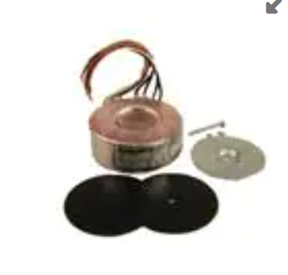</td>
</tr>
<tr>
<td style="text-align: center;">546-1182M9</td>
<td style="text-align: center;">Hammond Power Transformer 9V+9V 20VA</td>
<td style="text-align: center;"><a href="https://www.mouser.com/ProductDetail/546-1182M9">Mouser</a></td>
<td style="text-align: center;"></td>
</tr>
<tr>
<td style="text-align: center;">VTX-146-060-206</td>
<td style="text-align: center;">Vigortronix Power Transformer 6VA 2x6V</td>
<td style="text-align: center;"><a href="https://www.switchelectronics.co.uk/products/vtx-146-050-206-toroidal-transformer-50va-0-6v-vigortronix?currency=GBP&amp;country=GB&amp;variant=45694220206389&amp;utm_source=google&amp;utm_medium=cpc&amp;utm_campaign=Google%20Shopping&amp;stkn=bbf1d20e1ed7&amp;gad_source=1&amp;gad_campaignid=23321857875&amp;gbraid=0AAAAAqEgT0BQfVbHs8KwmvJlH6DAzkAyo&amp;gclid=Cj0KCQjwjIPSBhCCARIsABGyK7vJPmnLQInHhnEMVQb2GtcvyNNqW93mJx-GKBlvhf_wyRRO4Ft1ehoaAvjYEALw_wcB">switch Electronics</a></td>
<td style="text-align: center;">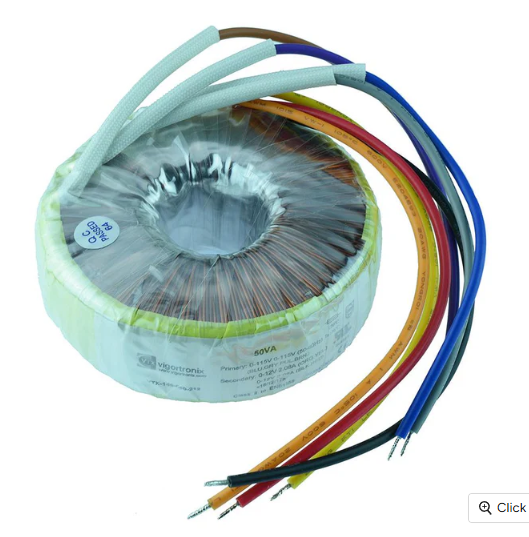</td>
</tr>
<tr>
<td style="text-align: center;">FN9290-4-06</td>
<td style="text-align: center;">Schaffner EMC Power Line Filter 4A</td>
<td style="text-align: center;"><a href="https://www.mouser.com/Search/Refine?Keyword=FN9290-4-06">Mouser Search</a></td>
<td style="text-align: center;">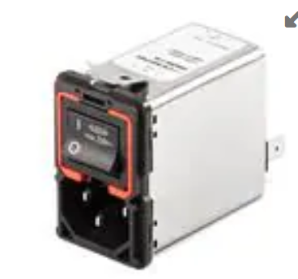</td>
</tr>
<tr>
<td style="text-align: center;">BK8-HTC-603M</td>
<td style="text-align: center;">Eaton/Bussmann Fuse Holder with Fuses</td>
<td style="text-align: center;"><a href="https://www.mouser.co.uk/ProductDetail/Eaton-Electronics/BK8-HTC-603M?qs=DRkmTr78QAR4GxQA20iXeg%3D%3D&amp;srsltid=AfmBOooluWFogsZrJNLhNb5vHrr31zGF7_oef6-Sheq1SS1CPsoGj9U4">Mouser</a></td>
<td style="text-align: center;"></td>
</tr>
<tr>
<td style="text-align: center;">NAUSB3-B</td>
<td style="text-align: center;">Neutrik USB 3.0 Feed-Through Adapter, Black D-shape</td>
<td style="text-align: center;"><a href="https://www.neutrik.com/en/product/nausb3-b">Neutrik</a></td>
<td style="text-align: center;">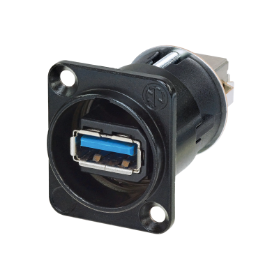</td>
</tr>
<tr>
<td style="text-align: center;">NAHDMI-W-B</td>
<td style="text-align: center;">Neutrik HDMI 2.0 Feed-Through Adapter, Black D-shape</td>
<td style="text-align: center;"><a href="https://www.neutrik.com/en/product/nahdmi-w-b">Neutrik</a></td>
<td style="text-align: center;">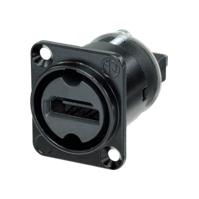</td>
</tr>
<tr>
<td style="text-align: center;">NF2D-B-0</td>
<td style="text-align: center;">Neutrik Phono/RCA Socket, Black D-shape (SPDIF)</td>
<td style="text-align: center;"><a href="https://www.neutrik.com/en/product/nf2d-b-0">Neutrik</a></td>
<td style="text-align: center;">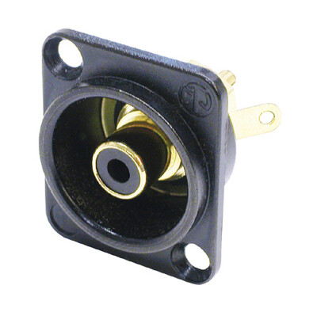</td>
</tr>
<tr>
<td style="text-align: center;">NC3MDM3LBAG-1</td>
<td style="text-align: center;">Neutrik XLR 3-pole Male Receptacle, Black D-shape, Silver Contacts</td>
<td style="text-align: center;"><a href="https://www.neutrik.com/en/product/nc3mdm3lbag-1">Neutrik</a></td>
<td style="text-align: center;">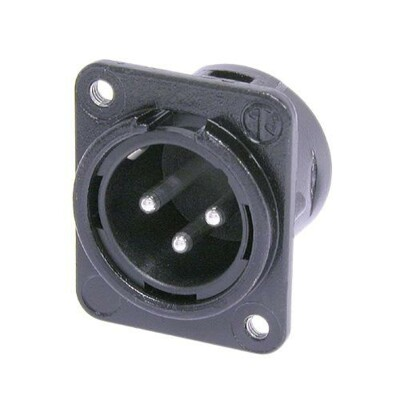</td>
</tr>
<tr>
<td style="text-align: center;">ENCOS24D2S65R</td>
<td style="text-align: center;">Panel Mount Ethernet Connector (RJ45 Coupler)</td>
<td style="text-align: center;"><a href="https://www.mouser.com/Search/Refine?Keyword=ENCOS24D2S65R">Mouser Search</a></td>
<td style="text-align: center;"></td>
</tr>
<tr>
<td style="text-align: center;">CP30217MB</td>
<td style="text-align: center;">Panel Mount Optical (TOSLINK) Input Connector</td>
<td style="text-align: center;"><a href="https://uk.farnell.com/cliff-electronic-components/cp30217mb/fibre-optic-adapter-toslink-toslink/dp/3490624">Farnell</a></td>
<td style="text-align: center;">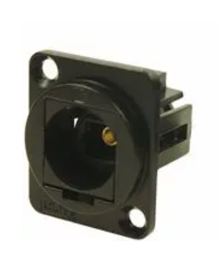</td>
</tr>
<tr>
<td style="text-align: center;">PX0794/S</td>
<td style="text-align: center;">Bulgin PX0794 Circular Connector, Socket</td>
<td style="text-align: center;"><a href="https://www.mouser.co.uk/ProductDetail/Bulgin/PX0794-S?qs=fZ%2FLqxhLDmlcL7BQN2egOg%3D%3D">Mouser</a></td>
<td style="text-align: center;"></td>
</tr>
<tr>
<td style="text-align: center;">PX0794/P</td>
<td style="text-align: center;">Bulgin PX0794 Circular Connector, Plug</td>
<td style="text-align: center;"><a href="https://www.mouser.co.uk/ProductDetail/Bulgin/PX0794-P?qs=1heAGhfc8RDP1j2J1H7tmQ%3D%3D">Mouser</a></td>
<td style="text-align: center;"></td>
</tr>
<tr>
<td style="text-align: center;">PV0H24011-311</td>
<td style="text-align: center;">Panel Mount Illuminated Pushbutton Switch</td>
<td style="text-align: center;"><a href="https://www.mouser.co.uk/ProductDetail/E-Switch/PV0H24011-311?qs=QvRObDHRS1%252BbpJ%252BDa6XY%2Fg%3D%3D">Mouser</a></td>
<td style="text-align: center;"></td>
</tr>
<tr>
<td style="text-align: center;">PX0708/P/12</td>
<td style="text-align: center;">Bulgin PX0708 12-way Circular Connector, Plug</td>
<td style="text-align: center;"><a href="https://www.bulgin.com/en/search#q=PX0708">Bulgin Search</a></td>
<td style="text-align: center;"></td>
</tr>
<tr>
<td style="text-align: center;">PX0708/S/12</td>
<td style="text-align: center;">Bulgin PX0708 12-way Circular Connector, Socket</td>
<td style="text-align: center;"><a href="https://www.bulgin.com/en/search#q=PX0708">Bulgin Search</a></td>
<td style="text-align: center;"></td>
</tr>
<tr>
<td style="text-align: center;">177-PX0709/P/07</td>
<td style="text-align: center;">Bulgin PX0709 7-way Circular Connector, Plug</td>
<td style="text-align: center;"><a href="https://www.mouser.com/Search/Refine?Keyword=PX0709%2FP%2F07">Mouser Search</a></td>
<td style="text-align: center;">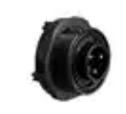</td>
</tr>
<tr>
<td style="text-align: center;">167-PX0709/S/07</td>
<td style="text-align: center;">Bulgin PX0709 7-way Circular Connector, Socket</td>
<td style="text-align: center;"><a href="https://www.mouser.com/Search/Refine?Keyword=PX0709%2FS%2F07">Mouser Search</a></td>
<td style="text-align: center;">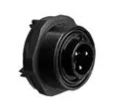</td>
</tr>
<tr>
<td style="text-align: center;">167-PX0745/P/07</td>
<td style="text-align: center;">Bulgin PX0745 7-way Circular Connector, Plug</td>
<td style="text-align: center;"><a href="https://www.mouser.com/Search/Refine?Keyword=PX0745%2FP%2F07">Mouser Search</a></td>
<td style="text-align: center;">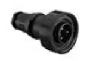</td>
</tr>
<tr>
<td style="text-align: center;">167-PX0745/S</td>
<td style="text-align: center;">Bulgin PX0745 Circular Connector, Socket</td>
<td style="text-align: center;"><a href="https://www.mouser.com/Search/Refine?Keyword=PX0745%2FS">Mouser Search</a></td>
<td style="text-align: center;"></td>
</tr>
<tr>
<td style="text-align: center;">157-SA3348/1</td>
<td style="text-align: center;">Bulgin SA3348 Connector Accessory / Back-Shell</td>
<td style="text-align: center;"><a href="https://uk.rs-online.com/web/c/?searchTerm=SA3348%2F1">RS Components</a></td>
<td style="text-align: center;"></td>
</tr>
<tr>
<td style="text-align: center;">157-SA3347/1</td>
<td style="text-align: center;">Bulgin SA3347 Connector Accessory / Back-Shell</td>
<td style="text-align: center;"><a href="https://uk.rs-online.com/web/c/?searchTerm=SA3347%2F1">RS Components</a></td>
<td style="text-align: center;"></td>
</tr>
<tr>
<td style="text-align: center;">157-13027/1</td>
<td style="text-align: center;">Bulgin 13027 Connector Accessory</td>
<td style="text-align: center;"><a href="https://uk.rs-online.com/web/c/?searchTerm=13027%2F1">RS Components</a></td>
<td style="text-align: center;"></td>
</tr>
<tr>
<td style="text-align: center;">62D11-02-060C</td>
<td style="text-align: center;">Grayhill Premium Haptic Optical Rotary Encoder, 32 PPR, w/ Pushbutton</td>
<td style="text-align: center;"><a href="https://www.grayhill.com/products/62d11-02-060c">Grayhill</a></td>
<td style="text-align: center;">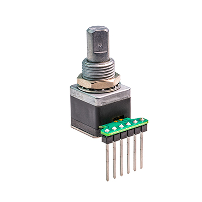</td>
</tr>
<tr>
<td style="text-align: center;">06SR-3S</td>
<td style="text-align: center;">JST/Molex 3-pin Encoder Cable Connector (Plug)</td>
<td style="text-align: center;"><a href="https://www.mouser.com/Search/Refine?Keyword=06SR-3S">Mouser Search</a></td>
<td style="text-align: center;"></td>
</tr>
<tr>
<td style="text-align: center;">#1D</td>
<td style="text-align: center;">IAN CANADA — FifoPi Q7 Synchronous FIFO Reclocker Board, I2S 32-bit 768kHz DSD1024 DoP256</td>
<td style="text-align: center;"><a href="https://iancanada.ca/products/1d-fifopi-q7-flagship-i2s-dsd-dop-fifo-with-isolator-re-clocker-and-low-phase-noise-xos">Ian Canada</a></td>
<td style="text-align: center;">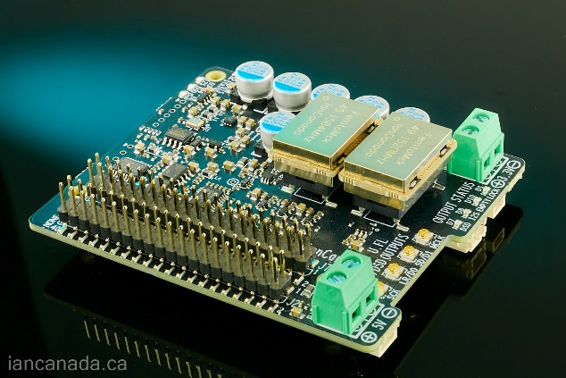</td>
</tr>
<tr>
<td style="text-align: center;">#38A</td>
<td style="text-align: center;">IAN CANADA — LinearPi Dual Ultra-Low Noise Linear Power Supply Module 2x +/-5V / +/-3.3V 2.5A</td>
<td style="text-align: center;"><a href="https://iancanada.ca/products/linearpi-pro-high-current-ultra-low-noise-linear-power-supply-full-smt">Ian Canada</a></td>
<td style="text-align: center;">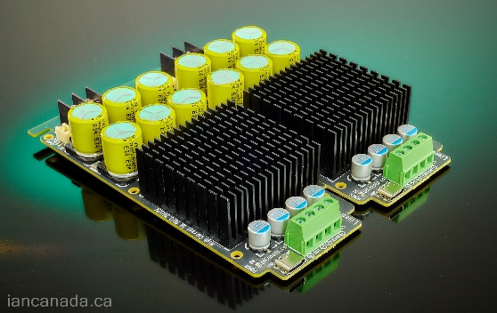</td>
</tr>
<tr>
<td style="text-align: center;">#35B</td>
<td style="text-align: center;">IAN CANADA — StationPi PRO Raspberry Pi and HAT Boards Adapter Station</td>
<td style="text-align: center;"><a href="https://iancanada.ca/products/35b-stationpi-pro-fully-finished">Ian Canada</a></td>
<td style="text-align: center;">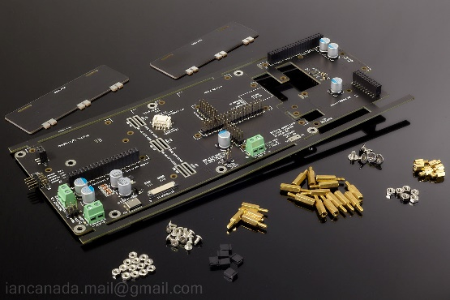</td>
</tr>
<tr>
<td style="text-align: center;">CCHD-957-45</td>
<td style="text-align: center;">CRYSTEK CCHD-957 Ultra Low Phase Noise Clock, 45.1584 MHz, 3.3 V, 25 ppm</td>
<td style="text-align: center;"><a href="https://www.crystek.com/crystal/spec-sheets/clock/CCHD-957.pdf">Crystek Datasheet</a></td>
<td style="text-align: center;">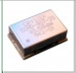</td>
</tr>
<tr>
<td style="text-align: center;">CCHD-957-49</td>
<td style="text-align: center;">CRYSTEK CCHD-957 Ultra Low Phase Noise Clock, 49.152 MHz, 3.3 V, 25 ppm</td>
<td style="text-align: center;"><a href="https://www.crystek.com/crystal/spec-sheets/clock/CCHD-957.pdf">Crystek Datasheet</a></td>
<td style="text-align: center;"></td>
</tr>
<tr>
<td style="text-align: center;">CCHD957-Adapter</td>
<td style="text-align: center;">IAN CANADA — CCHD957 XO Clock Adapter, supports SMT Capacitors (pair)</td>
<td style="text-align: center;"><a href="https://iancanada.ca/">Ian Canada</a></td>
<td style="text-align: center;">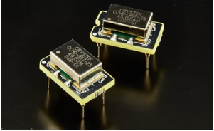</td>
</tr>
<tr>
<td style="text-align: center;">#32B</td>
<td style="text-align: center;">IAN CANADA — LinearPi MKII SOLO Ultra-Low Noise Linear Power Supply Module, 5V / 3.3V / 12V, 2.5A</td>
<td style="text-align: center;"><a href="https://iancanada.ca/products/linearpi-mkii-ultra-low-noise-smt-linear-power-supply">Ian Canada</a></td>
<td style="text-align: center;">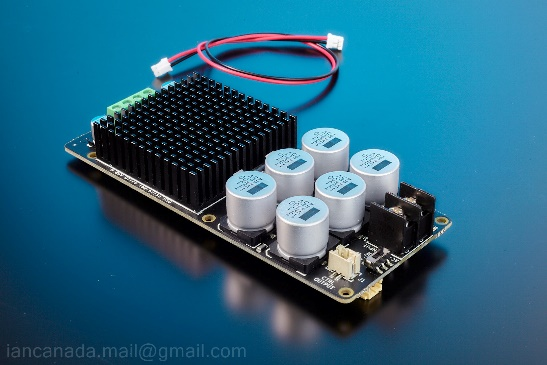</td>
</tr>
<tr>
<td style="text-align: center;">AS318-B-451584</td>
<td style="text-align: center;">ACCUSILICON AS318-B Ultra Low Jitter Audio Clock, 45.1584 MHz</td>
<td style="text-align: center;"><a href="https://www.accusilicon.com/">AccuSilicon</a></td>
<td style="text-align: center;"></td>
</tr>
<tr>
<td style="text-align: center;">AS318-B-491520</td>
<td style="text-align: center;">ACCUSILICON AS318-B Ultra Low Jitter Audio Clock, 49.152 MHz</td>
<td style="text-align: center;"><a href="https://www.accusilicon.com/">AccuSilicon</a></td>
<td style="text-align: center;"></td>
</tr>
<tr>
<td style="text-align: center;">#49B</td>
<td style="text-align: center;">IAN CANADA — MonitorPi PRO Control Center and Signal Analyzer with Display for Raspberry Pi</td>
<td style="text-align: center;"><a href="https://iancanada.ca/products/49b-monitorpi-pro-integrated-control-center-and-signal-analyzer">Ian Canada</a></td>
<td style="text-align: center;">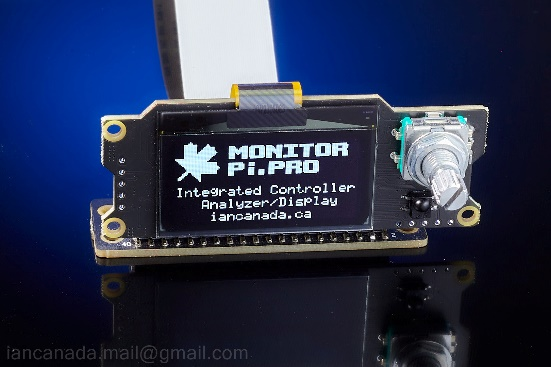</td>
</tr>
<tr>
<td style="text-align: center;">#19C</td>
<td style="text-align: center;">IAN CANADA — ReceiverPi PRO II Interface, SPDIF / I2S / HDMI for Raspberry Pi</td>
<td style="text-align: center;"><a href="https://iancanada.ca/products/19c-receiverpi-pro-ii">Ian Canada</a></td>
<td style="text-align: center;">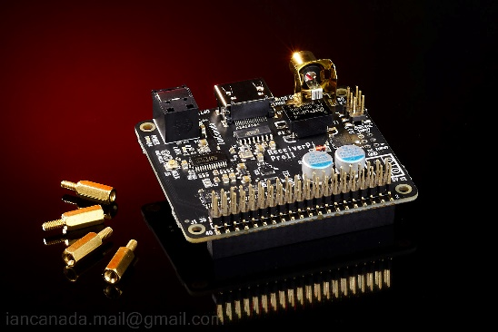</td>
</tr>
<tr>
<td style="text-align: center;">UcCond-MKII-3V3</td>
<td style="text-align: center;">IAN CANADA — UcConditioner MKII Ultra Capacitor Conditioner Board, 3.3V</td>
<td style="text-align: center;"><a href="https://iancanada.ca/products/ucconditionermkii-5v-or-3-3v">Ian Canada</a></td>
<td style="text-align: center;"></td>
</tr>
<tr>
<td style="text-align: center;">UcCond-MKII-5v</td>
<td style="text-align: center;">IAN CANADA — UcConditioner MKII Ultra Capacitor Conditioner Board, 5V</td>
<td style="text-align: center;"></td>
<td style="text-align: center;"></td>
</tr>
<tr>
<td style="text-align: center;">UCPure Balancer</td>
<td style="text-align: center;"><strong>UcBalancer protection board KIT</strong></td>
<td style="text-align: center;"><a href="https://iancanada.ca/products/41f-ucbalancer-protection-board-kit">Ian Canada</a></td>
<td style="text-align: center;">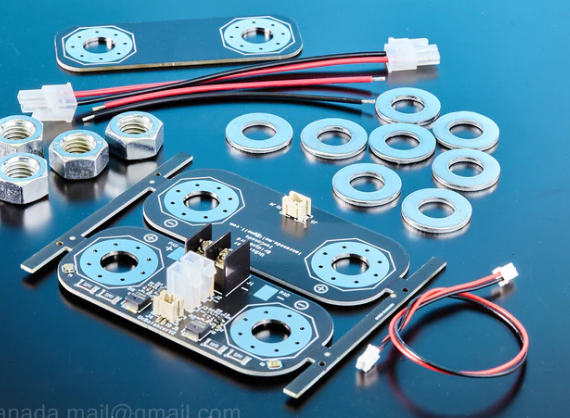</td>
</tr>
<tr>
<td style="text-align: center;">Alu-Case-320x240x90</td>
<td style="text-align: center;">100% Aluminium DIY Box / Case, Round Corners, 320×240×90 mm, Black</td>
<td style="text-align: center;"><a href="https://www.aliexpress.com/wholesale?SearchText=aluminium+case+320x240x90">Search AliExpress</a></td>
<td style="text-align: center;"></td>
</tr>
<tr>
<td style="text-align: center;">#50A</td>
<td style="text-align: center;">IAN CANADA — GPIO 40-PIN Extension Kit for Raspberry Pi (with 6″ &amp; 12″ FFC cables)</td>
<td style="text-align: center;"><a href="https://iancanada.ca/products/50a-universal-raspberrypi-gpio-extension-kit-with-6-12-ffc-cables">Ian Canada</a></td>
<td style="text-align: center;">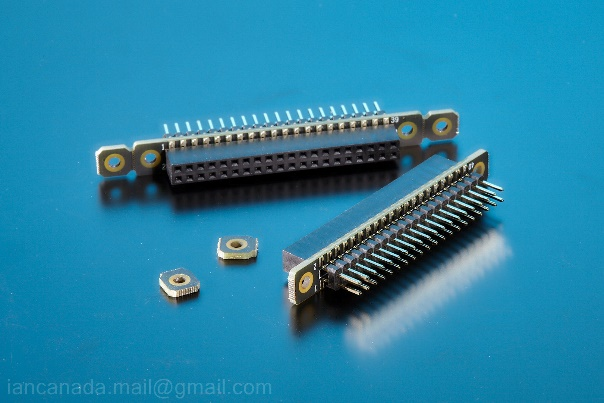</td>
</tr>
<tr>
<td style="text-align: center;"></td>
<td style="text-align: center;"></td>
<td style="text-align: center;"></td>
<td style="text-align: center;"></td>
</tr>
<tr>
<td style="text-align: center;">D-Shaft-Button-40mm</td>
<td style="text-align: center;">Aluminum Knob — D-Shaft, 40 mm diameter, Ø6 mm bore, Black</td>
<td style="text-align: center;"><a href="https://www.aliexpress.com/wholesale?SearchText=aluminum+knob+d+shaft+40mm+6mm">Search AliExpress</a></td>
<td style="text-align: center;"></td>
</tr>
<tr>
<td style="text-align: center;">BTR-M3x5</td>
<td style="text-align: center;">Socket Head Cap Screw, Steel, M3×5 mm (Pack of 10)</td>
<td style="text-align: center;"><a href="https://www.mouser.com/Search/Refine?Keyword=M3+5mm+socket+head">Search</a></td>
<td style="text-align: center;"></td>
</tr>
<tr>
<td style="text-align: center;">LHY-LT3042-2x5V</td>
<td style="text-align: center;">LHY AUDIO — Dual Linear Power Supply Module LT3042, 2×5V, 1.5A</td>
<td style="text-align: center;"><a href="https://www.audiophonics.fr/en/regulated-psu/lhy-audio-dual-linear-power-supply-module-lt3042-2x5v-15a-p-17276.html">audiophonics</a></td>
<td style="text-align: center;">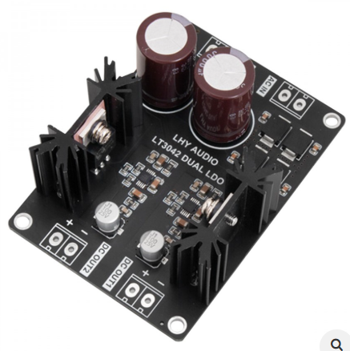</td>
</tr>
<tr>
<td style="text-align: center;">MicroUSB-Bare-20cm</td>
<td style="text-align: center;">Micro USB Male to Bare Wire Power Cable, 24AWG, 20 cm</td>
<td style="text-align: center;"><a href="https://www.aliexpress.com/wholesale?SearchText=micro+usb+male+bare+wire+20cm">Search AliExpress</a></td>
<td style="text-align: center;"></td>
</tr>
<tr>
<td style="text-align: center;">SE-BAL-XLR-RCA</td>
<td style="text-align: center;">Single-Ended to Balanced Converter Module, XLR / RCA Stereo</td>
<td style="text-align: center;"><a href="https://www.aliexpress.com/wholesale?SearchText=single+ended+balanced+converter+XLR+RCA">Search AliExpress</a></td>
<td style="text-align: center;"></td>
</tr>
<tr>
<td style="text-align: center;">Toroid-Cover-88x62</td>
<td style="text-align: center;">Toroid Cover — Metal Iron Shield for Transformer, 88×62 mm</td>
<td style="text-align: center;"><a href="https://www.aliexpress.com/wholesale?SearchText=toroid+cover+transformer+shield+88mm">Search AliExpress</a></td>
<td style="text-align: center;"></td>
</tr>
<tr>
<td style="text-align: center;">Toroidal-15VA-2x12V</td>
<td style="text-align: center;">Toroidal Transformer, 15VA, 2×12V AC</td>
<td style="text-align: center;"><a href="https://www.mouser.com/Search/Refine?Keyword=toroidal+transformer+15VA+12V">Search</a></td>
<td style="text-align: center;"></td>
</tr>
</tbody>
</table>

### Power Distribution — To Do

*Diagram showing every rail.*

### Transformer Connections — To Do

*Photos plus wiring diagrams.*

## Digital Audio and Control

*Signal routing and control-connection details are still being documented.*

### Streamer — To Do

### I2S Routing — To Do

### Clock Distribution — To Do

### Control Interface — To Do

#### Component Connections — To Do

*Document Raspberry Pi connections, ESP32 connections, UART links, I2S routing, and clock routing.*

##### Raspberry Pi Connections — To Do

##### ESP32 Connections — To Do

##### UART Links — To Do

##### I2S Routing — To Do

##### Clock Routing — To Do

## Analogue Audio

*Analogue signal-flow documentation is still in progress.*

### DAC Stage — To Do

### Output Stage — To Do

### Balanced Outputs — To Do

### Single-Ended Outputs — To Do

*To do: document the analogue signal flow.*

## Assembly and Commissioning

*The step-by-step build procedure is still in progress.*

### Chassis Preparation — To Do

### Mounting Boards — To Do

### Installing Transformers — To Do

### Power Wiring — To Do

### Signal Wiring — To Do

### Final Inspection — To Do

*Lots of photos here.*

### Testing and Commissioning

#### Pre-Power Checks — To Do

*Resistance checks.*

#### First Power-Up — To Do

*Expected voltages.*

#### Functional Testing — To Do

*Expected LED states.*

#### Audio Testing — To Do

*Signal path verification.*

### Troubleshooting

Use these topics as a starting point when the system does not behave as expected:

- No Power
- Display Not Working
- Streamer Not Booting
- No Audio
- Distorted Audio
- Relay Problems
- Clock Problems

*To do: add photographs of error indicators where available.*

## Parts List

The current parts lists are grouped with their related documentation:

- [Main assembly bill of materials](#main-assembly-bill-of-materials)
- [Power supply bill of materials](#bill-of-materials)

## Revision History

| Revision | Date | Changes |
|----------|------|---------|
| 1.0 | TBD | Initial release |

## Appendices

*Reference material to be added as the documentation is completed.*

- Wiring Diagram
- Connector Pinouts
- Voltage Reference Table
- Board-to-Board Connection Tables
- Software/Firmware Versions
