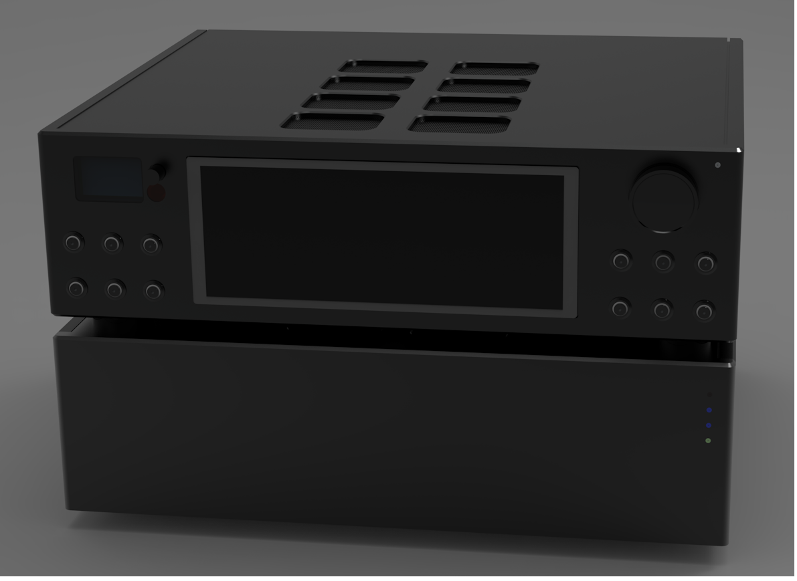
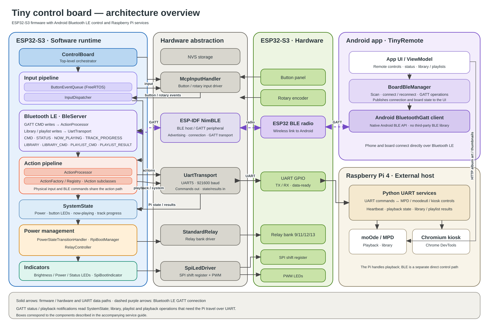
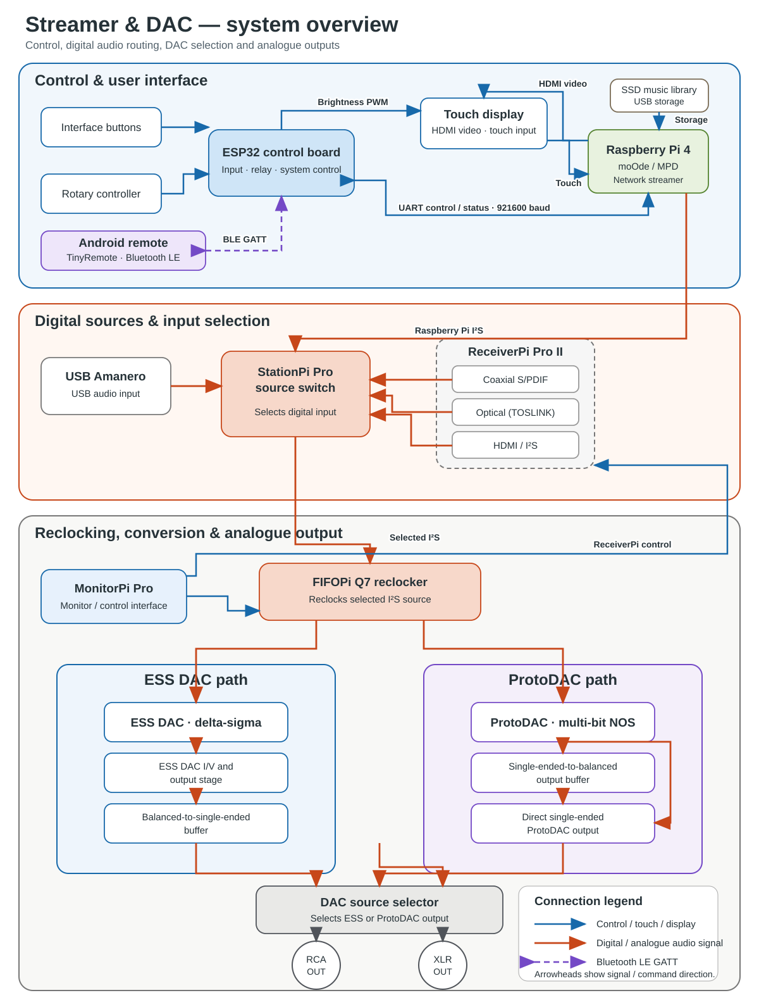
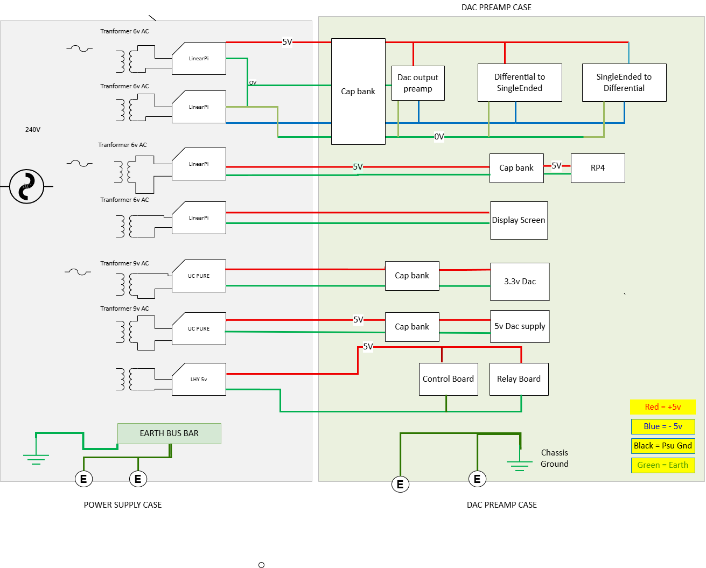
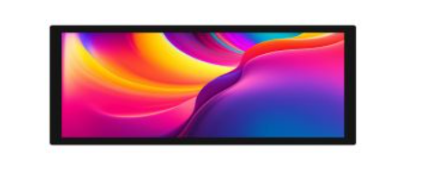

# Riverbank Streamer DAC

## Service and Build Guide

**Author:** Anthony Roy

<figure>

<figcaption>
Riverbank Streamer DAC
</figcaption>
</figure>

## Safety Information

> **Warning — hazardous mains voltage:** This project uses a toroidal transformer connected to 110 V or 230 V AC mains. Contact with exposed mains connections can cause fatal electric shock or severe injury.

- Insulate all mains connections—including the IEC inlet, fuse holder, power switch, and transformer primary wiring—with suitable heat-shrink tubing or equivalent insulation.
- Disconnect the power cord from the wall outlet before opening the chassis or working on the equipment.
- Install a slow-blow fuse of the correct rating in the live AC line. Select the fuse for the transformer and the local mains supply; transformer inrush current can be high.
- Observe DC polarity. Reversed connections can damage microcontrollers, DACs, and other components. Use ESD precautions when handling exposed semiconductor devices.

This guide is provided for informational and educational purposes. Construction and use are undertaken at the builder's own risk. Mains-powered equipment should be assembled, inspected, and tested only by people qualified to work safely with hazardous voltages.

**Reference:** [Transformer wiring](https://electro-dan.co.uk/electronics/wiringtrans.aspx)

------------------------------------------------------------------------

## Contents

- [Project Overview](#project-overview)
- [System Architecture](#system-architecture)
- [Component Overview](#component-overview)
- [Circuit Board Reference](service-guide/CircuitBoardReference.md)
- [DAC and Audio Subsystem](service-guide/DacSubsystem.md)
- [Power Supply Subsystem](service-guide/PowerSupplySubsystem.md)
- [Mechanical Construction](service-guide/MechanicalConstruction.md)
- [System Wiring and Commissioning](service-guide/SystemWiring.md)
- [Parts Lists](#parts-lists)
- [Revision History](#revision-history)

Use the focused guides for board-level information, construction, wiring, and subsystem-specific details. This index provides the project overview and links to the system diagrams. Electrical details and parts should be verified against the current schematics and manufacturer documentation before construction or repair.

## Project Overview

### Introduction

The Riverbank Streamer DAC is a multi-source digital audio streamer and DAC designed as both a high-quality listening system and a substantial DIY electronics project. It combines network playback, digital input selection, reclocking, DAC conversion, and an ESP32-based control interface in a custom enclosure.

#### System Overview

The system combines a Raspberry Pi network streamer running moOde Audio with a dedicated ESP32 control system. The Raspberry Pi handles network playback; the ESP32 manages user input, source selection, display control, relay switching, system monitoring, and communication with other subsystems.

#### Digital Audio Components

The digital audio path uses several audio modules, including Ian Canada's FIFOPi Q7 reclocking stage. It isolates and reclocks the Raspberry Pi's I2S stream using local oscillators. The reclocked signal can then be routed to either an ESS-based DAC or a ProtoDAC.

The ESS platform provides the primary digital-to-analogue conversion stage. Supporting modules, including the StationPi Pro, provide source selection, signal routing, and integration between audio components.

#### Power Supplies

Multiple independent linear power supplies serve the digital, analogue, control, and clock domains. UcPure ultra-capacitor modules provide local energy storage and power conditioning for selected audio circuits.

The system is designed to support these digital audio sources:

- Raspberry Pi network streaming via I2S
- Optical (TOSLINK) S/PDIF input
- Coaxial S/PDIF input
- USB input

#### Displays and Controls

The front-panel display presents album artwork and playback information. A secondary OLED display provides input, status, and configuration feedback. Illuminated controls provide direct access to commonly used functions.

#### Design Objectives

- High-quality digital audio reproduction using low-jitter clocking and signal isolation
- Multiple digital audio sources and selectable DAC architectures
- Independent linear power regulation for system power domains
- Noise control through grounding, shielding, and careful power distribution
- A serviceable enclosure with a modern display and hardware controls

#### Software and Build Requirements

- Raspberry Pi running moOde Audio
- Custom ESP32 firmware written in C++
- UART communication between the Raspberry Pi and ESP32
- Advanced skill level: the build involves mains wiring, metal chassis work, electronics assembly, Linux command-line use, firmware deployment, and system troubleshooting
- Estimated build time: approximately 20–30 hours, depending on enclosure work and testing

## System Architecture

### Control and Communication Architecture

### Audio System Overview

### Power Connection Diagram

## Component Overview

### Other Assemblies

- **Streamer:** Raspberry Pi network streamer running moOde Audio.
- **DACs:** ESS DAC and ProtoDAC implementations provide selectable conversion architectures.
- **Clocking:** FIFOPi Q7 reclocking stage with local oscillator clocks.
- **Control:** ESP32-based controller; see the [Tiny Control Board reference](service-guide/CircuitBoardReference.md#tiny-control-board-for-raspberry-pi-4).

### Display

See the [Waveshare display documentation](https://www.waveshare.com/wiki/9.3inch_1600x600_LCD#Working_with_Raspberry_Pi).

## Focused Guides

- [Circuit Board Reference](service-guide/CircuitBoardReference.md) — control, interface, and relay board descriptions and service notes.
- [DAC and Audio Subsystem](service-guide/DacSubsystem.md) — digital-to-analogue conversion boards, signal selection, and audio output stages.
- [Power Supply Subsystem](service-guide/PowerSupplySubsystem.md) — power boards, supply rails, transformers, and power-supply parts.
- [Mechanical Construction](service-guide/MechanicalConstruction.md) — enclosure drawings, mechanical parts, and assembly notes.
- [System Wiring and Commissioning](service-guide/SystemWiring.md) — inter-board connections, signal routing, system wiring, and commissioning checks.

## Parts Lists

- [Main assembly bill of materials](service-guide/MechanicalConstruction.md#main-assembly-bill-of-materials)
- [Power supply bill of materials](service-guide/PowerSupplySubsystem.md#bill-of-materials)

## Revision History

| Revision | Date | Changes |
|----------|------|---------|
| 1.0 | TBD | Initial release |
