# Mechanical Construction

[Back to the Service Guide](../ServiceGuide.md) · [Power supply subsystem](PowerSupplySubsystem.md) · [System wiring and commissioning](SystemWiring.md)

## Enclosure Drawings

### Streamer and DAC Enclosure

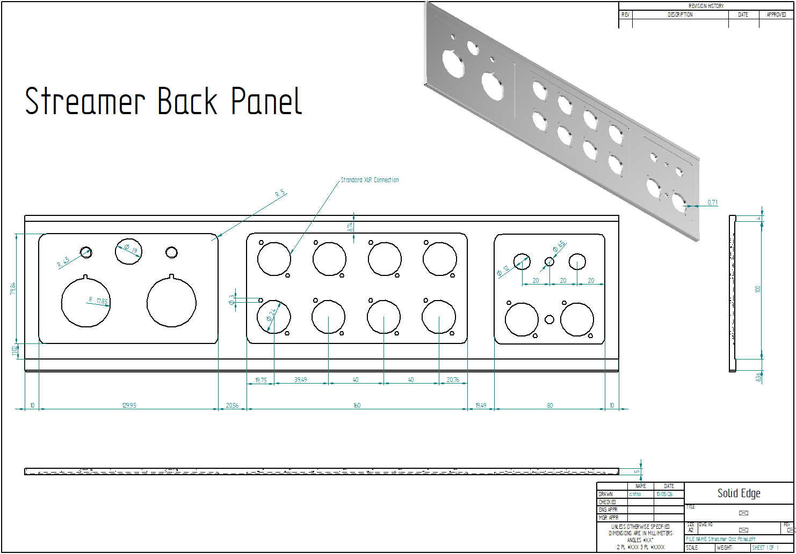

#### Front Panel

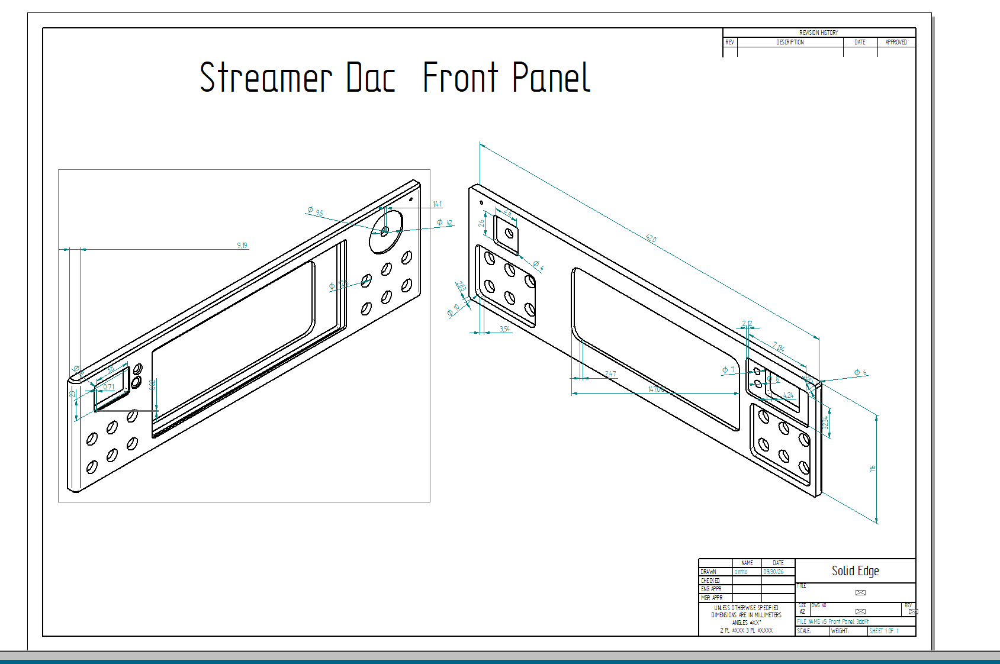

#### Side Panels

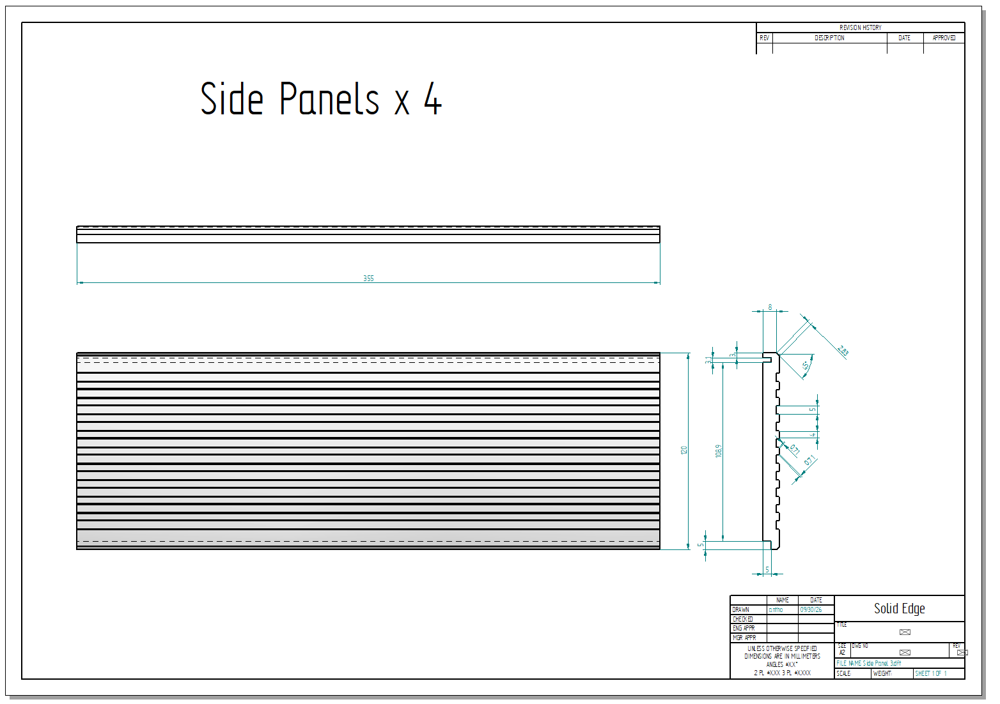

#### Top Panel

Top panel for the streamer and DAC enclosure.

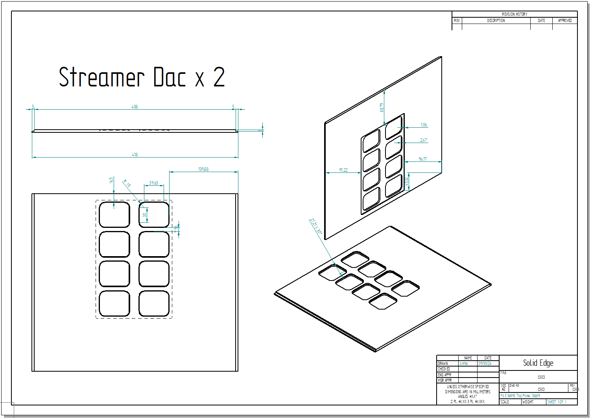

### Power Supply Enclosure

#### Front Panel
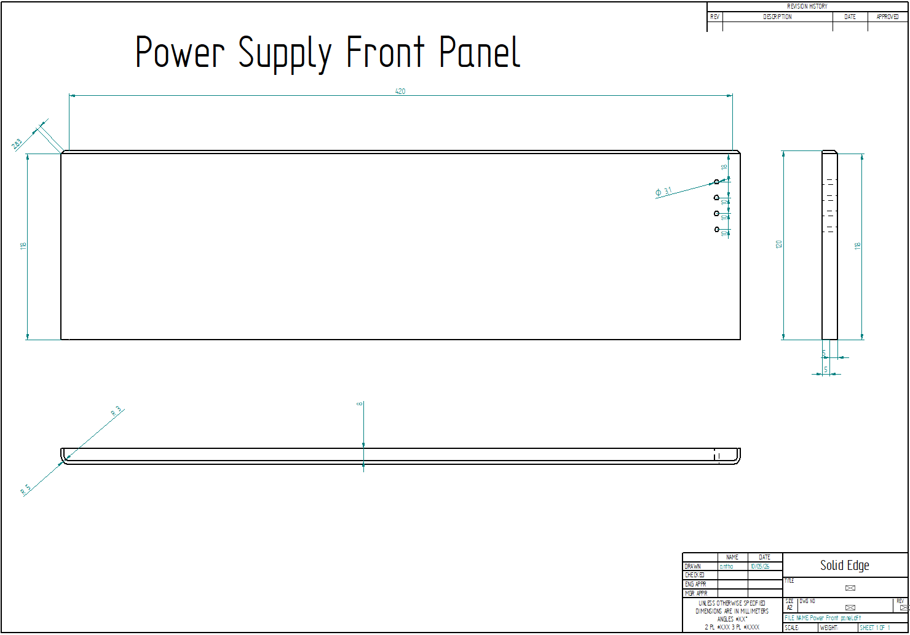

#### Rear Panel
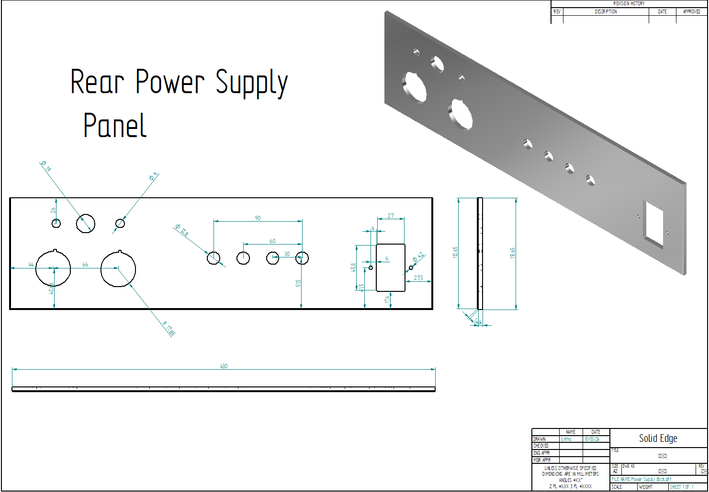

### Inner Case

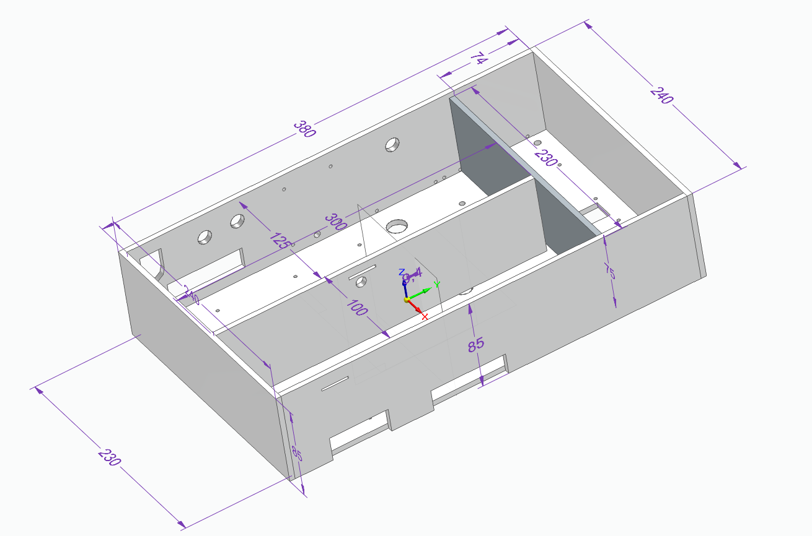

#### Front Panel
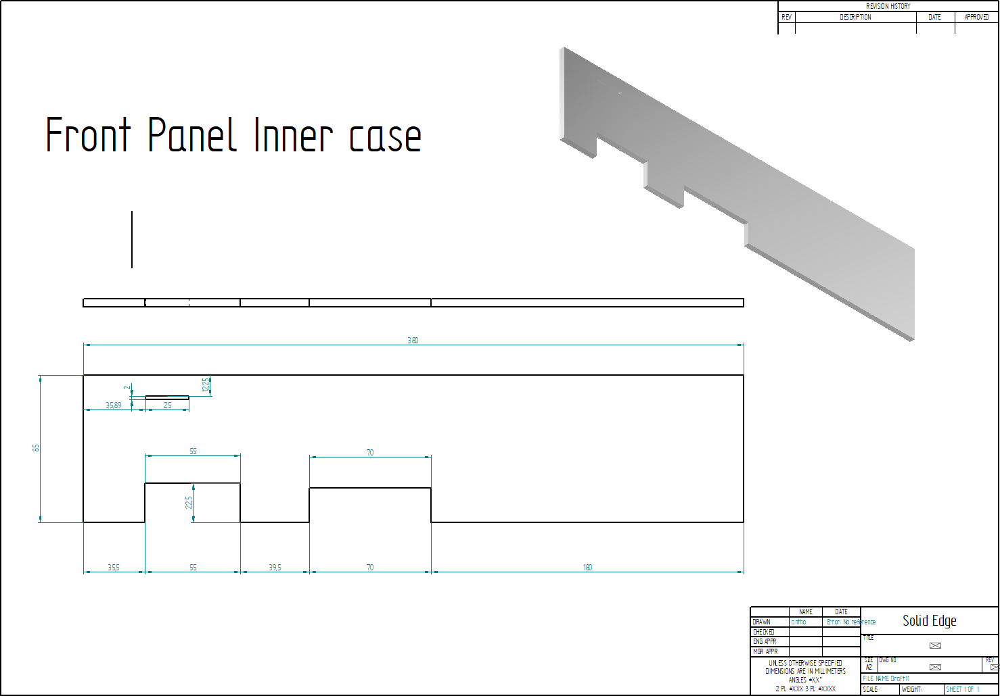

#### Rear Panel
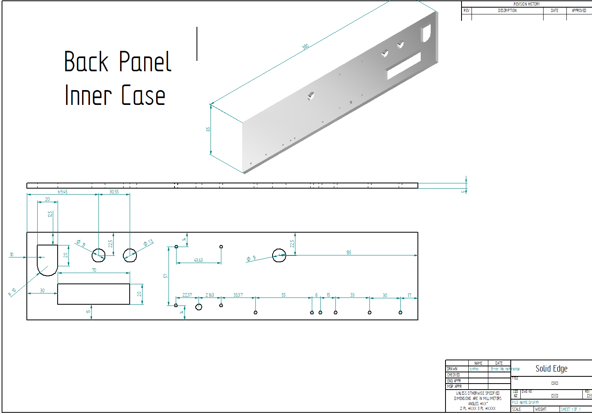

### Final Assembly

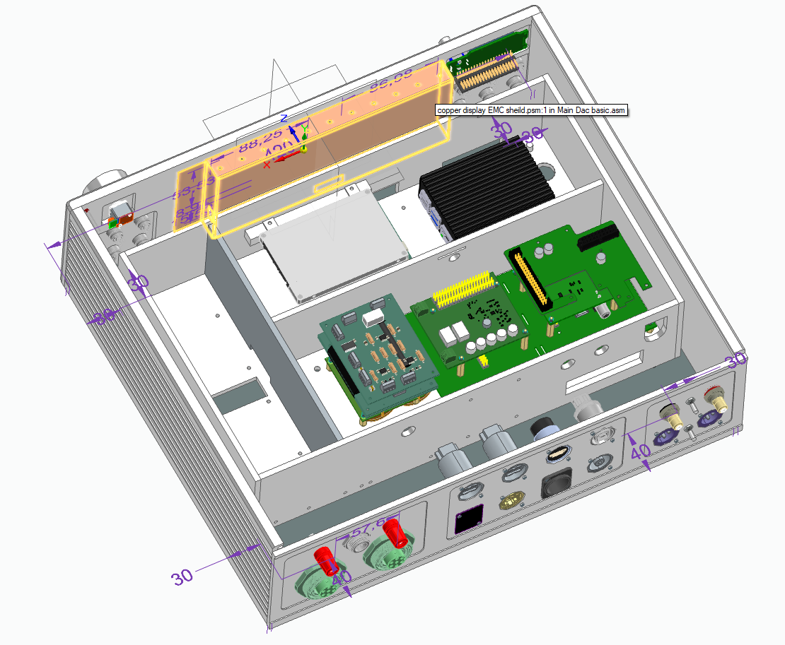

### MonitorPi Pro

#### PCB Stack-up

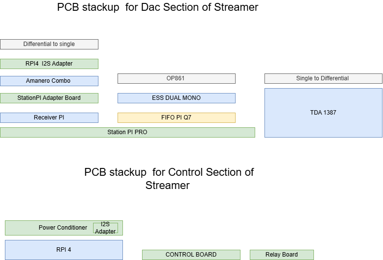

See the [MonitorPi Pro manual](https://github.com/iancanada/DocumentDownload/blob/master/MonitorPi/MonitorPiPro/MonitorPiProManual.pdf) for component details.

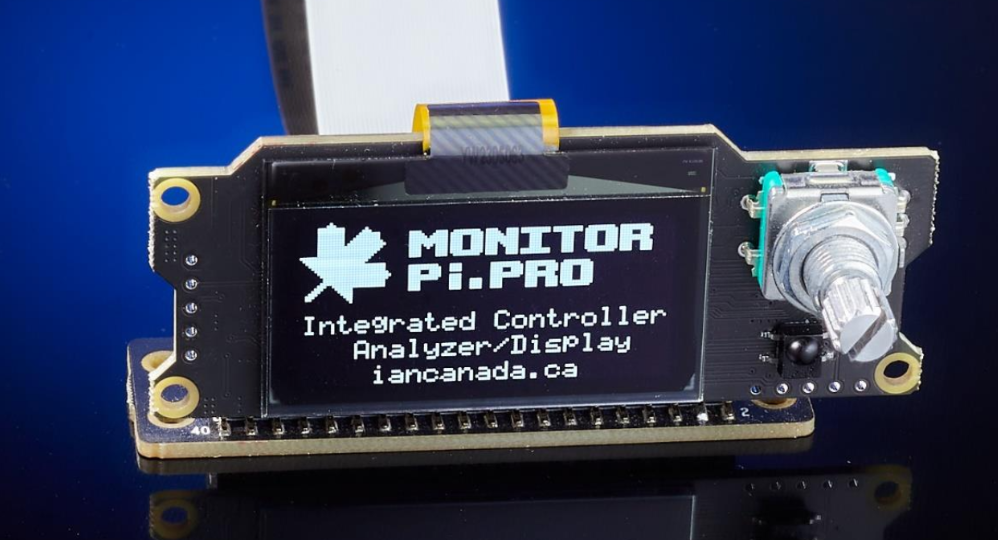

## Main Assembly Bill of Materials

The table below gathers the listed enclosure, panel, connector, and hardware items. Confirm quantities and part numbers against the final assembly before ordering.

<table style="width:93%;">
<colgroup>
<col style="width: 24%" />
<col style="width: 41%" />
<col style="width: 26%" />
</colgroup>
<thead>
<tr>
<th>Description</th>
<th>Part number</th>
<th style="text-align: center;">Quantity</th>
</tr>
</thead>
<tbody>
<tr>
<td>Super Capacitors 25f</td>
<td><a href="https://www.mouser.co.uk/ProductDetail/723-BCAP0325P270S19"><u>723-BCAP0325P270S19</u></a></td>
<td style="text-align: center;">4</td>
</tr>
<tr>
<td>Power Transformer</td>
<td>546-1182N6</td>
<td style="text-align: center;">1</td>
</tr>
<tr>
<td>Transformer</td>
<td>546-1182M9</td>
<td style="text-align: center;">1</td>
</tr>
<tr>
<td>Power Transformer</td>
<td><a href="https://uk.farnell.com/vigortronix/vtx-146-060-206/60va-toroidal-transformer-2x6v/dp/2817656"><u> VTX-146-060-206</u></a></td>
<td style="text-align: center;">1</td>
</tr>
<tr>
<td>Schaffner filter</td>
<td>FN9290-4-06</td>
<td style="text-align: center;">1</td>
</tr>
<tr>
<td>Fuses</td>
<td>BK8-HTC-603M</td>
<td style="text-align: center;">5</td>
</tr>
<tr>
<td>USB Adapters</td>
<td>NAUSB3-B</td>
<td style="text-align: center;">2</td>
</tr>
<tr>
<td>HDMI</td>
<td>NAHDMI-W-B</td>
<td style="text-align: center;">1</td>
</tr>
<tr>
<td>SPDIF</td>
<td>NF2D-B-0</td>
<td style="text-align: center;">1</td>
</tr>
<tr>
<td>XLR out</td>
<td><a href="https://www.mouser.co.uk/ProductDetail/Neutrik/NC3MDM3LBAG-1?qs=%252B86TLfaev29PPTEig8yI5g%3D%3D"><u>NC3MDM3LBAG-1</u></a></td>
<td style="text-align: center;">2</td>
</tr>
<tr>
<td>Ethernet panel</td>
<td>ENCOS24D2S65R</td>
<td style="text-align: center;">1</td>
</tr>
<tr>
<td>Optical input</td>
<td>CP30217MB</td>
<td style="text-align: center;">1</td>
</tr>
<tr>
<td>PX0794/S</td>
<td>PX0794/S</td>
<td style="text-align: center;">2</td>
</tr>
<tr>
<td>PX0794/P</td>
<td>PX0794/P</td>
<td style="text-align: center;">2</td>
</tr>
<tr>
<td>control pushbutton</td>
<td>PV0H24011-311</td>
<td style="text-align: center;">12</td>
</tr>
<tr>
<td>PX0708/P/12</td>
<td> </td>
<td style="text-align: center;">1</td>
</tr>
<tr>
<td>PX0708/S/12</td>
<td> </td>
<td style="text-align: center;">1</td>
</tr>
<tr>
<td>177-PX0709/P/07</td>
<td></td>
<td style="text-align: center;">1</td>
</tr>
<tr>
<td>167-PX0709/S/07</td>
<td></td>
<td style="text-align: center;">1</td>
</tr>
<tr>
<td><a href="https://www.mouser.co.uk/ProductDetail/167-PX0745-P-07"><u>167-PX0745/P/07</u></a></td>
<td></td>
<td style="text-align: center;">1</td>
</tr>
<tr>
<td><a href="https://www.mouser.co.uk/ProductDetail/167-PX0745-S"><u>167-PX0745/S</u></a></td>
<td></td>
<td style="text-align: center;">1</td>
</tr>
<tr>
<td><a href="https://www.mouser.co.uk/ProductDetail/157-SA3348-1"><u>157-SA3348/1</u></a></td>
<td></td>
<td style="text-align: center;">2</td>
</tr>
<tr>
<td><a href="https://www.mouser.co.uk/ProductDetail/157-SA3347-1"><u>157-SA3347/1</u></a></td>
<td></td>
<td style="text-align: center;">2</td>
</tr>
<tr>
<td>157-13027/1</td>
<td></td>
<td style="text-align: center;">1</td>
</tr>
<tr>
<td>Encoder</td>
<td><strong>62D11-02-060C</strong></td>
<td style="text-align: center;">1</td>
</tr>
<tr>
<td>Encoder Plug</td>
<td>06SR-3S</td>
<td style="text-align: center;">2</td>
</tr>
<tr>
<td style="text-align: center;">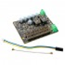</td>
<td><a href="https://www.audiophonics.fr/en/accessories-and-cases/ian-canada-fifopi-q7-synchronous-fifo-reclocker-board-i2s-32bit-768khz-dsd1024-dop256-p-16855.html"><u>IAN CANADA FIFOPI Q7 Synchronous FIFO Reclocker Board I2S 32bit 768kHz DSD1024 DoP256</u></a></td>
<td style="text-align: center;"><strong>1</strong></td>
</tr>
<tr>
<td style="text-align: center;">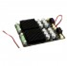</td>
<td><a href="https://www.audiophonics.fr/en/linear-regulated-psu/ian-canada-linearpi-dual-ultra-low-noise-linear-power-supply-module-2x-5v-33v-25a-p-14760.html"><u>IAN CANADA LINEARPI DUAL Ultra-Low Noise Linear Power Supply Module 2x +/-5V / +/-3.3V 2.5A</u></a></td>
<td style="text-align: center;"><strong>1</strong></td>
</tr>
<tr>
<td style="text-align: center;">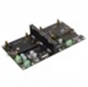</td>
<td><a href="https://www.audiophonics.fr/en/accessories-and-cases/ian-canada-stationpi-pro-raspberry-pi-and-hat-boards-adapter-station-p-16550.html"><u>IAN CANADA STATIONPI PRO Raspberry Pi and HAT Boards Adapter Station</u></a></td>
<td style="text-align: center;"><strong>1</strong></td>
</tr>
<tr>
<td style="text-align: center;"></td>
<td><a href="https://www.audiophonics.fr/en/composants-electronique-horloges/crystek-cchd-957-ultra-low-phase-noise-clock-451584mhz-33v-25ppm-p-14165.html"><u>CRYSTEK CCHD-957 Ultra Low Phase Noise Clock 45.1584MHz 3.3V 25ppm</u></a></td>
<td style="text-align: center;"><strong>1</strong></td>
</tr>
<tr>
<td style="text-align: center;">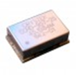</td>
<td><a href="https://www.audiophonics.fr/en/composants-electronique-horloges/crystek-cchd-957-ultra-low-phase-noise-clock-49152mhz-33v-25ppm-p-14166.html"><u>CRYSTEK CCHD-957 Ultra Low Phase Noise Clock 49.152MHz 3.3V 25ppm</u></a></td>
<td style="text-align: center;"><strong>1</strong></td>
</tr>
<tr>
<td style="text-align: center;">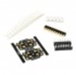</td>
<td><a href="https://www.audiophonics.fr/en/composants-electronique-horloges/ian-canada-cchd957-supports-adaptateurs-pour-horloges-xo-x2-p-13825.html"><u>IAN CANADA CCHD957 Adapter Supports for XO Clocks and SMT Capacitors (x2)</u></a></td>
<td style="text-align: center;"><strong>1</strong></td>
</tr>
<tr>
<td style="text-align: center;"></td>
<td><a href="https://www.audiophonics.fr/en/linear-regulated-psu/ian-canada-linearpi-mkii-solo-ultra-low-noise-linear-power-supply-module-5v-33v-12v-25a-p-17611.html"><u>IAN CANADA LINEARPI MKII SOLO Ultra-Low Noise Linear Power Supply Module 5V / 3.3V / 12V 2.5A</u></a></td>
<td style="text-align: center;"><strong>2</strong></td>
</tr>
<tr>
<td style="text-align: center;"></td>
<td><a href="https://www.audiophonics.fr/en/composants-electronique-horloges/accusilicon-as318-b-451584-ultra-low-jitter-clock-45mhz-p-14033.html"><u>ACCUSILICON AS318-B-451584 Ultra Low Jitter Clock 45MHz</u></a></td>
<td style="text-align: center;"><strong>1</strong></td>
</tr>
<tr>
<td style="text-align: center;">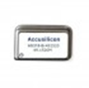</td>
<td><a href="https://www.audiophonics.fr/en/composants-electronique-horloges/accusilicon-as318-b-491520-ultra-low-jitter-clock-49mhz-p-14034.html"><u>ACCUSILICON AS318-B-491520 Ultra Low Jitter Clock 49MHz</u></a></td>
<td style="text-align: center;"><strong>1</strong></td>
</tr>
<tr>
<td style="text-align: center;">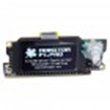</td>
<td><a href="https://www.audiophonics.fr/en/accessories-and-cases/ian-canada-monitorpi-pro-control-center-and-signal-analyzer-with-display-for-raspberry-pi-p-18285.html"><u>IAN CANADA MONITORPI PRO Control Center and Signal Analyzer with Display for Raspberry Pi</u></a></td>
<td style="text-align: center;"><strong>1</strong></td>
</tr>
<tr>
<td style="text-align: center;">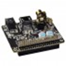</td>
<td><a href="https://www.audiophonics.fr/en/dac-and-interface-modules/ian-canada-receiverpi-pro-ii-interface-spdif-i2s-hdmi-for-raspberry-pi-p-18283.html"><u>IAN CANADA RECEIVERPI PRO II Interface SPDIF I2S HDMI for Raspberry Pi</u></a></td>
<td style="text-align: center;"><strong>1</strong></td>
</tr>
<tr>
<td style="text-align: center;">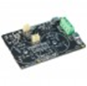</td>
<td><a href="https://www.audiophonics.fr/en/power-supply-accessories/ian-canada-ucconditioner-mkii-ultra-capacitor-conditioner-board-33v-p-17924.html"><u>IAN CANADA UCCONDITIONER MKII Ultra Capacitor Conditioner Board 3.3V</u></a></td>
<td style="text-align: center;"><strong>1</strong></td>
</tr>
<tr>
<td style="text-align: center;">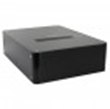</td>
<td><a href="https://www.audiophonics.fr/en/aluminium-boxes-cases/100-aluminium-diy-box-case-round-corners-319x239x89mm-black-p-11342.html"><u>100% Aluminium DIY Box / Case round corners 320x240x90mm Black</u></a></td>
<td style="text-align: center;"><strong>1</strong></td>
</tr>
<tr>
<td style="text-align: center;">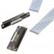</td>
<td><a href="https://www.audiophonics.fr/en/accessories-and-cases/ian-canada-gpio-40pin-extension-kit-for-raspberry-pi-p-16816.html"><u>IAN CANADA GPIO 40PIN Extension Kit for Raspberry Pi</u></a></td>
<td style="text-align: center;"><strong>1</strong></td>
</tr>
<tr>
<td style="text-align: center;"></td>
<td><a href="https://www.audiophonics.fr/en/power-supply-accessories/ian-canada-ucconditioner-mkii-ultra-capacitor-conditioner-board-5v-p-17923.html"><u>IAN CANADA UCCONDITIONER MKII Ultra Capacitor Conditioner Board 5V</u></a></td>
<td style="text-align: center;"><strong>1</strong></td>
</tr>
<tr>
<td rowspan="3" style="text-align: center;">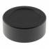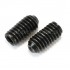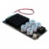</td>
<td><a href="https://www.audiophonics.fr/en/knobs-6mm/aluminum-button-d-shaft-40mm-o6mm-black-p-15050.html"><u>Aluminum Button D Shaft 40mm Ø6mm Black</u></a></td>
<td style="text-align: center;"><strong>4</strong></td>
</tr>
<tr>
<td><a href="https://www.audiophonics.fr/en/cylindrical-head-screw/hollow-head-screw-steel-btr-m3x5mm-x10-p-11549.html"><u>Hollow Head Screw Steel BTR M3x5mm (x10)</u></a></td>
<td style="text-align: center;"><strong>2</strong></td>
</tr>
<tr>
<td><a href="https://www.audiophonics.fr/en/linear-regulated-psu/ian-canada-linearpi-mkii-solo-ultra-low-noise-linear-power-supply-module-5v-33v-12v-25a-p-17611.html"><u>IAN CANADA LINEARPI MKII SOLO Ultra-Low Noise Linear Power Supply Module 5V / 3.3V / 12V 2.5A</u></a></td>
<td style="text-align: center;"><strong>1</strong></td>
</tr>
<tr>
<td style="text-align: center;">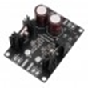</td>
<td><a href="https://www.audiophonics.fr/en/linear-regulated-psu/lhy-audio-dual-linear-power-supply-module-lt3042-2x5v-15a-p-17276.html"><u>LHY AUDIO Dual Linear Power Supply Module LT3042 2x5V 1.5A</u></a></td>
<td style="text-align: center;"><strong>1</strong></td>
</tr>
<tr>
<td style="text-align: center;">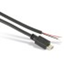</td>
<td><a href="https://www.audiophonics.fr/en/power-supply-accessories/micro-usb-male-to-to-bare-wire-power-cable-raspberry-pi-24awg-20cm-p-9405.html"><u>Micro USB male-to-bare-wire power cable, Raspberry Pi, 24 AWG, 20 cm</u></a></td>
<td style="text-align: center;"><strong>2</strong></td>
</tr>
<tr>
<td style="text-align: center;">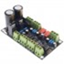</td>
<td><a href="https://www.audiophonics.fr/en/selector-sources-module/single-ended-to-balanced-converter-module-xlr-rca-stereo-p-18248.html"><u>Single-Ended to Balanced Converter Module XLR / RCA Stereo</u></a></td>
<td style="text-align: center;"><strong>1</strong></td>
</tr>
<tr>
<td style="text-align: center;">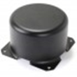</td>
<td><a href="https://www.audiophonics.fr/en/transformers-accessories/toroid-cover-metal-iron-shield-transformer-88x62mm-p-11513.html"><u>Toroid Cover Metal Iron Shield Transformer 88x62mm</u></a></td>
<td style="text-align: center;"><strong>2</strong></td>
</tr>
<tr>
<td>
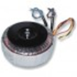

<table style="width:22%;">
<colgroup>
<col style="width: 22%" />
</colgroup>
<thead>
<tr>
<th style="text-align: center;"> </th>
</tr>
</thead>
<tbody>
</tbody>
</table></td>
<td><a href="https://www.audiophonics.fr/en/toroidal-transformers/toroidal-transformer-15va-2x12v-p-7040.html"><u>Toroidal Transformer 15VA 2x12V</u></a></td>
<td style="text-align: center;"><strong>1</strong></td>
</tr>
</tbody>
</table>

## Chassis Layout — To Do

*Photo of the complete internal layout.*

### Board Placement — To Do

*Photo for each board location.*

### Front Panel Assembly — To Do

*Buttons, LEDs, display.*

### Rear Panel Assembly — To Do

*Connectors, switches, fuses.*

### Transformer Placement — To Do

*Photos and dimensions.*

## Mechanical Assembly — To Do

### Chassis Preparation — To Do

### Mounting Boards — To Do

### Installing Transformers — To Do

### Power Wiring — To Do

### Signal Wiring — To Do

### Final Inspection — To Do

*To do: add photographs of the mechanical assembly.*
