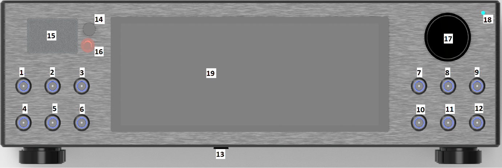
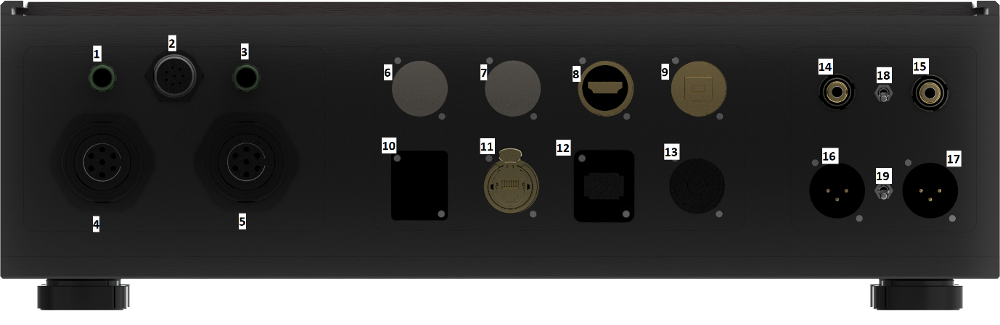
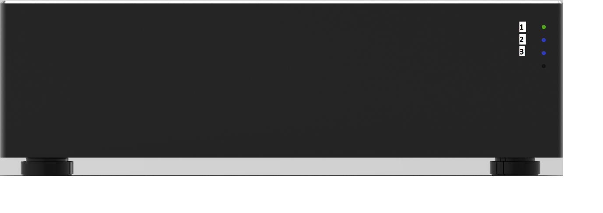
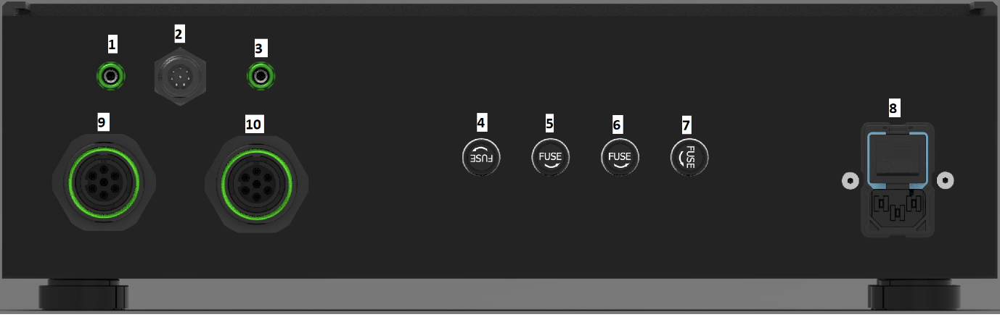

# Streamer DAC User Manual

This manual explains how to operate the Streamer DAC, connect its audio and network equipment, and understand the status lights on the DAC and its external power supply. It is written for everyday use, so you can start with the front-panel controls and then refer to the connection and troubleshooting sections as needed.

## Front Panel Operating Guide

Welcome to your Stream DAC player. This guide will walk you through everything you need to know to get the most out of your front panel controls — from powering on for the first time to exploring the display and playback options. No technical knowledge is needed; just read along and enjoy your music.

### A Quick Look at the Front Panel

Before diving in, here is a brief overview of where everything lives. The panel is divided into a few distinct areas that each handle a different part of your listening experience.

- **Left button group \[1–6\]** — Controls for the display and how content is presented on screen.

- **Right button group \[7–12\]** — Playback controls for your music.

- **Mini display area \[14, 15, 16\]** — A small secondary screen in the upper-left corner with two nearby buttons. This is for controlling the primary DAC and for switching inputs. For a detailed operation guide on how to use this display and the knob \[14\], please refer to this page from Ian Canada’s [MonitorPi Reference manual](https://github.com/iancanada/DocumentDownload/blob/master/MonitorPi/MonitorPiPro/MonitorPiProManual.pdf):

- **Main display \[19\]** — The large central screen showing album artwork, track information, and menus.

- **Rotary knob \[17\]** — A versatile control for navigating the playlist and managing playback.

- **Power indicator \[18\]** — A small light in the top-right corner that shows the player is on.

- **Power button \[13\]** — Located on the underside front centre of the cabinet.

### Powering the Player On and Off

#### Turning On

The power button \[13\] is tucked underneath the cabinet, along the front edge. A short press will wake the player from standby. Below is what you will see for normal operation

1.  The Power LED \[18\] flashes red.

2.  Button LEDs \[1, 2, 3, 4, 5, 6, 7 and 10\] illuminate blue.

3.  As the system initializes, the button LEDs gradually turn off.

4.  When startup is complete:

5.  All button LEDs are off.

6.  The Power LED \[18\] changes to solid blue.

7.  The DAC is now ready for use.

If there is an error during the turn on process the one or more of the lights will flash. See the Errors section at the end of this document.

#### Putting the Player to Sleep (Standby)

When you have finished listening and want to put the player into standby, give the power button \[13\] a short press. The player will save the current brightness level of the monitor and buttons, then go into a low-power sleep mode. The main display will turn off, and the system will be ready to wake up again quickly the next time you press the button. The DAC’s and the output stage will be kept on to keep them in the optimal operating temperature.

#### Deep Sleep

If you plan to leave the player unused for a longer period, you can put it into a deeper sleep mode that uses even less power. To do this, press and hold the power button \[13\] for about four seconds, then release. The player will go through a proper shutdown sequence before entering deep sleep. To use the player again after a deep sleep, press the power button as normal. If you are going away for a couple of days it is best to switch the power off completely, see power supply secton.

### Listening to Music — Playback Controls \[7–12\]

The six buttons on the right side of the panel are your everyday music controls. They are arranged so that the most-used navigation buttons are within easy reach.

#### Moving Between Tracks

To skip to the next song in your queue, press the **Next Track** button \[9\]. If you want to go back to the song that was just playing, press the **Previous Track** button \[7\]. These buttons will briefly light up when pressed to confirm your input.

#### Skipping Forward or Backward Within a Track

If you want to skip ahead within a long track — to get past a slow intro, for example — press the **Skip Forward** button \[12\]. To jump back to an earlier point in the track, press the **Skip Backwards** button \[10\]. Each press moves playback by a 10 seconds, so you can press multiple times to jump further.

#### Shuffling Your Music

To play your tracks in a random order rather than from start to finish, press the **Random** button \[11\]. When shuffle is active, the button will light up to let you know the mode is on. Pressing it again will turn shuffle off and the light will go out. This is a great way to rediscover tracks you might not have heard in a while.

#### Repeating Tracks

The **Repeat** button \[8\] keeps your music playing on a loop. When you press it, the player will continuously cycle through your playlist from the beginning once it reaches the end. The button will stay lit while repeat is active. Press it again to turn repeat off.

#### The Rotary Control \[17\]

The large knob on the right side of the panel is one of the most versatile controls on the player. It works in three ways:

- **Turn right** to move to the next track in the playlist.

- **Turn left** to move to the previous track.

- **Press (click)** to play or pause the current track. This is a quick and satisfying way to pause your music without looking for a specific button.

The rotary knob is especially useful when you are browsing through a long playlist. A few turns of the knob will get you where you want to be quickly.

### Controlling How the Screen Looks \[1–6\]

The six buttons on the left side of the panel all relate to the display and how information is shown on screen. They let you personalise the look of the interface to suit your preferences.

#### Turning the Main Display On or Off

If you prefer to listen without the screen on — perhaps in a darkened room — you can press the **Switch Display** button \[5\] to turn the main display off entirely. Press it again to bring the display back on. Your music will continue playing uninterrupted either way.

#### Changing Screen and Button Brightness

The **Set Screen Brightness** button \[2\] cycles through the available brightness levels for the main display. Each press steps to the next level, so you can keep pressing until you find a brightness that is comfortable for the room you are in. Note the button lights are synchronised to the screen brightness.

#### Showing Album Artwork with Display Overlay

When album artwork is filling the screen, you can press the **Display cover Art** button \[1\] to show the player interface — track title, artist, and other information — layered on top of the artwork. Press it again to hide the overlay and enjoy the artwork on its own. The button stays lit while the overlay is visible, making it easy to see which mode you are in at a glance.

#### Switching Between Display Panels

The player supports several different screen views, each showing your content in a different way. Press the **Switch Display Panel** button \[6\] to cycle through the available panels. This is a useful way to find the view that works best for you, whether that is a minimalist layout, a full artwork view, or something in between.

#### The Audio Level Meter

The player can show a live audio level meter on the main display — a visual representation of the music as it plays. Press the **Meter Display** button \[3\] to show the meter, and press it again to hide it. The button will stay lit when the meter is active.

### The Mini Display Area \[14, 15, 16\]

In the upper-left corner of the panel you will find a small secondary display \[15\] flanked by two buttons — one above \[14\] and one below \[16\]. This compact screen shows supplementary information independently of the main display. It can display details such as the current input source or audio format, and it’s display can be set independently from the main screen display options.

#### Switching Between Different DACs \[4\]

The player has a **Toggle DAC** button \[4\] that lets you switch between the primary DAC, Ian Canada’s ESS DAC and the secondary ProtoDac. When you press this button, a relay inside the player switches the active audio path. The button will light up to indicate which output is currently selected, and pressing it again toggles back. This is useful if you want to try a different DAC sound depending on your moOde.

### The Power Indicator \[18\]

The small light in the top-right corner of the panel \[18\] lets you know that the player is powered and running. It glows steadily when the system is on and active.

### A Note on Control Buttons

Several of the buttons on this panel are designed to stay lit when their feature is turned on. This gives you a clear at-a-glance view of your current settings without having to dig through any menus. If a button is glowing, that feature is active. If it is dark, that feature is off. The buttons that work this way are:

- **Display over Art** \[1\] — lit when the display overlay is showing

- **Meter Display** \[3\] — lit when the audio meter is visible

- **Toggle DAC** \[4\] — lit when the alternate DAC output is selected

- **Repeat** \[8\] — lit when repeat mode is on

- **Random** \[11\] — lit when shuffle mode is on

For all other buttons, a brief flash of light confirms your button press has been registered, and then the light goes off again.

### Quick Reference

| Button Ref (fig 1) | Button | What it does |
|:--:|----|----|
| 1 | \[1\] Display cover Art | Shows the player interface overlaid on album artwork. Stays lit when active. |
| 2 | \[2\] Screen Brightness | Cycles through display brightness levels. |
| 3 | \[3\] Meter Display | Shows or hides the audio level meter. Stays lit when active. |
| 4 | \[4\] Toggle DAC | Switches between DAC outputs. Stays lit when alternate output is selected. |
| 5 | \[5\] Switch Display | Turns the main display on or off. Music continues playing. |
| 6 | \[6\] Switch Display Panel | Cycles through the available screen views. |
| 7 | \[7\] Previous Track | Skips back to the previous track. |
| 8 | \[8\] Repeat | Loops the playlist continuously. Stays lit when active. |
| 9 | \[9\] Next Track | Skips forward to the next track. |
| 10 | \[10\] Skip Backwards | Jumps back within the current track. |
| 11 | \[11\] Random | Plays tracks in a random order. Stays lit when active. |
| 12 | \[12\] Skip Forward | Jumps forward within the current track. |
| 13 | \[13\] Power/Standby | Short press to sleep/wake. Hold 3 seconds for deep sleep. Located under cabinet. |
| 17 | \[17\] Rotary knob | Turn right for next, turn left for previous, press to play or pause. |
| 18 | \[18\] Power indicator | Glows when the player is on. |

### Error Conditions

Switching on:

Normal Operation

When you first switch on the system you will initially see the power led \[18\] flashing red. The button lights up \[1,2,3,4,5,6,7,10\] and turn blue. As the initialisation process continues you will see the button lights go out until there are no button lights left. And the power light will turn blue. This indicates that the DAC is up and running and ready to play music.

Failure options:

If there is an issue when switching on you will see several states

| Button State | explanation |
|----|----|
| Button lights 7 and 10 flashing | There is an issue with the Display Screen |
| Button lights 3 and 6 flashing | There is an issue with the DAC section |
| Button lights 2 and 5 flashing | There is an issue with the Clocks or DAC power |
| Button lights 1 and 4 flashing | There is an issue with the Power to the streamer |
| All lights Flashing | There is an issue with the control system board |

If any of the above issues occur, you can try a few things

- Ensure that the connections power and control connection at the back for the power supply are securely connected and have not come loose.

- Switch the system off, then turn on after a couple of minutes

If this fails to resolve the issue then the repair will require investigation with by an authorised engineer, of which there are none.

## Rear Panel Connection Guide

Before connecting your DAC, take a few moments to familiarise yourself with the rear panel. Every connector has been carefully designed to provide reliable operation while offering maximum flexibility when integrating the DAC into your audio system.

Whether you are connecting the external power supply, digital music sources, your home network or your amplifier, the following sections explain the purpose of each connection and when you would typically use it.

If you are new to standalone DACs, don't worry if some of the connection names are unfamiliar. Most users will only use a small number of these connections during normal operation.

### Rear Panel Overview

Before connecting your DAC, take a few moments to familiarise yourself with the rear panel. Every connector has been carefully designed to provide reliable operation while offering maximum flexibility when integrating the DAC into your audio system.

Whether you are connecting the external power supply, digital music sources, your home network or your amplifier, the following sections explain the purpose of each connection and when you would typically use it.

If you are new to standalone DACs, don't worry if some of the connection names are unfamiliar. Most users will only use a small number of these connections during normal operation.

### Rear Panel Layout

The rear panel is divided into six functional areas.

#### Grounding & Control

Connections used for system grounding and communication with the external power supply.

#### DC Power Inputs

Dedicated power connections supplying the DAC from the external power supply.

#### Digital Audio Inputs

Connect digital music sources using I²S, USB Audio, Optical (TOSLINK) or Coaxial S/PDIF.

#### Network & Expansion

Ethernet networking, firmware updates and USB storage support.

#### Analogue Audio Outputs

Single-ended RCA and balanced XLR outputs for connection to amplifiers or pre-amplifiers.

#### Ground Lift Controls

Optional switches that can help eliminate hum caused by ground loops in certain audio systems.

### Connector Descriptions

#### 1 & 3 – Chassis Earth Connections

These banana socket terminals connect the DAC chassis to the earth connection on the external power supply.

For most installations, no adjustment is required. However, if unwanted hum or electrical noise is present, these connections can help optimise system grounding and reduce interference.

> **Note**

It is advisable to connect the earth from the chassis to the power supply; otherwise, the chassis may not be correctly grounded.

In most systems these connections will already be correctly configured and require no further adjustment.

#### 2 – Power Supply Control Connection

This connector links the DAC directly to the external power supply.

It carries the control signals required to manage the internal power rails and enables features such as **Sleep** and **Deep Sleep** mode. This ensures both units power up and shut down in the correct sequence.

#### 4 & 5 – DC Power Inputs

These connectors supply the main DC power from the external power supply to the DAC.

Each connector is uniquely keyed and can only be inserted in the correct orientation, preventing accidental incorrect connection.

Once connected, the locking mechanism ensures a secure and reliable electrical connection.

> **Important**

Never force a connector into place. If correctly aligned, each connector will fit easily.

#### 6 – Firmware Update Port

This USB connection is reserved exclusively for firmware updates.

When new firmware becomes available, this port is used to update the DAC's internal software.

> **Important**

This port is **not** intended for music playback or USB storage devices.

#### 7 – USB Storage Port

This USB port allows music to be played directly from compatible USB storage devices.

Supported devices include:

- USB flash drives

- Externally powered USB hard drives

- Compatible USB solid-state drives (SSDs)

Once connected, the storage device can be selected from the DAC's user interface.

#### 8 – I²S Digital Audio Input (HDMI Connector)

Although this connector uses a standard HDMI-style socket, **it does not carry HDMI video signals**.

Instead, it provides an **I²S digital audio input**, offering one of the highest-quality methods of transferring digital audio between compatible source devices and the DAC.

Unlike USB or S/PDIF, I²S carries the audio data and clock signals separately, reducing the amount of clock recovery required within the DAC.

> **Important**

There is no standard external I²S connection there is no industry-standard external interface. Different manufacturers use different signal assignments (pinouts).

This DAC is designed for equipment using the **PS Audio I²S pinout**. Before connecting an I²S source, ensure that it is compatible with the PS Audio standard.

> **Tip**

If your source device provides both USB Audio and I²S outputs, either connection can provide excellent sound quality. Many enthusiasts prefer I²S because of its dedicated clock and data signals.

#### 9 – USB Audio Input

This USB Type-B connector allows high-quality music playback directly from compatible USB Audio devices.

Typical sources include:

- Windows PCs

- macOS computers

- Linux computers

- Compatible tablets

- Compatible smartphones

This input supports high-resolution digital audio playback from compatible operating systems and playback software.

#### 10 – Expansion Port

This position is reserved for future expansion.

The connector is not currently active and should remain covered by the supplied blanking plate.

#### 11 – Ethernet Network Port

Connect this port to your home network using a standard Ethernet cable.

A network connection enables streaming services, remote control functionality, firmware notifications and other supported network features.

> **Tip**

A wired Ethernet connection is recommended for the most reliable streaming performance.

#### 12 – Optical (TOSLINK) Input

This input accepts digital audio using a standard TOSLINK optical cable.

Typical devices include:

- Televisions

- Media players

- Games consoles

- CD players with optical outputs

Because optical cables transmit light rather than electrical signals, they are immune to electrical interference and can sometimes eliminate ground-loop related hum.

#### 13 – Coaxial S/PDIF Input

Use this input to connect digital audio sources equipped with a coaxial S/PDIF output.

Common examples include:

- CD transports

- Digital streamers

- Network players

- Digital audio interfaces

#### 14 & 15 – RCA Analogue Outputs

These are the standard single-ended analogue outputs used with amplifiers and pre-amplifiers equipped with RCA (phono) inputs.

- **14** – Right Channel

- **15** – Left Channel

#### 16 & 17 – Balanced XLR Outputs

These balanced analogue outputs are intended for equipment fitted with XLR inputs.

Balanced connections provide excellent rejection of electrical interference and are recommended whenever compatible equipment is available, particularly when using cables longer than approximately **2 metres (6 feet)**.

- **16** – Right Channel

- **17** – Left Channel

#### 18 – RCA Shield Ground Lift Switch (Not Implemented)

This switch changes the grounding arrangement for the RCA outputs.

In most installations, the factory setting provides the best performance.

If a low-frequency hum is present after connecting your amplifier, try both switch positions and leave the switch in the position that produces the lowest background noise.

##### Switch Positions

- **Up** — Ground Lift Enabled

- **Down** — Ground Connected

#### 19 – XLR Ground Lift Switch (Not Implemented)

This switch performs the same function as the RCA Ground Lift switch but applies to the balanced XLR outputs.

Most users will never need to adjust this switch. However, if hum is present when using balanced XLR connections, try both positions and select the setting that provides the quietest operation.

### Quick Reference

| Ref (fig 2) | Connection | Purpose |
|----|----|----|
| 1 & 3 | Earth Connections | Optional chassis-to-power-supply earth connection for grounding adjustment and hum reduction |
| 2 | Power Supply Control | Control link for Sleep and Deep Sleep power management |
| 4 & 5 | Main Power Connections | DC power input from the external power supply |
| 6 | Firmware Update Port | Reserved USB connection for firmware updates only |
| 7 | USB Accessory Connection | Connect USB storage devices or accessories containing music |
| 8 | HDMI Input | Digital audio input from compatible HDMI devices |
| 9 | Music USB Input | USB Type-B audio input for computers and compatible devices |
| 10 | Blanking Plate | Reserved for future expansion |
| 11 | Ethernet Connection | Network and internet connectivity |
| 12 | Optical Input | Toslink optical digital audio input |
| 13 | SPDIF Input | Coaxial digital audio input |
| 14 | RCA Right Output | Right-channel single-ended analogue output |
| 15 | RCA Left Output | Left-channel single-ended analogue output |
| 16 | XLR Right Output | Right-channel balanced analogue output |
| 17 | XLR Left Output | Left-channel balanced analogue output |
| 18 | RCA Earth Lift | Grounding adjustment for RCA outputs |
| 19 | XLR Earth Lift | Grounding adjustment for XLR outputs |

### Quick Setup Checklist

Before powering on the system, confirm the following:

✓ Main power connections are securely connected\
✓ Audio source is connected to the desired input\
✓ RCA or XLR outputs are connected to your amplifier or audio system\
✓ Ethernet connection is attached if network features are required\
✓ Earth lift switches are set as desired\
✓ Power supply and DAC control connections are securely fitted

## Power Supply Front Panel

### A Quick Look

The power supply front panel contains three LEDs that indicate the current operating state of the power supply.

#### Power Indicator \[1\]

When illuminated, this LED indicates that the power supply is receiving power from the mains supply.

#### 5V UcPure \[2\]

This LED has two operating states:

- **Orange** – The power supply is charging the capacitors.

- **Green** – The capacitors are fully charged, and the power supply is now delivering power from the capacitors rather than directly from the mains supply.

#### 3.3V UcPure \[3\]

This LED also has two operating states:

- **Orange** – The power supply is charging the capacitors.

- **Green** – The capacitors are fully charged, and the power supply is now delivering power from the capacitors rather than directly from the mains supply.

## Power Supply Back Panel

### A Quick Look

### Earth Connections \[1 and 3\]

These banana socket connections allow the DAC chassis to be connected to the power supply earth.

In most systems this will not require adjustment, however if you experience unwanted hum or grounding noise during playback, these connections may help improve system grounding and reduce interference.

It is recommended to connect one of these connections to the Streamer DAC by default

### Power Supply Control Connection \[2\]

This connection links directly to the accompanying power supply and carries the control signals used to manage the internal power rails.

It is used when placing the DAC into **Sleep** or **Deep Sleep** mode, allowing the system to power down and wake up correctly.

### Main Power Connections \[9 and 10\]

These connectors provide the main DC power feed from the external power supply to the DAC.

The connectors are keyed differently, so they can only be connected in the correct orientation. This prevents accidental misconnection and makes installation straightforward.

### Fuses \[4, 5, 6, 7\]

These output fuses provide protection for the connected equipment and the power supply outputs in the event of an electrical fault or excessive current draw.

Under normal operation, these fuses should not require replacement. However, if the power supply is switched on and the **5V UcPure** or **3.3V UcPure** status LEDs on the front panel do not illuminate, it is possible that one or more output fuses may have operated (blown).

Before replacing any fuse, it is recommended to identify and correct the cause of the fault, as repeated fuse failure may indicate an issue with the connected equipment or wiring.

**Warning:**\
Always switch the power supply off and disconnect the mains power lead before inspecting or replacing any fuse. Failure to do so may expose hazardous voltages and could result in electric shock or damage to the equipment.

Only replace fuses with the **same type and current rating** as originally specified. Using an incorrect fuse may compromise safety and damage the power supply or connected devices.

### Mains Power Connection and Switch \[8\]

This unit is fitted with a standard **IEC 240V AC mains inlet and power switch** for connection to the mains supply.

The mains inlet contains an integrated **5A fuse** that protects the unit against mains-side electrical faults and overcurrent conditions.

This connection is also used to switch power to the Streamer DAC system on and off.

**Warning:**\
Before connecting the mains lead, ensure that the power switch is in the **OFF** position and that the mains supply voltage is compatible with the unit specifications.

If the mains fuse requires replacement, always disconnect the mains lead first and replace the fuse only with the **5A rated fast blow fuse** from a reputable dealer.
