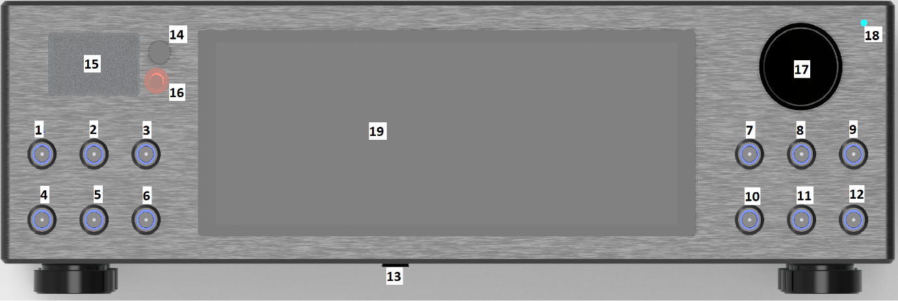
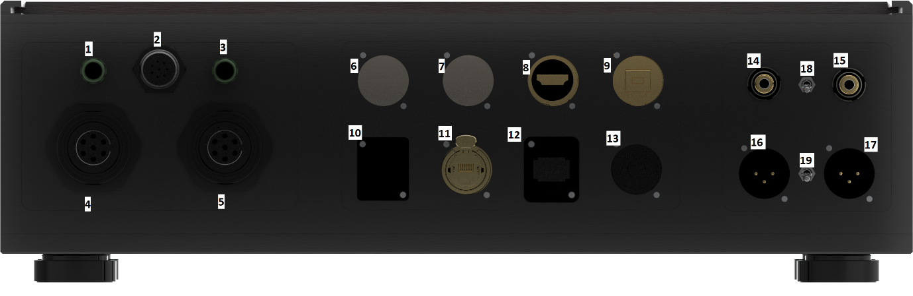
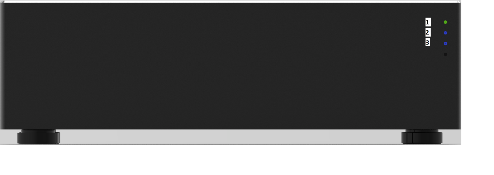
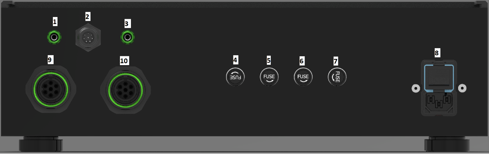

# Streamer DAC User Manual

Use this manual to set up and operate the Streamer DAC and its external power supply. Follow Quick Start for the initial connections, then refer to the relevant sections for everyday use or troubleshooting.

> **Safety:** The external supply contains mains-voltage circuitry. Do not open either enclosure or work on internal wiring. Disconnect the mains lead before handling external cables or connectors. Fuse replacement and internal servicing should be carried out only by a qualified service technician using the specified parts.
>
> **Supercapacitor hazard:** The external supply also contains high-current supercapacitors (the UcPure stages). They can store a large amount of energy and remain charged after the mains lead is disconnected and the unit is switched off. Accidentally shorting their terminals can cause severe arcing, burns, fire and damage to the equipment. See [Supercapacitor Safety](#supercapacitor-safety).

## Quick Start

1. Make sure the power supply's rear-panel switch is **OFF**.
2. Connect the DAC to the external power supply. Connect the earth and control leads, then connect the keyed DC power leads. Use the rear-panel diagrams to identify each connection. Never force a plug.
3. Connect a digital audio source to a compatible input. The I²S input uses an HDMI-style socket, but it is **not** an HDMI connection. Read the I²S input description before connecting a source. Confirm that the source and this unit's installed audio hardware support the format you intend to play.
4. Connect the DAC's RCA or XLR outputs to an amplifier or pre-amplifier.
5. Connect Ethernet if you use moOde network features or the Android app's album-art display. Connect other optional sources or USB storage as required.
6. Connect the mains lead and switch on the power supply.
7. Briefly press the power button beneath the DAC's front edge. Wait for startup to finish. The expected indicators are described in [Startup and Troubleshooting](#startup-and-troubleshooting).

### Audio Format Compatibility

Audio capability depends on the selected DAC, the digital input and the source/software configuration. The following figures describe the DAC chip or software capability, not independent measurements of the complete Streamer DAC:

| DAC option or software | PCM capability | DSD capability | Other reported information |
|---|---|---|---|
| ESS ES9038Q2M option | Up to 32-bit / 768 kHz | Native DSD512; DoP up to DSD256 | Reported dynamic range: 128–129 dB; reported THD+N: −120 dB (0.0001%); reported output resistance: 774 Ω. These are supplied module figures, not measurements of the assembled unit. |
| TDA1387T option | 16-bit input word length; chip datasheet specifies word-select frequency up to 384 kHz | Not specified in the supplied TDA1387T datasheet; do not assume DSD or DoP support | Philips Semiconductors TDA1387T data sheet, preliminary specification dated 11 December 1995. |
| moOde software | Decodes PCM formats including FLAC, ALAC, WAV, MP3 and AAC; PCM resolutions up to 32-bit / 384 kHz are supported, with higher rates depending on DAC hardware | Native DSD and DoP playback are hardware-dependent; software capability alone does not guarantee support | DSP features such as CamillaDSP depend on the installed software/configuration. |

The figures above are not a promise that every input or configuration accepts every listed format. The source, input interface, selected DAC and any intervening processing must all support the format. In particular, the TDA1387T figures are limits of the DAC chip's digital input, not a verified end-to-end compatibility test of the assembled unit.

## Everyday Operation

### Front Panel at a Glance

- **Buttons 1–6** control the main display and its presentation.
- **Buttons 7–12** control playback.
- **Mini display [15]** and its adjacent controls [14] and [16] provide supplementary DAC information and controls. For details on using the mini display and knob [14], see Ian Canada's [MonitorPi Reference manual](https://github.com/iancanada/DocumentDownload/blob/master/MonitorPi/MonitorPiPro/MonitorPiProManual.pdf).
- **Main display [19]** shows album artwork, track information and menus.
- **Rotary knob [17]** controls track selection and playback.
- **Power indicator [18]** shows the player's power state.
- **Power button [13]** is beneath the front edge of the cabinet.

### Power, Sleep (Standby) and Deep Sleep

Briefly press the power button [13] to wake the player or put it into Sleep (standby). In Sleep, the main display and output stage switch off, but the DAC remains powered so the player can wake quickly.

To enter Deep Sleep, press and hold the power button for about **3 seconds**, then release it. The player shuts down before entering Deep Sleep, which switches off both the DAC and output stage. Briefly press the power button to wake the player. If you will not use it for several days, switch off the external power supply.

### Playback Controls

Use the six buttons on the right side of the panel to control playback:

- **Previous Track [7]** and **Next Track [9]** move to the previous or next track.
- **Repeat [8]** repeats the playlist. The button stays lit while repeat is on; press it again to turn repeat off.
- **Skip Backwards [10]** and **Skip Forward [12]** move playback by 10 seconds with each press.
- **Shuffle (Random) [11]** turns shuffle on or off. The button stays lit while shuffle is on.

The rotary knob [17] also controls playback: turn it right to move forward through the queue, turn it left to move back, and press it to play or pause. Each click moves one track, but the player does not change track until you stop turning for about one second, and then it jumps straight to the chosen track. This lets you skip several tracks without each one starting to play. Turning past the last track continues from the first (and vice versa), and if you turn back to where you started, nothing changes. If playback is paused or stopped, it stays that way after the jump.

### Display Controls

Use the six buttons on the left side of the panel to control the main display:

- **Display over Art [1]** shows or hides track information over album artwork. The button stays lit while the overlay is visible.
- **Screen Brightness [2]** cycles through display brightness levels. The button lighting is synchronised with screen brightness.
- **Meter Display [3]** shows or hides the audio level meter. The button stays lit while the meter is active.
- **Toggle DAC [4]** switches the DAC output selection; it does not select a digital audio input. The button stays lit when the alternate output is selected. Input selection depends on the installed audio hardware and moOde configuration.
- **Switch Display [5]** turns the main display off or on without interrupting music playback.
- **Switch Display Panel [6]** cycles through the available screen views.

The other buttons briefly light to confirm a press. For the mini display and its controls, see the linked MonitorPi manual in [Front Panel at a Glance](#front-panel-at-a-glance).

### Front-Panel Quick Reference

| Ref (fig. 1) | Control | Function |
|---|---|---|
| 1 | Display over Art | Shows or hides the interface overlay on album artwork; lit when active. |
| 2 | Screen Brightness | Cycles through display brightness levels. |
| 3 | Meter Display | Shows or hides the audio level meter; lit when active. |
| 4 | Toggle DAC | Switches DAC output; lit when the alternate output is selected. |
| 5 | Switch Display | Turns the main display off or on. |
| 6 | Switch Display Panel | Cycles through screen views. |
| 7 | Previous Track | Moves to the previous track. |
| 8 | Repeat | Toggles playlist repeat; lit when active. |
| 9 | Next Track | Moves to the next track. |
| 10 | Skip Backwards | Moves playback back by 10 seconds. |
| 11 | Shuffle (Random) | Toggles shuffle; lit when active. |
| 12 | Skip Forward | Moves playback forward by 10 seconds. |
| 13 | Power button | Brief press for Sleep/wake; hold about 3 seconds for Deep Sleep. |
| 17 | Rotary knob | Turn to change tracks (jumps after you pause turning for about 1 second); press to play or pause. |
| 18 | Power indicator | Indicates the player's power state. |
| 19 | Main display | Shows artwork, track information and menus. |

## Connecting Equipment

### DAC Rear Panel

The rear panel provides power and control connections, digital audio inputs, network and USB connections, and analogue outputs. Most setups only require the power connections, one audio input and one pair of outputs.

#### Power and Ground Connections

**1 & 3 – Chassis earth connections**

These banana sockets connect the DAC chassis to the earth connection on the external power supply. Connecting the chassis earth to the power supply is recommended. In most installations, no further grounding adjustment is needed.

**2 – Power-supply control connection**

Connects the DAC to the external power supply and carries the control signals used for startup, standby and Deep Sleep.

**4 & 5 – DC power inputs**

These keyed connectors carry DC power from the external supply. Align each connector before inserting it. Do not force it; the locking mechanism secures a correctly aligned connector.

#### Digital Audio Inputs

**8 – I²S digital audio input (HDMI-style connector)**

This socket carries I²S digital audio, not HDMI video or audio. External I²S pinouts are not standardised between manufacturers. This input is designed for sources using the **PS Audio I²S pinout**; check compatibility before connecting a source.

**9 – USB Audio input**

This USB Type-B input connects compatible computers and other supported USB Audio sources. Playback capability depends on the source operating system and software.

**12 – Optical (TOSLINK) input**

Connect a digital audio source with an optical output, such as a television, media player, game console or CD player.

**13 – Coaxial S/PDIF input**

Connect a digital audio source with a coaxial S/PDIF output, such as a CD transport, streamer or digital audio interface.

#### Network, USB and Expansion

**6 – Firmware update port**

This port is not for music playback or USB storage. Do not attempt a firmware update through it unless you have the update package and instructions approved for this unit and hardware revision; this manual does not provide an end-user update procedure.

**7 – USB storage port**

Connect compatible USB storage, such as a flash drive or externally powered hard drive, then select the device in the DAC's user interface.

**10 – Expansion port**

This port is reserved for future expansion and is not currently active. Leave the supplied blanking plate in place.

**11 – Ethernet network port**

Use a standard Ethernet cable to connect the DAC to your home network for network features provided by the installed moOde system. The Android app uses the network connection to retrieve album artwork; playback and remote-control commands use Bluetooth between the app and the control board. A wired connection is recommended for reliable network streaming.

#### Analogue Outputs

**14 & 15 – RCA analogue outputs**

- **14** – Right channel
- **15** – Left channel

Connect these single-ended outputs to RCA inputs on an amplifier or pre-amplifier.

**16 & 17 – Balanced XLR outputs**

- **16** – Right channel
- **17** – Left channel

Connect these balanced outputs to XLR inputs on an amplifier or pre-amplifier. Balanced connections can help reject electrical interference, particularly with longer cable runs.

#### Ground-Lift Switches

Switches **18 (RCA)** and **19 (XLR)** are marked **Not Implemented**. Their described ground-lift function is not available; do not use them as a hum-reduction adjustment.

### DAC Rear-Panel Quick Reference

| Ref (fig. 2) | Connection | Purpose |
|---|---|---|
| 1 & 3 | Chassis earth | Connects the DAC chassis to the power-supply earth. |
| 2 | Power-supply control | Control link between the DAC and external power supply. |
| 4 & 5 | DC power inputs | DC power from the external supply. |
| 6 | Firmware/update port | Not for playback or storage; use only with approved update instructions. |
| 7 | USB storage | Connects compatible USB storage. |
| 8 | I²S audio input | I²S digital audio using a compatible PS Audio pinout; not HDMI. |
| 9 | USB Audio input | USB Type-B digital audio input. |
| 10 | Expansion port | Reserved; keep the blanking plate fitted. |
| 11 | Ethernet | Network connection. |
| 12 | Optical input | TOSLINK digital audio input. |
| 13 | Coaxial input | Coaxial S/PDIF digital audio input. |
| 14 & 15 | RCA outputs | Right and left single-ended analogue outputs. |
| 16 & 17 | XLR outputs | Right and left balanced analogue outputs. |
| 18 & 19 | Ground-lift switches | Not implemented. |

For remote playback, library, queue and power control from an Android phone, see the [DanStreamer Phone App User Guide](AndroidAppUserManual.md).

### External Power Supply

#### Front Panel

The three LEDs on the power supply's front panel indicate its status:

- **Power indicator [1]** – Indicates that the unit is receiving mains power.
- **5V UcPure [2]** – Orange while its capacitors charge; green when fully charged and supplying power from the capacitors.
- **3.3V UcPure [3]** – Orange while its capacitors charge; green when fully charged and supplying power from the capacitors.

#### Back Panel

**1 & 3 – Earth connections**

These banana sockets connect the power-supply earth to the DAC chassis. Connecting one of these to the DAC is recommended.

**2 – Power-supply control connection**

Connects the external power supply to the DAC's control connection. It enables coordinated startup, standby and Deep Sleep operation.

**9 & 10 – Main power connections**

These keyed connectors supply DC power to the DAC. Match each connector to its corresponding socket and never force it into place.

**4–7 – Output fuses**

These fuses protect the power-supply outputs and should not normally need replacing. If a fuse blows, switch off and unplug the supply. Do not replace the fuse yourself; have a qualified service technician identify the cause and fit the specified replacement. A fuse that blows repeatedly may indicate a fault in the connected equipment or wiring.

> **Warning:** The power supply contains mains-voltage circuitry. Do not open it or inspect internal fuses. Disconnect the mains lead and contact a qualified service technician.

**8 – Mains inlet, fuse and switch**

The IEC mains inlet includes the power switch and an integrated fuse. Before connecting the mains lead, make sure the switch is **OFF** and that the supply voltage matches the unit's rating label.

> **Warning:** Disconnect the mains lead before any service. Do not replace the mains fuse yourself; a qualified service technician must use the specified fuse type and rating.

### Supercapacitor Safety

The 5V UcPure and 3.3V UcPure stages use high-current supercapacitors as their energy store. Unlike a conventional supply, these can deliver very high currents into a short circuit and hold their charge for a long time after power is removed.

| Stage | Nominal voltage | Capacitance | Approx. stored energy |
|---|---|---|---|
| 5V UcPure | 5 V | 2 × 3000 F cells in series (1500 F total) | about 18.8 kJ (½·C·V²) |
| 3.3V UcPure | 3.3 V | 2 × 3000 F cells in series (1500 F total) | about 8.2 kJ |

These voltages are too low to cause electric shock, but the energy is comparable to a significant battery pack. A short circuit across a fully charged bank can produce currents of thousands of amps, enough to melt tools and cables, weld metal, cause severe burns and start a fire. For comparison, 18.8 kJ is roughly the energy needed to lift a 100 kg person about 19 m.
> **Warning:** Switching off and unplugging the supply does **not** make the inside safe. The supercapacitors may remain charged, possibly for hours or longer. Never open the enclosure.

- **Do not open the supply.** There are no user-serviceable parts. Only a qualified service technician, trained in handling supercapacitors, may open it, and must first confirm that the capacitors are discharged using a suitable meter and the manufacturer's discharge procedure.
- **Never short the outputs.** Do not bridge the output terminals or connectors with tools, metal objects, jewellery or damaged cables. A short can cause very high current, arcing, burns, fire and damage to the unit.
- **Check cables and connectors.** Do not use damaged, frayed or incorrectly wired output cables. Switch off and unplug the supply before connecting or disconnecting the DAC cable.
- **Wait for the LEDs.** Orange on a UcPure indicator means the capacitors are charging; green means they are fully charged and supplying power. Treat the supply as live whenever either colour is shown, and do not assume it is discharged because the front-panel LEDs are off.
- **Ventilation and placement.** Keep the supply on a stable, non-flammable surface with its ventilation clear. Do not cover it or place it near heat sources or in damp conditions.
- **If something goes wrong.** If you smell burning, see smoke or notice swelling, leaking or unusual heat, switch off and unplug the supply (if safe to do so), move away from it, and contact a qualified service technician. Do not touch leaked electrolyte; if it contacts skin or eyes, rinse thoroughly with water and seek medical advice.
- **Transport and storage.** Disconnect all cables before moving the supply and protect the output connectors from contact with metal objects. Dispose of the unit according to local regulations for electrical equipment and energy-storage components, not with household waste.

## Startup and Troubleshooting

### Normal Startup

When you press the power button to wake the player, the indicators should behave as follows:

1. The active power indicator [18] flashes during startup.
2. Eight diagnostic button LEDs illuminate.
3. The diagnostic LEDs turn off in pairs as startup stages complete.
4. When startup is complete, the diagnostic LEDs are off and the active power indicator is steady. The player is ready to use.

### Startup Error Indicators

If startup fails, the flashing diagnostic LED pairs identify the stage that did not complete. Button numbers refer to the labels in figure 1.

| Flashing buttons | Startup stage |
|---|---|
| 7 and 10 | 3.3V relay |
| 3 and 6 | DAC power relay |
| 2 and 5 | Output-stage relay |
| 1 and 4 | Raspberry Pi communication/boot heartbeat |
| All eight diagnostic LEDs | Firmware initialization |

Check that the external power and control connections are secure. Switch the system off and try one restart. If the fault persists, stop using the unit and contact the supplier or a qualified service technician. Do not attempt internal repairs.
