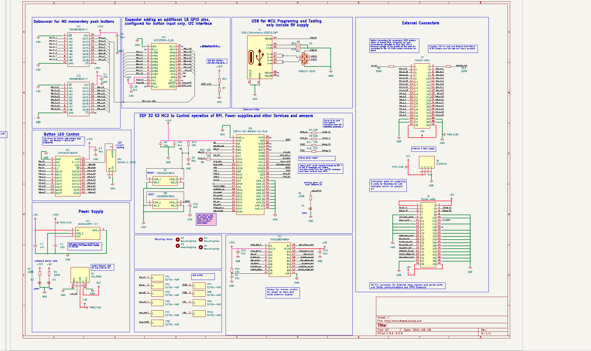

# Wiring Reference

This document collects the current known wiring and pin assignments for the ESP32-S3 firmware side and the Raspberry Pi companion side.

It also mirrors the button-to-command and button-to-SPI-LED mapping so the firmware view can be compared directly against the physical schematic blocks for button inputs and button LED drive.

Current hardware schematic image:

Primary source:

- [lib/board/boardConfig.hpp](../lib/board/boardConfig.hpp)

Related Raspberry Pi references:

- [scripts/rpi/home/antho/UAart5Listener.py](../scripts/rpi/home/antho/UAart5Listener.py)
- [scripts/rpi/home/antho/heartbeat_sender.py](../scripts/rpi/home/antho/heartbeat_sender.py)

## 1. ESP32-S3 Pin Assignments

### 1.1 UART And Handshake

| Function | ESP32-S3 Pin | Notes |
|---|---:|---|
| UART port | `UART_NUM_2` | main Raspberry Pi link |
| UART TX | `GPIO2` | ESP32 -> Pi data |
| UART RX | `GPIO1` | Pi -> ESP32 data |
| Pi data-ready input | `GPIO42` | Pi tells ESP32 UART data is ready |
| ESP32 data-ready output | `GPIO41` | ESP32 tells Pi UART data is ready |

### 1.2 I2C And Input Expander

| Function | ESP32-S3 Pin |
|---|---:|
| I2C SCL | `GPIO15` |
| I2C SDA | `GPIO16` |
| MCP interrupt | `GPIO18` |
| MCP enable | `GPIO17` |
| MCP address | `0x20` |

### 1.3 Relay Outputs

| Function | ESP32-S3 Pin |
|---|---:|
| Screen power relay | `GPIO13` |
| DAC power relay | `GPIO12` |
| Raspberry Pi power relay | `GPIO11` |
| Output stage power relay | `GPIO9` |
| Prototype DAC enable relay | `GPIO10` |
| General relay 1 | `GPIO47` |
| General relay 2 | `GPIO39` |

### 1.4 Indicator Outputs

| Function | ESP32-S3 Pin |
|---|---:|
| App active LED | `GPIO3` |
| App standby LED | `GPIO4` |
| Working status LED | `GPIO48` |
| Button LED PWM | `GPIO21` |
| Monitor brightness control | `GPIO43` |
| SPI LED data | `GPIO7` |
| SPI LED clock | `GPIO6` |
| SPI LED latch | `GPIO5` |

### 1.5 Button Inputs And SPI LED Drive

From the firmware side, the button path is split into two hardware blocks:

- button inputs are read through the I2C GPIO expander and reported as button indices `0..15`,
- button LEDs are driven by a 16-bit SPI-backed shift-register state where `ControlBoard` now passes `buttonId` directly as `ledIndex` for non-power buttons.

This is the same logical mapping documented in [docs/button-command-map.md](./button-command-map.md), placed here so it can be read alongside the physical circuit diagram.

| Button Index | Button Name | Input Source | SPI LED Register Bit | SPI Register Value From Idle | SPI TX Bytes | Command ID | Command Name | Notes |
|---|---|---|---|---|---|---|---|---|
| 0 | Power | MCP input index 0 | none | n/a | n/a | `0x0001` | `CMD_SYS_POWER` | timed action, command emitted on release, no SPI LED |
| 1 | Previous Track | MCP input index 1 | bit 1 | `0x0002` | `0x02 0x00` | `0x0101` | `CMD_PREVIOUS_TRACK` | UART command |
| 2 | Next Track | MCP input index 2 | bit 2 | `0x0004` | `0x04 0x00` | `0x0100` | `CMD_NEXT_TRACK` | UART command |
| 3 | Skip Forward | MCP input index 3 | bit 3 | `0x0008` | `0x08 0x00` | `0x0104` | `CMD_SKIP_FORWARD` | UART command |
| 4 | Skip Back | MCP input index 4 | bit 4 | `0x0010` | `0x10 0x00` | `0x0105` | `CMD_SKIP_BACK` | UART command |
| 5 | Play/Pause | MCP input index 5 | bit 5 | `0x0020` | `0x20 0x00` | `0x0102` | `CMD_PLAY_PAUSE` | UART command |
| 6 | Stop | MCP input index 6 | bit 6 | `0x0040` | `0x40 0x00` | `0x0103` | `CMD_STOP_TRACK` | UART command |
| 7 | Cover | MCP input index 7 | bit 7 | `0x0080` | `0x80 0x00` | `0x0117` or `0x0118` | `CMD_COVER_VIEW_ON` or `CMD_COVER_VIEW_OFF` | normalized to `CMD_TOGGLE_COVER_VIEW` on UART |
| 8 | Repeat | MCP input index 8 | bit 8 | `0x0100` | `0x00 0x01` | `0x011A` or `0x011B` | `CMD_REPEAT_ON` or `CMD_REPEAT_OFF` | normalized to `CMD_TOGGLE_REPEAT` with param `1` or `0` |
| 9 | Toggle Random | MCP input index 9 | bit 9 | `0x0200` | `0x00 0x02` | `0x011D` or `0x011E` | `CMD_RANDOM_ON` or `CMD_RANDOM_OFF` | normalized to `CMD_TOGGLE_RANDOM` with param `1` or `0` |
| 10 | Toggle DAC | MCP input index 10 | bit 10 | `0x0400` | `0x00 0x04` | `0x010A` or `0x010F` | `CMD_TOGGLE_DAC_ON` or `CMD_TOGGLE_DAC_OFF` | local relay control |
| 11 | Next Panel | MCP input index 11 | bit 11 | `0x0800` | `0x00 0x08` | `0x0107` | `CMD_NEXT_MENU_ITEM` | UART command; Pi cycles to next moOde panel |
| 12 | Toggle Meter | MCP input index 12 | bit 12 | `0x1000` | `0x00 0x10` | `0x010C` or `0x010D` | `CMD_TOGGLE_METER_ON` or `CMD_TOGGLE_METER_OFF` | normalized to `CMD_TOGGLE_METER` with param `1` or `0` |
| 13 | Rotary Left | MCP input index 13 | none in current rotary path | n/a | n/a | `0x0112` | `CMD_ROTARY_ACTION` | sent with param `0`, no SPI LED write |
| 14 | Rotary Right | MCP input index 14 | none in current rotary path | n/a | n/a | `0x0112` | `CMD_ROTARY_ACTION` | sent with param `1`, no SPI LED write |
| 15 | Cycle Brightness | MCP input index 15 | bit 15 | `0x8000` | `0x00 0x80` | `0x0116` | `CMD_CYCLE_BRIGHTNESS` | local brightness control |

Important hardware interpretation:

- the SPI LED driver accepts a zero-based `ledIndex` (0–15) and has no knowledge of button IDs,
- `ControlBoard` now maps non-power button IDs directly to LED indices: `ledIndex = buttonId`,
- button 0 (power) is skipped and does not drive any SPI LED bit,
- SPI LED bit 0 is therefore unused in the normal button path,
- the SPI LED driver shifts the 16-bit LED register low byte first, then high byte,
- the values above assume an idle LED register before the button is pressed,
- if another LED is already latched on, the transmitted SPI value is the OR-combination of active LED bits,
- rotary movement currently bypasses `setLed()` and therefore does not light a corresponding SPI LED bit.

### 1.6 Button Pin To LED Relationship

Looking at the schematic and the firmware together, the relationship is logical rather than a direct hardwired button-to-LED coupling inside the board logic:

- each button input arrives on a numbered `btn_in_x` net through the debouncer and MCP23016/23018 input expander,
- the ESP32 converts that numbered input into a firmware button index,
- `ControlBoard` maps the button index directly to an LED index for non-power buttons (`ledIndex = buttonId`),
- button 0 (power) is skipped — it has no corresponding LED,
- the SPI shift register then drives the corresponding LED output.

So the normal pattern is:

- `btn_in_1` drives firmware button index `0` (power), which has no LED,
- `btn_in_2` drives firmware button index `1`, which lights SPI LED bit `1`,
- `btn_in_3` drives firmware button index `2`, which lights SPI LED bit `2`,
- and so on.

The main exception is rotary movement: those inputs are still read as indices `13` and `14`, but the current firmware does not call `setLed()` for rotary events, so no SPI LED bit is written for them.

| Schematic Input Net | Firmware Button Index | Firmware Name | Command Name | LED Relationship |
|---|---:|---|---|---|
| `btn_in_1` | 0 | `kPower` | `CMD_SYS_POWER` | no LED (power button skipped) |
| `btn_in_2` | 1 | `kPrevTrack` | `CMD_PREVIOUS_TRACK` | lights SPI bit 1, register `0x0002`, LED output 1 |
| `btn_in_3` | 2 | `kNextTrack` | `CMD_NEXT_TRACK` | lights SPI bit 2, register `0x0004`, LED output 2 |
| `btn_in_4` | 3 | `kSkipForward` | `CMD_SKIP_FORWARD` | lights SPI bit 3, register `0x0008`, LED output 3 |
| `btn_in_5` | 4 | `kSkipBack` | `CMD_SKIP_BACK` | lights SPI bit 4, register `0x0010`, LED output 4 |
| `btn_in_6` | 5 | `kPlayPause` | `CMD_PLAY_PAUSE` | lights SPI bit 5, register `0x0020`, LED output 5 |
| `btn_in_7` | 6 | `kToggleDisplay` | `CMD_STOP_TRACK` | lights SPI bit 6, register `0x0040`, LED output 6 |
| `btn_in_8` | 7 | `kCover` | `CMD_COVER_VIEW_ON` or `CMD_COVER_VIEW_OFF` | lights SPI bit 7, register `0x0080`, LED output 7 |
| `btn_in_9` | 8 | `kNextMenu` | `CMD_NEXT_MENU_ITEM` | lights SPI bit 8, register `0x0100`, LED output 8 |
| `btn_in_10` | 9 | `kMenuSelect` | `CMD_ITEM_SELECT` | lights SPI bit 9, register `0x0200`, LED output 9 |
| `btn_in_11` | 10 | `kToggleDac` | `CMD_TOGGLE_DAC_ON` or `CMD_TOGGLE_DAC_OFF` | lights SPI bit 10, register `0x0400`, LED output 10 |
| `btn_in_12` | 11 | `kToggleDisplay` | `CMD_DISPLAY_OFF` or `CMD_DISPLAY_ON` | lights SPI bit 11, register `0x0800`, LED output 11 |
| `btn_in_13` | 12 | `kToggleMeter` | `CMD_TOGGLE_METER_ON` or `CMD_TOGGLE_METER_OFF` | lights SPI bit 12, register `0x1000`, LED output 12 |
| `btn_in_14` | 13 | `kRotaryEventLeft` | `CMD_ROTARY_ACTION` with param `0` | no LED update in current firmware |
| `btn_in_15` | 14 | `kRotaryEventRight` | `CMD_ROTARY_ACTION` with param `1` | no LED update in current firmware |
| `btn_in_16` | 15 | `kCycleBrightness` | `CMD_CYCLE_BRIGHTNESS` | lights SPI bit 15, register `0x8000`, LED output 15 |

In short: button 0 (power) has no LED. For all other push buttons, input number `N` maps to LED bit `N`. Firmware stores the button as a zero-based index, skips index `0` for power, and now passes the remaining button indices directly to the SPI LED driver. Rotary left and right break that pattern because they are input-only events in the current code path.

### 1.7 40-Pin Front-Panel Molex Connector

The attached 40-pin front-panel connector drawing can be matched to the current firmware naming as follows.

Power and status lines:

| Connector Pin | Diagram Label | Current Firmware Symbol | Notes |
|---|---|---|---|
| 1 | `Power On (LED)` | app active / power-state LED path | separate from the 16 SPI button LEDs |
| 2 | `Power StandBy (LED)` | app standby / power-state LED path | separate from the 16 SPI button LEDs |
| 35 | `GND` | ground | return |
| 36 | `GND` | ground | return |
| 37 | `GND` | ground | return |
| 38 | `GND` | ground | return |
| 39 | `5V` | `5V` rail | supply |
| 40 | `5V` | `5V` rail | supply |

Button and command inputs:

| Connector Pin | Diagram Label | Firmware Button Index | Current Firmware Mapping | Match Status |
|---|---|---:|---|---|
| 3 | `Btn_Power` | 0 | `kPower` -> `CMD_SYS_POWER` | matches |
| 5 | `CMD_Previous_Track` | 1 | `kPrevTrack` -> `CMD_PREVIOUS_TRACK` | matches |
| 7 | `CMD_Next_Track` | 2 | `kNextTrack` -> `CMD_NEXT_TRACK` | matches |
| 9 | `CMD_Skip_Forrard` | 3 | `kSkipForward` -> `CMD_SKIP_FORWARD` | matches |
| 11 | `CMD_Skip_Back` | 4 | `kSkipBack` -> `CMD_SKIP_BACK` | matches |
| 13 | `CMD_Play_Pause` | 5 | `kPlayPause` -> `CMD_PLAY_PAUSE` | matches |
| 15 | `CMD_Stop_Track` | 6 | `kToggleDisplay` -> `CMD_STOP_TRACK` | matches |
| 17 | `CMD_Prev_Menu_Item` | 7 | current firmware uses `kCover` -> `CMD_COVER_VIEW_ON/OFF` | mismatch |
| 4 | `CMD_Next_Menu_Item` | 8 | `kNextMenu` -> `CMD_NEXT_MENU_ITEM` | matches |
| 6 | `CMD_Item_Select` | 9 | `kMenuSelect` -> `CMD_ITEM_SELECT` | matches |
| 8 | `CMD_Toggle_Dac` | 10 | `kToggleDac` -> `CMD_TOGGLE_DAC_ON/OFF` | matches |
| 10 | `CMD_Display_Off` | 11 | `kToggleDisplay` -> `CMD_DISPLAY_OFF/ON` | partial match: connector names only one half of the toggle |
| 12 | `CMD_Toggle_Meter_On` | 12 | `kToggleMeter` -> `CMD_TOGGLE_METER_ON/OFF` | partial match: connector names only one half of the toggle |
| 14 | `CMD_Rotary_Action` | 13 | `kRotaryEventLeft` -> `CMD_ROTARY_ACTION` with param `0` | matches as rotary-left |
| 16 | `CMD_Rotary_Action` | 14 | `kRotaryEventRight` -> `CMD_ROTARY_ACTION` with param `1` | matches as rotary-right |
| 18 | `CMD_Cycle_Brightness` | 15 | `kCycleBrightness` -> `CMD_CYCLE_BRIGHTNESS` | matches |

SPI button LED outputs on the same connector:

| Connector Pin | Diagram Label | SPI LED Output | Current Firmware Use |
|---|---|---|---|
| 19 | `LED_0_1` | bit 0 | lights for Previous Track |
| 21 | `LED_0_2` | bit 1 | lights for Next Track |
| 23 | `LED_0_3` | bit 2 | lights for Skip Forward |
| 25 | `LED_0_4` | bit 3 | lights for Skip Back |
| 27 | `LED_0_5` | bit 4 | lights for Play/Pause |
| 29 | `LED_0_6` | bit 5 | lights for Stop |
| 31 | `LED_0_7` | bit 6 | lights for firmware button index 7 |
| 33 | `LED_0_8` | bit 7 | lights for Next Menu |
| 20 | `LED_0_9` | bit 8 | lights for Menu Select |
| 22 | `LED_0_10` | bit 9 | lights for Toggle DAC |
| 24 | `LED_0_11` | bit 10 | lights for Toggle Display |
| 26 | `LED_0_12` | bit 11 | lights for Toggle Meter |
| 28 | `LED_0_13` | bit 12 | present on connector, not driven by current rotary path |
| 30 | `LED_0_14` | bit 13 | present on connector, not driven by current rotary path |
| 32 | `LED_0_15` | bit 14 | lights for Cycle Brightness |
| 34 | `LED_0_16` | bit 15 | present on connector, currently unused by firmware |

Important connector-level mismatch:

- the connector drawing labels pin 17 as `CMD_Prev_Menu_Item`,
- current firmware assigns that logical slot to `Cover` instead,
- `CMD_PREV_MENU_ITEM` exists in the codebase, but `createButtonActionMap()` does not currently bind it to any front-panel button.

If the connector drawing is the intended hardware truth, button index 7 would need to be reassigned from `CoverViewInstance` to `PreviousMenuInstance` in `ControlBoard::createButtonActionMap()`.

## 2. Raspberry Pi Side Wiring

### 2.1 Confirmed Script-Level Pin Usage

| Function | Pi BCM | Pi Physical Pin | Notes |
|---|---:|---:|---|
| ESP32 -> Pi data-ready input | 23 | 16 | listener waits on rising edge |
| Pi -> ESP32 data-ready output | 24 | 18 | sender script pulses this line |

### 2.2 UART5 Header Mapping

Using the standard `dtoverlay=uart5` mapping on a 40-pin Raspberry Pi header:

| Function | Pi BCM | Pi Physical Pin |
|---|---:|---:|
| UART5 TX | 12 | 32 |
| UART5 RX | 13 | 33 |

## 3. End-To-End Connection Table

| Function | Raspberry Pi Side | ESP32-S3 Side |
|---|---|---|
| Pi UART5 TX -> ESP32 UART RX | BCM12, pin 32 | GPIO1 |
| Pi UART5 RX <- ESP32 UART TX | BCM13, pin 33 | GPIO2 |
| ESP32 -> Pi data-ready | BCM23, pin 16 | GPIO41 |
| Pi -> ESP32 data-ready | BCM24, pin 18 | GPIO42 |
| Ground | Pi GND | ESP32 GND |

Important rule:

- UART TX always connects to the other side's RX.

## 4. Handshake Meaning

The design uses two extra GPIO lines in addition to UART.

### 4.1 ESP32 -> Pi Notification

- ESP32 writes a UART packet.
- ESP32 raises its data-ready output briefly.
- Pi listener wakes on BCM23 and reads from `/dev/ttyAMA5`.

### 4.2 Pi -> ESP32 Notification

- Pi writes a UART packet.
- Pi pulses BCM24.
- ESP32 sees GPIO42 rising edge and services UART RX.

This means the UART bytes and the ready notification are separate signals.

## 5. Pi Numbering Reminder

The Python scripts use:

- `GPIO.setmode(GPIO.BCM)`

That means values like `23` and `24` are BCM GPIO numbers, not physical header pin numbers.

## 6. Related Docs

- [docs/button-command-map.md](./button-command-map.md)
- [docs/project-guide.md](./project-guide.md)
- [docs/protocol-reference.md](./protocol-reference.md)
- [docs/raspberry-pi-setup.md](./raspberry-pi-setup.md)